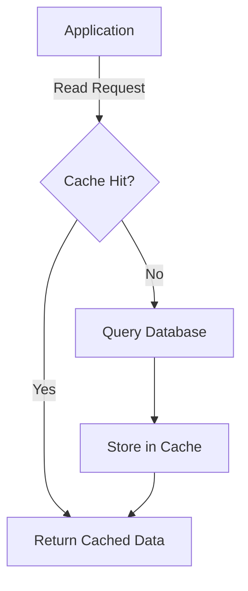
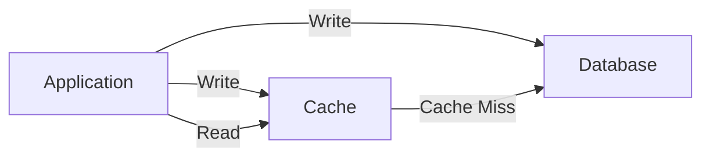
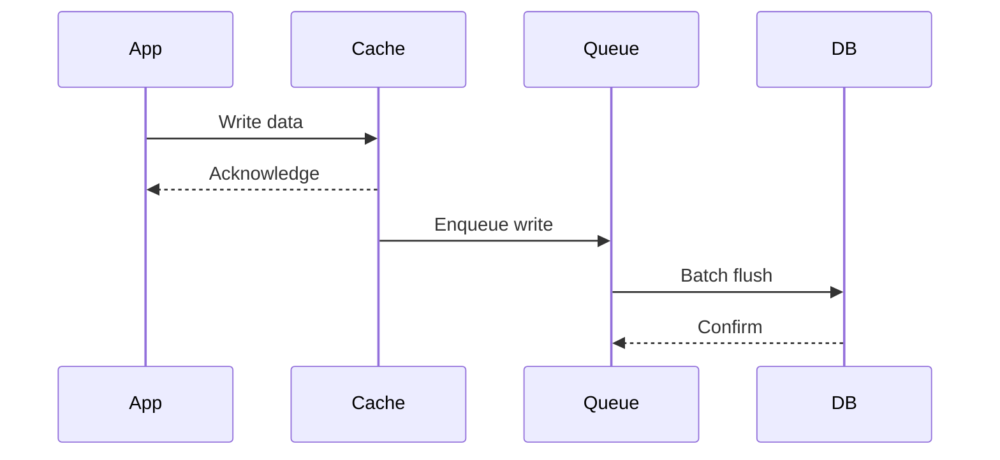
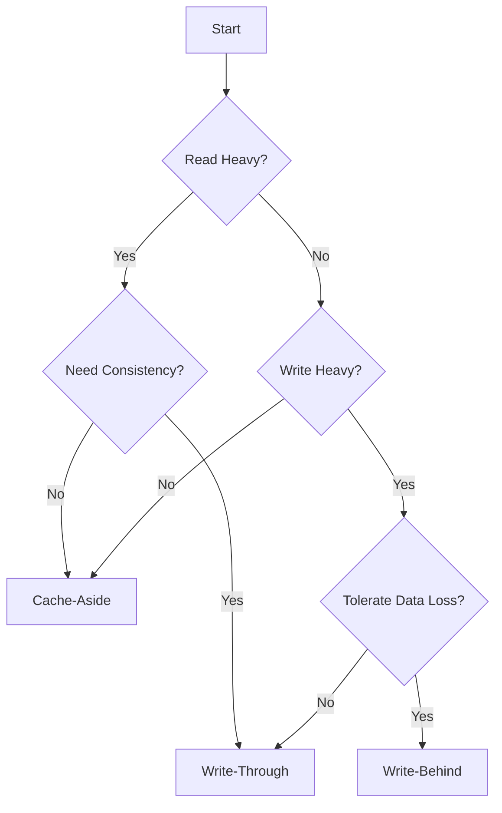

# How to Implement Redis Caching Patterns for Applications

Author: [nawazdhandala](https://www.github.com/nawazdhandala)

Tags: Redis, Caching, Cache Aside, Write Through, Performance

Description: Learn common Redis caching patterns including cache-aside, write-through, write-behind, and TTL-based expiration strategies.

---

Caching is one of the most effective ways to improve application performance. Redis, with its in-memory data store and rich data structures, is the go-to choice for caching in modern applications. But simply throwing data into Redis is not enough. You need to pick the right caching pattern for your use case.

This post covers the four most common Redis caching patterns, when to use each one, and how to implement them with practical code examples.

## Why Caching Patterns Matter

Without a clear caching strategy, you end up with stale data, cache stampedes, and inconsistent reads. Each pattern makes different trade-offs between consistency, latency, and complexity.



## Pattern 1: Cache-Aside (Lazy Loading)

Cache-aside is the most common pattern. The application checks the cache first. On a miss, it loads from the database and populates the cache.

```python
import redis
import json

# Create a Redis connection
r = redis.Redis(host='localhost', port=6379, db=0, decode_responses=True)

def get_user(user_id: str) -> dict:
    """
    Cache-aside pattern: check cache first, then fall back to database.
    The application is responsible for managing both cache and database.
    """
    cache_key = f"user:{user_id}"

    # Step 1: Try to read from cache
    cached = r.get(cache_key)
    if cached:
        return json.loads(cached)

    # Step 2: On cache miss, read from database
    user = db_query_user(user_id)

    # Step 3: Populate cache with a TTL of 300 seconds
    if user:
        r.setex(cache_key, 300, json.dumps(user))

    return user


def update_user(user_id: str, data: dict):
    """
    On write, update the database and invalidate the cache.
    The next read will repopulate the cache from the database.
    """
    # Step 1: Update the database
    db_update_user(user_id, data)

    # Step 2: Invalidate the cache entry
    cache_key = f"user:{user_id}"
    r.delete(cache_key)
```

**When to use**: Read-heavy workloads where data changes infrequently. This is the simplest pattern to implement.

**Trade-off**: The first read after a cache miss or invalidation is always slow because it hits the database.

## Pattern 2: Write-Through

In write-through caching, every write goes to both the cache and the database at the same time. This keeps the cache always up to date.



```python
def write_through_update(user_id: str, data: dict):
    """
    Write-through pattern: write to both cache and database simultaneously.
    Ensures cache is always consistent with the database.
    """
    cache_key = f"user:{user_id}"

    # Step 1: Write to the database
    db_update_user(user_id, data)

    # Step 2: Write the same data to the cache
    r.setex(cache_key, 300, json.dumps(data))


def write_through_read(user_id: str) -> dict:
    """
    Reads always go to cache first.
    Cache misses are populated from the database.
    """
    cache_key = f"user:{user_id}"
    cached = r.get(cache_key)

    if cached:
        return json.loads(cached)

    # Populate cache on miss
    user = db_query_user(user_id)
    if user:
        r.setex(cache_key, 300, json.dumps(user))
    return user
```

**When to use**: When you need strong consistency between cache and database and can tolerate slightly higher write latency.

**Trade-off**: Writes are slower because they must update both the cache and the database before returning.

## Pattern 3: Write-Behind (Write-Back)

Write-behind is the inverse of write-through. Writes go to the cache immediately and are asynchronously flushed to the database in batches.



```python
import threading
import time

# A simple in-memory buffer for pending writes
write_buffer = []
buffer_lock = threading.Lock()

def write_behind_update(user_id: str, data: dict):
    """
    Write-behind pattern: write to cache immediately,
    then batch-flush to database asynchronously.
    """
    cache_key = f"user:{user_id}"

    # Step 1: Write to cache immediately (fast)
    r.setex(cache_key, 600, json.dumps(data))

    # Step 2: Queue the write for async database flush
    with buffer_lock:
        write_buffer.append({"user_id": user_id, "data": data})


def flush_writes():
    """
    Background worker that flushes queued writes to the database
    every 5 seconds. This reduces database write pressure.
    """
    while True:
        time.sleep(5)
        with buffer_lock:
            # Copy and clear the buffer
            pending = list(write_buffer)
            write_buffer.clear()

        # Batch write to the database
        for item in pending:
            db_update_user(item["user_id"], item["data"])

# Start the background flush thread
flush_thread = threading.Thread(target=flush_writes, daemon=True)
flush_thread.start()
```

**When to use**: Write-heavy workloads where you can tolerate a small window of potential data loss (if the cache crashes before flushing).

**Trade-off**: There is a risk of data loss between the cache write and the database flush.

## Pattern 4: TTL-Based Expiration

TTL (Time-To-Live) is not a full caching pattern on its own, but it is a critical strategy used alongside the patterns above. It prevents stale data from lingering in the cache.

```python
def cache_with_ttl(key: str, value: str, ttl_seconds: int = 60):
    """
    Set a cache entry with a specific TTL.
    After the TTL expires, Redis automatically removes the key.
    """
    r.setex(key, ttl_seconds, value)


def cache_with_sliding_ttl(key: str):
    """
    Sliding TTL: reset the expiration every time the key is accessed.
    Useful for session-like data that should stay alive while active.
    """
    value = r.get(key)
    if value:
        # Reset TTL on access - keeps active keys alive
        r.expire(key, 300)
    return value


def cache_with_jitter(key: str, value: str, base_ttl: int = 300):
    """
    Add random jitter to TTL to prevent cache stampede.
    Without jitter, many keys expire at the same time,
    causing a thundering herd on the database.
    """
    import random
    # Add up to 60 seconds of random jitter
    jitter = random.randint(0, 60)
    r.setex(key, base_ttl + jitter, value)
```

## Choosing the Right Pattern



| Pattern | Consistency | Write Latency | Read Latency | Complexity |
|---------|------------|---------------|--------------|------------|
| Cache-Aside | Eventual | Low | High on miss | Low |
| Write-Through | Strong | High | Low | Medium |
| Write-Behind | Eventual | Low | Low | High |

## Cache Invalidation Strategies

Cache invalidation is one of the hardest problems in computer science. Here are three common approaches:

```python
def invalidate_single(user_id: str):
    """Delete a single cache entry when data changes."""
    r.delete(f"user:{user_id}")


def invalidate_by_pattern(pattern: str):
    """
    Invalidate all keys matching a pattern.
    Use SCAN instead of KEYS to avoid blocking Redis.
    """
    cursor = 0
    while True:
        # SCAN is non-blocking and safe for production
        cursor, keys = r.scan(cursor, match=pattern, count=100)
        if keys:
            r.delete(*keys)
        if cursor == 0:
            break


def invalidate_with_versioning(user_id: str):
    """
    Version-based invalidation: increment a version counter
    so old cache entries are never read.
    """
    version_key = f"user_version:{user_id}"
    # Increment the version - old cache keys become stale
    r.incr(version_key)
```

## Monitoring Your Cache

Regardless of which pattern you choose, you need to monitor cache hit rates, memory usage, and eviction counts. A low hit rate means your caching strategy is not effective. High eviction counts mean you need more memory or shorter TTLs.

Key metrics to track:

- **Hit rate**: `keyspace_hits / (keyspace_hits + keyspace_misses)`
- **Memory usage**: `used_memory` vs `maxmemory`
- **Eviction count**: `evicted_keys`
- **Connected clients**: sudden spikes indicate connection leaks

## Conclusion

Picking the right Redis caching pattern depends on your workload. Cache-aside works for most read-heavy use cases. Write-through is best when you need strong consistency. Write-behind shines for write-heavy workloads that can tolerate brief data loss. And TTL-based expiration should be used with every pattern to prevent stale data.

If you need to monitor your Redis instances, track cache hit rates, and get alerted when evictions spike, [OneUptime](https://oneuptime.com) provides full observability for your infrastructure including Redis metrics, custom dashboards, and alerting - all in one open-source platform.
