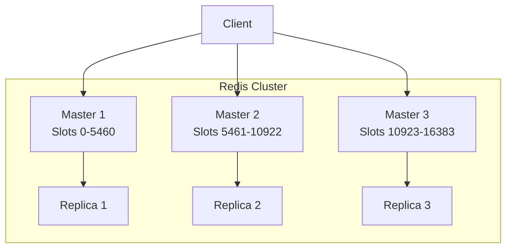
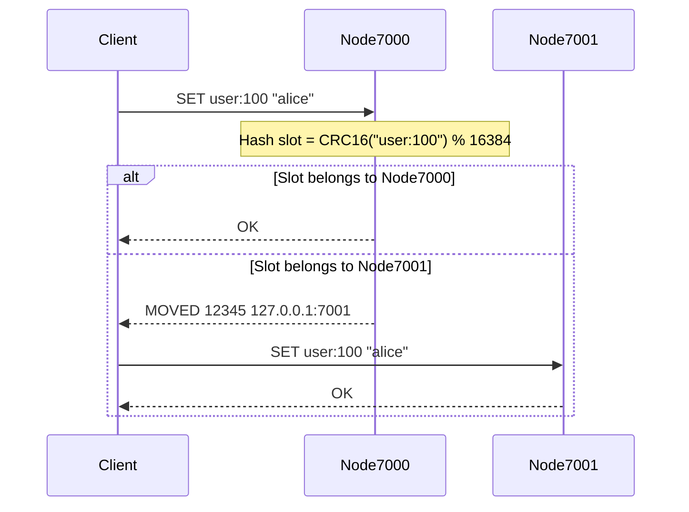
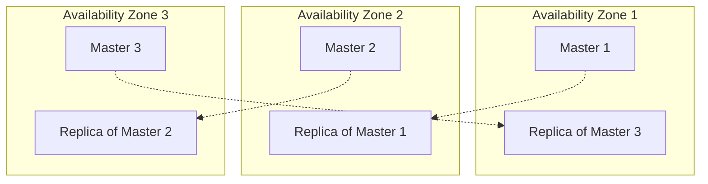

# How to Set Up Redis Cluster for High Availability

Author: [nawazdhandala](https://www.github.com/nawazdhandala)

Tags: Redis, Cluster, High Availability, Sharding, Replication

Description: Step-by-step guide to setting up Redis Cluster with automatic sharding, replication, and failover for production.

---

A single Redis instance is a single point of failure. If it goes down, every service that depends on it is affected. Redis Cluster solves this by distributing data across multiple nodes with automatic sharding, replication, and failover.

This post walks through setting up a production-ready Redis Cluster from scratch, configuring replication, and handling failover scenarios.

## How Redis Cluster Works

Redis Cluster uses hash slots to distribute data. There are 16,384 hash slots in total. Each master node owns a subset of these slots. When you write a key, Redis hashes the key and routes it to the correct node.



Each master has at least one replica. If a master fails, its replica is automatically promoted to master.

## Prerequisites

You need at least 6 Redis instances for a production cluster: 3 masters and 3 replicas. In this guide, we will run them on a single machine for demonstration, but in production you should spread them across different servers or availability zones.

## Step 1: Create Configuration Files

Create a configuration file for each node. Each node needs a unique port and cluster-enabled settings.

```bash
# Create directories for each node
mkdir -p /opt/redis-cluster/{7000,7001,7002,7003,7004,7005}

# Generate configuration for each node
for port in 7000 7001 7002 7003 7004 7005; do
cat > /opt/redis-cluster/$port/redis.conf << EOF
# Basic settings
port $port
bind 0.0.0.0

# Enable cluster mode
cluster-enabled yes
cluster-config-file nodes-$port.conf
cluster-node-timeout 5000

# Persistence settings
appendonly yes
appendfilename "appendonly-$port.aof"
dir /opt/redis-cluster/$port

# Memory limit - adjust for your environment
maxmemory 256mb
maxmemory-policy allkeys-lru

# Logging
logfile /opt/redis-cluster/$port/redis.log
loglevel notice
EOF
done
```

## Step 2: Start All Redis Instances

Start each Redis instance with its own configuration file.

```bash
# Start all 6 Redis instances
for port in 7000 7001 7002 7003 7004 7005; do
    redis-server /opt/redis-cluster/$port/redis.conf &
    echo "Started Redis on port $port"
done

# Verify all instances are running
for port in 7000 7001 7002 7003 7004 7005; do
    redis-cli -p $port ping
done
# Each should respond with PONG
```

## Step 3: Create the Cluster

Use the `redis-cli` cluster creation command. The `--cluster-replicas 1` flag means each master gets one replica.

```bash
# Create the cluster with 3 masters and 3 replicas
redis-cli --cluster create \
    127.0.0.1:7000 \
    127.0.0.1:7001 \
    127.0.0.1:7002 \
    127.0.0.1:7003 \
    127.0.0.1:7004 \
    127.0.0.1:7005 \
    --cluster-replicas 1

# Redis will ask you to confirm the configuration
# Type 'yes' to proceed
```

Redis automatically assigns hash slot ranges to the three masters and pairs each master with a replica.

## Step 4: Verify the Cluster

```bash
# Check cluster status
redis-cli -p 7000 cluster info

# Expected output includes:
# cluster_state:ok
# cluster_slots_assigned:16384
# cluster_slots_ok:16384
# cluster_known_nodes:6
# cluster_size:3

# View node roles and slot assignments
redis-cli -p 7000 cluster nodes
```



## Step 5: Connect from Your Application

Use a cluster-aware client library. Here is an example with Python:

```python
from redis.cluster import RedisCluster

# Connect to the Redis Cluster
# The client discovers all nodes from the startup node
cluster = RedisCluster(
    host="127.0.0.1",
    port=7000,
    decode_responses=True,
    # Skip full cluster coverage check during development
    skip_full_coverage_check=True
)

# Basic operations work the same as standalone Redis
cluster.set("user:1", "alice")
value = cluster.get("user:1")
print(f"Got value: {value}")

# Hash tags force related keys to the same slot
# Keys with the same {tag} go to the same node
cluster.set("{order:100}.items", "item1,item2")
cluster.set("{order:100}.total", "59.99")
cluster.set("{order:100}.status", "pending")

# This allows multi-key operations on related data
pipe = cluster.pipeline()
pipe.get("{order:100}.items")
pipe.get("{order:100}.total")
pipe.get("{order:100}.status")
results = pipe.execute()
print(f"Order data: {results}")
```

## Step 6: Simulate Failover

Test that automatic failover works before going to production.

```bash
# Check which node is master for a specific slot
redis-cli -p 7000 cluster nodes | grep master

# Kill one of the masters (e.g., port 7001)
redis-cli -p 7001 DEBUG sleep 30

# Wait a few seconds, then check the cluster
# The replica should have been promoted to master
redis-cli -p 7000 cluster nodes

# Cluster state should still be OK
redis-cli -p 7000 cluster info | grep cluster_state
# Output: cluster_state:ok
```

## Adding Nodes to a Running Cluster

You can scale a Redis Cluster by adding new nodes without downtime.

```bash
# Start a new Redis instance on port 7006
redis-server /opt/redis-cluster/7006/redis.conf &

# Add it as a new master node
redis-cli --cluster add-node 127.0.0.1:7006 127.0.0.1:7000

# Reshard: move some hash slots to the new node
redis-cli --cluster reshard 127.0.0.1:7000 \
    --cluster-from <source-node-id> \
    --cluster-to <new-node-id> \
    --cluster-slots 4096 \
    --cluster-yes

# Add a replica for the new master
redis-server /opt/redis-cluster/7007/redis.conf &
redis-cli --cluster add-node 127.0.0.1:7007 127.0.0.1:7000 \
    --cluster-slave \
    --cluster-master-id <new-master-node-id>
```

## Production Checklist

Before running Redis Cluster in production, verify these settings:

```bash
# 1. Disable transparent huge pages (reduces latency spikes)
echo never > /sys/kernel/mm/transparent_hugepage/enabled

# 2. Set the overcommit memory policy
sysctl vm.overcommit_memory=1

# 3. Set the TCP backlog
sysctl net.core.somaxconn=65535

# 4. Raise the file descriptor limit
ulimit -n 65535
```

## Cluster Architecture for Production



Spread masters and replicas across availability zones. Each replica should be in a different zone than its master. This ensures the cluster survives a full zone failure.

## Common Pitfalls

1. **Multi-key operations across slots**: Commands like `MGET` fail if keys are on different nodes. Use hash tags to colocate related keys.
2. **Not enough replicas**: Always have at least one replica per master. Two replicas per master is safer for production.
3. **Unbalanced slots**: After adding or removing nodes, reshard to balance the slot distribution evenly.
4. **Network partitions**: Set `cluster-node-timeout` appropriately. Too low causes false failovers. Too high delays real failover.

## Conclusion

Redis Cluster gives you horizontal scaling and high availability. Start with 3 masters and 3 replicas, spread them across availability zones, and test failover before going live. Use hash tags for multi-key operations and monitor slot distribution after scaling events.

To monitor your Redis Cluster health, track replication lag, and get alerted on failover events, [OneUptime](https://oneuptime.com) offers infrastructure monitoring with built-in support for Redis metrics, uptime checks, and incident management - all open source.
