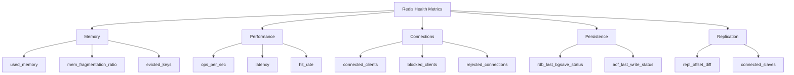
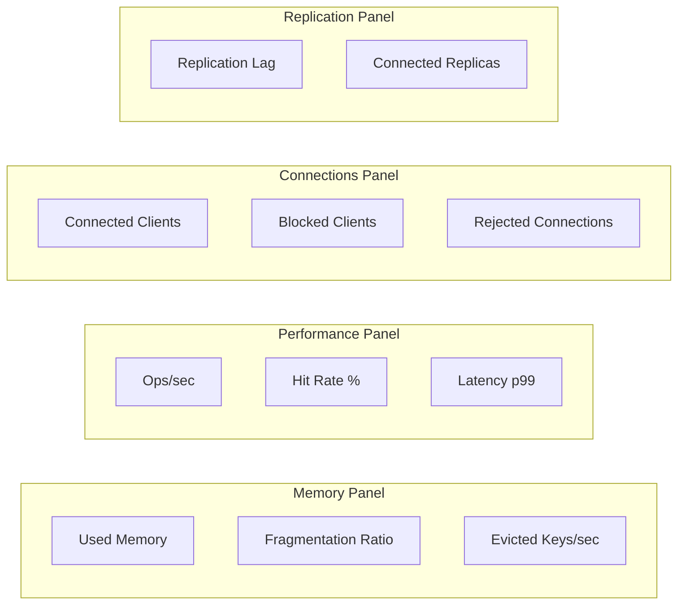

# How to Monitor Redis Performance and Health

Author: [nawazdhandala](https://www.github.com/nawazdhandala)

Tags: Redis, Monitoring, Metrics, Performance, Observability

Description: Learn how to monitor Redis performance using INFO command, Prometheus exporter, and key health metrics to track.

---

Redis is fast by default, but without monitoring you will not know when it starts to slow down, run out of memory, or drop connections. Proper monitoring helps you catch problems before they affect your users.

This post covers the key Redis metrics you should track, how to collect them using the INFO command and Prometheus exporter, and how to set up alerts for common failure scenarios.

## Key Metrics to Monitor



## Using the INFO Command

The `INFO` command is the primary way to get Redis metrics. It returns a large set of key-value pairs organized by section.

```bash
# Get all information
redis-cli INFO

# Get specific sections
redis-cli INFO memory
redis-cli INFO stats
redis-cli INFO replication
redis-cli INFO clients
redis-cli INFO persistence
```

### Parsing INFO Output Programmatically

```python
import redis

r = redis.Redis(host='localhost', port=6379, decode_responses=True)

def get_redis_metrics() -> dict:
    """
    Collect key Redis metrics from the INFO command.
    Returns a dictionary of metric name to value.
    """
    info = r.info()

    metrics = {
        # Memory metrics
        "used_memory_bytes": info["used_memory"],
        "used_memory_peak_bytes": info["used_memory_peak"],
        "used_memory_rss_bytes": info["used_memory_rss"],
        "mem_fragmentation_ratio": info["mem_fragmentation_ratio"],
        "maxmemory_bytes": info.get("maxmemory", 0),

        # Performance metrics
        "ops_per_sec": info["instantaneous_ops_per_sec"],
        "keyspace_hits": info["keyspace_hits"],
        "keyspace_misses": info["keyspace_misses"],
        "evicted_keys": info["evicted_keys"],
        "expired_keys": info["expired_keys"],

        # Connection metrics
        "connected_clients": info["connected_clients"],
        "blocked_clients": info["blocked_clients"],
        "rejected_connections": info["rejected_connections"],
        "total_connections_received": info["total_connections_received"],

        # Persistence metrics
        "rdb_last_bgsave_status": info["rdb_last_bgsave_status"],
        "rdb_changes_since_last_save": info["rdb_changes_since_last_save"],

        # Replication metrics
        "role": info["role"],
        "connected_slaves": info.get("connected_slaves", 0),
    }

    return metrics


def calculate_hit_rate(info: dict) -> float:
    """
    Calculate the cache hit rate.
    A low hit rate means most reads are cache misses.
    Target: above 90% for a well-tuned cache.
    """
    hits = info["keyspace_hits"]
    misses = info["keyspace_misses"]
    total = hits + misses

    if total == 0:
        return 0.0

    return round((hits / total) * 100, 2)
```

## Setting Up Prometheus Exporter

The Redis Exporter for Prometheus is the standard way to collect Redis metrics in a Prometheus-compatible format.

```yaml
# docker-compose.yml
version: "3.8"

services:
  redis:
    image: redis:7-alpine
    ports:
      - "6379:6379"
    # Enable Redis to report slow queries
    command: >
      redis-server
      --slowlog-log-slower-than 10000
      --slowlog-max-len 128
      --maxmemory 512mb
      --maxmemory-policy allkeys-lru

  redis-exporter:
    image: oliver006/redis_exporter:latest
    ports:
      - "9121:9121"
    environment:
      # Point the exporter to the Redis instance
      REDIS_ADDR: redis://redis:6379
    depends_on:
      - redis

  prometheus:
    image: prom/prometheus:latest
    ports:
      - "9090:9090"
    volumes:
      - ./prometheus.yml:/etc/prometheus/prometheus.yml
    depends_on:
      - redis-exporter
```

```yaml
# prometheus.yml
global:
  scrape_interval: 15s

scrape_configs:
  - job_name: "redis"
    static_configs:
      # Scrape the Redis exporter endpoint
      - targets: ["redis-exporter:9121"]
```

## Critical Metrics and Alert Thresholds

### Memory Alerts

```python
def check_memory_health(metrics: dict) -> list:
    """
    Check memory-related health indicators.
    Returns a list of warnings.
    """
    warnings = []

    # Check memory usage percentage
    used = metrics["used_memory_bytes"]
    max_mem = metrics["maxmemory_bytes"]
    if max_mem > 0:
        usage_pct = (used / max_mem) * 100
        if usage_pct > 90:
            warnings.append(
                f"CRITICAL: Memory usage at {usage_pct:.1f}%. "
                f"Evictions will increase."
            )
        elif usage_pct > 75:
            warnings.append(
                f"WARNING: Memory usage at {usage_pct:.1f}%."
            )

    # Check fragmentation ratio
    frag = metrics["mem_fragmentation_ratio"]
    if frag > 1.5:
        warnings.append(
            f"WARNING: Memory fragmentation ratio is {frag}. "
            f"Consider restarting Redis to reclaim memory."
        )
    elif frag < 1.0:
        warnings.append(
            f"CRITICAL: Fragmentation ratio below 1.0 ({frag}). "
            f"Redis is swapping to disk."
        )

    # Check evictions
    if metrics["evicted_keys"] > 0:
        warnings.append(
            f"WARNING: {metrics['evicted_keys']} keys evicted. "
            f"Increase maxmemory or reduce data."
        )

    return warnings
```

### Latency Monitoring

```python
def measure_latency(r: redis.Redis, samples: int = 100) -> dict:
    """
    Measure Redis command latency by running PING commands.
    Returns min, max, avg, and p99 latency in milliseconds.
    """
    import time

    latencies = []
    for _ in range(samples):
        start = time.perf_counter()
        r.ping()
        end = time.perf_counter()
        # Convert to milliseconds
        latencies.append((end - start) * 1000)

    latencies.sort()

    return {
        "min_ms": round(latencies[0], 3),
        "max_ms": round(latencies[-1], 3),
        "avg_ms": round(sum(latencies) / len(latencies), 3),
        # 99th percentile
        "p99_ms": round(latencies[int(len(latencies) * 0.99)], 3),
    }
```

### Slow Log Analysis

```python
def analyze_slow_log(r: redis.Redis, count: int = 10) -> list:
    """
    Retrieve and analyze the Redis slow log.
    Slow queries are a common cause of latency spikes.
    """
    # Get the latest slow log entries
    slow_log = r.slowlog_get(count)

    results = []
    for entry in slow_log:
        results.append({
            "id": entry["id"],
            # Duration is in microseconds
            "duration_ms": entry["duration"] / 1000,
            "command": " ".join(
                arg.decode() if isinstance(arg, bytes) else str(arg)
                for arg in entry["command"]
            ),
            "timestamp": entry["start_time"],
        })

    # Sort by duration, slowest first
    results.sort(key=lambda x: x["duration_ms"], reverse=True)
    return results
```

## Monitoring Dashboard Metrics

Here are the key metrics to put on your Redis monitoring dashboard:



| Metric | Good | Warning | Critical |
|--------|------|---------|----------|
| Memory Usage | < 70% | 70-90% | > 90% |
| Hit Rate | > 95% | 80-95% | < 80% |
| Fragmentation Ratio | 1.0-1.5 | 1.5-2.0 | > 2.0 or < 1.0 |
| Latency p99 | < 1ms | 1-5ms | > 5ms |
| Blocked Clients | 0 | 1-10 | > 10 |
| Evicted Keys/sec | 0 | < 100 | > 100 |
| Replication Lag | 0 bytes | < 1MB | > 1MB |

## Automated Health Check Script

```python
def redis_health_check(host: str = "localhost", port: int = 6379) -> dict:
    """
    Comprehensive Redis health check.
    Returns overall status and individual metric checks.
    """
    r = redis.Redis(host=host, port=port, decode_responses=True)

    try:
        # Basic connectivity
        r.ping()
    except redis.ConnectionError:
        return {"status": "DOWN", "error": "Cannot connect to Redis"}

    metrics = get_redis_metrics()
    hit_rate = calculate_hit_rate(r.info())
    latency = measure_latency(r)
    warnings = check_memory_health(metrics)

    # Determine overall status
    status = "HEALTHY"
    if any("CRITICAL" in w for w in warnings):
        status = "CRITICAL"
    elif any("WARNING" in w for w in warnings):
        status = "WARNING"

    return {
        "status": status,
        "metrics": {
            "memory_used_mb": round(
                metrics["used_memory_bytes"] / 1024 / 1024, 2
            ),
            "ops_per_sec": metrics["ops_per_sec"],
            "hit_rate_pct": hit_rate,
            "latency_p99_ms": latency["p99_ms"],
            "connected_clients": metrics["connected_clients"],
            "evicted_keys": metrics["evicted_keys"],
        },
        "warnings": warnings,
    }

# Run the health check
result = redis_health_check()
print(f"Redis Status: {result['status']}")
for key, value in result["metrics"].items():
    print(f"  {key}: {value}")
for warning in result["warnings"]:
    print(f"  {warning}")
```

## Conclusion

Monitoring Redis is not optional in production. Track memory usage, hit rates, latency, and connection counts at a minimum. Use the Redis INFO command for quick checks and set up the Prometheus exporter for continuous monitoring. Set alerts on critical thresholds so you can respond before your users notice.

For a complete Redis monitoring solution with dashboards, alerting, and incident management, [OneUptime](https://oneuptime.com) provides out-of-the-box observability for Redis and your entire infrastructure. It is open source and includes metrics collection, custom alerts, status pages, and on-call scheduling in a single platform.
