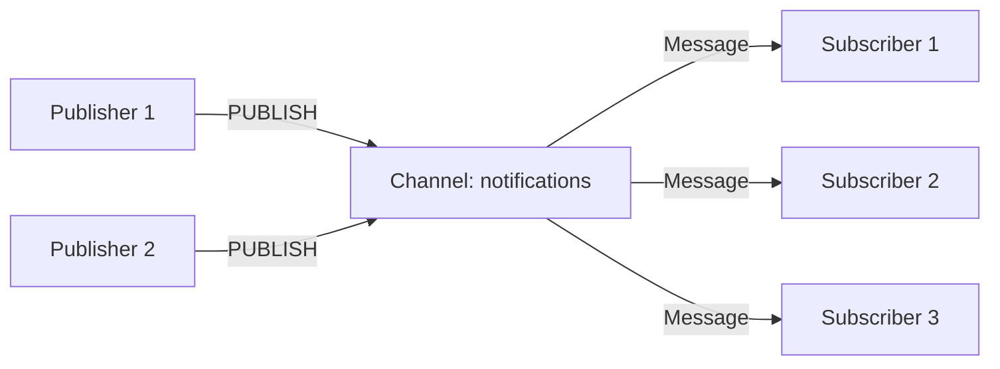
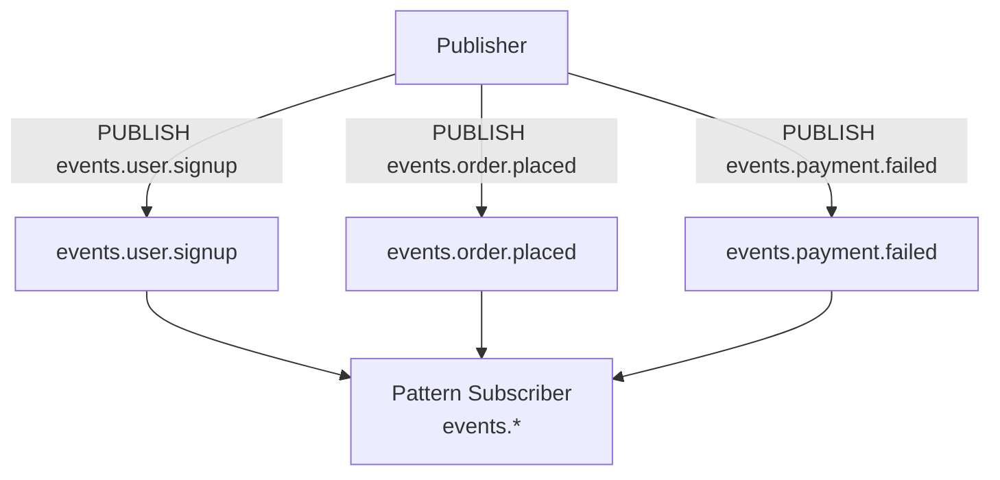
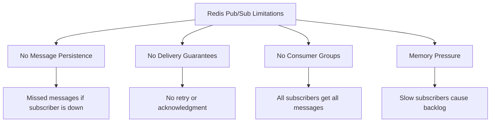

# How to Use Redis Pub/Sub for Real-Time Messaging

Author: [nawazdhandala](https://www.github.com/nawazdhandala)

Tags: Redis, Pub/Sub, Messaging, Real-Time, Event Driven

Description: Learn how to use Redis Pub/Sub for real-time messaging between services including patterns, channels, and scaling considerations.

---

Redis Pub/Sub (Publish/Subscribe) is a messaging paradigm where senders publish messages to channels without knowing who will receive them, and receivers subscribe to channels without knowing who is sending. It is one of the simplest ways to add real-time messaging to your application.

This post covers how Redis Pub/Sub works, practical use cases, implementation examples, and important limitations you need to know before using it in production.

## How Redis Pub/Sub Works

Publishers send messages to named channels. Subscribers listen on those channels. When a message is published, Redis delivers it to all active subscribers of that channel in real time.



Key characteristics:
- Messages are fire-and-forget. There is no persistence.
- If a subscriber is not connected when a message is published, it misses that message.
- There is no acknowledgment mechanism.

## Basic Pub/Sub Example

### Publisher

```python
import redis
import json
import time

# Connect to Redis
r = redis.Redis(host='localhost', port=6379, decode_responses=True)

def publish_event(channel: str, event_type: str, data: dict):
    """
    Publish an event to a Redis channel.
    All subscribers on this channel receive the message instantly.
    """
    message = json.dumps({
        "type": event_type,
        "data": data,
        "timestamp": time.time()
    })
    # PUBLISH returns the number of subscribers who received the message
    receivers = r.publish(channel, message)
    print(f"Published to {channel}, received by {receivers} subscribers")
    return receivers

# Publish some events
publish_event("notifications", "user.signup", {"user_id": "u123", "name": "Alice"})
publish_event("notifications", "order.placed", {"order_id": "o456", "total": 99.99})
```

### Subscriber

```python
import redis
import json

# Each subscriber needs its own connection
# Pub/Sub connections cannot be used for other Redis commands
r = redis.Redis(host='localhost', port=6379, decode_responses=True)

def subscribe_to_channel(channel: str):
    """
    Subscribe to a Redis channel and process messages.
    This blocks the current thread and listens for messages.
    """
    pubsub = r.pubsub()
    pubsub.subscribe(channel)

    print(f"Subscribed to {channel}, waiting for messages...")

    # listen() is a blocking generator that yields messages
    for message in pubsub.listen():
        # Skip the subscription confirmation message
        if message["type"] == "message":
            data = json.loads(message["data"])
            print(f"Received on {message['channel']}: {data}")
            handle_event(data)


def handle_event(event: dict):
    """Process an incoming event based on its type."""
    event_type = event.get("type", "unknown")

    if event_type == "user.signup":
        print(f"New user signed up: {event['data']['name']}")
    elif event_type == "order.placed":
        print(f"New order: {event['data']['order_id']}")
    else:
        print(f"Unknown event type: {event_type}")

# Start listening (this blocks)
subscribe_to_channel("notifications")
```

## Pattern-Based Subscriptions

Redis supports pattern matching for channel names using `PSUBSCRIBE`. This lets a single subscriber listen to multiple channels at once.

```python
def subscribe_with_pattern(pattern: str):
    """
    Subscribe to channels matching a glob-style pattern.
    Example patterns:
      - "events.*" matches "events.user", "events.order", etc.
      - "service-*" matches "service-auth", "service-api", etc.
    """
    pubsub = r.pubsub()
    # PSUBSCRIBE uses glob-style patterns
    pubsub.psubscribe(pattern)

    print(f"Subscribed to pattern: {pattern}")

    for message in pubsub.listen():
        if message["type"] == "pmessage":
            print(f"Channel: {message['channel']}, Pattern: {message['pattern']}")
            data = json.loads(message["data"])
            handle_event(data)

# Subscribe to all channels starting with "events."
subscribe_with_pattern("events.*")
```



## Real-World Use Case: Chat Room

```python
import threading

class ChatRoom:
    """
    A simple chat room using Redis Pub/Sub.
    Each chat room maps to a Redis channel.
    """

    def __init__(self, room_name: str, username: str):
        # Publisher connection
        self.pub_conn = redis.Redis(
            host='localhost', port=6379, decode_responses=True
        )
        # Subscriber connection (separate connection required)
        self.sub_conn = redis.Redis(
            host='localhost', port=6379, decode_responses=True
        )
        self.room_name = f"chat:{room_name}"
        self.username = username
        self.pubsub = self.sub_conn.pubsub()

    def join(self):
        """Join the chat room and start listening for messages."""
        self.pubsub.subscribe(self.room_name)
        # Run the listener in a background thread
        self.listener_thread = threading.Thread(
            target=self._listen, daemon=True
        )
        self.listener_thread.start()
        # Announce joining
        self.send(f"{self.username} has joined the room")

    def send(self, message: str):
        """Send a message to the chat room."""
        payload = json.dumps({
            "sender": self.username,
            "message": message,
            "timestamp": time.time()
        })
        self.pub_conn.publish(self.room_name, payload)

    def _listen(self):
        """Background listener for incoming messages."""
        for msg in self.pubsub.listen():
            if msg["type"] == "message":
                data = json.loads(msg["data"])
                # Do not print your own messages
                if data["sender"] != self.username:
                    print(f"[{data['sender']}]: {data['message']}")

    def leave(self):
        """Leave the chat room."""
        self.send(f"{self.username} has left the room")
        self.pubsub.unsubscribe(self.room_name)
```

## Async Subscriber with asyncio

For non-blocking applications, use the async Redis client.

```python
import asyncio
import redis.asyncio as aioredis

async def async_subscriber(channel: str):
    """
    Async subscriber using redis.asyncio.
    Non-blocking and suitable for asyncio-based applications.
    """
    r = aioredis.Redis(host='localhost', port=6379, decode_responses=True)
    pubsub = r.pubsub()
    await pubsub.subscribe(channel)

    print(f"Async subscriber listening on {channel}")

    # Process messages asynchronously
    async for message in pubsub.listen():
        if message["type"] == "message":
            data = json.loads(message["data"])
            print(f"Async received: {data}")
            # Handle the message without blocking
            await process_message(data)

async def process_message(data: dict):
    """Simulate async message processing."""
    await asyncio.sleep(0.1)  # Simulate I/O work
    print(f"Processed: {data.get('type', 'unknown')}")

# Run the async subscriber
asyncio.run(async_subscriber("notifications"))
```

## Limitations of Redis Pub/Sub

Before choosing Redis Pub/Sub, understand these limitations:



1. **No persistence**: Messages are not stored. If no subscriber is listening, the message is lost.
2. **No acknowledgment**: The publisher does not know if subscribers processed the message.
3. **No consumer groups**: Every subscriber gets every message. You cannot distribute work across consumers.
4. **Backpressure risk**: Slow subscribers cause Redis to buffer messages in memory.

If you need any of these features, consider Redis Streams instead.

## When to Use Pub/Sub vs Streams

| Feature | Pub/Sub | Streams |
|---------|---------|---------|
| Persistence | No | Yes |
| Consumer Groups | No | Yes |
| Acknowledgment | No | Yes |
| Message Replay | No | Yes |
| Latency | Lower | Slightly Higher |
| Complexity | Simple | Moderate |

Use Pub/Sub for: real-time notifications, chat, live dashboards, cache invalidation signals.

Use Streams for: task queues, event sourcing, reliable message processing.

## Conclusion

Redis Pub/Sub is a lightweight, fast way to broadcast messages between services in real time. It works well for notifications, chat systems, and cache invalidation. Just remember that it is fire-and-forget with no persistence or delivery guarantees. For reliable message processing, pair it with Redis Streams or a dedicated message broker.

To monitor your Redis Pub/Sub channels, track subscriber counts, and alert on message delivery failures, [OneUptime](https://oneuptime.com) provides end-to-end observability for your messaging infrastructure with metrics, logs, and incident management in a single open-source platform.
