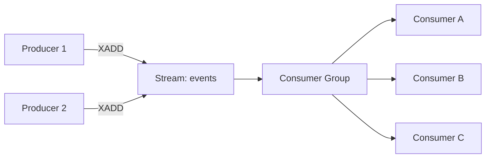
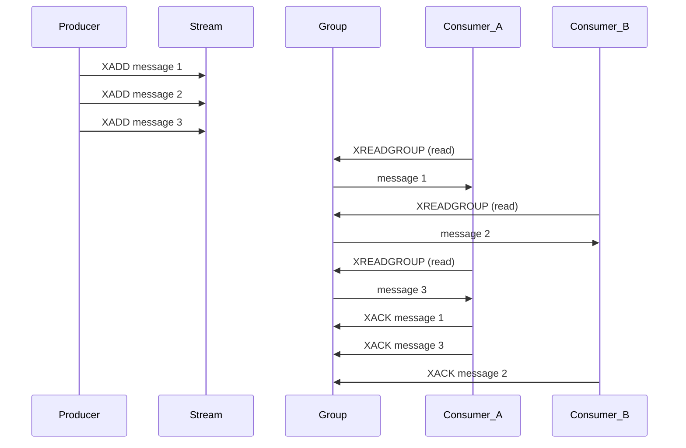
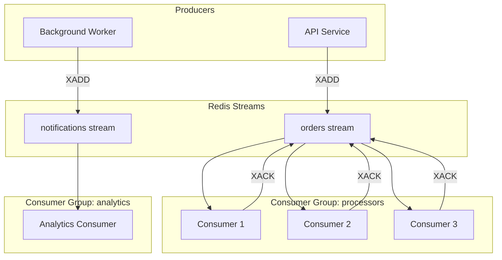

# How to Use Redis Streams for Event Processing

Author: [nawazdhandala](https://www.github.com/nawazdhandala)

Tags: Redis, Streams, Event Processing, Consumer Groups, Message Queue

Description: Learn how to use Redis Streams with consumer groups for reliable event processing and message queuing.

---

Redis Streams is a log-like data structure introduced in Redis 5.0. Unlike Pub/Sub, Streams persist messages, support consumer groups, and provide message acknowledgment. This makes them suitable for reliable event processing, task queues, and event sourcing.

This post covers the core concepts of Redis Streams, how to produce and consume messages, set up consumer groups, and handle failures.

## How Redis Streams Work

A stream is an append-only log of entries. Each entry has a unique ID (typically a timestamp) and a set of field-value pairs. Consumers can read entries sequentially or join consumer groups to distribute work.



Key features:
- Messages are persisted to disk
- Each message gets a unique, time-based ID
- Consumer groups allow distributing messages across workers
- Acknowledgment ensures no message is lost

## Producing Messages

```python
import redis
import json
import time

# Connect to Redis
r = redis.Redis(host='localhost', port=6379, decode_responses=True)

def produce_event(stream: str, event_type: str, data: dict) -> str:
    """
    Add an event to a Redis Stream.
    XADD appends the entry and returns a unique message ID.
    The '*' argument tells Redis to auto-generate the ID.
    """
    entry = {
        "type": event_type,
        "data": json.dumps(data),
        "timestamp": str(time.time())
    }

    # XADD appends to the stream and returns the message ID
    message_id = r.xadd(stream, entry)
    print(f"Produced message {message_id} to {stream}")
    return message_id

# Produce some events
produce_event("orders", "order.created", {"order_id": "o1", "total": 49.99})
produce_event("orders", "order.created", {"order_id": "o2", "total": 129.00})
produce_event("orders", "order.shipped", {"order_id": "o1", "carrier": "FedEx"})
```

## Consuming Messages (Simple Reader)

The simplest way to consume is with `XREAD`, which reads entries from one or more streams.

```python
def simple_consumer(stream: str):
    """
    Simple stream consumer using XREAD.
    Reads new messages as they arrive.
    '$' means read only new messages from this point forward.
    """
    last_id = "$"  # Start from the latest message

    print(f"Listening on stream: {stream}")
    while True:
        # BLOCK=5000 waits up to 5 seconds for new messages
        # COUNT=10 reads at most 10 messages per call
        messages = r.xread(
            streams={stream: last_id},
            count=10,
            block=5000  # Block for 5 seconds
        )

        if not messages:
            continue  # No new messages, loop again

        for stream_name, entries in messages:
            for message_id, fields in entries:
                print(f"Message {message_id}: {fields}")
                # Update last_id to continue from this point
                last_id = message_id
```

## Consumer Groups

Consumer groups are the real power of Redis Streams. They let multiple consumers share the workload, with each message delivered to exactly one consumer in the group.



### Setting Up a Consumer Group

```python
def create_consumer_group(stream: str, group: str):
    """
    Create a consumer group for a stream.
    '0' means start reading from the beginning of the stream.
    '$' means start reading only new messages.
    """
    try:
        # mkstream=True creates the stream if it does not exist
        r.xgroup_create(stream, group, id="0", mkstream=True)
        print(f"Created consumer group '{group}' on stream '{stream}'")
    except redis.exceptions.ResponseError as e:
        # Group already exists
        if "BUSYGROUP" in str(e):
            print(f"Consumer group '{group}' already exists")
        else:
            raise

# Create a consumer group
create_consumer_group("orders", "order-processors")
```

### Consumer Group Reader

```python
def group_consumer(stream: str, group: str, consumer_name: str):
    """
    Consumer group reader.
    Each consumer in the group receives different messages.
    Messages must be acknowledged after processing.
    """
    print(f"Consumer '{consumer_name}' started in group '{group}'")

    while True:
        # '>' means read only messages never delivered to this consumer
        messages = r.xreadgroup(
            groupname=group,
            consumername=consumer_name,
            streams={stream: ">"},
            count=5,
            block=5000
        )

        if not messages:
            continue

        for stream_name, entries in messages:
            for message_id, fields in entries:
                try:
                    # Process the message
                    process_event(fields)

                    # Acknowledge successful processing
                    r.xack(stream, group, message_id)
                    print(f"[{consumer_name}] Processed and ACKed: {message_id}")

                except Exception as e:
                    # Do not ACK - message stays in the pending list
                    print(f"[{consumer_name}] Failed to process {message_id}: {e}")


def process_event(fields: dict):
    """Process an event from the stream."""
    event_type = fields.get("type", "unknown")
    data = json.loads(fields.get("data", "{}"))

    if event_type == "order.created":
        print(f"Processing new order: {data['order_id']}")
    elif event_type == "order.shipped":
        print(f"Order shipped: {data['order_id']} via {data['carrier']}")
```

## Handling Failed Messages

When a consumer fails to acknowledge a message, it stays in the Pending Entries List (PEL). You need a mechanism to reclaim and retry these messages.

```python
def claim_stale_messages(stream: str, group: str, consumer_name: str,
                         min_idle_ms: int = 60000):
    """
    Claim messages that have been pending for too long.
    This handles the case where a consumer crashes before ACKing.
    min_idle_ms: only claim messages idle for at least this many ms.
    """
    # XAUTOCLAIM automatically transfers ownership of idle messages
    # It returns messages that have been pending longer than min_idle_ms
    result = r.xautoclaim(
        name=stream,
        groupname=group,
        consumername=consumer_name,
        min_idle_time=min_idle_ms,
        start_id="0-0",
        count=10
    )

    # result is a tuple: (next_start_id, claimed_messages, deleted_ids)
    next_id, claimed, deleted = result

    for message_id, fields in claimed:
        try:
            process_event(fields)
            r.xack(stream, group, message_id)
            print(f"Reclaimed and processed: {message_id}")
        except Exception as e:
            print(f"Failed to process reclaimed message {message_id}: {e}")

    return len(claimed)


def check_pending(stream: str, group: str):
    """
    Check the pending entries list for a consumer group.
    Shows messages that have been delivered but not yet acknowledged.
    """
    # XPENDING returns a summary of pending messages
    pending = r.xpending(stream, group)
    print(f"Pending messages: {pending['pending']}")
    print(f"Smallest ID: {pending['min']}")
    print(f"Largest ID: {pending['max']}")

    # Get detailed pending info per consumer
    if pending['pending'] > 0:
        details = r.xpending_range(
            stream, group, min="-", max="+", count=10
        )
        for entry in details:
            print(f"  Message {entry['message_id']} - "
                  f"Consumer: {entry['consumer']} - "
                  f"Idle: {entry['time_since_delivered']}ms - "
                  f"Deliveries: {entry['times_delivered']}")
```

## Stream Management

```python
def trim_stream(stream: str, max_length: int = 10000):
    """
    Trim the stream to keep only the latest entries.
    Use MAXLEN with ~ for approximate trimming (more efficient).
    """
    # ~ means approximate trimming - Redis may keep slightly more entries
    # This is more performant than exact trimming
    r.xtrim(stream, maxlen=max_length, approximate=True)
    print(f"Trimmed {stream} to approximately {max_length} entries")


def stream_info(stream: str):
    """Get information about a stream."""
    info = r.xinfo_stream(stream)
    print(f"Stream: {stream}")
    print(f"  Length: {info['length']}")
    print(f"  First entry: {info['first-entry']}")
    print(f"  Last entry: {info['last-entry']}")
    print(f"  Groups: {info['groups']}")
```

## Architecture Overview



## Streams vs Other Message Brokers

| Feature | Redis Streams | Kafka | RabbitMQ |
|---------|--------------|-------|----------|
| Persistence | Yes | Yes | Yes |
| Consumer Groups | Yes | Yes | No (but has exchanges) |
| Ordering | Per stream | Per partition | Per queue |
| Throughput | High | Very High | Moderate |
| Complexity | Low | High | Moderate |
| Built-in with Redis | Yes | No | No |

Redis Streams is a good fit when you already use Redis and need a lightweight, reliable message queue without adding another infrastructure component.

## Conclusion

Redis Streams gives you persistent, reliable message processing with consumer groups and acknowledgment. Use them when you need guaranteed delivery that Pub/Sub cannot provide. Set up consumer groups to distribute work, always acknowledge processed messages, and run a reclaimer to handle failed consumers.

To monitor your Redis Streams consumers, track pending message counts, and get alerted when processing falls behind, [OneUptime](https://oneuptime.com) provides full observability for your event processing pipelines with real-time metrics, distributed tracing, and alerting in one open-source platform.
