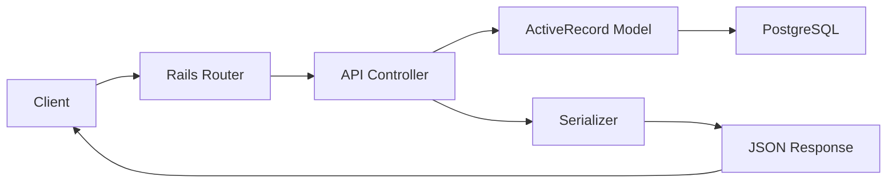
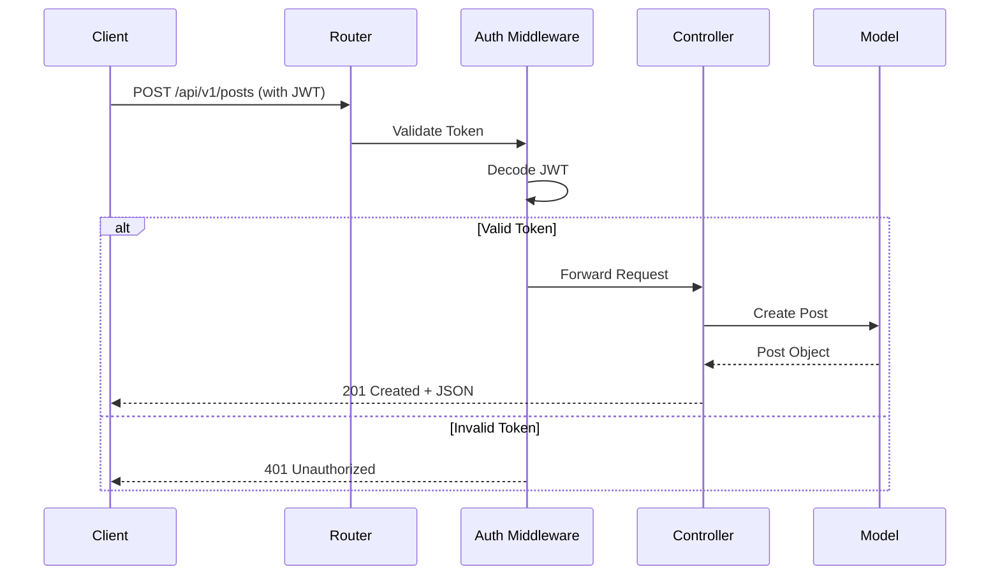

# How to Build REST APIs with Ruby on Rails

Author: [nawazdhandala](https://www.github.com/nawazdhandala)

Tags: Ruby, Rails, REST API, Backend, Web Development

Description: Learn how to build REST APIs with Ruby on Rails including controllers, serializers, authentication, and testing.

---

Ruby on Rails has been a go-to framework for building web applications for nearly two decades. Its convention-over-configuration philosophy makes it especially productive for building REST APIs. In this guide, we will walk through creating a production-ready REST API with Rails.

## Architecture Overview

Before writing code, let us look at how a typical Rails API handles requests.



## Setting Up a New Rails API Project

Rails ships with an API-only mode that strips out middleware you do not need for JSON APIs.

```bash
# Create a new Rails API project
rails new my_api --api --database=postgresql

# Navigate into the project
cd my_api

# Create the database
rails db:create
```

## Generating Resources

Rails generators scaffold out models, controllers, and migrations in one command.

```bash
# Generate a Post resource with title and body fields
rails generate scaffold Post title:string body:text published:boolean

# Run the migration
rails db:migrate
```

## Configuring Routes

Rails uses a resourceful routing system. Open `config/routes.rb`:

```ruby
# config/routes.rb
Rails.application.routes.draw do
  # Namespace all API routes under /api/v1
  namespace :api do
    namespace :v1 do
      resources :posts do
        resources :comments, only: [:index, :create, :destroy]
      end
      resources :users, only: [:create, :show]
      post '/auth/login', to: 'authentication#login'
    end
  end
end
```

## Building the Controller

Here is a well-structured API controller with proper error handling:

```ruby
# app/controllers/api/v1/posts_controller.rb
module Api
  module V1
    class PostsController < ApplicationController
      # Find the post before show, update, and destroy actions
      before_action :set_post, only: [:show, :update, :destroy]
      before_action :authenticate_user!, except: [:index, :show]

      # GET /api/v1/posts
      # Returns paginated list of published posts
      def index
        @posts = Post.where(published: true)
                     .order(created_at: :desc)
                     .page(params[:page])
                     .per(params[:per_page] || 20)

        render json: {
          posts: PostSerializer.new(@posts).serializable_hash,
          meta: pagination_meta(@posts)
        }, status: :ok
      end

      # GET /api/v1/posts/:id
      # Returns a single post by ID
      def show
        render json: PostSerializer.new(@post).serializable_hash, status: :ok
      end

      # POST /api/v1/posts
      # Creates a new post for the authenticated user
      def create
        @post = current_user.posts.build(post_params)

        if @post.save
          render json: PostSerializer.new(@post).serializable_hash, status: :created
        else
          render json: { errors: @post.errors.full_messages }, status: :unprocessable_entity
        end
      end

      # PATCH /api/v1/posts/:id
      # Updates an existing post
      def update
        if @post.update(post_params)
          render json: PostSerializer.new(@post).serializable_hash, status: :ok
        else
          render json: { errors: @post.errors.full_messages }, status: :unprocessable_entity
        end
      end

      # DELETE /api/v1/posts/:id
      # Deletes a post
      def destroy
        @post.destroy
        head :no_content
      end

      private

      # Find the post or return 404
      def set_post
        @post = Post.find(params[:id])
      rescue ActiveRecord::RecordNotFound
        render json: { error: 'Post not found' }, status: :not_found
      end

      # Whitelist allowed parameters
      def post_params
        params.require(:post).permit(:title, :body, :published)
      end

      # Build pagination metadata
      def pagination_meta(collection)
        {
          current_page: collection.current_page,
          total_pages: collection.total_pages,
          total_count: collection.total_count
        }
      end
    end
  end
end
```

## Adding Serializers

Use `jsonapi-serializer` for consistent JSON output:

```ruby
# Gemfile
gem 'jsonapi-serializer'
```

```ruby
# app/serializers/post_serializer.rb
class PostSerializer
  include JSONAPI::Serializer

  # Define which attributes to include in the JSON output
  attributes :title, :body, :published, :created_at, :updated_at

  # Include the author relationship
  belongs_to :user, serializer: UserSerializer

  # Add a computed attribute for reading time
  attribute :reading_time do |post|
    words = post.body.split.size
    minutes = (words / 200.0).ceil
    "#{minutes} min read"
  end
end
```

## Adding JWT Authentication

Secure your API with JSON Web Tokens:

```ruby
# app/controllers/concerns/authenticatable.rb
module Authenticatable
  extend ActiveSupport::Concern

  # Decode the JWT token from the Authorization header
  def authenticate_user!
    header = request.headers['Authorization']
    token = header.split(' ').last if header

    begin
      # Decode the token using the application secret
      decoded = JWT.decode(token, Rails.application.credentials.secret_key_base, true, algorithm: 'HS256')
      @current_user = User.find(decoded[0]['user_id'])
    rescue JWT::DecodeError, ActiveRecord::RecordNotFound
      render json: { error: 'Unauthorized' }, status: :unauthorized
    end
  end

  def current_user
    @current_user
  end
end
```

## Request Flow with Authentication



## Model Validations

Keep your data clean with ActiveRecord validations:

```ruby
# app/models/post.rb
class Post < ApplicationRecord
  # Associations
  belongs_to :user
  has_many :comments, dependent: :destroy

  # Validations - ensure data integrity at the model level
  validates :title, presence: true, length: { minimum: 5, maximum: 200 }
  validates :body, presence: true, length: { minimum: 50 }

  # Scopes for common queries
  scope :published, -> { where(published: true) }
  scope :recent, -> { order(created_at: :desc) }
  scope :by_author, ->(user_id) { where(user_id: user_id) }
end
```

## Error Handling

Add a global error handler to keep controllers clean:

```ruby
# app/controllers/application_controller.rb
class ApplicationController < ActionController::API
  include Authenticatable

  # Catch common errors and return proper HTTP status codes
  rescue_from ActiveRecord::RecordNotFound do |e|
    render json: { error: e.message }, status: :not_found
  end

  rescue_from ActiveRecord::RecordInvalid do |e|
    render json: { errors: e.record.errors.full_messages }, status: :unprocessable_entity
  end

  rescue_from ActionController::ParameterMissing do |e|
    render json: { error: e.message }, status: :bad_request
  end
end
```

## Testing Your API

Write request specs to verify behavior end-to-end:

```ruby
# spec/requests/api/v1/posts_spec.rb
require 'rails_helper'

RSpec.describe 'Api::V1::Posts', type: :request do
  let(:user) { create(:user) }
  let(:token) { generate_jwt_token(user) }
  let(:headers) { { 'Authorization' => "Bearer #{token}", 'Content-Type' => 'application/json' } }

  describe 'GET /api/v1/posts' do
    # Create test posts before running the test
    before { create_list(:post, 5, published: true) }

    it 'returns a paginated list of posts' do
      get '/api/v1/posts'

      expect(response).to have_http_status(:ok)
      json = JSON.parse(response.body)
      expect(json['posts']['data'].size).to eq(5)
    end
  end

  describe 'POST /api/v1/posts' do
    let(:valid_params) do
      { post: { title: 'Test Post', body: 'A' * 50, published: false } }
    end

    it 'creates a new post' do
      post '/api/v1/posts', params: valid_params.to_json, headers: headers

      expect(response).to have_http_status(:created)
      json = JSON.parse(response.body)
      expect(json['data']['attributes']['title']).to eq('Test Post')
    end

    it 'returns 401 without authentication' do
      post '/api/v1/posts', params: valid_params.to_json,
           headers: { 'Content-Type' => 'application/json' }

      expect(response).to have_http_status(:unauthorized)
    end
  end
end
```

## Rate Limiting

Add rate limiting with the `rack-attack` gem:

```ruby
# config/initializers/rack_attack.rb
class Rack::Attack
  # Throttle API requests to 100 per minute per IP
  throttle('api/ip', limit: 100, period: 1.minute) do |req|
    req.ip if req.path.start_with?('/api/')
  end

  # Return a JSON response when throttled
  self.throttled_responder = lambda do |_env|
    [429, { 'Content-Type' => 'application/json' },
     [{ error: 'Rate limit exceeded. Try again later.' }.to_json]]
  end
end
```

## Summary

Building REST APIs with Ruby on Rails is straightforward thanks to its conventions and rich ecosystem. The key takeaways are:

- Use `--api` mode for leaner applications
- Namespace your routes under versioned paths
- Add serializers for consistent JSON output
- Secure endpoints with JWT authentication
- Write request specs for end-to-end testing
- Add rate limiting for production safety

Once your API is running, you will want to monitor its health, uptime, and performance. [OneUptime](https://oneuptime.com) provides complete observability for your Rails APIs - including uptime monitoring, request tracing, and alerting - so you can catch issues before your users do.
