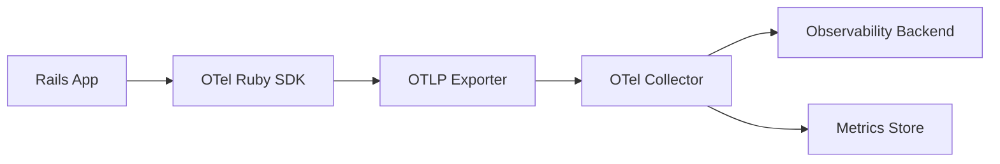
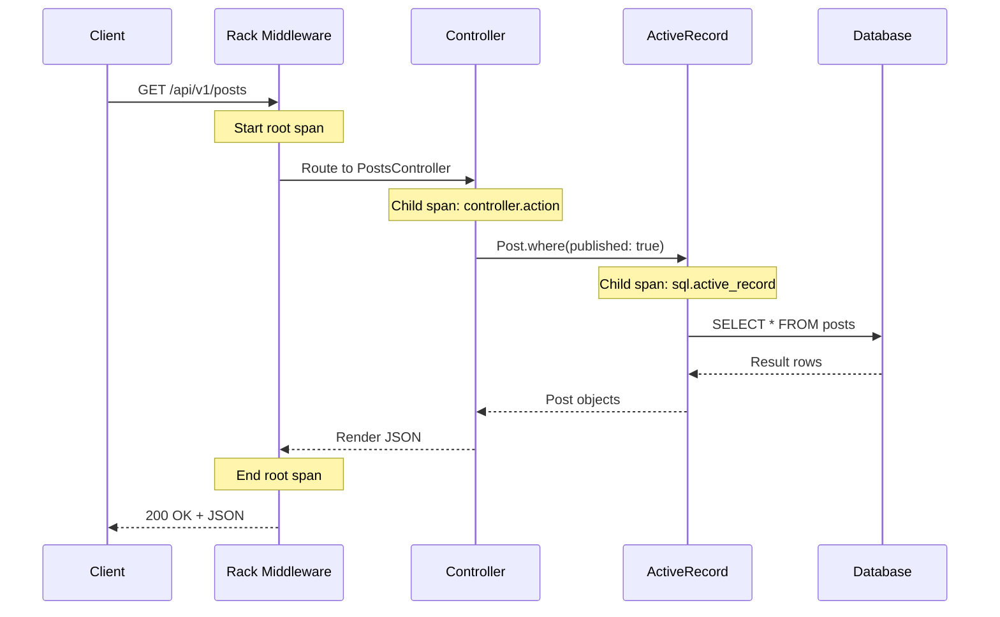
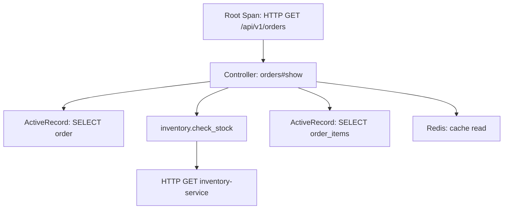

# How to Instrument Ruby on Rails with OpenTelemetry

Author: [nawazdhandala](https://www.github.com/nawazdhandala)

Tags: Ruby, Rails, OpenTelemetry, Tracing, Observability

Description: Learn how to add OpenTelemetry instrumentation to Ruby on Rails applications for distributed tracing and monitoring.

---

Distributed tracing gives you end-to-end visibility into how requests flow through your Rails application and its dependencies. OpenTelemetry is the vendor-neutral standard for collecting traces, metrics, and logs. In this guide, we will instrument a Ruby on Rails application with OpenTelemetry from scratch.

## How OpenTelemetry Works in Rails

Before we dive into setup, let us understand the data flow.



Each incoming HTTP request becomes a trace. Each database query, cache lookup, or external API call within that request becomes a span.

## Installing OpenTelemetry Gems

Add the required gems to your Gemfile:

```ruby
# Gemfile

# Core OpenTelemetry SDK
gem 'opentelemetry-sdk'

# OTLP exporter to send data to any OpenTelemetry-compatible backend
gem 'opentelemetry-exporter-otlp'

# Auto-instrumentation for Rails and common libraries
gem 'opentelemetry-instrumentation-rails'
gem 'opentelemetry-instrumentation-active_record'
gem 'opentelemetry-instrumentation-action_pack'
gem 'opentelemetry-instrumentation-active_job'
gem 'opentelemetry-instrumentation-pg'
gem 'opentelemetry-instrumentation-redis'
gem 'opentelemetry-instrumentation-net_http'
gem 'opentelemetry-instrumentation-faraday'
```

```bash
# Install the gems
bundle install
```

## Configuring the SDK

Create an initializer to configure OpenTelemetry when Rails boots:

```ruby
# config/initializers/opentelemetry.rb
require 'opentelemetry/sdk'
require 'opentelemetry/exporter/otlp'
require 'opentelemetry/instrumentation/rails'

OpenTelemetry::SDK.configure do |c|
  # Set the service name that will appear in your tracing backend
  c.service_name = ENV.fetch('OTEL_SERVICE_NAME', 'my-rails-api')

  # Set the service version for tracking deployments
  c.service_version = ENV.fetch('APP_VERSION', '1.0.0')

  # Configure the OTLP exporter to send traces
  c.add_span_processor(
    OpenTelemetry::SDK::Trace::Export::BatchSpanProcessor.new(
      OpenTelemetry::Exporter::OTLP::Exporter.new(
        # The endpoint of your OpenTelemetry Collector
        endpoint: ENV.fetch('OTEL_EXPORTER_OTLP_ENDPOINT', 'http://localhost:4318/v1/traces'),
        # Optional headers for authentication
        headers: { 'x-oneuptime-token' => ENV.fetch('ONEUPTIME_TOKEN', '') }
      )
    )
  )

  # Automatically instrument Rails and all supported libraries
  c.use_all
end
```

## Trace Lifecycle in a Rails Request



## Adding Custom Spans

Auto-instrumentation covers HTTP, database, and cache. For business logic, add custom spans:

```ruby
# app/services/order_service.rb
class OrderService
  def initialize
    # Get a tracer instance named after this service
    @tracer = OpenTelemetry.tracer_provider.tracer('order-service')
  end

  def process_order(order_params)
    # Create a custom span for the entire order processing flow
    @tracer.in_span('process_order', attributes: {
      'order.customer_id' => order_params[:customer_id].to_s,
      'order.item_count' => order_params[:items].size
    }) do |span|
      # Validate the order inside a child span
      validate_order(order_params)

      # Calculate pricing in another child span
      total = calculate_total(order_params[:items])
      span.set_attribute('order.total_cents', total)

      # Charge the payment
      charge_payment(order_params[:customer_id], total)

      # Send confirmation email
      send_confirmation(order_params[:customer_id])
    end
  end

  private

  def validate_order(params)
    @tracer.in_span('validate_order') do |span|
      # Validation logic here
      raise ArgumentError, 'No items in order' if params[:items].empty?
      span.set_attribute('validation.passed', true)
    end
  end

  def calculate_total(items)
    @tracer.in_span('calculate_total') do |span|
      total = items.sum { |item| item[:price] * item[:quantity] }
      span.set_attribute('pricing.subtotal_cents', total)
      total
    end
  end

  def charge_payment(customer_id, amount)
    @tracer.in_span('charge_payment', attributes: {
      'payment.amount_cents' => amount,
      'payment.customer_id' => customer_id.to_s
    }) do |span|
      # Call payment gateway
      result = PaymentGateway.charge(customer_id, amount)
      span.set_attribute('payment.success', result.success?)
      span.set_attribute('payment.transaction_id', result.transaction_id)
    end
  end

  def send_confirmation(customer_id)
    @tracer.in_span('send_confirmation') do
      # Queue the email via ActiveJob
      OrderConfirmationMailer.confirm(customer_id).deliver_later
    end
  end
end
```

## Recording Errors in Spans

When exceptions occur, record them on the span so they appear in your tracing backend:

```ruby
# app/controllers/api/v1/payments_controller.rb
class Api::V1::PaymentsController < ApplicationController
  def create
    tracer = OpenTelemetry.tracer_provider.tracer('payments-controller')

    tracer.in_span('payments.create') do |span|
      begin
        # Set initial attributes
        span.set_attribute('payment.method', params[:payment_method])
        span.set_attribute('payment.amount', params[:amount].to_f)

        result = PaymentService.charge(payment_params)

        if result.success?
          span.set_attribute('payment.status', 'success')
          render json: { transaction_id: result.id }, status: :created
        else
          # Record the failure without raising an exception
          span.set_attribute('payment.status', 'failed')
          span.set_attribute('payment.failure_reason', result.error_message)
          render json: { error: result.error_message }, status: :unprocessable_entity
        end
      rescue StandardError => e
        # Record the exception on the span
        span.record_exception(e)
        span.status = OpenTelemetry::Trace::Status.error(e.message)
        render json: { error: 'Payment processing failed' }, status: :internal_server_error
      end
    end
  end
end
```

## Adding Context Propagation

When your Rails app calls other services, propagate the trace context:

```ruby
# app/services/inventory_client.rb
class InventoryClient
  BASE_URL = ENV.fetch('INVENTORY_SERVICE_URL', 'http://inventory:3001')

  def check_stock(product_id)
    tracer = OpenTelemetry.tracer_provider.tracer('inventory-client')

    tracer.in_span('inventory.check_stock', attributes: {
      'product.id' => product_id.to_s,
      'http.method' => 'GET',
      'http.url' => "#{BASE_URL}/api/stock/#{product_id}"
    }) do |span|
      # Net::HTTP instrumentation automatically injects trace headers
      uri = URI("#{BASE_URL}/api/stock/#{product_id}")
      response = Net::HTTP.get_response(uri)

      span.set_attribute('http.status_code', response.code.to_i)

      JSON.parse(response.body)
    end
  end
end
```

## Span Hierarchy Diagram



## Environment Configuration

Set these environment variables in production:

```bash
# Service identification
export OTEL_SERVICE_NAME="my-rails-api"
export OTEL_SERVICE_VERSION="1.2.0"

# Collector endpoint
export OTEL_EXPORTER_OTLP_ENDPOINT="https://otel.oneuptime.com"

# Authentication token
export ONEUPTIME_TOKEN="your-project-token"

# Sampling rate (1.0 = 100%, 0.1 = 10%)
export OTEL_TRACES_SAMPLER="parentbased_traceidratio"
export OTEL_TRACES_SAMPLER_ARG="0.5"
```

## Resource Attributes

Add deployment metadata to all spans:

```ruby
# config/initializers/opentelemetry.rb
resource = OpenTelemetry::SDK::Resources::Resource.create(
  'deployment.environment' => ENV.fetch('RAILS_ENV', 'development'),
  'host.name' => Socket.gethostname,
  'service.namespace' => 'ecommerce',
  'service.instance.id' => SecureRandom.uuid
)

OpenTelemetry::SDK.configure do |c|
  c.resource = resource
  c.service_name = 'my-rails-api'
  c.use_all
end
```

## Summary

Instrumenting Ruby on Rails with OpenTelemetry gives you deep visibility into your application:

- Auto-instrumentation covers HTTP, database, cache, and background jobs
- Custom spans let you trace business logic
- Context propagation connects traces across services
- Error recording makes debugging faster

To get the most out of your traces, send them to [OneUptime](https://oneuptime.com). OneUptime accepts OpenTelemetry data natively and gives you distributed tracing, performance dashboards, and alerting - all in one platform. Set your OTLP endpoint to your OneUptime collector and start seeing traces immediately.
