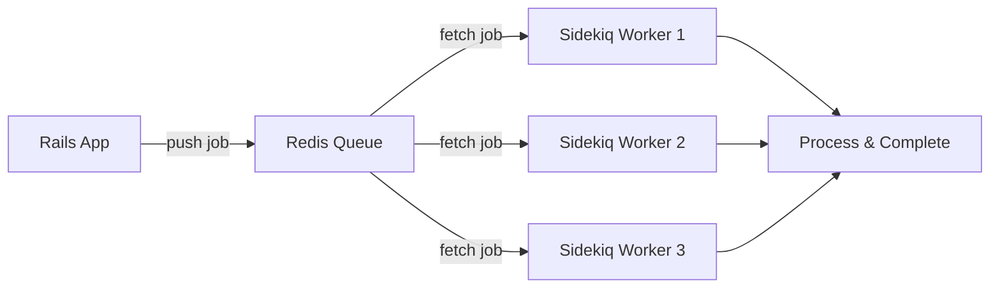
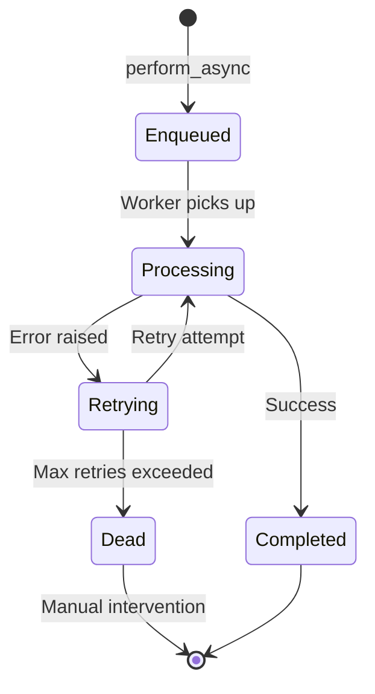
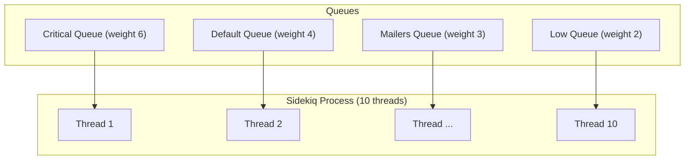

# How to Use Sidekiq for Background Jobs in Ruby

Author: [nawazdhandala](https://www.github.com/nawazdhandala)

Tags: Ruby, Sidekiq, Background Jobs, Redis, Async Processing

Description: Learn how to use Sidekiq for background job processing in Ruby applications with Redis, retries, and monitoring.

---

Background job processing is essential for any production application. Tasks like sending emails, processing images, generating reports, and syncing data should not block the request-response cycle. Sidekiq is the most popular background job framework for Ruby, using Redis for fast, reliable job queuing. This guide covers everything you need to know to use Sidekiq effectively.

## How Sidekiq Works

Sidekiq uses a multi-threaded architecture with Redis as the job store.



## Installation

Add Sidekiq and Redis to your Gemfile:

```ruby
# Gemfile
gem 'sidekiq'          # Background job processing
gem 'sidekiq-cron'     # Scheduled/recurring jobs
gem 'redis', '>= 4.0'  # Redis client
```

```bash
bundle install
```

## Configuring Sidekiq

Create the Sidekiq configuration file:

```yaml
# config/sidekiq.yml
---
# Number of worker threads per Sidekiq process
:concurrency: 10

# Named queues with priority weights
# Higher weight means the queue is checked more often
:queues:
  - [critical, 6]
  - [default, 4]
  - [low, 2]
  - [mailers, 3]

# Retry failed jobs up to 25 times by default
:max_retries: 25

# Log level
:verbose: false
```

Configure the Redis connection:

```ruby
# config/initializers/sidekiq.rb

# Server-side configuration (Sidekiq worker process)
Sidekiq.configure_server do |config|
  config.redis = {
    url: ENV.fetch('REDIS_URL', 'redis://localhost:6379/0'),
    # Connection pool size should match concurrency
    size: ENV.fetch('SIDEKIQ_CONCURRENCY', 10).to_i + 5
  }
end

# Client-side configuration (Rails web process)
Sidekiq.configure_client do |config|
  config.redis = {
    url: ENV.fetch('REDIS_URL', 'redis://localhost:6379/0'),
    size: 5
  }
end
```

## Creating Workers

Define a basic Sidekiq worker:

```ruby
# app/workers/email_notification_worker.rb
class EmailNotificationWorker
  include Sidekiq::Worker

  # Configure retry behavior and queue assignment
  sidekiq_options queue: 'mailers', retry: 5, dead: true

  # The perform method receives the arguments passed when enqueuing
  # IMPORTANT: Arguments must be simple JSON-serializable types
  def perform(user_id, notification_type)
    # Find the user - if not found, the job will fail and retry
    user = User.find(user_id)

    case notification_type
    when 'welcome'
      UserMailer.welcome(user).deliver_now
    when 'password_reset'
      UserMailer.password_reset(user).deliver_now
    when 'weekly_digest'
      UserMailer.weekly_digest(user).deliver_now
    else
      logger.warn("Unknown notification type: #{notification_type}")
    end

    logger.info("Sent #{notification_type} email to user #{user_id}")
  end
end
```

## Enqueuing Jobs

There are several ways to enqueue jobs:

```ruby
# Enqueue a job to run as soon as a worker is available
EmailNotificationWorker.perform_async(user.id, 'welcome')

# Schedule a job to run at a specific time
EmailNotificationWorker.perform_at(30.minutes.from_now, user.id, 'password_reset')

# Schedule a job to run after a delay
EmailNotificationWorker.perform_in(1.hour, user.id, 'weekly_digest')

# Enqueue from a controller
class UsersController < ApplicationController
  def create
    @user = User.create!(user_params)

    # Send welcome email in the background instead of blocking the response
    EmailNotificationWorker.perform_async(@user.id, 'welcome')

    render json: @user, status: :created
  end
end
```

## Job Lifecycle



## Advanced Worker Patterns

### Batch Processing Worker

```ruby
# app/workers/report_generation_worker.rb
class ReportGenerationWorker
  include Sidekiq::Worker

  sidekiq_options queue: 'low', retry: 3

  # Generate a report for a date range
  def perform(report_type, start_date, end_date, requester_id)
    logger.info("Generating #{report_type} report from #{start_date} to #{end_date}")

    # Parse the date strings back into Date objects
    start_dt = Date.parse(start_date)
    end_dt = Date.parse(end_date)

    # Process in batches to avoid loading all records into memory
    report_data = []
    Order.where(created_at: start_dt..end_dt).find_in_batches(batch_size: 1000) do |batch|
      batch.each do |order|
        report_data << {
          id: order.id,
          total: order.total_cents,
          status: order.status,
          created_at: order.created_at.iso8601
        }
      end
    end

    # Save the report to storage
    report = Report.create!(
      report_type: report_type,
      data: report_data.to_json,
      generated_by_id: requester_id,
      status: 'completed'
    )

    # Notify the requester that the report is ready
    ReportReadyNotificationWorker.perform_async(requester_id, report.id)
  end
end
```

### Worker with Custom Retry Logic

```ruby
# app/workers/payment_sync_worker.rb
class PaymentSyncWorker
  include Sidekiq::Worker

  # Custom retry delays: 1 min, 5 min, 30 min, 2 hours, 12 hours
  sidekiq_options queue: 'critical', retry: 5

  # Called when all retries are exhausted
  sidekiq_retries_exhausted do |job, exception|
    # Log the permanent failure
    Rails.logger.error(
      "Payment sync permanently failed for job #{job['jid']}: #{exception.message}"
    )

    # Create an alert for the operations team
    AlertService.notify(
      severity: 'high',
      message: "Payment sync failed after #{job['retry_count']} retries",
      context: job['args']
    )
  end

  def perform(payment_id)
    payment = Payment.find(payment_id)

    # Call external payment gateway
    result = PaymentGateway.sync_status(payment.external_id)

    # Update local record with the synced status
    payment.update!(
      status: result.status,
      synced_at: Time.current,
      gateway_response: result.raw_response
    )
  end
end
```

## Scheduled and Recurring Jobs

Use `sidekiq-cron` for recurring tasks:

```ruby
# config/initializers/sidekiq_cron.rb
Sidekiq::Cron::Job.load_from_hash(
  # Run database cleanup every day at 3 AM
  'database_cleanup' => {
    'class' => 'DatabaseCleanupWorker',
    'cron' => '0 3 * * *',
    'queue' => 'low',
    'description' => 'Remove old records and temporary data'
  },
  # Send weekly digest emails every Monday at 9 AM
  'weekly_digest' => {
    'class' => 'WeeklyDigestWorker',
    'cron' => '0 9 * * 1',
    'queue' => 'mailers',
    'description' => 'Send weekly digest emails to all subscribers'
  },
  # Sync inventory every 15 minutes
  'inventory_sync' => {
    'class' => 'InventorySyncWorker',
    'cron' => '*/15 * * * *',
    'queue' => 'default',
    'description' => 'Sync inventory counts with warehouse API'
  }
)
```

## Queue Priority Flow



## Running Sidekiq

```bash
# Start Sidekiq with the configuration file
bundle exec sidekiq -C config/sidekiq.yml

# Start with a specific environment
RAILS_ENV=production bundle exec sidekiq -C config/sidekiq.yml

# Start multiple Sidekiq processes for higher throughput
# Process 1: handles critical and default queues
bundle exec sidekiq -q critical -q default -c 15

# Process 2: handles low-priority and mailer queues
bundle exec sidekiq -q mailers -q low -c 10
```

## Testing Workers

Test your workers with RSpec:

```ruby
# spec/workers/email_notification_worker_spec.rb
require 'rails_helper'
require 'sidekiq/testing'

RSpec.describe EmailNotificationWorker do
  # Use fake mode so jobs are pushed to an array instead of Redis
  before { Sidekiq::Testing.fake! }

  let(:user) { create(:user) }

  it 'enqueues the job in the mailers queue' do
    expect {
      described_class.perform_async(user.id, 'welcome')
    }.to change(described_class.jobs, :size).by(1)

    job = described_class.jobs.last
    expect(job['queue']).to eq('mailers')
  end

  it 'sends the welcome email' do
    expect {
      described_class.new.perform(user.id, 'welcome')
    }.to change { ActionMailer::Base.deliveries.count }.by(1)
  end

  it 'handles missing users gracefully' do
    expect {
      described_class.new.perform(-1, 'welcome')
    }.to raise_error(ActiveRecord::RecordNotFound)
  end
end
```

## Summary

Sidekiq is a battle-tested solution for background job processing in Ruby:

- Use Redis as a fast, reliable job queue
- Assign jobs to priority queues for workload management
- Configure retry strategies for resilience
- Schedule recurring jobs with sidekiq-cron
- Test workers thoroughly with Sidekiq's testing modes

Monitoring your Sidekiq queues and workers is critical in production. [OneUptime](https://oneuptime.com) can monitor your Redis instances, track queue depths, alert on failed jobs, and give you full visibility into your background processing pipeline - so you always know your jobs are running smoothly.
