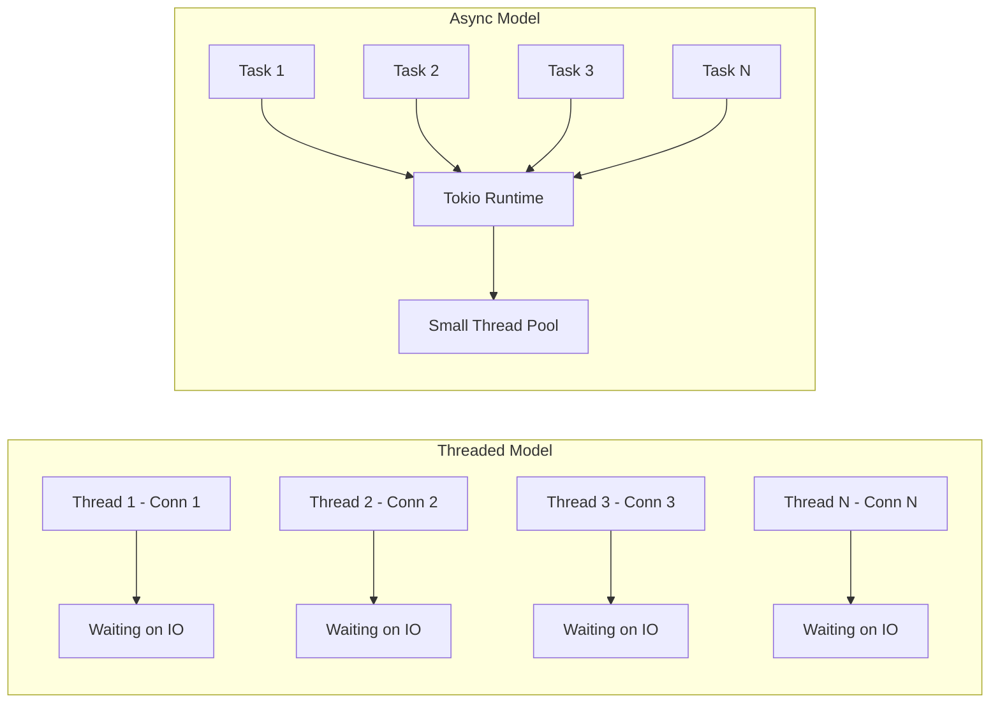
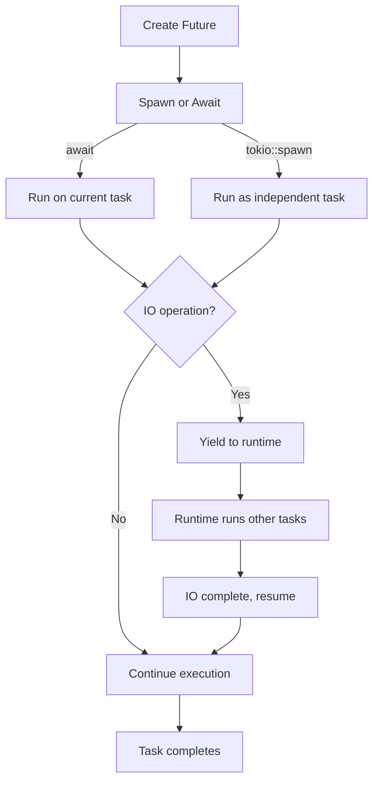
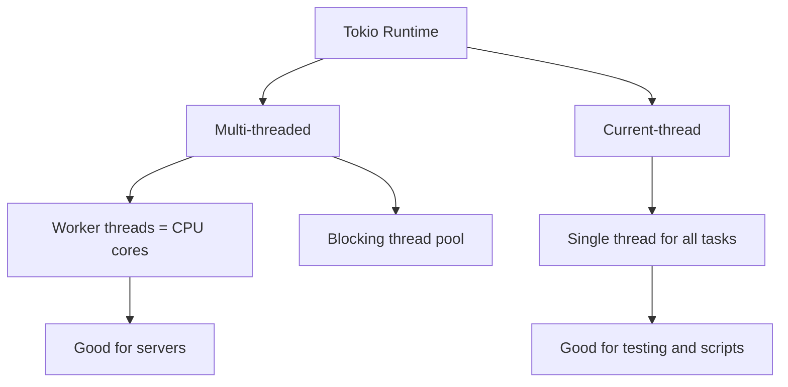

# How to Write Async Rust with Tokio Runtime

Author: [nawazdhandala](https://www.github.com/nawazdhandala)

Tags: Rust, Async, Tokio, Concurrency, Runtime

Description: Learn how to write asynchronous Rust code with the Tokio runtime for high-performance concurrent applications.

---

Asynchronous programming lets your application handle thousands of concurrent operations without spawning thousands of threads. Rust's async/await syntax, combined with the Tokio runtime, provides a powerful foundation for building high-performance network services, web servers, and data pipelines.

In this guide, we will explore how Tokio works, how to write async functions, and how to manage concurrent tasks effectively.

## Why Async Matters

Traditional threaded servers create one OS thread per connection. Each thread consumes memory for its stack (typically 2-8 MB) and context switching between thousands of threads becomes expensive. Async runtimes multiplex many tasks onto a small pool of threads, using far less memory and avoiding costly context switches.



## Project Setup

Add Tokio and related dependencies to your project:

```toml
# Cargo.toml
[package]
name = "async-demo"
version = "0.1.0"
edition = "2021"

[dependencies]
# Tokio runtime with all features enabled
tokio = { version = "1", features = ["full"] }
# HTTP client for async requests
reqwest = { version = "0.12", features = ["json"] }
# Serialization for JSON responses
serde = { version = "1", features = ["derive"] }
serde_json = "1"
```

## Basic Async Function

```rust
use std::time::Duration;
use tokio::time::sleep;

// The async keyword marks this function as asynchronous
// It returns a Future that must be awaited or spawned
async fn fetch_data(url: &str) -> Result<String, reqwest::Error> {
    // .await suspends this task until the HTTP request completes
    // Other tasks can run on the same thread while this waits
    let response = reqwest::get(url).await?;
    let body = response.text().await?;
    Ok(body)
}

// #[tokio::main] sets up the Tokio runtime and runs the async main
#[tokio::main]
async fn main() {
    match fetch_data("https://httpbin.org/get").await {
        Ok(body) => println!("Response length: {} bytes", body.len()),
        Err(err) => eprintln!("Request failed: {}", err),
    }
}
```

## Task Lifecycle



## Spawning Concurrent Tasks

Use tokio::spawn to run tasks concurrently:

```rust
use tokio::task::JoinHandle;

// Fetch multiple URLs concurrently
async fn fetch_all(urls: Vec<String>) -> Vec<Result<String, String>> {
    // Spawn a task for each URL
    let handles: Vec<JoinHandle<Result<String, String>>> = urls
        .into_iter()
        .map(|url| {
            // Each spawned task runs independently on the thread pool
            tokio::spawn(async move {
                let resp = reqwest::get(&url)
                    .await
                    .map_err(|e| format!("Request to {} failed: {}", url, e))?;
                resp.text()
                    .await
                    .map_err(|e| format!("Reading body from {} failed: {}", url, e))
            })
        })
        .collect();

    // Wait for all tasks to complete and collect results
    let mut results = Vec::new();
    for handle in handles {
        match handle.await {
            Ok(result) => results.push(result),
            Err(e) => results.push(Err(format!("Task panicked: {}", e))),
        }
    }
    results
}

#[tokio::main]
async fn main() {
    let urls = vec![
        "https://httpbin.org/delay/1".to_string(),
        "https://httpbin.org/delay/2".to_string(),
        "https://httpbin.org/delay/1".to_string(),
    ];

    // All three requests run concurrently
    // Total time is approximately the duration of the slowest request
    let results = fetch_all(urls).await;
    for (i, result) in results.iter().enumerate() {
        match result {
            Ok(body) => println!("URL {}: {} bytes", i, body.len()),
            Err(err) => println!("URL {}: {}", i, err),
        }
    }
}
```

## Channels for Task Communication

Tokio provides async-aware channels for communication between tasks:

```rust
use tokio::sync::mpsc;

// Message represents work items passed between tasks
#[derive(Debug)]
struct Message {
    id: u64,
    payload: String,
}

#[tokio::main]
async fn main() {
    // Create a multi-producer, single-consumer channel with buffer size 100
    let (tx, mut rx) = mpsc::channel::<Message>(100);

    // Spawn producer tasks that send messages into the channel
    for i in 0..5 {
        let tx_clone = tx.clone();
        tokio::spawn(async move {
            let msg = Message {
                id: i,
                payload: format!("Hello from task {}", i),
            };
            // send() is async and will wait if the buffer is full
            if let Err(e) = tx_clone.send(msg).await {
                eprintln!("Failed to send message: {}", e);
            }
        });
    }

    // Drop the original sender so the receiver knows when all senders are done
    drop(tx);

    // Receive messages until all senders are dropped
    while let Some(msg) = rx.recv().await {
        println!("Received message {}: {}", msg.id, msg.payload);
    }
}
```

## Timeouts and Cancellation

Wrap any future with a timeout to prevent indefinite waiting:

```rust
use std::time::Duration;
use tokio::time::timeout;

async fn fetch_with_timeout(url: &str) -> Result<String, String> {
    // timeout wraps a future with a deadline
    // If the inner future does not complete in time, it is dropped (cancelled)
    let result = timeout(
        Duration::from_secs(5),
        reqwest::get(url),
    )
    .await;

    match result {
        // Timeout did not expire, check the inner result
        Ok(Ok(response)) => {
            response.text().await.map_err(|e| e.to_string())
        }
        // Timeout did not expire, but the request failed
        Ok(Err(e)) => Err(format!("Request error: {}", e)),
        // Timeout expired before the request completed
        Err(_) => Err(format!("Request to {} timed out after 5 seconds", url)),
    }
}
```

## Select: Racing Multiple Futures

tokio::select! runs multiple futures and acts on whichever completes first:

```rust
use tokio::sync::oneshot;
use tokio::time::{sleep, Duration};

async fn primary_source() -> String {
    sleep(Duration::from_secs(2)).await;
    "data from primary".to_string()
}

async fn fallback_source() -> String {
    sleep(Duration::from_secs(1)).await;
    "data from fallback".to_string()
}

#[tokio::main]
async fn main() {
    // select! races two futures and uses whichever completes first
    // The other future is cancelled automatically
    let result = tokio::select! {
        val = primary_source() => {
            println!("Primary source responded first");
            val
        }
        val = fallback_source() => {
            println!("Fallback source responded first");
            val
        }
    };

    println!("Got: {}", result);
}
```

## Shared State with RwLock

For state shared between async tasks, use Tokio's async-aware RwLock:

```rust
use std::collections::HashMap;
use std::sync::Arc;
use tokio::sync::RwLock;

// A thread-safe, async-aware cache
type Cache = Arc<RwLock<HashMap<String, String>>>;

async fn get_cached(cache: &Cache, key: &str) -> Option<String> {
    // Acquire a read lock - multiple readers can hold this simultaneously
    let store = cache.read().await;
    store.get(key).cloned()
}

async fn set_cached(cache: &Cache, key: String, value: String) {
    // Acquire a write lock - exclusive access, blocks all readers
    let mut store = cache.write().await;
    store.insert(key, value);
}
```

## Runtime Configuration



Configure the runtime explicitly when you need control:

```rust
fn main() {
    // Build a custom runtime with specific settings
    let runtime = tokio::runtime::Builder::new_multi_thread()
        // Use 4 worker threads instead of the default (num CPUs)
        .worker_threads(4)
        // Enable both IO and time drivers
        .enable_all()
        // Name the threads for easier debugging
        .thread_name("my-app-worker")
        .build()
        .expect("Failed to build Tokio runtime");

    // Run the async entry point on our custom runtime
    runtime.block_on(async {
        println!("Running on custom runtime");
    });
}
```

## Conclusion

Tokio transforms Rust into a powerful platform for async programming. By combining Rust's ownership model with cooperative multitasking, you get high-performance concurrent applications that are safe from data races and use minimal resources. The async/await syntax keeps the code readable while the runtime handles the complexity of scheduling.

If you are building async Rust services and need to monitor their performance, trace requests across service boundaries, and get alerted when things go wrong, [OneUptime](https://oneuptime.com) provides distributed tracing, metrics collection, and incident management that integrates with OpenTelemetry-instrumented Rust applications.
