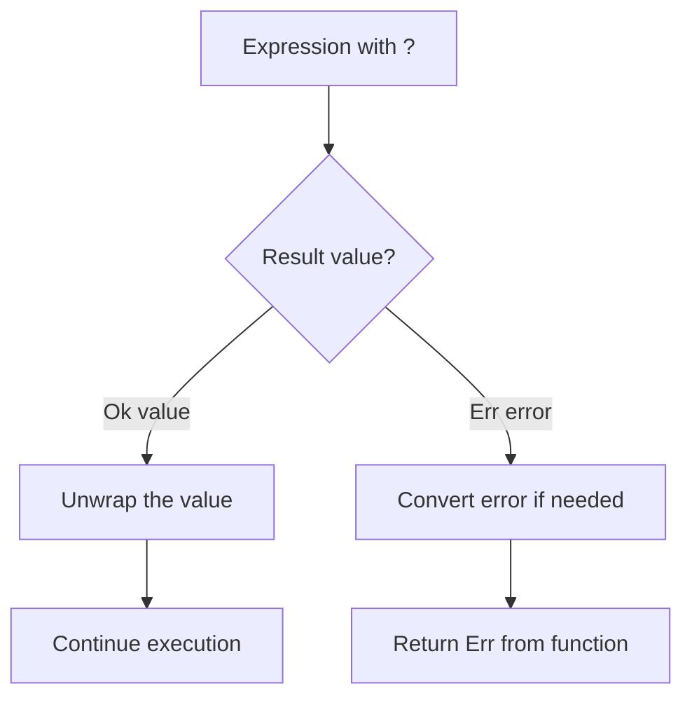
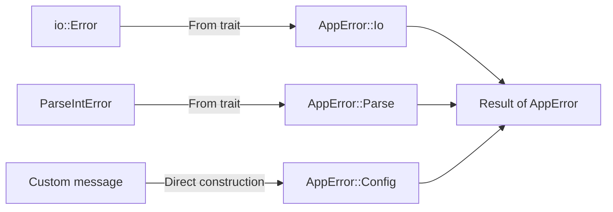
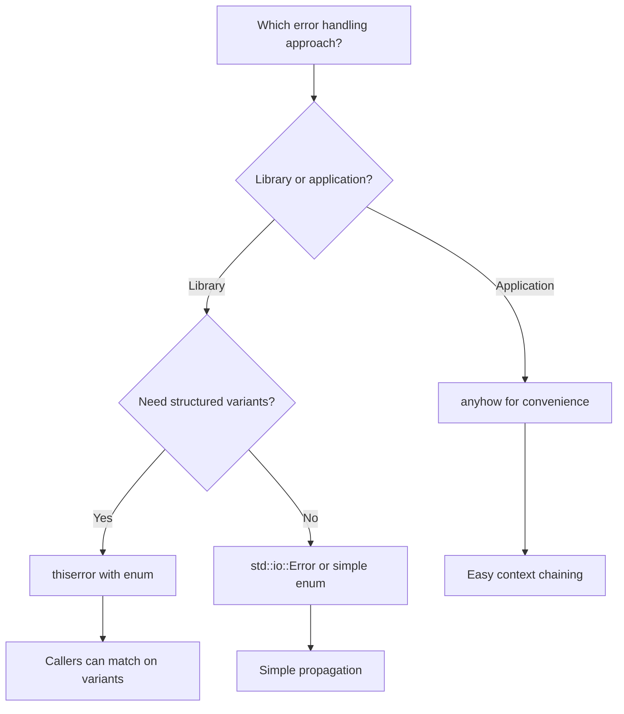

# How to Handle Errors in Rust with Result and the ? Operator

Author: [nawazdhandala](https://www.github.com/nawazdhandala)

Tags: Rust, Error Handling, Result, Programming, Best Practices

Description: Learn how to handle errors in Rust using Result types, the ? operator, custom error types, and the thiserror crate.

---

Rust does not have exceptions. Instead, it uses the type system to make error handling explicit and exhaustive. Every function that can fail returns a Result type, and the compiler ensures you handle both the success and failure cases. This approach eliminates entire categories of runtime surprises.

In this guide, we will explore Rust's error handling from basic Result usage through custom error types and the thiserror crate.

## The Result Type

Result is an enum with two variants:

```rust
// This is the actual definition in Rust's standard library
// T is the success type, E is the error type
enum Result<T, E> {
    Ok(T),
    Err(E),
}
```

Every function that can fail uses this type:

```rust
use std::fs;
use std::num::ParseIntError;

// read_file returns either the file contents or an IO error
fn read_config() -> Result<String, std::io::Error> {
    // fs::read_to_string returns Result<String, io::Error>
    let contents = fs::read_to_string("config.toml")?;
    Ok(contents)
}

// parse_port extracts a port number from a string
fn parse_port(input: &str) -> Result<u16, ParseIntError> {
    // str::parse returns Result<T, ParseIntError>
    let port: u16 = input.parse()?;
    Ok(port)
}
```

## Pattern Matching on Result

The most explicit way to handle a Result is with match:

```rust
use std::fs;

fn main() {
    // Match on the Result to handle both cases
    match fs::read_to_string("data.txt") {
        Ok(contents) => {
            println!("File has {} bytes", contents.len());
        }
        Err(error) => {
            // Handle specific error kinds
            match error.kind() {
                std::io::ErrorKind::NotFound => {
                    println!("File does not exist, creating default");
                }
                std::io::ErrorKind::PermissionDenied => {
                    println!("Permission denied reading file");
                }
                _ => {
                    println!("Unexpected error: {}", error);
                }
            }
        }
    }
}
```

## The ? Operator

The ? operator is syntactic sugar for propagating errors up the call stack:

```rust
use std::fs;
use std::io;

// Without the ? operator - verbose and repetitive
fn read_username_verbose() -> Result<String, io::Error> {
    let contents = match fs::read_to_string("username.txt") {
        Ok(c) => c,
        Err(e) => return Err(e),
    };
    Ok(contents.trim().to_string())
}

// With the ? operator - clean and concise
// The ? unwraps Ok or returns Err to the caller automatically
fn read_username_clean() -> Result<String, io::Error> {
    let contents = fs::read_to_string("username.txt")?;
    Ok(contents.trim().to_string())
}

// Chaining multiple ? operations reads naturally
fn load_user_config() -> Result<String, io::Error> {
    let path = fs::read_to_string("config_path.txt")?;
    let config = fs::read_to_string(path.trim())?;
    Ok(config)
}
```

## How the ? Operator Works



## Custom Error Types

For libraries and larger applications, define your own error type:

```rust
use std::fmt;
use std::io;
use std::num::ParseIntError;

// AppError covers all error cases in our application
#[derive(Debug)]
enum AppError {
    Io(io::Error),
    Parse(ParseIntError),
    Config(String),
    NotFound { resource: String, id: String },
}

// Display provides human-readable error messages
impl fmt::Display for AppError {
    fn fmt(&self, f: &mut fmt::Formatter<'_>) -> fmt::Result {
        match self {
            AppError::Io(err) => write!(f, "IO error: {}", err),
            AppError::Parse(err) => write!(f, "Parse error: {}", err),
            AppError::Config(msg) => write!(f, "Config error: {}", msg),
            AppError::NotFound { resource, id } => {
                write!(f, "{} with id '{}' not found", resource, id)
            }
        }
    }
}

// Implement From to enable automatic conversion with ?
impl From<io::Error> for AppError {
    fn from(err: io::Error) -> Self {
        AppError::Io(err)
    }
}

impl From<ParseIntError> for AppError {
    fn from(err: ParseIntError) -> Self {
        AppError::Parse(err)
    }
}

// Now we can use ? with functions returning different error types
fn load_port_from_file(path: &str) -> Result<u16, AppError> {
    // ? converts io::Error into AppError::Io automatically
    let contents = std::fs::read_to_string(path)?;
    // ? converts ParseIntError into AppError::Parse automatically
    let port: u16 = contents.trim().parse()?;

    if port < 1024 {
        return Err(AppError::Config(
            "Port must be 1024 or higher".to_string()
        ));
    }

    Ok(port)
}
```

## Error Conversion Flow



## Using thiserror for Less Boilerplate

The thiserror crate generates Display and From implementations automatically:

```rust
use thiserror::Error;

// The #[error] attribute generates the Display implementation
// The #[from] attribute generates the From implementation
#[derive(Error, Debug)]
enum ServiceError {
    #[error("database error: {0}")]
    Database(#[from] sqlx::Error),

    #[error("HTTP request failed: {0}")]
    Http(#[from] reqwest::Error),

    #[error("item '{id}' not found in {collection}")]
    NotFound {
        id: String,
        collection: String,
    },

    #[error("validation failed: {0}")]
    Validation(String),

    #[error("rate limit exceeded, retry after {retry_after} seconds")]
    RateLimit {
        retry_after: u64,
    },
}

// Using the error type in a service function
async fn get_user(id: &str) -> Result<User, ServiceError> {
    // sqlx::Error is automatically converted via #[from]
    let user = sqlx::query_as("SELECT * FROM users WHERE id = $1")
        .bind(id)
        .fetch_optional(&pool)
        .await?;

    // Return a structured NotFound error if the user does not exist
    user.ok_or_else(|| ServiceError::NotFound {
        id: id.to_string(),
        collection: "users".to_string(),
    })
}
```

## Using anyhow for Applications

For application code where you do not need callers to match on error variants, anyhow provides a convenient catch-all:

```rust
use anyhow::{Context, Result, bail};

// anyhow::Result<T> is shorthand for Result<T, anyhow::Error>
fn load_app_config() -> Result<Config> {
    // .context() adds a human-readable message to the error chain
    let raw = std::fs::read_to_string("config.yaml")
        .context("failed to read config.yaml")?;

    let config: Config = serde_yaml::from_str(&raw)
        .context("failed to parse YAML configuration")?;

    // bail! creates an error and returns immediately
    if config.port == 0 {
        bail!("port must be non-zero in config.yaml");
    }

    Ok(config)
}
```

## When to Use Each Approach



## Combining Result with Option

Rust also has the Option type for values that may be absent. You can convert between them:

```rust
fn find_user_email(users: &[User], name: &str) -> Result<String, AppError> {
    // .find() returns Option<&User>
    // .ok_or_else() converts None into an Err
    let user = users
        .iter()
        .find(|u| u.name == name)
        .ok_or_else(|| AppError::NotFound {
            resource: "user".to_string(),
            id: name.to_string(),
        })?;

    Ok(user.email.clone())
}
```

## Best Practices

1. Use Result for all operations that can fail. Never panic in library code.
2. Use the ? operator to propagate errors cleanly through the call stack.
3. Add context to errors as they propagate so the final error message tells a clear story.
4. Use thiserror for libraries where callers need to match on error variants.
5. Use anyhow for application code where you just need to report errors.
6. Implement From traits to enable seamless conversion between error types with ?.
7. Reserve unwrap() and expect() for cases where failure is truly impossible.

## Conclusion

Rust's error handling system turns errors into first-class data that flows through your program predictably. The Result type, combined with the ? operator and crates like thiserror and anyhow, provides a flexible toolkit that scales from simple scripts to large distributed systems.

If you are building Rust services and want to track how errors propagate across your system in production, [OneUptime](https://oneuptime.com) provides distributed tracing and log management that lets you follow error chains from their origin through every service they touch, helping your team diagnose and resolve issues faster.
