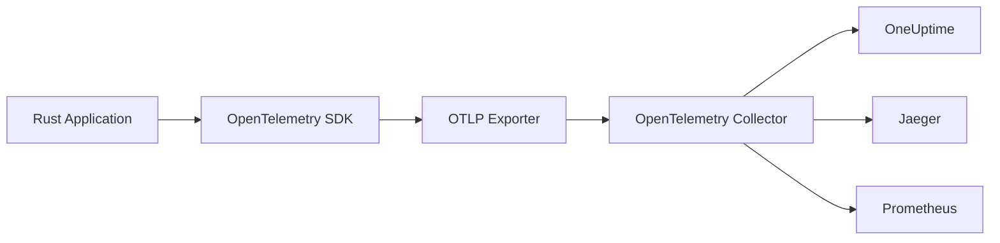
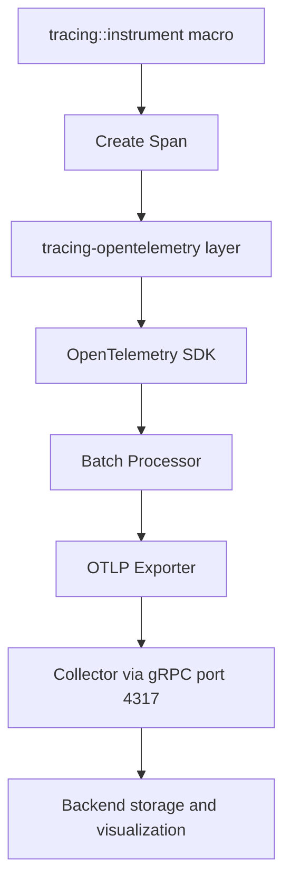
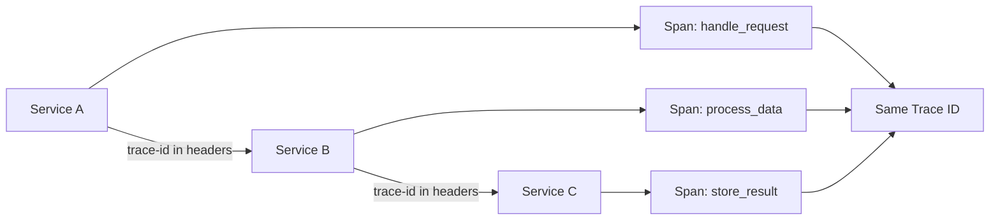

# How to Instrument Rust Applications with OpenTelemetry

Author: [nawazdhandala](https://www.github.com/nawazdhandala)

Tags: Rust, OpenTelemetry, Tracing, Observability, Instrumentation

Description: Learn how to instrument Rust applications with OpenTelemetry for distributed tracing and metrics collection.

---

OpenTelemetry provides a vendor-neutral standard for collecting traces, metrics, and logs from your applications. Rust's OpenTelemetry SDK integrates with the tracing ecosystem to give you distributed observability with minimal overhead. In this guide, we will set up OpenTelemetry tracing in a Rust application and export telemetry data to a collector.

## Why OpenTelemetry for Rust

Rust services often run in performance-critical paths where observability overhead must be minimal. OpenTelemetry's Rust SDK is designed with this in mind, using zero-allocation patterns where possible and batching exports to reduce network calls.

## Architecture Overview



## Project Dependencies

```toml
# Cargo.toml
[package]
name = "otel-rust-demo"
version = "0.1.0"
edition = "2021"

[dependencies]
# OpenTelemetry core and OTLP exporter
opentelemetry = "0.24"
opentelemetry_sdk = { version = "0.24", features = ["rt-tokio"] }
opentelemetry-otlp = { version = "0.17", features = ["tonic"] }
opentelemetry-semantic-conventions = "0.16"

# Tracing integration for OpenTelemetry
tracing = "0.1"
tracing-subscriber = { version = "0.3", features = ["env-filter"] }
tracing-opentelemetry = "0.25"

# Async runtime
tokio = { version = "1", features = ["full"] }

# Web framework for the example
actix-web = "4"
serde = { version = "1", features = ["derive"] }
serde_json = "1"
```

## Initializing the Tracer

```rust
use opentelemetry::trace::TracerProvider;
use opentelemetry_otlp::WithExportConfig;
use opentelemetry_sdk::{
    runtime,
    trace::{Config, Sampler},
    Resource,
};
use opentelemetry::KeyValue;
use tracing_subscriber::{layer::SubscriberExt, util::SubscriberInitExt};

// Initialize OpenTelemetry with OTLP export
// Returns a guard that must be kept alive for the lifetime of the application
fn init_telemetry() -> opentelemetry_sdk::trace::TracerProvider {
    // Define resource attributes that identify this service
    let resource = Resource::new(vec![
        KeyValue::new("service.name", "rust-api"),
        KeyValue::new("service.version", "1.0.0"),
        KeyValue::new("deployment.environment", "production"),
    ]);

    // Configure the OTLP exporter to send data to the collector
    let exporter = opentelemetry_otlp::new_exporter()
        .tonic()
        .with_endpoint("http://localhost:4317");

    // Build the tracer provider with batching and sampling
    let provider = opentelemetry_otlp::new_pipeline()
        .tracing()
        .with_exporter(exporter)
        .with_trace_config(
            Config::default()
                .with_resource(resource)
                // Sample all traces in development, reduce in production
                .with_sampler(Sampler::AlwaysOn),
        )
        .install_batch(runtime::Tokio)
        .expect("Failed to initialize tracer provider");

    // Create a tracing layer that bridges tracing spans to OpenTelemetry
    let telemetry_layer = tracing_opentelemetry::layer()
        .with_tracer(provider.tracer("rust-api"));

    // Combine the OpenTelemetry layer with a console output layer
    tracing_subscriber::registry()
        .with(tracing_subscriber::EnvFilter::new("info"))
        .with(telemetry_layer)
        .with(tracing_subscriber::fmt::layer())
        .init();

    provider
}
```

## Telemetry Data Flow



## Instrumenting Functions

Use the tracing crate macros to create spans automatically:

```rust
use tracing::{info, instrument, warn};

// The #[instrument] macro creates a span for each call to this function
// Parameters are recorded as span attributes automatically
#[instrument(skip(pool))]
async fn get_user(pool: &DbPool, user_id: &str) -> Result<User, AppError> {
    info!("Fetching user from database");

    // This database query runs inside the get_user span
    let user = sqlx::query_as::<_, User>("SELECT * FROM users WHERE id = $1")
        .bind(user_id)
        .fetch_optional(pool)
        .await
        .map_err(|e| {
            // Log the error inside the span for correlation
            warn!(error = %e, "Database query failed");
            AppError::Database(e.to_string())
        })?;

    match user {
        Some(u) => {
            info!(user_name = %u.name, "User found");
            Ok(u)
        }
        None => {
            warn!("User not found");
            Err(AppError::NotFound(user_id.to_string()))
        }
    }
}

// Instrument an HTTP handler with custom span fields
#[instrument(
    name = "handle_get_user",
    skip(pool, path),
    fields(user_id = %path.into_inner())
)]
async fn handle_get_user(
    pool: web::Data<DbPool>,
    path: web::Path<String>,
) -> actix_web::HttpResponse {
    let user_id = path.into_inner();

    match get_user(pool.get_ref(), &user_id).await {
        Ok(user) => actix_web::HttpResponse::Ok().json(user),
        Err(AppError::NotFound(_)) => {
            actix_web::HttpResponse::NotFound().finish()
        }
        Err(e) => {
            warn!(error = %e, "Internal error in get_user handler");
            actix_web::HttpResponse::InternalServerError().finish()
        }
    }
}
```

## Manual Span Creation

For more control, create spans manually:

```rust
use tracing::{span, Level, Instrument};

async fn process_batch(items: Vec<Item>) -> Result<(), AppError> {
    // Create a parent span for the entire batch operation
    let batch_span = span!(
        Level::INFO,
        "process_batch",
        batch_size = items.len(),
    );

    async {
        for (index, item) in items.iter().enumerate() {
            // Create a child span for each item
            let item_span = span!(
                Level::INFO,
                "process_item",
                item_id = %item.id,
                item_index = index,
            );

            async {
                // All work here is traced under the item_span
                validate_item(item).await?;
                transform_item(item).await?;
                store_item(item).await?;
                Ok::<(), AppError>(())
            }
            .instrument(item_span)
            .await?;
        }
        Ok(())
    }
    .instrument(batch_span)
    .await
}
```

## Adding Custom Attributes and Events

```rust
use tracing::{info, span, Level};

#[instrument(skip(request_body))]
async fn create_order(request_body: OrderRequest) -> Result<Order, AppError> {
    // Record custom attributes on the current span
    tracing::Span::current().record("order.item_count", request_body.items.len());

    // Add an event (a log entry attached to the current span)
    info!(
        customer_id = %request_body.customer_id,
        total_items = request_body.items.len(),
        "Processing new order"
    );

    // Validate the order
    let total = calculate_total(&request_body.items);
    tracing::Span::current().record("order.total_cents", total);

    if total == 0 {
        warn!("Order has zero total, rejecting");
        return Err(AppError::Validation("Order total cannot be zero".into()));
    }

    info!(total_cents = total, "Order validated successfully");

    // Save the order to the database
    let order = save_order(request_body).await?;

    info!(order_id = %order.id, "Order created");
    Ok(order)
}
```

## OpenTelemetry Collector Configuration

Configure the collector to receive data from your Rust application:

```yaml
# otel-collector-config.yaml
receivers:
  otlp:
    protocols:
      # gRPC receiver on port 4317
      grpc:
        endpoint: "0.0.0.0:4317"
      # HTTP receiver on port 4318
      http:
        endpoint: "0.0.0.0:4318"

processors:
  # Batch spans before exporting to reduce network calls
  batch:
    timeout: 5s
    send_batch_size: 1024

exporters:
  # Export traces to OneUptime
  otlphttp:
    endpoint: "https://otlp.oneuptime.com"
    headers:
      x-oneuptime-token: "your-project-token"

service:
  pipelines:
    traces:
      receivers: [otlp]
      processors: [batch]
      exporters: [otlphttp]
```

## Application Entry Point

```rust
#[tokio::main]
async fn main() -> std::io::Result<()> {
    // Initialize telemetry before starting the server
    let provider = init_telemetry();

    // Build and start the web server
    let server = actix_web::HttpServer::new(|| {
        actix_web::App::new()
            .route("/users/{id}", actix_web::web::get().to(handle_get_user))
            .route("/orders", actix_web::web::post().to(create_order))
    })
    .bind("0.0.0.0:8080")?
    .run()
    .await;

    // Flush remaining spans before shutting down
    provider.shutdown().expect("Failed to shut down tracer provider");

    server
}
```

## Trace Propagation Across Services



## Conclusion

OpenTelemetry gives your Rust applications production-grade observability with minimal performance overhead. By combining the tracing crate's ergonomic macros with OpenTelemetry's export pipeline, you get distributed traces that flow across service boundaries and help you understand exactly what happened during any request.

[OneUptime](https://oneuptime.com) natively ingests OpenTelemetry data, so you can send traces and metrics from your Rust services directly to OneUptime for visualization, alerting, and incident management - giving your team a complete picture of your system's health.
