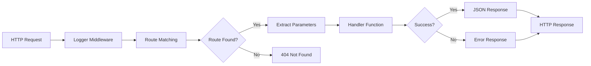
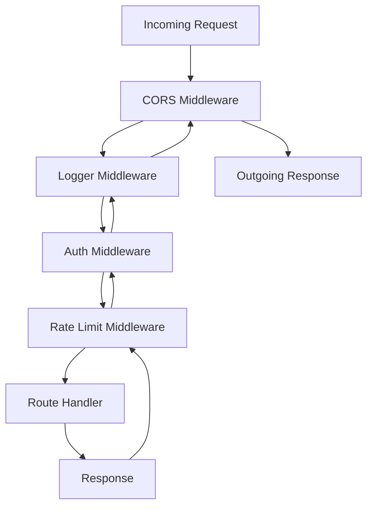

# How to Build a Web Server in Rust with Actix Web

Author: [nawazdhandala](https://www.github.com/nawazdhandala)

Tags: Rust, Actix Web, Web Server, API, Performance

Description: Learn how to build a high-performance web server in Rust using Actix Web with routing, middleware, and error handling.

---

Actix Web is one of the fastest web frameworks available in any language. It leverages Rust's zero-cost abstractions and async runtime to deliver performance that consistently tops benchmarks, while providing a developer-friendly API for building production web services.

In this guide, we will build a REST API with Actix Web, covering routing, middleware, error handling, and application state.

## Project Setup

Start by creating a new Rust project and adding dependencies:

```toml
# Cargo.toml
[package]
name = "actix-api"
version = "0.1.0"
edition = "2021"

[dependencies]
# Web framework
actix-web = "4"
# Serialization and deserialization
serde = { version = "1", features = ["derive"] }
serde_json = "1"
# Unique identifiers
uuid = { version = "1", features = ["v4"] }
# Async runtime logging
env_logger = "0.11"
log = "0.4"
# Date and time handling
chrono = { version = "0.4", features = ["serde"] }
# Environment variable loading
dotenvy = "0.15"
```

## Basic Server Structure

```rust
use actix_web::{web, App, HttpServer, HttpResponse, middleware};
use log::info;
use std::sync::Mutex;

// Application state shared across all handlers
// Mutex provides safe interior mutability for the items vector
struct AppState {
    app_name: String,
    items: Mutex<Vec<Item>>,
}

// Item represents a resource in our API
#[derive(serde::Serialize, serde::Deserialize, Clone)]
struct Item {
    id: String,
    name: String,
    description: String,
    created_at: String,
}

#[actix_web::main]
async fn main() -> std::io::Result<()> {
    // Initialize the logger from the RUST_LOG environment variable
    env_logger::init();

    // Create shared application state
    let data = web::Data::new(AppState {
        app_name: String::from("Actix API"),
        items: Mutex::new(Vec::new()),
    });

    info!("Starting server on 0.0.0.0:8080");

    // Build and start the HTTP server
    HttpServer::new(move || {
        App::new()
            // Attach shared state to the application
            .app_data(data.clone())
            // Add logging middleware for every request
            .wrap(middleware::Logger::default())
            // Register route handlers
            .service(
                web::scope("/api/v1")
                    .route("/health", web::get().to(health_check))
                    .route("/items", web::get().to(list_items))
                    .route("/items", web::post().to(create_item))
                    .route("/items/{id}", web::get().to(get_item))
                    .route("/items/{id}", web::delete().to(delete_item))
            )
    })
    .bind("0.0.0.0:8080")?
    .run()
    .await
}
```

## Request and Response Flow



## Health Check Endpoint

```rust
use actix_web::HttpResponse;
use serde::Serialize;

// HealthResponse is serialized to JSON automatically
#[derive(Serialize)]
struct HealthResponse {
    status: String,
    service: String,
    timestamp: String,
}

// Health check handler returns the current service status
async fn health_check(data: web::Data<AppState>) -> HttpResponse {
    let response = HealthResponse {
        status: "healthy".to_string(),
        service: data.app_name.clone(),
        timestamp: chrono::Utc::now().to_rfc3339(),
    };
    HttpResponse::Ok().json(response)
}
```

## CRUD Handlers

```rust
use actix_web::{web, HttpResponse};
use uuid::Uuid;

// Request body for creating a new item
#[derive(serde::Deserialize)]
struct CreateItemRequest {
    name: String,
    description: String,
}

// List all items in the store
async fn list_items(data: web::Data<AppState>) -> HttpResponse {
    // Lock the mutex to read the items vector safely
    let items = data.items.lock().unwrap();
    HttpResponse::Ok().json(items.clone())
}

// Create a new item and return it
async fn create_item(
    data: web::Data<AppState>,
    body: web::Json<CreateItemRequest>,
) -> HttpResponse {
    let new_item = Item {
        id: Uuid::new_v4().to_string(),
        name: body.name.clone(),
        description: body.description.clone(),
        created_at: chrono::Utc::now().to_rfc3339(),
    };

    // Lock the mutex and push the new item
    let mut items = data.items.lock().unwrap();
    items.push(new_item.clone());

    log::info!("Created item: {}", new_item.id);
    HttpResponse::Created().json(new_item)
}

// Get a single item by its ID
async fn get_item(
    data: web::Data<AppState>,
    path: web::Path<String>,
) -> HttpResponse {
    let item_id = path.into_inner();
    let items = data.items.lock().unwrap();

    // Search for the item by ID
    match items.iter().find(|item| item.id == item_id) {
        Some(item) => HttpResponse::Ok().json(item),
        None => HttpResponse::NotFound().json(
            serde_json::json!({"error": "Item not found"})
        ),
    }
}

// Delete an item by its ID
async fn delete_item(
    data: web::Data<AppState>,
    path: web::Path<String>,
) -> HttpResponse {
    let item_id = path.into_inner();
    let mut items = data.items.lock().unwrap();

    // Find the position of the item and remove it
    let original_len = items.len();
    items.retain(|item| item.id != item_id);

    if items.len() < original_len {
        log::info!("Deleted item: {}", item_id);
        HttpResponse::NoContent().finish()
    } else {
        HttpResponse::NotFound().json(
            serde_json::json!({"error": "Item not found"})
        )
    }
}
```

## Custom Error Handling

Define a structured error type that maps to HTTP responses:

```rust
use actix_web::{HttpResponse, ResponseError};
use std::fmt;

// ApiError covers all error cases the API can return
#[derive(Debug)]
enum ApiError {
    NotFound(String),
    BadRequest(String),
    Internal(String),
}

// Display formats the error for logging
impl fmt::Display for ApiError {
    fn fmt(&self, f: &mut fmt::Formatter<'_>) -> fmt::Result {
        match self {
            ApiError::NotFound(msg) => write!(f, "Not found: {}", msg),
            ApiError::BadRequest(msg) => write!(f, "Bad request: {}", msg),
            ApiError::Internal(msg) => write!(f, "Internal error: {}", msg),
        }
    }
}

// ResponseError converts ApiError into an HTTP response
impl ResponseError for ApiError {
    fn error_response(&self) -> HttpResponse {
        match self {
            ApiError::NotFound(msg) => {
                HttpResponse::NotFound().json(
                    serde_json::json!({"error": msg})
                )
            }
            ApiError::BadRequest(msg) => {
                HttpResponse::BadRequest().json(
                    serde_json::json!({"error": msg})
                )
            }
            ApiError::Internal(msg) => {
                log::error!("Internal server error: {}", msg);
                HttpResponse::InternalServerError().json(
                    serde_json::json!({"error": "An internal error occurred"})
                )
            }
        }
    }
}
```

## Middleware Architecture



## Adding CORS Middleware

```rust
use actix_cors::Cors;
use actix_web::{App, HttpServer, middleware};

// Configure CORS for the application
fn configure_cors() -> Cors {
    Cors::default()
        // Allow requests from your frontend origin
        .allowed_origin("https://app.example.com")
        // Allow common HTTP methods
        .allowed_methods(vec!["GET", "POST", "PUT", "DELETE"])
        // Allow JSON content type header
        .allowed_headers(vec!["Content-Type", "Authorization"])
        // Cache preflight responses for one hour
        .max_age(3600)
}
```

## Running the Server

```bash
# Set the log level and start the server
RUST_LOG=info cargo run

# Test the health endpoint
curl http://localhost:8080/api/v1/health

# Create an item
curl -X POST http://localhost:8080/api/v1/items \
  -H "Content-Type: application/json" \
  -d '{"name": "Widget", "description": "A useful widget"}'

# List all items
curl http://localhost:8080/api/v1/items
```

## Conclusion

Actix Web combines Rust's performance guarantees with a practical API for building web services. The type system catches entire categories of bugs at compile time, and the async runtime handles thousands of concurrent connections efficiently. With proper error handling and middleware, you can build APIs that are both fast and reliable.

If you are deploying Actix Web services and need to monitor their uptime, response times, and error rates, [OneUptime](https://oneuptime.com) provides end-to-end monitoring with distributed tracing, alerting, and incident management that keeps your team informed when issues arise.
