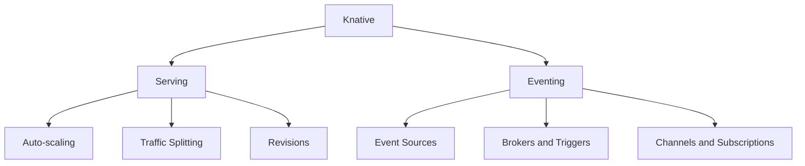
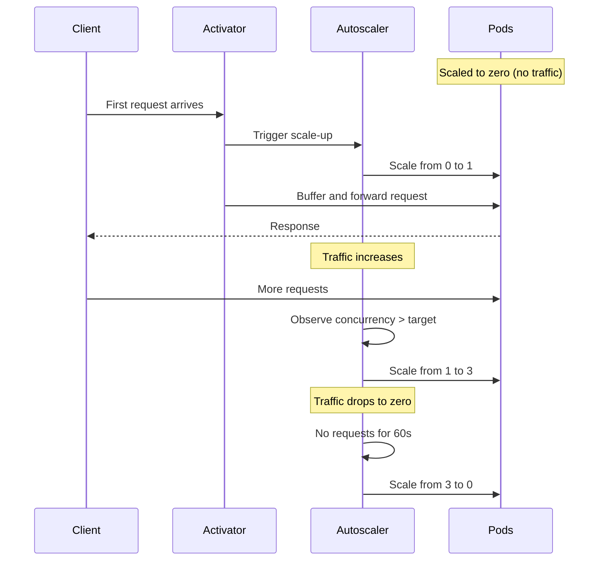
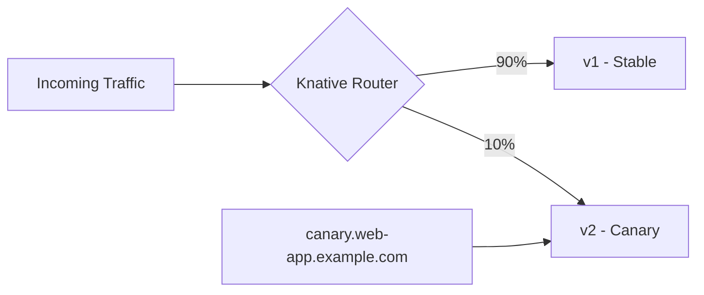
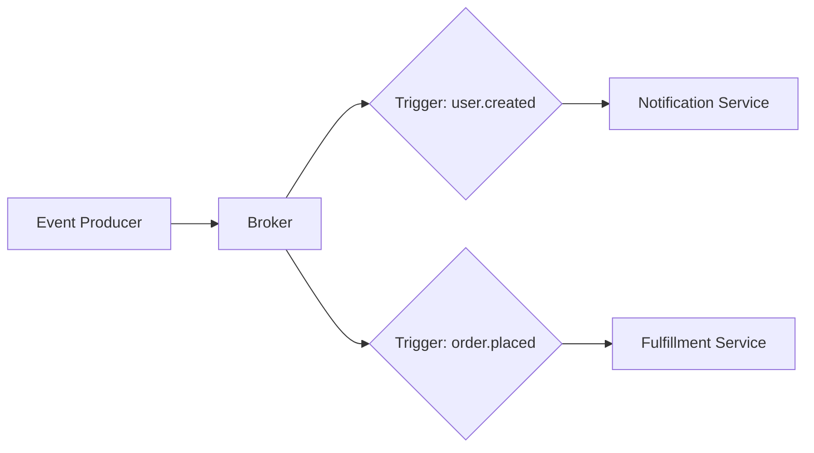

# How to Run Serverless Workloads on Kubernetes with Knative

Author: [nawazdhandala](https://www.github.com/nawazdhandala)

Tags: Serverless, Kubernetes, Knative, Autoscaling, Functions

Description: Learn how to deploy serverless workloads on Kubernetes using Knative for auto-scaling, event-driven architectures.

---

Knative brings serverless capabilities to Kubernetes. It handles auto-scaling (including scaling to zero), traffic splitting, and event-driven architectures - all on your existing Kubernetes cluster. No vendor lock-in, no proprietary runtimes. This guide shows you how to deploy and manage serverless workloads with Knative.

## What Knative Provides

Knative has two main components: Serving and Eventing.



**Serving** manages your workloads: deploying containers, routing traffic, and scaling up and down based on demand - including scaling to zero when there is no traffic.

**Eventing** provides a framework for event-driven architectures: producing, routing, and consuming events using a loosely coupled model.

## Installing Knative

```bash
# Install Knative Serving with Kourier as the networking layer

# Install the Knative Serving CRDs
kubectl apply -f https://github.com/knative/serving/releases/download/knative-v1.13.0/serving-crds.yaml

# Install the Knative Serving core components
kubectl apply -f https://github.com/knative/serving/releases/download/knative-v1.13.0/serving-core.yaml

# Install Kourier as the networking layer (lighter than Istio)
kubectl apply -f https://github.com/knative/net-kourier/releases/download/knative-v1.13.0/kourier.yaml

# Configure Knative to use Kourier
kubectl patch configmap/config-network \
  --namespace knative-serving \
  --type merge \
  --patch '{"data":{"ingress-class":"kourier.ingress.networking.knative.dev"}}'

# Install Knative Eventing
kubectl apply -f https://github.com/knative/eventing/releases/download/knative-v1.13.0/eventing-crds.yaml
kubectl apply -f https://github.com/knative/eventing/releases/download/knative-v1.13.0/eventing-core.yaml
```

## Deploying Your First Knative Service

A Knative Service is the fundamental unit of deployment. It manages revisions, routes traffic, and handles auto-scaling.

```yaml
# hello-service.yaml
# A simple Knative Service that auto-scales based on traffic

apiVersion: serving.knative.dev/v1
kind: Service
metadata:
  name: hello
  namespace: default
spec:
  template:
    metadata:
      # Annotations control auto-scaling behavior
      annotations:
        # Minimum number of replicas (0 enables scale-to-zero)
        autoscaling.knative.dev/min-scale: "0"
        # Maximum number of replicas
        autoscaling.knative.dev/max-scale: "10"
        # Target number of concurrent requests per pod
        autoscaling.knative.dev/target: "100"
    spec:
      containers:
        - image: ghcr.io/myorg/hello-app:latest
          ports:
            - containerPort: 8080
          # Resource limits help the autoscaler make decisions
          resources:
            requests:
              cpu: 100m
              memory: 128Mi
            limits:
              cpu: 500m
              memory: 256Mi
          # Readiness probe tells Knative when the pod is ready
          readinessProbe:
            httpGet:
              path: /health
              port: 8080
            initialDelaySeconds: 5
            periodSeconds: 10
          env:
            - name: LOG_LEVEL
              value: "info"
```

```bash
# Deploy the service
kubectl apply -f hello-service.yaml

# Check the service status
kubectl get ksvc hello

# Get the URL for the service
kubectl get ksvc hello -o jsonpath='{.status.url}'
```

## How Auto-Scaling Works

Knative uses the Knative Pod Autoscaler (KPA) which scales based on concurrency or requests per second.



## Configuring Auto-Scaling

```yaml
# autoscale-service.yaml
# Fine-tuned auto-scaling configuration

apiVersion: serving.knative.dev/v1
kind: Service
metadata:
  name: api-server
  namespace: default
spec:
  template:
    metadata:
      annotations:
        # Scale based on concurrency (default) or rps
        autoscaling.knative.dev/metric: "concurrency"

        # Target 50 concurrent requests per pod
        autoscaling.knative.dev/target: "50"

        # Use 70% of the target as the actual threshold
        # This gives headroom before hitting the hard limit
        autoscaling.knative.dev/target-utilization-percentage: "70"

        # Keep at least 1 replica running (disable scale-to-zero)
        autoscaling.knative.dev/min-scale: "1"

        # Never scale beyond 20 replicas
        autoscaling.knative.dev/max-scale: "20"

        # Wait 30 seconds before scaling down
        autoscaling.knative.dev/scale-down-delay: "30s"

        # Scale-to-zero grace period
        autoscaling.knative.dev/scale-to-zero-grace-period: "60s"
    spec:
      containers:
        - image: ghcr.io/myorg/api-server:latest
          ports:
            - containerPort: 8080
```

## Traffic Splitting and Canary Deployments

Knative makes it easy to split traffic between revisions for canary deployments and gradual rollouts.

```yaml
# canary-service.yaml
# Split traffic between two revisions for a canary deployment

apiVersion: serving.knative.dev/v1
kind: Service
metadata:
  name: web-app
  namespace: default
spec:
  template:
    metadata:
      # Name this revision explicitly for traffic routing
      name: web-app-v2
    spec:
      containers:
        - image: ghcr.io/myorg/web-app:v2
          ports:
            - containerPort: 8080

  # Traffic routing rules
  traffic:
    # Send 90% of traffic to the stable revision
    - revisionName: web-app-v1
      percent: 90

    # Send 10% of traffic to the canary revision
    - revisionName: web-app-v2
      percent: 10
      # Optional: give the canary its own URL for direct testing
      tag: canary
```



## Progressive Rollout

Gradually shift traffic from the old version to the new version:

```bash
# Start with 10% to the new revision
kubectl patch ksvc web-app --type merge -p '
{
  "spec": {
    "traffic": [
      {"revisionName": "web-app-v1", "percent": 90},
      {"revisionName": "web-app-v2", "percent": 10}
    ]
  }
}'

# If metrics look good, increase to 50%
kubectl patch ksvc web-app --type merge -p '
{
  "spec": {
    "traffic": [
      {"revisionName": "web-app-v1", "percent": 50},
      {"revisionName": "web-app-v2", "percent": 50}
    ]
  }
}'

# Complete the rollout to 100%
kubectl patch ksvc web-app --type merge -p '
{
  "spec": {
    "traffic": [
      {"revisionName": "web-app-v2", "percent": 100}
    ]
  }
}'
```

## Event-Driven Architecture with Knative Eventing

Knative Eventing lets you build loosely coupled, event-driven systems.

```yaml
# eventing-setup.yaml
# Set up event sources, brokers, and triggers

# Broker receives and routes events
apiVersion: eventing.knative.dev/v1
kind: Broker
metadata:
  name: default
  namespace: default

---
# Trigger routes specific events to a Knative Service
apiVersion: eventing.knative.dev/v1
kind: Trigger
metadata:
  name: user-created-trigger
  namespace: default
spec:
  broker: default
  # Filter events by type
  filter:
    attributes:
      type: user.created
  # Route matching events to the notification service
  subscriber:
    ref:
      apiVersion: serving.knative.dev/v1
      kind: Service
      name: notification-service

---
# Another trigger for order events going to a different service
apiVersion: eventing.knative.dev/v1
kind: Trigger
metadata:
  name: order-placed-trigger
  namespace: default
spec:
  broker: default
  filter:
    attributes:
      type: order.placed
  subscriber:
    ref:
      apiVersion: serving.knative.dev/v1
      kind: Service
      name: fulfillment-service
```



## Producing Events with CloudEvents

```python
# event_producer.py
# Send CloudEvents to the Knative Broker

from cloudevents.http import CloudEvent
from cloudevents.conversion import to_structured
import requests

def publish_event(event_type: str, data: dict, source: str = "/api-server"):
    """
    Publish a CloudEvent to the Knative Broker.

    CloudEvents is a specification for describing events in a
    common way. Knative Eventing uses CloudEvents natively.
    """
    # Create a CloudEvent with the standard attributes
    event = CloudEvent({
        "type": event_type,
        "source": source,
        "datacontenttype": "application/json",
    })

    # Convert to structured format (JSON with headers)
    headers, body = to_structured(event, data=data)

    # Send to the broker's ingress endpoint
    broker_url = "http://broker-ingress.knative-eventing.svc.cluster.local/default/default"

    response = requests.post(
        broker_url,
        headers=headers,
        data=body,
        timeout=10,
    )

    if response.status_code != 202:
        raise Exception(f"Failed to publish event: {response.status_code}")

    return True

# Publish a user creation event
publish_event(
    event_type="user.created",
    data={"user_id": "123", "name": "Alice", "email": "alice@example.com"},
)
```

## Consuming Events

```python
# event_consumer.py
# Knative Service that processes incoming CloudEvents

from flask import Flask, request, jsonify
from cloudevents.http import from_http

app = Flask(__name__)

@app.route("/", methods=["POST"])
def handle_event():
    """
    Process incoming CloudEvents from the Knative Broker.
    Knative sends events as HTTP POST requests to the service.
    """
    # Parse the CloudEvent from the HTTP request
    event = from_http(request.headers, request.get_data())

    # Extract event metadata
    event_type = event["type"]
    event_source = event["source"]
    event_data = event.data

    print(f"Received event: type={event_type}, source={event_source}")

    # Route based on event type
    if event_type == "user.created":
        send_welcome_email(event_data)
    elif event_type == "order.placed":
        start_fulfillment(event_data)
    else:
        print(f"Unknown event type: {event_type}")

    # Return 200 to acknowledge successful processing
    return jsonify({"status": "processed"}), 200

def send_welcome_email(data: dict):
    """Send a welcome email to a new user."""
    print(f"Sending welcome email to {data.get('email')}")

def start_fulfillment(data: dict):
    """Begin order fulfillment process."""
    print(f"Starting fulfillment for order {data.get('order_id')}")

if __name__ == "__main__":
    app.run(host="0.0.0.0", port=8080)
```

## Summary

Knative brings serverless to Kubernetes without vendor lock-in. Use Serving for auto-scaling workloads (including scale-to-zero), traffic splitting for canary deployments, and Eventing for building event-driven architectures. You get the flexibility of Kubernetes with the operational simplicity of serverless.

Monitor your Knative services with [OneUptime](https://oneuptime.com) to track scaling behavior, request latency, and cold start times. Set up alerts for when services take too long to scale up or when event processing falls behind.
