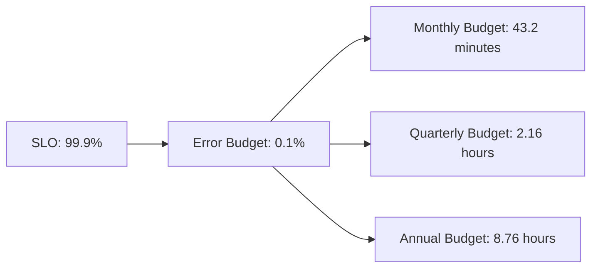
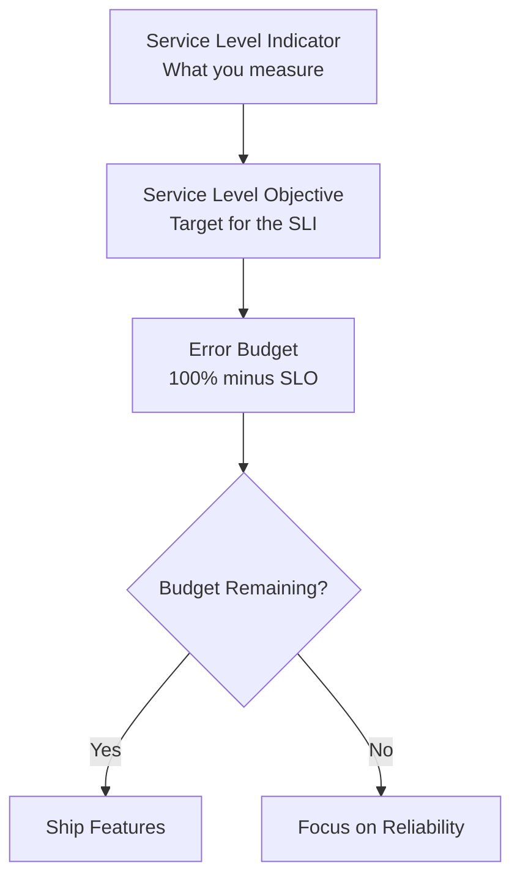
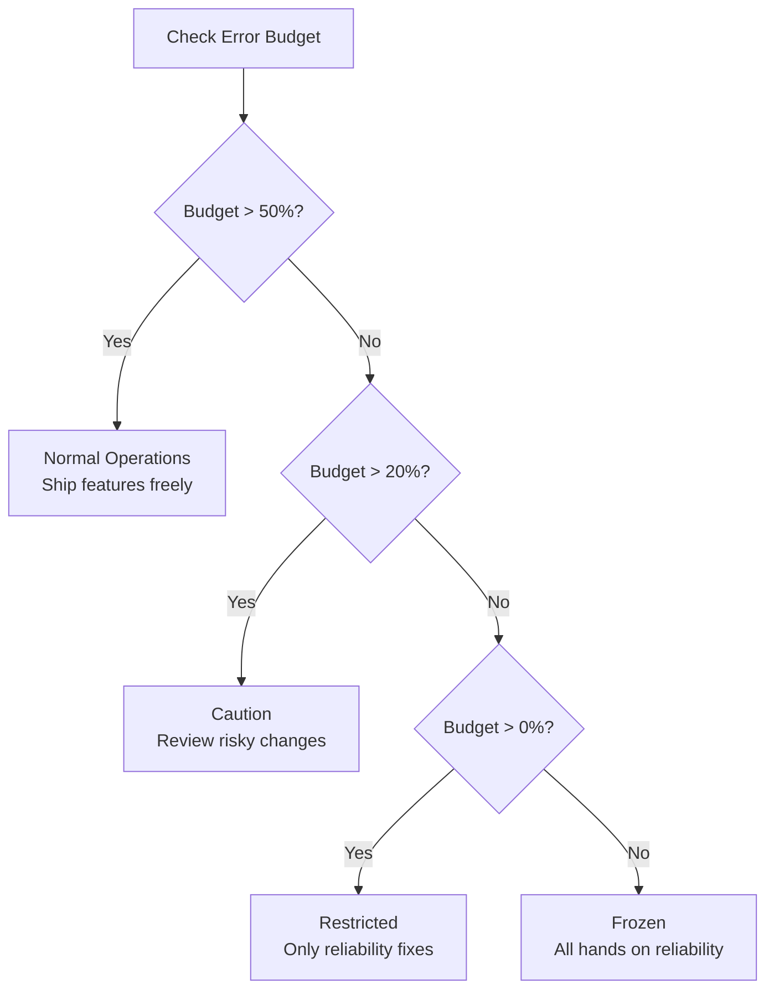
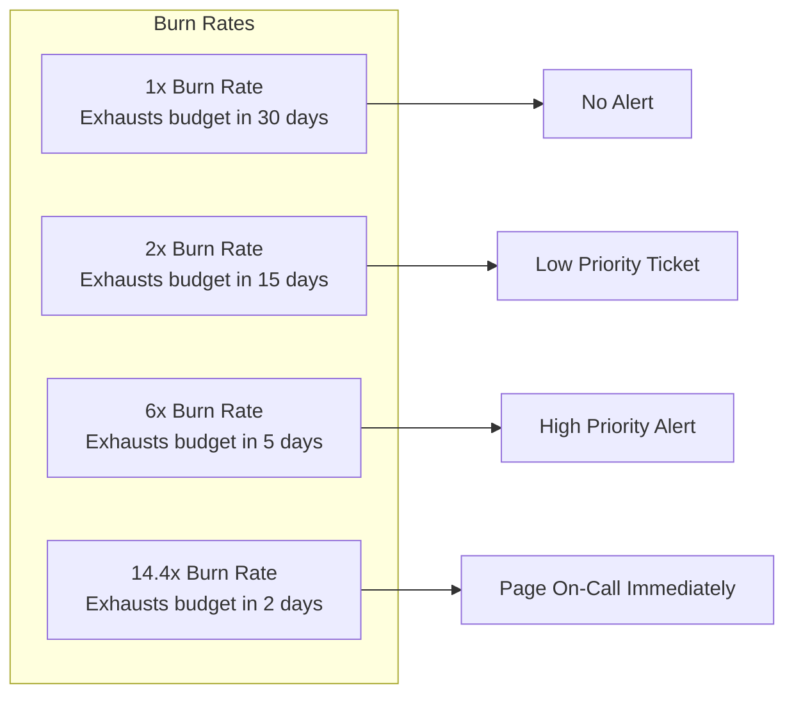
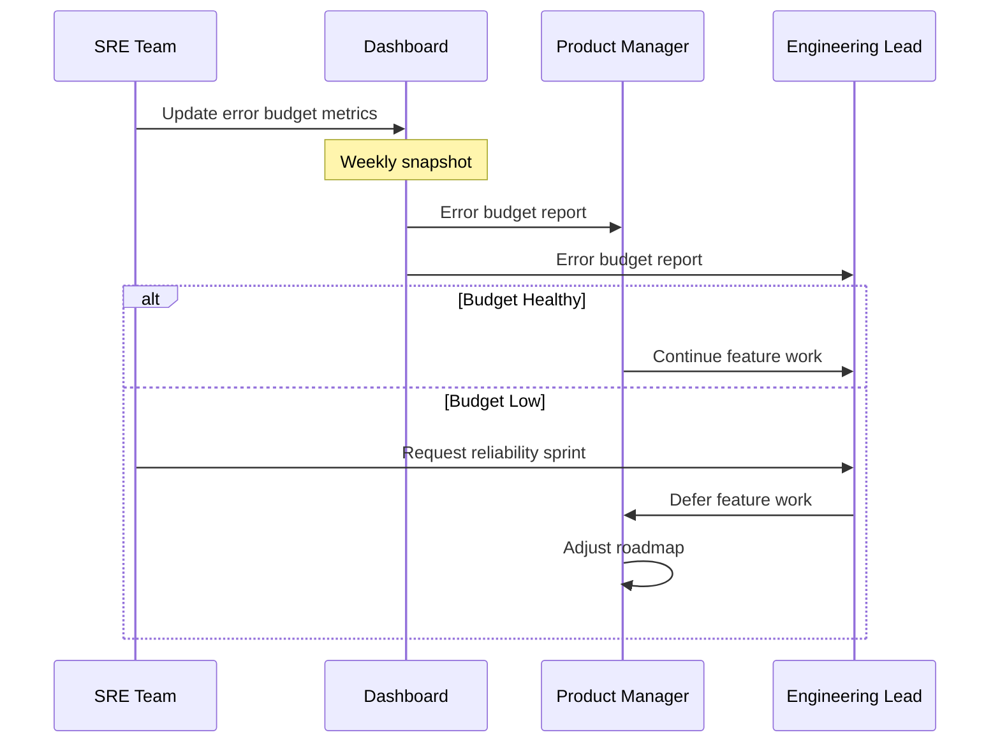

# How to Implement SRE Error Budgets for Service Reliability

Author: [nawazdhandala](https://www.github.com/nawazdhandala)

Tags: SRE, Error Budgets, Reliability, SLO, Service Management

Description: Learn how to implement SRE error budgets to balance feature velocity with service reliability and manage risk.

---

Error budgets are one of the most powerful concepts in Site Reliability Engineering. They provide a quantitative framework for balancing the desire to ship new features with the need to maintain reliable services. This post explains what error budgets are, how to calculate them, and how to use them to drive better engineering decisions.

## What Is an Error Budget?

An error budget is the maximum amount of unreliability your service can tolerate within a given time window, derived from your Service Level Objective (SLO). If your SLO is 99.9% availability, your error budget is 0.1% of the total time.



## The Relationship Between SLOs and Error Budgets



The error budget is simply 100% minus the SLO target. For example:

- SLO of 99.9% gives an error budget of 0.1%
- SLO of 99.95% gives an error budget of 0.05%
- SLO of 99.99% gives an error budget of 0.01%

## Calculating Your Error Budget

```python
# error_budget.py
# Calculate error budget consumption for a service
# based on its SLO and observed performance.

from dataclasses import dataclass
from datetime import datetime, timedelta


@dataclass
class ErrorBudget:
    """Represents an error budget calculation for a service."""
    slo_target: float           # e.g., 0.999 for 99.9%
    window_days: int            # Measurement window in days
    total_requests: int         # Total requests in the window
    failed_requests: int        # Failed requests in the window

    @property
    def error_budget_fraction(self) -> float:
        """The fraction of requests allowed to fail."""
        return 1.0 - self.slo_target

    @property
    def allowed_failures(self) -> int:
        """Maximum number of failures allowed in the window."""
        return int(self.total_requests * self.error_budget_fraction)

    @property
    def budget_consumed(self) -> float:
        """Percentage of error budget consumed."""
        if self.allowed_failures == 0:
            return 100.0
        return (self.failed_requests / self.allowed_failures) * 100.0

    @property
    def budget_remaining(self) -> float:
        """Percentage of error budget remaining."""
        return max(0.0, 100.0 - self.budget_consumed)

    @property
    def remaining_failures(self) -> int:
        """Number of failures that can still occur before the budget is exhausted."""
        return max(0, self.allowed_failures - self.failed_requests)


def calculate_time_budget(slo_target: float, window_days: int) -> dict:
    """
    Calculate the error budget in terms of downtime minutes.
    Useful for availability-based SLOs.
    """
    total_minutes = window_days * 24 * 60
    budget_minutes = total_minutes * (1 - slo_target)

    return {
        "total_minutes": total_minutes,
        "budget_minutes": round(budget_minutes, 2),
        "budget_hours": round(budget_minutes / 60, 2),
    }


# Example: Monthly error budget for a service with 99.9% SLO
budget = ErrorBudget(
    slo_target=0.999,
    window_days=30,
    total_requests=10_000_000,
    failed_requests=3_500
)

print(f"Error Budget: {budget.error_budget_fraction * 100}%")
print(f"Allowed Failures: {budget.allowed_failures:,}")
print(f"Actual Failures: {budget.failed_requests:,}")
print(f"Budget Consumed: {budget.budget_consumed:.1f}%")
print(f"Budget Remaining: {budget.budget_remaining:.1f}%")
print(f"Remaining Failures: {budget.remaining_failures:,}")

# Calculate time-based budget
time_budget = calculate_time_budget(0.999, 30)
print(f"Downtime Budget: {time_budget['budget_minutes']} minutes")
```

## Error Budget Policies

An error budget policy defines what actions your team takes based on how much budget remains.



Here is an example policy document:

```yaml
# error-budget-policy.yaml
# Defines team actions based on error budget consumption levels.

policy:
  service: payment-api
  slo: 99.9%
  window: 30 days

  thresholds:
    # Budget is healthy - operate normally
    - level: green
      budget_remaining: ">50%"
      actions:
        - "Ship features at normal velocity"
        - "Run planned experiments and tests"
        - "Perform standard maintenance"

    # Budget is being consumed - proceed with caution
    - level: yellow
      budget_remaining: "20-50%"
      actions:
        - "Reduce deployment frequency"
        - "Require extra review for risky changes"
        - "Prioritize reliability work in sprint planning"

    # Budget is low - restrict changes
    - level: orange
      budget_remaining: "1-20%"
      actions:
        - "Freeze non-critical feature deployments"
        - "All engineering effort on reliability"
        - "Conduct incident review for recent outages"

    # Budget exhausted - full reliability focus
    - level: red
      budget_remaining: "0%"
      actions:
        - "Complete feature freeze"
        - "All hands on reliability improvements"
        - "Escalate to leadership for resource allocation"
        - "Postmortem all budget-consuming incidents"
```

## Burn Rate Alerts

Rather than waiting until the budget is gone, burn rate alerts detect when you are consuming budget too quickly and will exhaust it before the window ends.



```yaml
# burn-rate-alert.yaml
# Prometheus alerting rules for error budget burn rate.
# These detect fast budget consumption before it is exhausted.
groups:
  - name: error-budget-burn-rate
    rules:
      # Fast burn - 14.4x rate over 1 hour
      # Will exhaust monthly budget in ~2 days
      - alert: ErrorBudgetFastBurn
        expr: |
          (
            sum(rate(http_requests_total{status=~"5.."}[1h]))
            /
            sum(rate(http_requests_total[1h]))
          ) > (14.4 * 0.001)
        for: 2m
        labels:
          severity: critical
        annotations:
          summary: "Error budget burning at 14.4x rate"

      # Slow burn - 3x rate over 6 hours
      # Will exhaust monthly budget in ~10 days
      - alert: ErrorBudgetSlowBurn
        expr: |
          (
            sum(rate(http_requests_total{status=~"5.."}[6h]))
            /
            sum(rate(http_requests_total[6h]))
          ) > (3 * 0.001)
        for: 15m
        labels:
          severity: warning
        annotations:
          summary: "Error budget burning at 3x rate"
```

## Reporting and Stakeholder Communication

Create regular error budget reports for engineering leadership and product teams.



## Best Practices

- Define SLOs before error budgets - the budget is derived from the SLO
- Use rolling windows (e.g., 30 days) rather than calendar months
- Implement burn rate alerts at multiple thresholds
- Automate error budget tracking in dashboards
- Review error budget consumption in sprint planning
- Treat error budget exhaustion as a signal, not a punishment
- Include all stakeholders in error budget policy discussions

## Tracking Error Budgets with OneUptime

OneUptime (https://oneuptime.com) provides SLO monitoring and error budget tracking out of the box. Define your SLOs, and OneUptime automatically calculates error budget consumption, triggers burn rate alerts, and generates reports for stakeholders. When your error budget runs low, OneUptime alerts your team so you can shift focus to reliability before customers are impacted.
