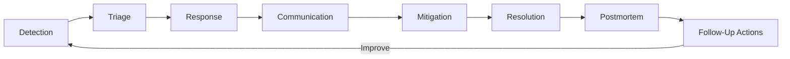
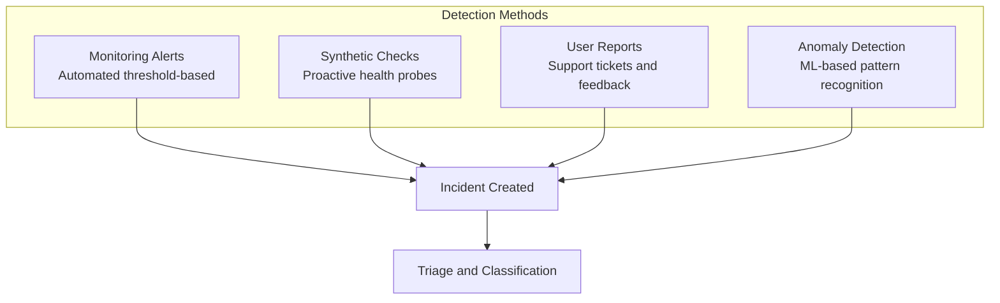
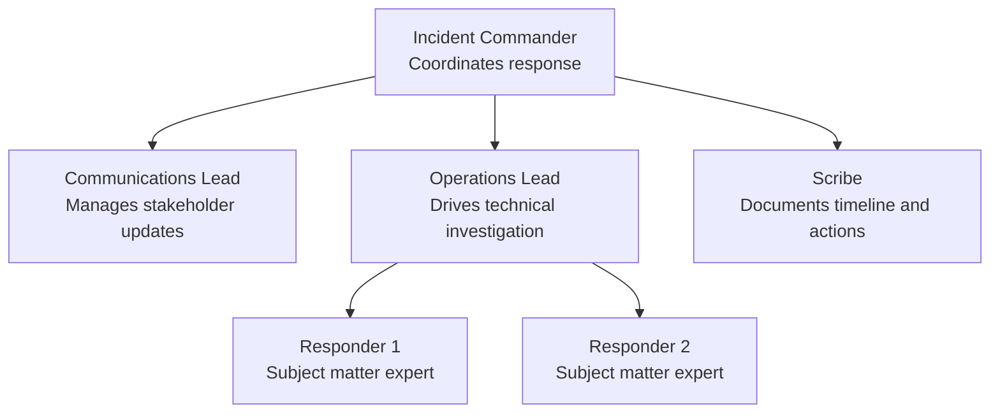
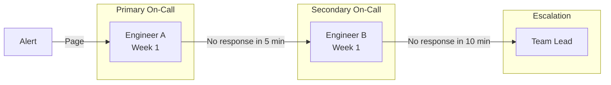
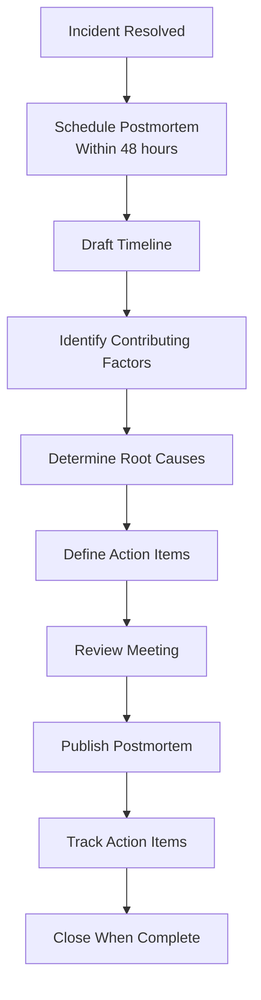

# How to Build an SRE Incident Management Process

Author: [nawazdhandala](https://www.github.com/nawazdhandala)

Tags: SRE, Incident Management, On-Call, Postmortem, Reliability

Description: Learn how to build an effective SRE incident management process including detection, response, communication, and postmortems.

---

Incidents are inevitable. What separates high-performing teams from the rest is how they detect, respond to, communicate about, and learn from incidents. This guide walks through building an SRE incident management process from scratch.

## The Incident Lifecycle

Every incident follows a lifecycle from detection to resolution and learning.



## Severity Levels

Define clear severity levels so responders know how to prioritize and escalate.

```yaml
# severity-definitions.yaml
# Severity levels define the impact and urgency of an incident.
# These guide response actions and escalation paths.

severities:
  - level: SEV-1
    name: Critical
    description: "Complete service outage affecting all users"
    response_time: "5 minutes"
    communication: "Every 15 minutes"
    escalation: "VP of Engineering notified"
    examples:
      - "Production database is down"
      - "Payment processing is completely broken"
      - "Security breach detected"

  - level: SEV-2
    name: Major
    description: "Significant degradation affecting many users"
    response_time: "15 minutes"
    communication: "Every 30 minutes"
    escalation: "Engineering Manager notified"
    examples:
      - "API latency increased 10x"
      - "50% of requests failing"

  - level: SEV-3
    name: Minor
    description: "Partial degradation affecting some users"
    response_time: "1 hour"
    communication: "Every 2 hours"
    escalation: "Team lead notified"
    examples:
      - "One region experiencing errors"
      - "Non-critical feature unavailable"

  - level: SEV-4
    name: Low
    description: "Minor issue with minimal user impact"
    response_time: "Next business day"
    communication: "Daily update"
    escalation: "None"
    examples:
      - "Cosmetic UI bug"
      - "Slow dashboard loading"
```

## Incident Detection

Reliable detection is the foundation of incident management. Combine multiple detection methods.



## Incident Roles

Clearly defined roles prevent confusion during high-pressure incidents.



```yaml
# incident-roles.yaml
# Defines responsibilities for each incident role.

roles:
  incident_commander:
    responsibilities:
      - "Declare the incident and assign severity"
      - "Assign roles to responders"
      - "Make decisions on response strategy"
      - "Coordinate across teams"
      - "Decide when the incident is resolved"
    who: "On-call lead or senior engineer"

  communications_lead:
    responsibilities:
      - "Post status updates at defined intervals"
      - "Update the status page"
      - "Notify affected customers"
      - "Coordinate with support and sales teams"
    who: "On-call secondary or designated communicator"

  operations_lead:
    responsibilities:
      - "Lead technical investigation"
      - "Coordinate debugging efforts"
      - "Propose and execute mitigations"
      - "Escalate to subject matter experts"
    who: "Senior engineer familiar with the affected system"

  scribe:
    responsibilities:
      - "Record timeline of events"
      - "Document actions taken and by whom"
      - "Capture decisions and their rationale"
      - "Prepare notes for the postmortem"
    who: "Any available team member"
```

## Incident Response Runbook

A runbook template guides responders through a structured response.

```markdown
## Incident Response Template

### 1. Detection
- How was the incident detected?
- What alerts fired?
- When was the first signal?

### 2. Triage
- What is the severity? (SEV-1 through SEV-4)
- What services are affected?
- How many users are impacted?

### 3. Assign Roles
- Incident Commander: ___
- Communications Lead: ___
- Operations Lead: ___
- Scribe: ___

### 4. Investigate
- Check monitoring dashboards
- Review recent deployments
- Examine logs and traces
- Check infrastructure health

### 5. Mitigate
- Can we rollback a recent change?
- Can we failover to a healthy region?
- Can we scale up resources?
- Can we disable a feature flag?

### 6. Communicate
- Update the status page
- Notify stakeholders
- Post in the incident channel

### 7. Resolve
- Confirm the mitigation is effective
- Verify metrics have recovered
- Declare the incident resolved
```

## On-Call Structure

An effective on-call rotation prevents burnout and ensures coverage.



```yaml
# on-call-schedule.yaml
# Weekly rotation with primary and secondary on-call engineers.

schedule:
  rotation: weekly
  handoff_day: Monday
  handoff_time: "10:00 AM UTC"

  week_1:
    primary: engineer-a
    secondary: engineer-b
  week_2:
    primary: engineer-b
    secondary: engineer-c
  week_3:
    primary: engineer-c
    secondary: engineer-a

  escalation:
    timeout_minutes: 5
    chain:
      - role: secondary
      - role: team_lead
      - role: engineering_manager

  policies:
    # Maximum consecutive on-call days before mandatory rest
    max_consecutive_days: 7
    # Minimum gap between on-call rotations
    min_gap_days: 14
    # Compensation for after-hours pages
    after_hours_comp: true
```

## Postmortem Process

Every SEV-1 and SEV-2 incident should produce a blameless postmortem.



```yaml
# postmortem-template.yaml
# Structure for a blameless postmortem document.

postmortem:
  title: "[SEV-1] Payment Service Outage - 2026-02-15"
  date: "2026-02-15"
  duration: "47 minutes"
  authors:
    - "engineer-a"
    - "engineer-b"

  summary: >
    The payment service was unavailable for 47 minutes due to
    a database connection pool exhaustion caused by a slow query
    introduced in the v3.4.2 release.

  impact:
    users_affected: 12500
    revenue_impact: "$45,000"
    error_budget_consumed: "35%"

  timeline:
    - time: "14:02 UTC"
      event: "Deployment of v3.4.2 completed"
    - time: "14:15 UTC"
      event: "Connection pool utilization alert fired"
    - time: "14:18 UTC"
      event: "On-call engineer acknowledged alert"
    - time: "14:25 UTC"
      event: "Identified slow query in new release"
    - time: "14:32 UTC"
      event: "Initiated rollback to v3.4.1"
    - time: "14:49 UTC"
      event: "Service fully recovered"

  contributing_factors:
    - "No query performance testing in CI pipeline"
    - "Connection pool alerts had a 10-minute delay"
    - "Canary deployment was skipped for this release"

  action_items:
    - description: "Add query performance tests to CI"
      owner: "engineer-c"
      priority: "P1"
      due_date: "2026-03-01"
    - description: "Reduce connection pool alert threshold"
      owner: "engineer-a"
      priority: "P1"
      due_date: "2026-02-22"
    - description: "Enforce canary deployments for all releases"
      owner: "team-lead"
      priority: "P2"
      due_date: "2026-03-15"
```

## Measuring Incident Management Effectiveness

Track key metrics to improve your process over time.

- **MTTD** (Mean Time to Detect): How long until you know about an incident
- **MTTA** (Mean Time to Acknowledge): How long until someone responds
- **MTTR** (Mean Time to Resolve): How long until the incident is fixed
- **Incident frequency**: Number of incidents per week or month
- **Postmortem action item completion rate**: Are you learning from incidents?

## Using OneUptime for Incident Management

OneUptime (https://oneuptime.com) provides a complete incident management platform including on-call scheduling, automated alerting, status page updates, and incident timelines. Define severity levels, configure escalation policies, and run postmortems - all from a single platform. OneUptime integrates with your monitoring stack to detect incidents automatically and notify the right people at the right time.
