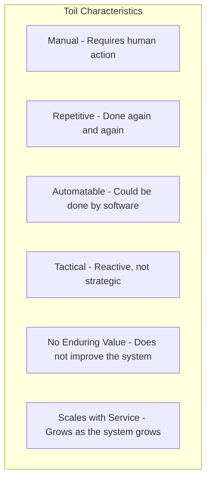
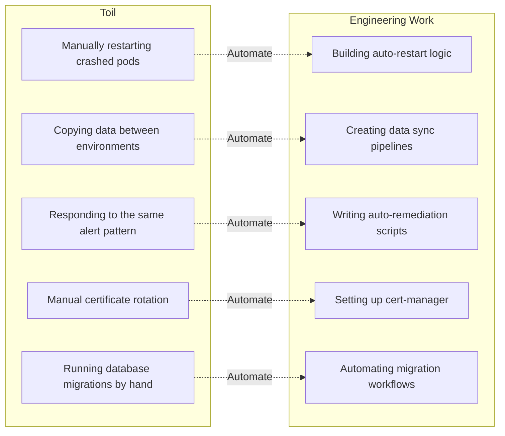
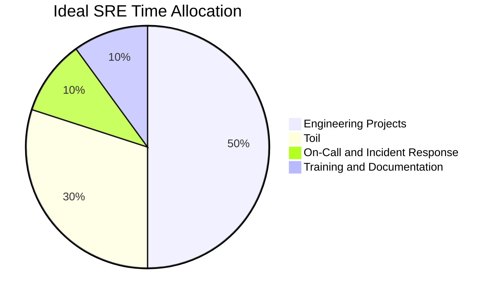
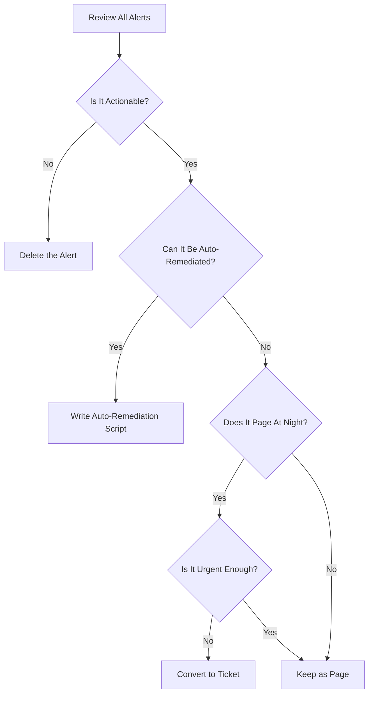
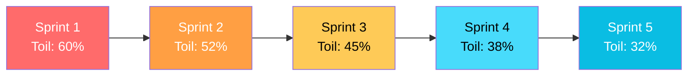

# How to Identify and Reduce Toil in SRE

Author: [nawazdhandala](https://www.github.com/nawazdhandala)

Tags: SRE, Toil, Automation, Reliability, Engineering

Description: Learn how to identify, measure, and reduce toil in SRE teams to focus on reliability engineering work.

---

Google's SRE book defines toil as manual, repetitive, automatable, tactical, and devoid of enduring value work. Left unchecked, toil consumes engineering time that should go to reliability improvements and strategic projects. This guide covers how to identify, measure, and systematically reduce toil.

## What Is Toil?

Not all operational work is toil. Toil has specific characteristics that distinguish it from valuable engineering work.



## Toil vs. Engineering Work



## Measuring Toil

You cannot reduce what you do not measure. Track toil systematically.

```python
# toil_tracker.py
# Track and categorize toil activities for an SRE team.
# This helps quantify how much time is spent on toil
# versus engineering work each sprint.

from dataclasses import dataclass, field
from datetime import datetime
from enum import Enum
from typing import Optional


class ToilCategory(Enum):
    """Categories of toil for classification."""
    MANUAL_RESTART = "manual_restart"
    DATA_MIGRATION = "data_migration"
    CERTIFICATE_ROTATION = "certificate_rotation"
    ALERT_RESPONSE = "alert_response"
    ACCESS_PROVISIONING = "access_provisioning"
    CAPACITY_MANAGEMENT = "capacity_management"
    DEPLOYMENT = "deployment"
    OTHER = "other"


@dataclass
class ToilEntry:
    """A single toil activity record."""
    description: str
    category: ToilCategory
    time_spent_minutes: int
    engineer: str
    date: datetime
    # How many times this task has been done before
    occurrence_count: int = 1
    # Whether this task could be automated
    automatable: bool = True
    # Estimated effort to automate (in hours)
    automation_effort_hours: Optional[float] = None

    @property
    def roi_ratio(self) -> Optional[float]:
        """
        Calculate the return on investment of automating this task.
        A higher ratio means greater benefit from automation.
        """
        if not self.automation_effort_hours:
            return None
        # Annual time saved if automated (assuming weekly occurrence)
        annual_savings_hours = (self.time_spent_minutes / 60) * 52
        return annual_savings_hours / self.automation_effort_hours


@dataclass
class ToilReport:
    """Aggregate toil metrics for a reporting period."""
    entries: list = field(default_factory=list)

    @property
    def total_toil_hours(self) -> float:
        """Total hours spent on toil."""
        return sum(e.time_spent_minutes for e in self.entries) / 60

    @property
    def toil_by_category(self) -> dict:
        """Break down toil hours by category."""
        breakdown = {}
        for entry in self.entries:
            cat = entry.category.value
            if cat not in breakdown:
                breakdown[cat] = 0
            breakdown[cat] += entry.time_spent_minutes / 60
        return breakdown

    @property
    def top_automation_candidates(self) -> list:
        """
        Rank toil entries by ROI to find the best automation targets.
        Returns entries sorted by highest ROI first.
        """
        candidates = [e for e in self.entries if e.roi_ratio is not None]
        return sorted(candidates, key=lambda e: e.roi_ratio, reverse=True)


# Example usage
report = ToilReport()

report.entries.append(ToilEntry(
    description="Manually restart payment pods after OOM kill",
    category=ToilCategory.MANUAL_RESTART,
    time_spent_minutes=30,
    engineer="alice",
    date=datetime.now(),
    occurrence_count=12,
    automatable=True,
    automation_effort_hours=8,
))

report.entries.append(ToilEntry(
    description="Rotate TLS certificates for staging",
    category=ToilCategory.CERTIFICATE_ROTATION,
    time_spent_minutes=45,
    engineer="bob",
    date=datetime.now(),
    occurrence_count=4,
    automatable=True,
    automation_effort_hours=16,
))

print(f"Total toil: {report.total_toil_hours:.1f} hours")
print(f"By category: {report.toil_by_category}")
for candidate in report.top_automation_candidates:
    print(f"  Automate: {candidate.description} (ROI: {candidate.roi_ratio:.1f}x)")
```

## The 50% Rule

Google SRE recommends that SRE teams spend no more than 50% of their time on toil. The other 50% should go to engineering projects that reduce future toil and improve reliability.



## Toil Reduction Strategies

### 1. Automate Repetitive Tasks

```yaml
# auto-restart-policy.yaml
# Instead of manually restarting crashed pods,
# configure Kubernetes to handle restarts automatically
# with proper resource limits and health checks.
apiVersion: apps/v1
kind: Deployment
metadata:
  name: payment-service
spec:
  template:
    spec:
      containers:
        - name: payment
          resources:
            # Set proper resource limits to prevent OOM kills
            requests:
              memory: "256Mi"
              cpu: "100m"
            limits:
              memory: "512Mi"
              cpu: "500m"
          # Liveness probe auto-restarts unhealthy containers
          livenessProbe:
            httpGet:
              path: /health
              port: 8080
            initialDelaySeconds: 10
            periodSeconds: 15
            failureThreshold: 3
```

### 2. Self-Service Tooling

Replace manual processes with self-service tools.

```python
# access_provisioner.py
# Self-service tool for database access provisioning.
# Replaces manual tickets and SSH sessions with an API.

from fastapi import FastAPI, HTTPException
from pydantic import BaseModel
import subprocess

app = FastAPI(title="Access Provisioner")


class AccessRequest(BaseModel):
    """Request model for database access provisioning."""
    username: str
    database: str
    access_level: str  # "readonly" or "readwrite"
    duration_hours: int  # How long the access should last


@app.post("/provision")
async def provision_access(request: AccessRequest):
    """
    Provision temporary database access.
    Creates a time-limited database role automatically.
    Previously, this required an SRE to SSH in and run SQL manually.
    """
    # Validate the access level
    if request.access_level not in ("readonly", "readwrite"):
        raise HTTPException(400, "Invalid access level")

    # Validate duration (max 24 hours)
    if request.duration_hours > 24:
        raise HTTPException(400, "Maximum duration is 24 hours")

    # Generate the SQL for the temporary role
    role_name = f"temp_{request.username}_{request.database}"

    if request.access_level == "readonly":
        grants = "GRANT SELECT ON ALL TABLES IN SCHEMA public"
    else:
        grants = "GRANT SELECT, INSERT, UPDATE, DELETE ON ALL TABLES IN SCHEMA public"

    # Log the access grant for audit purposes
    print(f"Provisioning {request.access_level} access for {request.username}")
    print(f"Database: {request.database}, Duration: {request.duration_hours}h")

    return {
        "status": "provisioned",
        "role": role_name,
        "expires_in_hours": request.duration_hours,
    }
```

### 3. Eliminate Alert Noise

Noisy alerts are a major source of toil. Each alert should be actionable.



### 4. Standardize With Templates

```bash
# project-template.sh
# Generate a new microservice from a standard template.
# Eliminates the toil of setting up boilerplate for each new service.

#!/bin/bash
set -euo pipefail

SERVICE_NAME=$1

echo "Creating service: $SERVICE_NAME"

# Clone the service template repository
git clone https://github.com/example/service-template.git "$SERVICE_NAME"
cd "$SERVICE_NAME"

# Replace template placeholders with the actual service name
find . -type f -name "*.yaml" -exec sed -i '' "s/SERVICE_NAME/$SERVICE_NAME/g" {} +
find . -type f -name "*.py" -exec sed -i '' "s/SERVICE_NAME/$SERVICE_NAME/g" {} +

# Initialize a fresh Git repository
rm -rf .git
git init
git add .
git commit -m "Initial commit from service template"

echo "Service $SERVICE_NAME created successfully"
echo "  - Dockerfile configured"
echo "  - Kubernetes manifests generated"
echo "  - CI/CD pipeline configured"
echo "  - Monitoring dashboards templated"
```

## Tracking Toil Reduction Progress



## Best Practices

- Track toil in your issue tracker alongside engineering work
- Calculate ROI before automating - focus on high-frequency, high-cost toil first
- Set team-level toil budgets and review them in retrospectives
- Celebrate automation wins to motivate the team
- Document manual procedures before automating them
- Gradually increase automation coverage rather than trying to automate everything at once

## Monitoring Your Automation Health

As you automate toil away, you need to monitor the automation itself. OneUptime (https://oneuptime.com) lets you monitor your automation scripts, self-service tools, and CI/CD pipelines. Set up alerts for automation failures so you catch issues before they turn back into manual toil. Track the health of your reliability tooling with the same rigor you apply to your production services.
