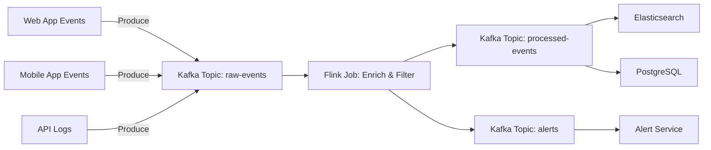
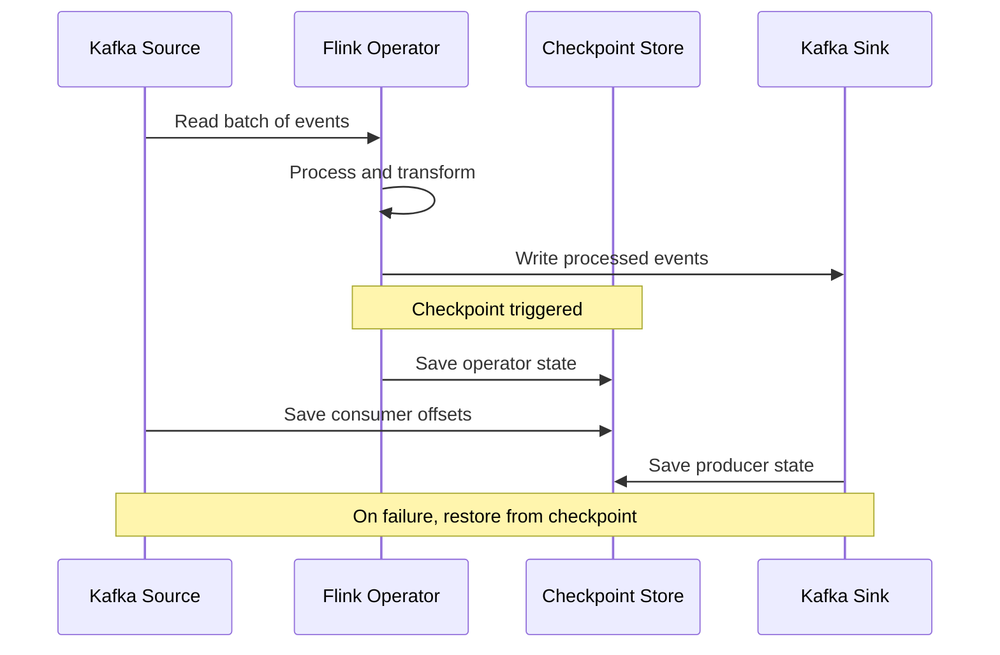

# How to Build Real-Time Data Pipelines with Kafka and Flink

Author: [nawazdhandala](https://www.github.com/nawazdhandala)

Tags: Kafka, Flink, Streaming, Real-Time, Data Pipeline

Description: Learn how to build real-time data processing pipelines using Apache Kafka for ingestion and Apache Flink for stream processing.

---

Batch processing was the standard for years. Collect data, wait, process, wait, deliver results. But modern systems need answers in seconds, not hours. Apache Kafka handles the ingestion side with durable, ordered message streams. Apache Flink processes those streams with exactly-once semantics and low latency.

This guide covers how to wire these two together into a production-ready real-time data pipeline.

## Pipeline Architecture



## Setting Up Kafka Topics

Create topics with appropriate partitioning for throughput.

```bash
# create-topics.sh
# Create Kafka topics with partition counts tuned for parallelism

# Raw events topic - 12 partitions for high-throughput ingestion
kafka-topics.sh --create \
  --bootstrap-server kafka:9092 \
  --topic raw-events \
  --partitions 12 \
  --replication-factor 3 \
  --config retention.ms=86400000 \
  --config cleanup.policy=delete

# Processed events - matches raw partitions for 1:1 consumption
kafka-topics.sh --create \
  --bootstrap-server kafka:9092 \
  --topic processed-events \
  --partitions 12 \
  --replication-factor 3 \
  --config retention.ms=604800000

# Alerts topic - fewer partitions, ordering matters more
kafka-topics.sh --create \
  --bootstrap-server kafka:9092 \
  --topic alerts \
  --partitions 3 \
  --replication-factor 3 \
  --config retention.ms=259200000
```

## Kafka Producer in Python

```python
# event_producer.py
# Publishes application events to Kafka with proper serialization
# Uses partitioning by user_id to maintain per-user ordering

import json
import time
from confluent_kafka import Producer

# Kafka broker configuration
config = {
    "bootstrap.servers": "kafka-0:9092,kafka-1:9092,kafka-2:9092",
    # Wait for all replicas to acknowledge
    "acks": "all",
    # Retry transient failures up to 5 times
    "retries": 5,
    # Batch messages for throughput
    "batch.size": 16384,
    # Wait up to 10ms to fill a batch
    "linger.ms": 10,
}

producer = Producer(config)


def delivery_report(err, msg):
    """Callback invoked once per delivered or failed message."""
    if err is not None:
        print(f"Delivery failed for {msg.key()}: {err}")
    else:
        print(f"Delivered to {msg.topic()} [{msg.partition()}]")


def publish_event(user_id, event_type, payload):
    """Publish a single event to the raw-events topic."""
    event = {
        "user_id": user_id,
        "event_type": event_type,
        "timestamp": int(time.time() * 1000),
        "payload": payload,
    }

    # Partition by user_id so all events for a user land in the same partition
    producer.produce(
        topic="raw-events",
        key=user_id.encode("utf-8"),
        value=json.dumps(event).encode("utf-8"),
        callback=delivery_report,
    )
    # Trigger delivery of buffered messages
    producer.poll(0)


# Example usage
publish_event(
    user_id="user-42",
    event_type="page_view",
    payload={"url": "/dashboard", "duration_ms": 1200},
)

# Flush remaining messages before exit
producer.flush()
```

## Flink Stream Processing Job

This Flink job reads from Kafka, enriches events, filters noise, and writes results back to Kafka.

```java
// EventProcessingJob.java
// Flink job that consumes raw events from Kafka,
// enriches them with geo data, filters bot traffic,
// and produces processed events and alerts

import org.apache.flink.api.common.eventtime.WatermarkStrategy;
import org.apache.flink.api.common.serialization.SimpleStringSchema;
import org.apache.flink.connector.kafka.source.KafkaSource;
import org.apache.flink.connector.kafka.source.enumerator.initializer.OffsetsInitializer;
import org.apache.flink.connector.kafka.sink.KafkaSink;
import org.apache.flink.connector.kafka.sink.KafkaRecordSerializationSchema;
import org.apache.flink.streaming.api.datastream.DataStream;
import org.apache.flink.streaming.api.environment.StreamExecutionEnvironment;
import org.apache.flink.streaming.api.windowing.time.Time;

public class EventProcessingJob {

    public static void main(String[] args) throws Exception {
        // Initialize the Flink execution environment
        StreamExecutionEnvironment env =
            StreamExecutionEnvironment.getExecutionEnvironment();

        // Enable checkpointing every 30 seconds for exactly-once guarantees
        env.enableCheckpointing(30000);

        // Configure Kafka source to read raw events
        KafkaSource<String> source = KafkaSource.<String>builder()
            .setBootstrapServers("kafka:9092")
            .setTopics("raw-events")
            .setGroupId("flink-event-processor")
            .setStartingOffsets(OffsetsInitializer.latest())
            .setValueOnlyDeserializer(new SimpleStringSchema())
            .build();

        // Read the stream with event-time watermarks
        DataStream<String> rawEvents = env.fromSource(
            source,
            WatermarkStrategy.forMonotonousTimestamps(),
            "Kafka Raw Events"
        );

        // Parse, enrich, and filter the events
        DataStream<String> processed = rawEvents
            // Parse JSON strings into Event objects
            .map(new EventParser())
            // Filter out bot traffic based on user-agent patterns
            .filter(new BotFilter())
            // Enrich with geo-location data from IP address
            .map(new GeoEnricher())
            // Serialize back to JSON for the sink
            .map(new EventSerializer());

        // Configure Kafka sink for processed events
        KafkaSink<String> processedSink = KafkaSink.<String>builder()
            .setBootstrapServers("kafka:9092")
            .setRecordSerializer(
                KafkaRecordSerializationSchema.builder()
                    .setTopic("processed-events")
                    .setValueSerializationSchema(new SimpleStringSchema())
                    .build()
            )
            .build();

        processed.sinkTo(processedSink);

        // Execute the pipeline
        env.execute("Event Processing Pipeline");
    }
}
```

## Windowed Aggregation for Alerts

```java
// AlertAggregator.java
// Detects anomalies by counting error events in tumbling windows
// Fires an alert if error count exceeds a threshold within a window

DataStream<Alert> alerts = processedEvents
    // Key by the service that generated the event
    .keyBy(event -> event.getServiceName())
    // Tumble every 60 seconds
    .window(TumblingEventTimeWindows.of(Time.seconds(60)))
    // Count error events in each window
    .process(new ProcessWindowFunction<Event, Alert, String, TimeWindow>() {
        @Override
        public void process(
            String serviceKey,
            Context context,
            Iterable<Event> events,
            Collector<Alert> out
        ) {
            long errorCount = 0;
            for (Event e : events) {
                if ("error".equals(e.getEventType())) {
                    errorCount++;
                }
            }
            // Threshold: more than 50 errors in 60 seconds
            if (errorCount > 50) {
                out.collect(new Alert(
                    serviceKey,
                    "High error rate: " + errorCount + " errors in 60s",
                    context.window().getEnd()
                ));
            }
        }
    });
```

## Data Flow With Checkpointing



## Deploying Flink on Kubernetes

```yaml
# flink-jobmanager.yaml
# Deploys the Flink JobManager as a Kubernetes Deployment
apiVersion: apps/v1
kind: Deployment
metadata:
  name: flink-jobmanager
  namespace: streaming
spec:
  replicas: 1
  selector:
    matchLabels:
      app: flink
      component: jobmanager
  template:
    metadata:
      labels:
        app: flink
        component: jobmanager
    spec:
      containers:
        - name: jobmanager
          image: flink:1.18-java11
          args: ["jobmanager"]
          ports:
            # Flink web UI
            - containerPort: 8081
              name: web-ui
            # RPC port for TaskManagers
            - containerPort: 6123
              name: rpc
          env:
            - name: FLINK_PROPERTIES
              value: |
                jobmanager.rpc.address: flink-jobmanager
                state.backend: rocksdb
                state.checkpoints.dir: s3://flink-checkpoints/checkpoints
                state.savepoints.dir: s3://flink-checkpoints/savepoints
          resources:
            requests:
              memory: "2Gi"
              cpu: "1"
            limits:
              memory: "4Gi"
              cpu: "2"
```

## Monitoring the Pipeline

Track these metrics to ensure pipeline health:

- **Consumer lag** - the gap between the latest Kafka offset and the consumer position. Rising lag means Flink cannot keep up.
- **Checkpoint duration** - how long each checkpoint takes. If checkpoints take longer than the interval, the pipeline stalls.
- **Records per second** - throughput at both source and sink. A drop at the sink with stable source input means a processing bottleneck.
- **Backpressure** - Flink reports backpressure ratios per operator. Sustained high backpressure requires either more parallelism or operator optimization.

## Key Takeaways

- Use Kafka for durable, ordered event ingestion and Flink for stateful stream processing.
- Partition Kafka topics by a key that matches your processing needs, such as user ID or service name.
- Enable Flink checkpointing for exactly-once semantics across the entire pipeline.
- Use tumbling or sliding windows in Flink to aggregate events for anomaly detection.
- Monitor consumer lag, checkpoint duration, and backpressure to catch pipeline issues early.

Building a real-time pipeline is only half the problem. Keeping it running is the other half. Use [OneUptime](https://oneuptime.com) to monitor your Kafka brokers, Flink jobs, and downstream sinks so you get alerted the moment lag spikes or a checkpoint fails.
