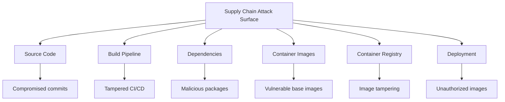
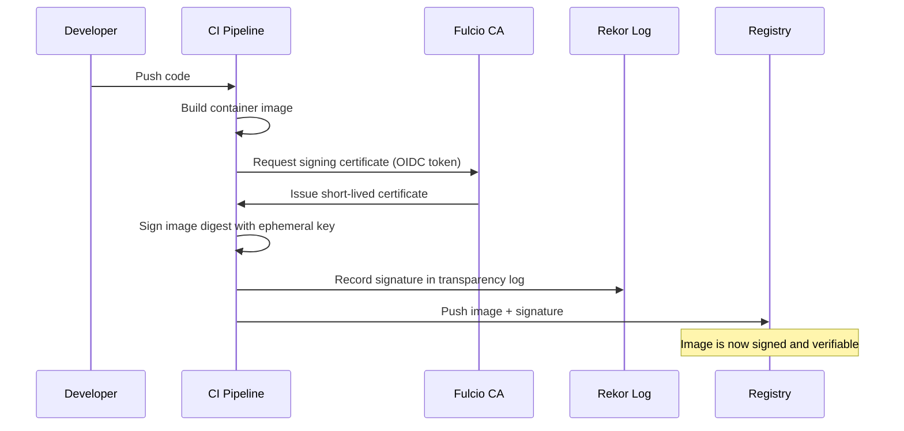
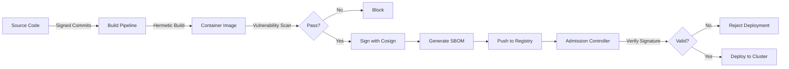

# How to Implement Supply Chain Security for Kubernetes

Author: [nawazdhandala](https://www.github.com/nawazdhandala)

Tags: Supply Chain Security, Sigstore, Cosign, Kubernetes, SBOM

Description: Learn how to implement supply chain security for Kubernetes with image signing, verification, SBOMs, and admission policies.

---

## Introduction

Software supply chain attacks have surged in recent years, targeting everything from build pipelines to container registries. For Kubernetes environments, ensuring that only trusted, verified images run in your clusters is critical. This guide walks through implementing supply chain security using open-source tools like Sigstore, Cosign, and Kyverno.

## Supply Chain Attack Surface



## Signing Container Images with Cosign

### Installing Cosign

```bash
# Install Cosign on macOS
brew install cosign

# Or download the binary directly
# Verify the checksum after download
curl -LO https://github.com/sigstore/cosign/releases/latest/download/cosign-darwin-amd64
chmod +x cosign-darwin-amd64
sudo mv cosign-darwin-amd64 /usr/local/bin/cosign
```

### Keyless Signing with Sigstore

```bash
# Sign an image using keyless signing (Sigstore Fulcio + Rekor)
# This uses your OIDC identity (GitHub, Google, etc.) for signing
cosign sign --yes myregistry.io/myapp:v1.2.3

# The above command will:
# 1. Authenticate you via OIDC
# 2. Generate an ephemeral key pair
# 3. Get a certificate from Fulcio
# 4. Sign the image digest
# 5. Record the signature in Rekor transparency log
```

### Key-Based Signing

```bash
# Generate a Cosign key pair for offline/private signing
cosign generate-key-pair

# Sign the image with your private key
cosign sign --key cosign.key myregistry.io/myapp:v1.2.3

# Verify the image signature with the public key
cosign verify --key cosign.pub myregistry.io/myapp:v1.2.3
```

## Signing Flow



## CI/CD Pipeline with Image Signing

```yaml
# GitHub Actions workflow for building, scanning, and signing images
name: Build and Sign Container Image

on:
  push:
    tags: ["v*"]

permissions:
  contents: read
  packages: write
  id-token: write  # Required for keyless signing with Sigstore

jobs:
  build-sign:
    runs-on: ubuntu-latest
    steps:
      - name: Checkout code
        uses: actions/checkout@v4

      - name: Install Cosign
        uses: sigstore/cosign-installer@v3

      - name: Install Syft for SBOM generation
        uses: anchore/sbom-action/download-syft@v0

      - name: Set up Docker Buildx
        uses: docker/setup-buildx-action@v3

      - name: Login to container registry
        uses: docker/login-action@v3
        with:
          registry: ghcr.io
          username: ${{ github.actor }}
          password: ${{ secrets.GITHUB_TOKEN }}

      - name: Build and push image
        id: build
        uses: docker/build-push-action@v5
        with:
          push: true
          tags: ghcr.io/${{ github.repository }}:${{ github.ref_name }}

      - name: Sign the image with keyless signing
        run: |
          # Sign using the image digest (immutable reference)
          cosign sign --yes \
            ghcr.io/${{ github.repository }}@${{ steps.build.outputs.digest }}

      - name: Generate and attach SBOM
        run: |
          # Generate SBOM in SPDX format
          syft ghcr.io/${{ github.repository }}@${{ steps.build.outputs.digest }} \
            -o spdx-json > sbom.spdx.json

          # Attach SBOM to the image as a cosign attestation
          cosign attest --yes \
            --predicate sbom.spdx.json \
            --type spdxjson \
            ghcr.io/${{ github.repository }}@${{ steps.build.outputs.digest }}

      - name: Verify the signature
        run: |
          cosign verify \
            --certificate-identity-regexp=".*" \
            --certificate-oidc-issuer="https://token.actions.githubusercontent.com" \
            ghcr.io/${{ github.repository }}@${{ steps.build.outputs.digest }}
```

## Generating Software Bill of Materials (SBOM)

```bash
# Generate SBOM with Syft
# SPDX format (ISO standard)
syft myregistry.io/myapp:v1.2.3 -o spdx-json > sbom.spdx.json

# CycloneDX format (OWASP standard)
syft myregistry.io/myapp:v1.2.3 -o cyclonedx-json > sbom.cdx.json

# Scan the SBOM for vulnerabilities with Grype
grype sbom:sbom.spdx.json --fail-on critical
```

## Admission Control with Kyverno

### Require Signed Images

```yaml
# Kyverno policy to enforce image signature verification
apiVersion: kyverno.io/v1
kind: ClusterPolicy
metadata:
  name: verify-image-signatures
  annotations:
    policies.kyverno.io/title: Verify Image Signatures
    policies.kyverno.io/description: >-
      Ensures all container images are signed with Cosign
      before they can be deployed to the cluster.
spec:
  validationFailureAction: Enforce  # Block non-compliant resources
  background: false
  rules:
    - name: verify-cosign-signature
      match:
        any:
          - resources:
              kinds:
                - Pod
              namespaces:
                - production
                - staging
      verifyImages:
        - imageReferences:
            - "ghcr.io/myorg/*"       # Only verify org images
          attestors:
            - count: 1
              entries:
                - keyless:
                    subject: "https://github.com/myorg/*"
                    issuer: "https://token.actions.githubusercontent.com"
                    rekor:
                      url: https://rekor.sigstore.dev
```

### Require SBOM Attestation

```yaml
# Kyverno policy to require SBOM attestation on images
apiVersion: kyverno.io/v1
kind: ClusterPolicy
metadata:
  name: require-sbom-attestation
spec:
  validationFailureAction: Enforce
  rules:
    - name: check-sbom
      match:
        any:
          - resources:
              kinds:
                - Pod
              namespaces:
                - production
      verifyImages:
        - imageReferences:
            - "ghcr.io/myorg/*"
          attestations:
            - type: https://spdx.dev/Document  # SPDX SBOM type
              attestors:
                - entries:
                    - keyless:
                        subject: "https://github.com/myorg/*"
                        issuer: "https://token.actions.githubusercontent.com"
              conditions:
                - all:
                    # Ensure SBOM contains package information
                    - key: "{{ len(packages) }}"
                      operator: GreaterThan
                      value: "0"
```

## End-to-End Supply Chain Security



## Verifying Images at Deploy Time

```python
# Python script to verify image signatures before deployment
import subprocess
import json
import sys

def verify_image_signature(image: str, issuer: str, identity: str) -> bool:
    """Verify that a container image has a valid Cosign signature."""
    try:
        # Run cosign verify with keyless verification
        result = subprocess.run(
            [
                "cosign", "verify",
                "--certificate-oidc-issuer", issuer,
                "--certificate-identity-regexp", identity,
                "--output", "json",
                image,
            ],
            capture_output=True,
            text=True,
            timeout=30,
        )

        if result.returncode != 0:
            print(f"Signature verification failed: {result.stderr}")
            return False

        # Parse and display verification results
        signatures = json.loads(result.stdout)
        print(f"Image {image} verified successfully")
        print(f"Found {len(signatures)} valid signature(s)")
        return True

    except subprocess.TimeoutExpired:
        print("Verification timed out")
        return False
    except Exception as e:
        print(f"Verification error: {e}")
        return False

# Verify before deploying
image = "ghcr.io/myorg/myapp:v1.2.3"
issuer = "https://token.actions.githubusercontent.com"
identity = "https://github.com/myorg/.*"

if not verify_image_signature(image, issuer, identity):
    print("Deployment blocked: image signature verification failed")
    sys.exit(1)
```

## Dependency Pinning

```dockerfile
# Pin all dependencies by hash for reproducible, secure builds
FROM python:3.12.1-slim@sha256:abc123def456...

WORKDIR /app

# Use pip-compile to generate pinned requirements with hashes
# pip-compile --generate-hashes requirements.in > requirements.txt
COPY requirements.txt .

# Install with hash verification - fails if any hash mismatches
RUN pip install --no-cache-dir --require-hashes -r requirements.txt

COPY . .
USER nonroot
ENTRYPOINT ["python", "main.py"]
```

## Conclusion

Supply chain security for Kubernetes is about verifying trust at every step. Sign your images with Cosign, generate SBOMs for transparency, enforce signatures with admission controllers, and pin your dependencies. These practices create a chain of trust from source code to running containers.

To monitor your Kubernetes clusters and get alerted on supply chain security violations, check out [OneUptime](https://oneuptime.com) for comprehensive monitoring, alerting, and incident management.
