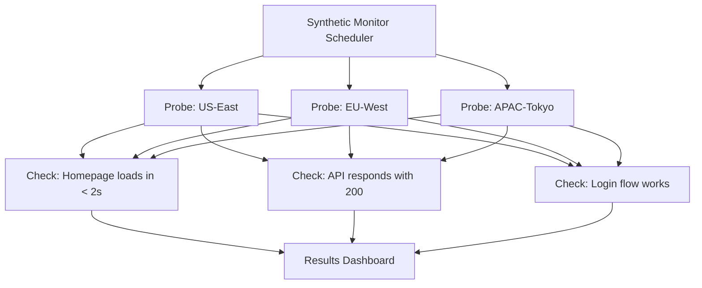
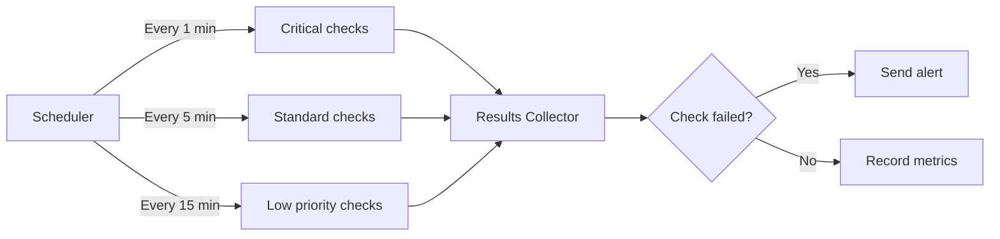

# How to Set Up Synthetic Monitoring for Web Applications

Author: [nawazdhandala](https://www.github.com/nawazdhandala)

Tags: Synthetic Monitoring, Web Performance, Uptime, Testing, Observability

Description: Learn how to set up synthetic monitoring to proactively detect issues before users do with endpoint checks and browser tests.

---

Synthetic monitoring lets you catch outages and performance problems before your users do. Instead of waiting for real users to report issues, synthetic monitors run automated checks from multiple locations around the world, verifying that your services are available and performing well. This guide shows you how to set up effective synthetic monitoring.

## What Is Synthetic Monitoring?

Synthetic monitoring uses scripted checks that simulate user interactions with your application. These checks run on a schedule from multiple geographic locations, providing consistent baseline measurements and early warning of issues.



## HTTP Endpoint Checks

The simplest form of synthetic monitoring is HTTP endpoint checks. These verify that your endpoints return the expected status code and response time.

```python
# http_monitor.py
# Simple HTTP endpoint monitor with validation

import httpx
import time
import logging
from dataclasses import dataclass, field
from typing import Optional, List, Dict

logger = logging.getLogger(__name__)

@dataclass
class CheckResult:
    """Result of a single synthetic check."""
    url: str
    status_code: int
    response_time_ms: float
    passed: bool
    error: Optional[str] = None
    headers: Dict[str, str] = field(default_factory=dict)

@dataclass
class EndpointCheck:
    """Configuration for an HTTP endpoint check."""
    url: str
    method: str = "GET"
    expected_status: int = 200
    timeout_seconds: float = 10.0
    max_response_time_ms: float = 2000.0
    headers: Dict[str, str] = field(default_factory=dict)
    body_contains: Optional[str] = None

    async def execute(self) -> CheckResult:
        """Run the endpoint check and return results."""
        start = time.perf_counter()

        try:
            async with httpx.AsyncClient() as client:
                # Send the HTTP request
                response = await client.request(
                    method=self.method,
                    url=self.url,
                    headers=self.headers,
                    timeout=self.timeout_seconds
                )

                elapsed_ms = (time.perf_counter() - start) * 1000
                passed = True

                # Validate status code
                if response.status_code != self.expected_status:
                    passed = False
                    logger.warning(
                        f"Status mismatch for {self.url}: "
                        f"expected {self.expected_status}, "
                        f"got {response.status_code}"
                    )

                # Validate response time
                if elapsed_ms > self.max_response_time_ms:
                    passed = False
                    logger.warning(
                        f"Slow response for {self.url}: "
                        f"{elapsed_ms:.0f}ms > {self.max_response_time_ms}ms"
                    )

                # Validate response body contains expected string
                if self.body_contains:
                    if self.body_contains not in response.text:
                        passed = False
                        logger.warning(
                            f"Body validation failed for {self.url}: "
                            f"'{self.body_contains}' not found"
                        )

                return CheckResult(
                    url=self.url,
                    status_code=response.status_code,
                    response_time_ms=elapsed_ms,
                    passed=passed,
                    headers=dict(response.headers)
                )

        except Exception as e:
            elapsed_ms = (time.perf_counter() - start) * 1000
            return CheckResult(
                url=self.url,
                status_code=0,
                response_time_ms=elapsed_ms,
                passed=False,
                error=str(e)
            )
```

## API Flow Checks

For APIs, you often need to check a sequence of calls that depend on each other - like authenticating and then fetching user data.

```python
# api_flow_monitor.py
# Multi-step API flow monitor

import httpx
import time
import logging

logger = logging.getLogger(__name__)

class APIFlowMonitor:
    """Monitor a multi-step API flow."""

    def __init__(self, base_url):
        self.base_url = base_url
        self.steps = []
        self.results = []

    def add_step(self, name, method, path, headers=None, json_body=None,
                 expected_status=200, extract=None):
        """Add a step to the API flow."""
        self.steps.append({
            "name": name,
            "method": method,
            "path": path,
            "headers": headers or {},
            "json_body": json_body,
            "expected_status": expected_status,
            # Extract values from response for use in later steps
            "extract": extract or {}
        })

    async def run(self):
        """Execute all steps in sequence."""
        # Store extracted values across steps
        context = {}

        async with httpx.AsyncClient(base_url=self.base_url) as client:
            for step in self.steps:
                start = time.perf_counter()

                # Substitute context variables in headers and body
                headers = self._substitute(step["headers"], context)
                body = self._substitute(step["json_body"], context) if step["json_body"] else None

                try:
                    response = await client.request(
                        method=step["method"],
                        url=step["path"],
                        headers=headers,
                        json=body,
                        timeout=10.0
                    )

                    elapsed_ms = (time.perf_counter() - start) * 1000
                    passed = response.status_code == step["expected_status"]

                    # Extract values for subsequent steps
                    if passed and step["extract"]:
                        data = response.json()
                        for key, json_path in step["extract"].items():
                            context[key] = self._get_json_value(data, json_path)

                    self.results.append({
                        "step": step["name"],
                        "status": response.status_code,
                        "time_ms": elapsed_ms,
                        "passed": passed
                    })

                    if not passed:
                        logger.error(f"Step '{step['name']}' failed")
                        break

                except Exception as e:
                    self.results.append({
                        "step": step["name"],
                        "status": 0,
                        "time_ms": 0,
                        "passed": False,
                        "error": str(e)
                    })
                    break

        return self.results

    def _substitute(self, obj, context):
        """Replace {{variable}} placeholders with context values."""
        if isinstance(obj, str):
            for key, value in context.items():
                obj = obj.replace(f"{{{{{key}}}}}", str(value))
            return obj
        if isinstance(obj, dict):
            return {k: self._substitute(v, context) for k, v in obj.items()}
        return obj

    def _get_json_value(self, data, path):
        """Extract a value from JSON using dot notation."""
        keys = path.split(".")
        for key in keys:
            data = data[key]
        return data


# Example: Monitor a login and data fetch flow
async def check_auth_flow():
    monitor = APIFlowMonitor("https://api.example.com")

    # Step 1: Authenticate
    monitor.add_step(
        name="login",
        method="POST",
        path="/auth/login",
        json_body={"email": "monitor@example.com", "password": "test-password"},
        expected_status=200,
        extract={"token": "access_token"}
    )

    # Step 2: Fetch user profile using the token
    monitor.add_step(
        name="get_profile",
        method="GET",
        path="/api/me",
        headers={"Authorization": "Bearer {{token}}"},
        expected_status=200
    )

    return await monitor.run()
```

## SSL Certificate Monitoring

Monitor your SSL certificates to avoid surprise expirations that cause browser warnings and trust issues.

```python
# ssl_monitor.py
# Monitor SSL certificate expiration

import ssl
import socket
from datetime import datetime, timezone
import logging

logger = logging.getLogger(__name__)

def check_ssl_certificate(hostname, port=443, warn_days=30):
    """Check SSL certificate validity and expiration."""
    context = ssl.create_default_context()

    try:
        # Connect to the host and retrieve the certificate
        with socket.create_connection((hostname, port), timeout=10) as sock:
            with context.wrap_socket(sock, server_hostname=hostname) as ssock:
                cert = ssock.getpeercert()

        # Parse the expiration date
        expires_str = cert["notAfter"]
        expires = datetime.strptime(expires_str, "%b %d %H:%M:%S %Y %Z")
        expires = expires.replace(tzinfo=timezone.utc)

        # Calculate days until expiration
        now = datetime.now(timezone.utc)
        days_remaining = (expires - now).days

        result = {
            "hostname": hostname,
            "issuer": dict(x[0] for x in cert["issuer"]),
            "expires": expires.isoformat(),
            "days_remaining": days_remaining,
            "valid": days_remaining > 0,
            "warning": days_remaining <= warn_days
        }

        if days_remaining <= warn_days:
            logger.warning(
                f"SSL certificate for {hostname} expires in "
                f"{days_remaining} days"
            )

        return result

    except Exception as e:
        logger.error(f"SSL check failed for {hostname}: {e}")
        return {
            "hostname": hostname,
            "valid": False,
            "error": str(e)
        }
```

## Scheduling and Running Checks



```python
# scheduler.py
# Schedule synthetic checks at different intervals

import asyncio
from datetime import datetime

class SyntheticScheduler:
    def __init__(self):
        # Checks grouped by interval
        self.checks = {"60": [], "300": [], "900": []}

    def add_check(self, check, interval_seconds=300):
        """Register a check with its run interval."""
        key = str(interval_seconds)
        if key not in self.checks:
            self.checks[key] = []
        self.checks[key].append(check)

    async def run_interval(self, interval_seconds):
        """Run all checks for a given interval in a loop."""
        checks = self.checks.get(str(interval_seconds), [])
        while True:
            for check in checks:
                result = await check.execute()
                await self.process_result(result)
            await asyncio.sleep(interval_seconds)

    async def process_result(self, result):
        """Process a check result - alert if failed."""
        if not result.passed:
            print(
                f"[{datetime.utcnow().isoformat()}] FAIL: "
                f"{result.url} - {result.error or result.status_code}"
            )

    async def start(self):
        """Start all check intervals concurrently."""
        tasks = []
        for interval in self.checks:
            if self.checks[interval]:
                tasks.append(self.run_interval(int(interval)))
        await asyncio.gather(*tasks)
```

## Choosing Check Locations

Run checks from multiple geographic locations to detect regional outages and measure latency from your users' perspective.

With **OneUptime**, you can set up synthetic monitoring from probes distributed across the globe. Configure HTTP checks, API flow monitors, and SSL certificate monitoring with customizable intervals and alerting. OneUptime's synthetic monitoring detects issues before your users do, giving you time to fix problems proactively.
