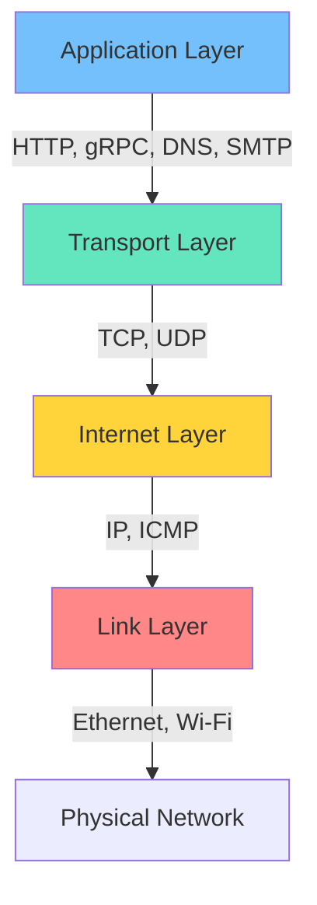
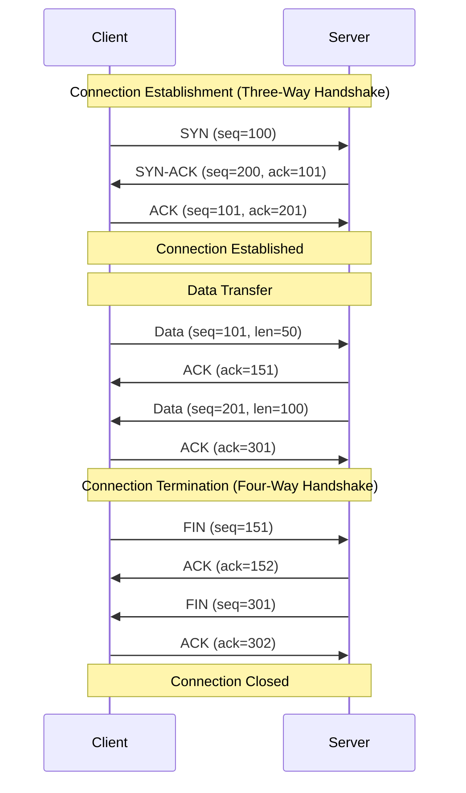
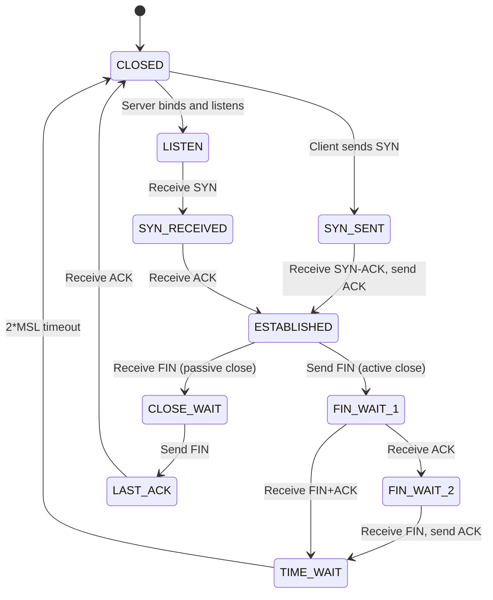
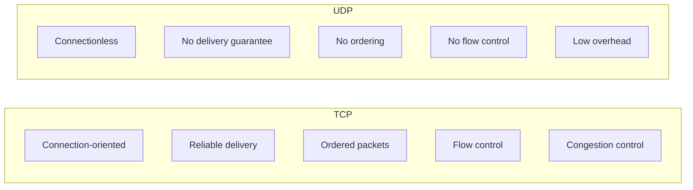
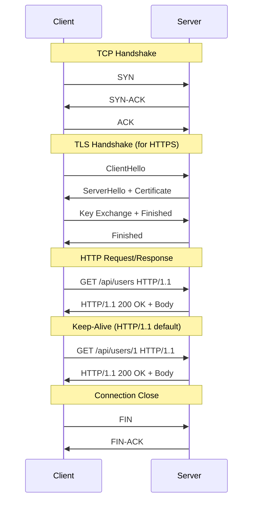

# Understanding TCP/IP Networking for Application Developers

Author: [nawazdhandala](https://www.github.com/nawazdhandala)

Tags: TCP/IP, Networking, Protocols, HTTP, Application Development

Description: A practical guide to TCP/IP networking fundamentals including the protocol stack, connection lifecycle, and common issues.

---

Every web request, database query, and API call runs over TCP/IP. When things go wrong at the network level, application developers who understand TCP/IP can diagnose problems in minutes instead of hours. This guide covers the practical TCP/IP knowledge you need as a developer.

## The TCP/IP Protocol Stack

The TCP/IP model has four layers. Each layer has a specific job and passes data to the layer below it.



| Layer | Protocols | What It Does |
|-------|-----------|-------------|
| Application | HTTP, DNS, gRPC | Application-specific communication |
| Transport | TCP, UDP | Reliable delivery and port multiplexing |
| Internet | IP, ICMP | Addressing and routing between networks |
| Link | Ethernet, ARP | Communication on the local network |

## TCP Connection Lifecycle

Every TCP connection goes through a three-way handshake to establish and a four-way handshake to close.



## TCP Connection States

Understanding TCP states helps you diagnose connection problems using tools like `ss` and `netstat`.



```bash
# Check connection states on your system
ss -tan | awk '{print $1}' | sort | uniq -c | sort -rn

# Common output and what it means:
# ESTABLISHED - Active connections transferring data
# TIME_WAIT   - Connections that closed recently (waiting 2*MSL)
# CLOSE_WAIT  - Remote side closed, local app has not closed yet (potential leak)
# LISTEN      - Server sockets waiting for connections
# SYN_SENT    - Outgoing connection attempts in progress
```

## TCP vs UDP



| Feature | TCP | UDP |
|---------|-----|-----|
| Use case | HTTP, databases, file transfer | DNS, video streaming, gaming |
| Reliability | Guaranteed delivery with retransmission | Best effort, no retransmission |
| Overhead | Higher (20+ byte header, handshake) | Lower (8 byte header, no handshake) |
| Ordering | Packets delivered in order | No ordering guarantee |

## IP Addressing and Subnets

```bash
# Understanding CIDR notation
# 10.0.0.0/24 means:
#   Network: 10.0.0.0
#   Subnet mask: 255.255.255.0
#   Usable hosts: 10.0.0.1 to 10.0.0.254
#   Broadcast: 10.0.0.255
#   Total usable IPs: 254

# Common subnet sizes
# /32 = 1 IP (single host)
# /24 = 256 IPs (254 usable)
# /16 = 65,536 IPs
# /8  = 16,777,216 IPs

# Private IP ranges (RFC 1918)
# 10.0.0.0/8      (10.0.0.0 - 10.255.255.255)
# 172.16.0.0/12   (172.16.0.0 - 172.31.255.255)
# 192.168.0.0/16  (192.168.0.0 - 192.168.255.255)

# Check your machine's IP and subnet
ip addr show | grep "inet "

# Calculate subnet details
ipcalc 10.0.0.0/24
```

## Port Numbers

```bash
# Well-known ports (0-1023) - require root to bind
# 22   - SSH
# 53   - DNS
# 80   - HTTP
# 443  - HTTPS

# Registered ports (1024-49151) - common application ports
# 3000 - Node.js dev servers
# 3306 - MySQL
# 5432 - PostgreSQL
# 6379 - Redis
# 8080 - HTTP alternative
# 8443 - HTTPS alternative
# 9090 - Prometheus

# Ephemeral ports (49152-65535) - used for outgoing connections
# Check your system's ephemeral port range
cat /proc/sys/net/ipv4/ip_local_port_range

# Check what is listening on a port
ss -tlnp | grep :8080

# Check if a specific port is reachable
nc -zv 10.0.0.5 5432
```

## How HTTP Works Over TCP



## Common TCP/IP Problems and Diagnosis

### Connection Refused

```bash
# Error: Connection refused
# Cause: Nothing is listening on the target port
# Diagnosis:
ss -tlnp | grep :5432

# Fix: Start the service or check the port configuration
```

### Connection Timeout

```bash
# Error: Connection timed out
# Cause: Packets are being dropped (firewall, routing issue)
# Diagnosis:

# Check if the host is reachable at all
ping -c 3 10.0.0.5

# Check the route to the host
traceroute 10.0.0.5

# Check local firewall rules
sudo iptables -L -n
```

### Too Many TIME_WAIT Connections

```bash
# Problem: Thousands of TIME_WAIT connections eating up ports
# Check the count
ss -t state time-wait | wc -l

# TIME_WAIT lasts for 2 * MSL (usually 60 seconds)
# Solutions:
# 1. Use connection pooling in your application
# 2. Enable TCP reuse (careful in production)
cat /proc/sys/net/ipv4/tcp_tw_reuse

# 3. Reduce the FIN timeout
cat /proc/sys/net/ipv4/tcp_fin_timeout
```

### CLOSE_WAIT Accumulation

```bash
# Problem: CLOSE_WAIT connections accumulating
# Cause: Application is not closing sockets after the remote side closes
# This is almost always an application bug

# Find which process has the CLOSE_WAIT connections
ss -tp state close-wait

# The fix is in your application code:
# Make sure you close connections properly in finally blocks
# Check for connection pool leaks
```

## Socket Programming Basics

Understanding sockets helps you reason about network behavior in your applications.

```python
# server.py
# A minimal TCP server showing the connection lifecycle
import socket

# Create a TCP socket (AF_INET = IPv4, SOCK_STREAM = TCP)
server_socket = socket.socket(socket.AF_INET, socket.SOCK_STREAM)

# Allow port reuse to avoid "address already in use" errors
server_socket.setsockopt(socket.SOL_SOCKET, socket.SO_REUSEADDR, 1)

# Bind to all interfaces on port 8080
server_socket.bind(('0.0.0.0', 8080))

# Start listening with a backlog of 128 pending connections
server_socket.listen(128)

print("Server listening on port 8080")

while True:
    # Accept a new connection (blocks until a client connects)
    client_socket, client_address = server_socket.accept()
    print(f"Connection from {client_address}")

    # Receive data (up to 4096 bytes)
    data = client_socket.recv(4096)
    print(f"Received: {data.decode()}")

    # Send a response
    client_socket.sendall(b"HTTP/1.1 200 OK\r\nContent-Length: 2\r\n\r\nOK")

    # Close the connection
    client_socket.close()
```

## TCP Tuning Parameters

```bash
# Key TCP parameters for production servers

# Maximum number of pending connections in the listen backlog
cat /proc/sys/net/core/somaxconn
# Default: 4096. Increase for high-traffic servers.

# TCP keepalive settings
# How long before sending keepalive probes (seconds)
cat /proc/sys/net/ipv4/tcp_keepalive_time
# Default: 7200 (2 hours). Lower for faster dead connection detection.

# Interval between keepalive probes
cat /proc/sys/net/ipv4/tcp_keepalive_intvl

# Number of probes before declaring connection dead
cat /proc/sys/net/ipv4/tcp_keepalive_probes

# Maximum SYN retransmissions (affects connection timeout)
cat /proc/sys/net/ipv4/tcp_syn_retries

# Enable TCP window scaling for high-bandwidth connections
cat /proc/sys/net/ipv4/tcp_window_scaling
```

## Conclusion

TCP/IP knowledge is a superpower for application developers. When you understand connection states, you can diagnose CLOSE_WAIT leaks. When you understand TIME_WAIT, you know why connection pooling matters. When you understand the handshake, you can reason about latency. These fundamentals do not change even as higher-level protocols evolve.

For monitoring your applications and the networks they run on, [OneUptime](https://oneuptime.com) provides TCP port monitors, HTTP endpoint checks, and application performance monitoring so you can detect connectivity issues and performance degradation before they impact your users.
