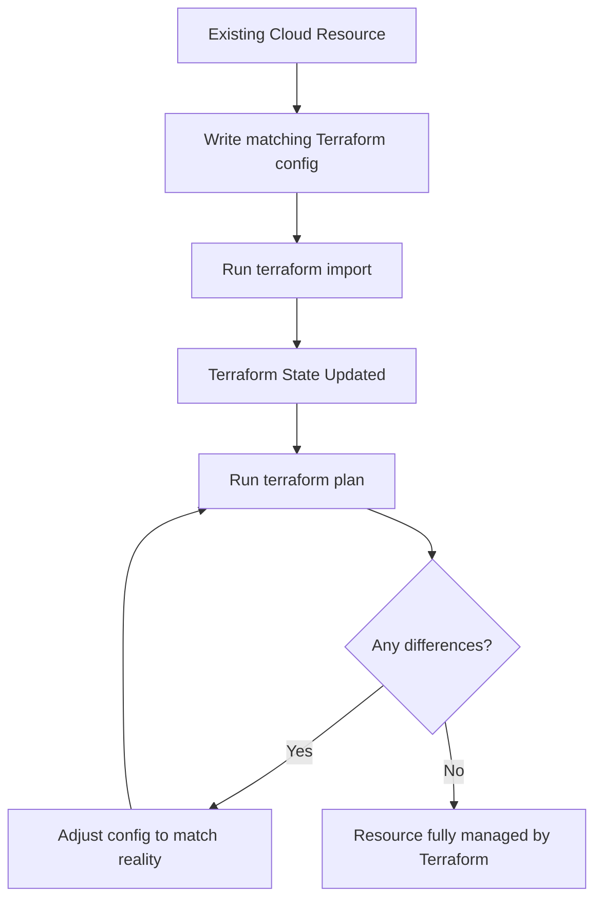
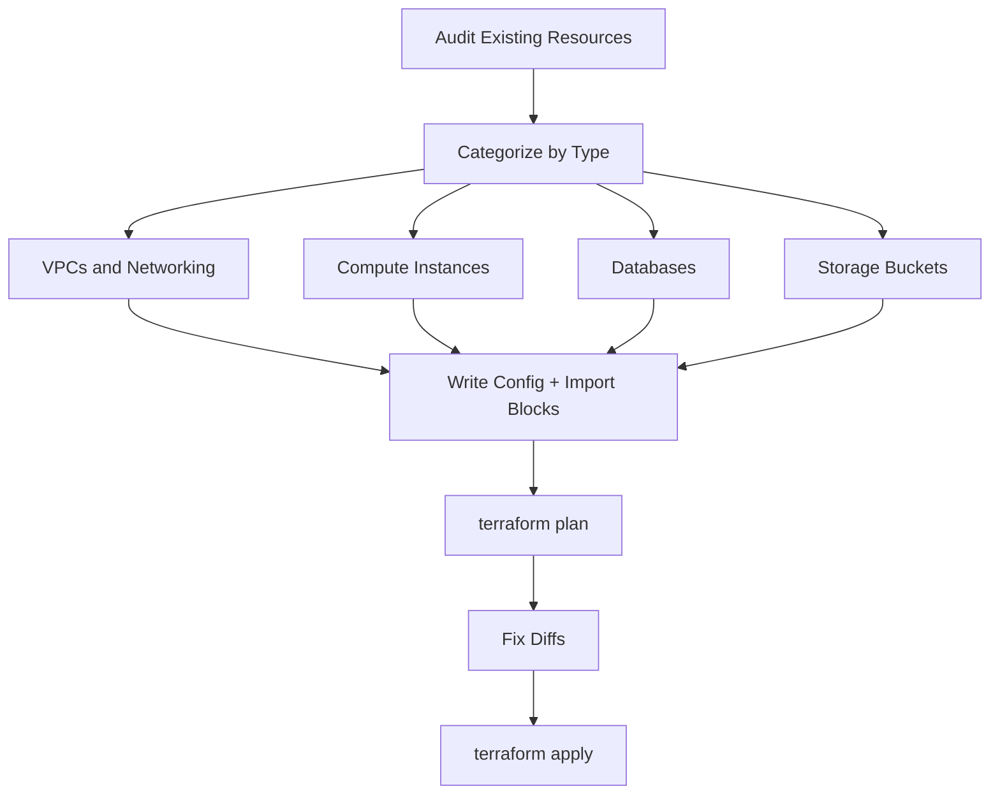

# How to Import Existing Infrastructure into Terraform

Author: [nawazdhandala](https://www.github.com/nawazdhandala)

Tags: Terraform, Import, Migration, Infrastructure as Code, Adoption

Description: Learn how to import existing cloud resources into Terraform state for managing pre-existing infrastructure as code.

---

## Introduction

Most teams do not start with Terraform from day one. You likely have cloud resources created through the console, CLI, or other tools. Importing those existing resources into Terraform lets you manage them as code going forward, without recreating anything.

This guide walks through the process of importing existing infrastructure into Terraform, covering both the traditional `terraform import` command and the newer `import` block approach introduced in Terraform 1.5.

## The Import Workflow

Importing a resource involves three steps: write the configuration, import the state, and verify the result.



## Traditional Import with terraform import

The `terraform import` command maps an existing resource to a Terraform resource address.

### Step 1: Write the Resource Configuration

First, write a Terraform resource block that describes the existing resource. You do not need to get every attribute perfect on the first try.

```hcl
# main.tf
# Describe the existing EC2 instance
resource "aws_instance" "web_server" {
  # Start with the values you know
  ami           = "ami-0abcdef1234567890"
  instance_type = "t3.medium"

  tags = {
    Name = "production-web-server"
  }
}
```

### Step 2: Run the Import Command

```bash
# Import the existing EC2 instance into Terraform state
# Syntax: terraform import <resource_address> <resource_id>
terraform import aws_instance.web_server i-1234567890abcdef0
```

### Step 3: Compare and Adjust

After importing, run a plan to see if your configuration matches the actual resource.

```bash
# Check for differences between config and imported state
terraform plan
```

If there are differences, update your configuration to match reality. Repeat until the plan shows no changes.

## Import Block Approach (Terraform 1.5+)

Terraform 1.5 introduced the `import` block, which is declarative and works with `terraform plan`.

```hcl
# imports.tf
# Declaratively import existing resources
import {
  # The Terraform resource address to import into
  to = aws_instance.web_server

  # The cloud resource ID
  id = "i-1234567890abcdef0"
}

import {
  to = aws_s3_bucket.assets
  id = "my-company-production-assets"
}

import {
  to = aws_db_instance.main
  id = "production-main-db"
}
```

```hcl
# main.tf
# Write the resource blocks to match the imported resources
resource "aws_instance" "web_server" {
  ami           = "ami-0abcdef1234567890"
  instance_type = "t3.medium"

  tags = {
    Name = "production-web-server"
  }
}

resource "aws_s3_bucket" "assets" {
  bucket = "my-company-production-assets"
}

resource "aws_db_instance" "main" {
  identifier     = "production-main-db"
  instance_class = "db.t3.medium"
  engine         = "postgresql"
  engine_version = "15"
}
```

Now you can preview the import with `terraform plan` before applying.

```bash
# Preview the import (no state changes yet)
terraform plan

# Apply the import
terraform apply
```

## Generating Configuration Automatically

Terraform 1.5+ can also generate configuration for imported resources.

```hcl
# imports.tf
# Import and generate configuration automatically
import {
  to = aws_instance.web_server
  id = "i-1234567890abcdef0"
}
```

```bash
# Generate configuration for the imported resource
terraform plan -generate-config-out=generated.tf
```

This creates a `generated.tf` file with the full resource configuration based on the current state. Review and clean it up before committing.

## Importing Multiple Resources

For large migrations, you often need to import many resources. Here is a systematic approach.



### Example: Importing a VPC and Its Subnets

```hcl
# imports.tf
# Import the full VPC setup
import {
  to = aws_vpc.main
  id = "vpc-0abc123def456789"
}

import {
  to = aws_subnet.public_a
  id = "subnet-0aaa111bbb222ccc"
}

import {
  to = aws_subnet.public_b
  id = "subnet-0ddd333eee444fff"
}

import {
  to = aws_subnet.private_a
  id = "subnet-0ggg555hhh666iii"
}

import {
  to = aws_internet_gateway.main
  id = "igw-0jjj777kkk888lll"
}
```

```hcl
# vpc.tf
# Resource blocks matching the existing VPC setup
resource "aws_vpc" "main" {
  cidr_block           = "10.0.0.0/16"
  enable_dns_support   = true
  enable_dns_hostnames = true

  tags = {
    Name = "production-vpc"
  }
}

resource "aws_subnet" "public_a" {
  vpc_id            = aws_vpc.main.id
  cidr_block        = "10.0.1.0/24"
  availability_zone = "us-east-1a"

  tags = {
    Name = "production-public-a"
  }
}

resource "aws_subnet" "public_b" {
  vpc_id            = aws_vpc.main.id
  cidr_block        = "10.0.2.0/24"
  availability_zone = "us-east-1b"

  tags = {
    Name = "production-public-b"
  }
}

resource "aws_subnet" "private_a" {
  vpc_id            = aws_vpc.main.id
  cidr_block        = "10.0.10.0/24"
  availability_zone = "us-east-1a"

  tags = {
    Name = "production-private-a"
  }
}

resource "aws_internet_gateway" "main" {
  vpc_id = aws_vpc.main.id

  tags = {
    Name = "production-igw"
  }
}
```

## Handling Import Challenges

### Resources with Complex IDs

Some resources have composite IDs. Check the provider documentation for the correct format.

```bash
# IAM role policy attachment uses a composite ID
terraform import aws_iam_role_policy_attachment.example \
  "my-role/arn:aws:iam::aws:policy/AmazonEKSClusterPolicy"

# Security group rule uses a complex ID format
terraform import aws_security_group_rule.allow_https \
  "sg-0abc123_ingress_tcp_443_443_0.0.0.0/0"
```

### Resources That Cannot Be Imported

Not every resource supports import. Check the Terraform provider docs. If a resource does not support import, you may need to:

1. Remove it from the cloud manually
2. Let Terraform recreate it
3. Or manage it outside of Terraform

### Dealing with Drift After Import

```bash
# After importing, always run plan to check for drift
terraform plan

# If there are expected differences you want to keep,
# update your config to match the actual state
# Then verify again
terraform plan
```

## Import Checklist

| Step | Action |
|------|--------|
| 1 | List all resources to import |
| 2 | Find resource IDs from cloud console or CLI |
| 3 | Write import blocks in imports.tf |
| 4 | Write matching resource blocks |
| 5 | Run terraform plan to preview |
| 6 | Fix configuration diffs |
| 7 | Run terraform apply to complete import |
| 8 | Remove import blocks after successful import |
| 9 | Commit all changes to version control |

## Post-Import: Lifecycle Rules

After importing, protect critical resources from accidental deletion.

```hcl
# Prevent Terraform from destroying the database
resource "aws_db_instance" "main" {
  identifier     = "production-main-db"
  instance_class = "db.t3.medium"
  engine         = "postgresql"

  # Safety net: prevent accidental destruction
  lifecycle {
    prevent_destroy = true
  }
}
```

## Monitoring Imported Infrastructure

After importing existing resources into Terraform, you gain declarative control over your infrastructure. But control without visibility is incomplete. OneUptime (https://oneuptime.com) provides the monitoring layer that complements your Terraform-managed infrastructure. Set up health checks, uptime monitors, and alerting for every imported resource to ensure nothing falls through the cracks during and after migration.
