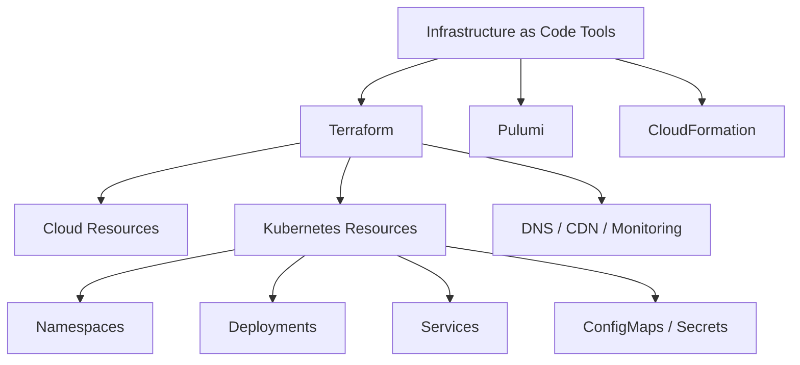
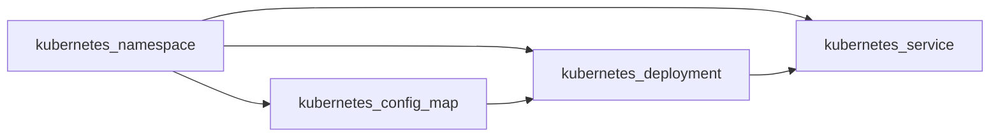

# How to Manage Kubernetes Resources with the Terraform Kubernetes Provider

Author: [nawazdhandala](https://www.github.com/nawazdhandala)

Tags: Terraform, Kubernetes, Infrastructure as Code, Provider, DevOps

Description: Learn how to use the Terraform Kubernetes provider to manage Kubernetes resources declaratively alongside your infrastructure.

---

## Introduction

Managing Kubernetes resources through kubectl and YAML manifests works fine for small setups. But when your infrastructure grows, you need a unified approach. The Terraform Kubernetes provider lets you manage Kubernetes resources using the same tool you use for cloud infrastructure.

This guide walks you through setting up the Terraform Kubernetes provider, creating resources, and integrating Kubernetes management into your broader infrastructure-as-code workflow.

## Why Use Terraform for Kubernetes?

Before diving in, let's understand where this approach fits in the broader tooling landscape.



The key benefits include:

- **Unified workflow** - Manage cloud infra and Kubernetes resources together
- **State tracking** - Terraform tracks what exists and what changed
- **Plan before apply** - Preview changes before they happen
- **Dependency management** - Terraform resolves resource dependencies automatically

## Setting Up the Provider

First, configure the Kubernetes provider in your Terraform configuration.

```hcl
# versions.tf
# Pin provider versions for reproducible builds
terraform {
  required_version = ">= 1.5.0"

  required_providers {
    kubernetes = {
      source  = "hashicorp/kubernetes"
      version = "~> 2.25.0"
    }
  }
}

# provider.tf
# Configure the Kubernetes provider using kubeconfig
provider "kubernetes" {
  # Path to your kubeconfig file
  config_path    = "~/.kube/config"
  # Context to use from kubeconfig
  config_context = "my-cluster"
}
```

If you are provisioning the cluster with Terraform as well, you can chain the outputs directly.

```hcl
# provider.tf
# Use cluster data from another Terraform resource
provider "kubernetes" {
  host                   = module.eks_cluster.endpoint
  cluster_ca_certificate = base64decode(module.eks_cluster.ca_certificate)
  token                  = data.aws_eks_cluster_auth.cluster.token
}
```

## Creating a Namespace

Namespaces are the starting point for organizing Kubernetes resources.

```hcl
# namespace.tf
# Create a namespace for the application
resource "kubernetes_namespace" "app" {
  metadata {
    # Name of the namespace
    name = "my-application"

    # Labels help with resource selection and organization
    labels = {
      environment = "production"
      managed_by  = "terraform"
      team        = "backend"
    }
  }
}
```

## Deploying an Application

Here is a complete deployment with a service.

```hcl
# deployment.tf
# Deploy a web application with 3 replicas
resource "kubernetes_deployment" "web_app" {
  metadata {
    name      = "web-app"
    namespace = kubernetes_namespace.app.metadata[0].name

    labels = {
      app = "web-app"
    }
  }

  spec {
    # Run 3 replicas for high availability
    replicas = 3

    selector {
      match_labels = {
        app = "web-app"
      }
    }

    template {
      metadata {
        labels = {
          app = "web-app"
        }
      }

      spec {
        container {
          name  = "web-app"
          image = "nginx:1.25"

          # Expose port 80 inside the container
          port {
            container_port = 80
          }

          # Set resource limits to prevent runaway usage
          resources {
            limits = {
              cpu    = "500m"
              memory = "256Mi"
            }
            requests = {
              cpu    = "100m"
              memory = "128Mi"
            }
          }

          # Health check to verify the app is running
          liveness_probe {
            http_get {
              path = "/healthz"
              port = 80
            }
            initial_delay_seconds = 10
            period_seconds        = 5
          }
        }
      }
    }
  }
}
```

## Exposing the Deployment with a Service

```hcl
# service.tf
# Create a LoadBalancer service to expose the deployment
resource "kubernetes_service" "web_app" {
  metadata {
    name      = "web-app-service"
    namespace = kubernetes_namespace.app.metadata[0].name
  }

  spec {
    # Match pods with the app=web-app label
    selector = {
      app = "web-app"
    }

    # Use LoadBalancer for external access
    type = "LoadBalancer"

    port {
      port        = 80    # Service port
      target_port = 80    # Container port
      protocol    = "TCP"
    }
  }
}
```

## Resource Dependency Flow

Terraform automatically determines the order in which resources should be created.



## Managing ConfigMaps and Secrets

```hcl
# configmap.tf
# Store application configuration in a ConfigMap
resource "kubernetes_config_map" "app_config" {
  metadata {
    name      = "app-config"
    namespace = kubernetes_namespace.app.metadata[0].name
  }

  # Key-value pairs for configuration
  data = {
    "APP_ENV"      = "production"
    "LOG_LEVEL"    = "info"
    "DATABASE_HOST" = "db.internal.example.com"
  }
}

# secret.tf
# Store sensitive data in a Kubernetes Secret
resource "kubernetes_secret" "app_secrets" {
  metadata {
    name      = "app-secrets"
    namespace = kubernetes_namespace.app.metadata[0].name
  }

  # Values are base64-encoded automatically by Terraform
  data = {
    "DB_PASSWORD" = var.db_password
    "API_KEY"     = var.api_key
  }

  type = "Opaque"
}
```

## Using Variables for Flexibility

```hcl
# variables.tf
# Define input variables for reusability
variable "app_name" {
  description = "Name of the application"
  type        = string
  default     = "web-app"
}

variable "replicas" {
  description = "Number of replicas to deploy"
  type        = number
  default     = 3
}

variable "image_tag" {
  description = "Docker image tag to deploy"
  type        = string
}

variable "db_password" {
  description = "Database password"
  type        = string
  sensitive   = true
}

variable "api_key" {
  description = "API key for external services"
  type        = string
  sensitive   = true
}
```

## Outputs for Reference

```hcl
# outputs.tf
# Export useful information after apply
output "namespace" {
  description = "The namespace where resources are deployed"
  value       = kubernetes_namespace.app.metadata[0].name
}

output "service_ip" {
  description = "The external IP of the LoadBalancer service"
  value       = kubernetes_service.web_app.status[0].load_balancer[0].ingress[0].ip
}
```

## Applying the Configuration

Run the standard Terraform workflow to deploy your resources.

```bash
# Initialize the Terraform working directory
terraform init

# Preview the changes Terraform will make
terraform plan -var="image_tag=v1.2.3"

# Apply the changes to the cluster
terraform apply -var="image_tag=v1.2.3"
```

## When to Use Terraform vs kubectl

| Scenario | Terraform | kubectl |
|----------|-----------|---------|
| Provisioning infra + K8s together | Yes | No |
| Quick ad-hoc debugging | No | Yes |
| Tracking resource state | Yes | No |
| Applying raw YAML manifests | Possible | Native |
| CI/CD pipeline deployments | Either | Either |

## Monitoring Your Kubernetes Deployments

After deploying Kubernetes resources with Terraform, monitoring them is critical. OneUptime (https://oneuptime.com) provides full-stack observability for Kubernetes clusters, including deployment health checks, pod status monitoring, and alerting when deployments fail or degrade. Combine Terraform's declarative provisioning with OneUptime's monitoring to keep your infrastructure reliable and observable.
