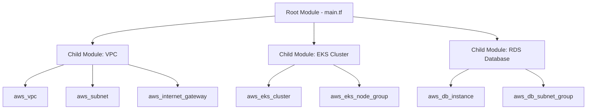
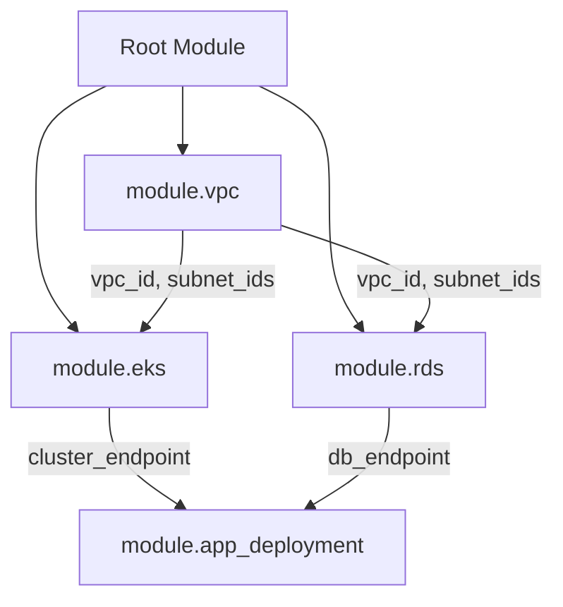

# How to Write Reusable Terraform Modules

Author: [nawazdhandala](https://www.github.com/nawazdhandala)

Tags: Terraform, Modules, Reusable, Infrastructure as Code, Best Practices

Description: Learn how to write reusable Terraform modules with proper input variables, outputs, and versioning for scalable infrastructure.

---

## Introduction

As your Terraform codebase grows, you will start copying and pasting resource blocks across projects. Modules solve this problem by letting you package a group of resources into a reusable unit. A well-written module can be shared across teams, versioned independently, and composed together to build complex infrastructure.

This guide covers how to structure, write, and publish reusable Terraform modules that your team will actually want to use.

## What Is a Terraform Module?

A module is simply a directory containing Terraform configuration files. Every Terraform project is technically a module. The distinction is between the root module (your main project) and child modules (reusable components).



## Module Directory Structure

A well-organized module follows a consistent structure.

```
modules/
  vpc/
    main.tf          # Primary resource definitions
    variables.tf     # Input variables
    outputs.tf       # Output values
    versions.tf      # Provider and Terraform version constraints
    README.md        # Documentation
    examples/
      simple/
        main.tf      # Simple usage example
      complete/
        main.tf      # Full-featured usage example
```

## Writing Your First Module

Let's build a reusable VPC module step by step.

### Define Input Variables

```hcl
# modules/vpc/variables.tf
# Define all inputs the module accepts

variable "name" {
  description = "Name prefix for all VPC resources"
  type        = string
}

variable "cidr_block" {
  description = "CIDR block for the VPC"
  type        = string
  default     = "10.0.0.0/16"

  # Validate the CIDR block format
  validation {
    condition     = can(cidrhost(var.cidr_block, 0))
    error_message = "The cidr_block must be a valid CIDR notation."
  }
}

variable "availability_zones" {
  description = "List of availability zones to use"
  type        = list(string)
}

variable "private_subnet_cidrs" {
  description = "CIDR blocks for private subnets"
  type        = list(string)
  default     = []
}

variable "public_subnet_cidrs" {
  description = "CIDR blocks for public subnets"
  type        = list(string)
  default     = []
}

variable "enable_nat_gateway" {
  description = "Whether to create a NAT gateway for private subnets"
  type        = bool
  default     = true
}

variable "tags" {
  description = "Additional tags to apply to all resources"
  type        = map(string)
  default     = {}
}
```

### Define the Resources

```hcl
# modules/vpc/main.tf
# Create the VPC and associated networking resources

# Merge common tags with user-provided tags
locals {
  common_tags = merge(var.tags, {
    ManagedBy = "terraform"
    Module    = "vpc"
  })
}

# Create the main VPC
resource "aws_vpc" "this" {
  cidr_block           = var.cidr_block
  enable_dns_support   = true
  enable_dns_hostnames = true

  tags = merge(local.common_tags, {
    Name = "${var.name}-vpc"
  })
}

# Create public subnets across availability zones
resource "aws_subnet" "public" {
  count = length(var.public_subnet_cidrs)

  vpc_id                  = aws_vpc.this.id
  cidr_block              = var.public_subnet_cidrs[count.index]
  availability_zone       = var.availability_zones[count.index]
  map_public_ip_on_launch = true

  tags = merge(local.common_tags, {
    Name = "${var.name}-public-${var.availability_zones[count.index]}"
    Tier = "public"
  })
}

# Create private subnets across availability zones
resource "aws_subnet" "private" {
  count = length(var.private_subnet_cidrs)

  vpc_id            = aws_vpc.this.id
  cidr_block        = var.private_subnet_cidrs[count.index]
  availability_zone = var.availability_zones[count.index]

  tags = merge(local.common_tags, {
    Name = "${var.name}-private-${var.availability_zones[count.index]}"
    Tier = "private"
  })
}

# Create an internet gateway for public subnets
resource "aws_internet_gateway" "this" {
  count = length(var.public_subnet_cidrs) > 0 ? 1 : 0

  vpc_id = aws_vpc.this.id

  tags = merge(local.common_tags, {
    Name = "${var.name}-igw"
  })
}

# Create a NAT gateway for private subnet internet access
resource "aws_nat_gateway" "this" {
  count = var.enable_nat_gateway && length(var.private_subnet_cidrs) > 0 ? 1 : 0

  allocation_id = aws_eip.nat[0].id
  subnet_id     = aws_subnet.public[0].id

  tags = merge(local.common_tags, {
    Name = "${var.name}-nat"
  })

  depends_on = [aws_internet_gateway.this]
}

# Elastic IP for the NAT gateway
resource "aws_eip" "nat" {
  count  = var.enable_nat_gateway && length(var.private_subnet_cidrs) > 0 ? 1 : 0
  domain = "vpc"

  tags = merge(local.common_tags, {
    Name = "${var.name}-nat-eip"
  })
}
```

### Define Outputs

```hcl
# modules/vpc/outputs.tf
# Expose values that consumers of this module will need

output "vpc_id" {
  description = "The ID of the VPC"
  value       = aws_vpc.this.id
}

output "vpc_cidr_block" {
  description = "The CIDR block of the VPC"
  value       = aws_vpc.this.cidr_block
}

output "public_subnet_ids" {
  description = "List of public subnet IDs"
  value       = aws_subnet.public[*].id
}

output "private_subnet_ids" {
  description = "List of private subnet IDs"
  value       = aws_subnet.private[*].id
}

output "nat_gateway_ip" {
  description = "The public IP of the NAT gateway"
  value       = var.enable_nat_gateway ? aws_eip.nat[0].public_ip : null
}
```

## Using the Module

```hcl
# main.tf in the root module
# Instantiate the VPC module with project-specific values
module "vpc" {
  source = "./modules/vpc"

  name               = "production"
  cidr_block         = "10.0.0.0/16"
  availability_zones = ["us-east-1a", "us-east-1b", "us-east-1c"]

  public_subnet_cidrs  = ["10.0.1.0/24", "10.0.2.0/24", "10.0.3.0/24"]
  private_subnet_cidrs = ["10.0.10.0/24", "10.0.11.0/24", "10.0.12.0/24"]

  enable_nat_gateway = true

  tags = {
    Environment = "production"
    Project     = "web-platform"
  }
}
```

## Module Composition

Modules work best when composed together. Here is how multiple modules fit into a complete infrastructure.



```hcl
# main.tf
# Compose multiple modules together
module "vpc" {
  source = "./modules/vpc"
  name   = "production"
  # ... vpc config
}

module "eks" {
  source = "./modules/eks"

  # Pass VPC outputs as inputs to the EKS module
  vpc_id     = module.vpc.vpc_id
  subnet_ids = module.vpc.private_subnet_ids

  cluster_name = "production"
}

module "rds" {
  source = "./modules/rds"

  # Pass VPC outputs as inputs to the RDS module
  vpc_id     = module.vpc.vpc_id
  subnet_ids = module.vpc.private_subnet_ids

  engine  = "postgresql"
  version = "15.4"
}
```

## Versioning Modules with Git Tags

When hosting modules in a Git repository, use tags for versioning.

```hcl
# Reference a specific version of a module from Git
module "vpc" {
  source = "git::https://github.com/my-org/terraform-modules.git//vpc?ref=v1.2.0"

  name       = "production"
  cidr_block = "10.0.0.0/16"
}
```

## Module Best Practices

| Practice | Description |
|----------|-------------|
| Keep modules focused | One module should do one thing well |
| Use sensible defaults | Provide defaults for optional variables |
| Validate inputs | Use validation blocks for complex inputs |
| Document everything | README with examples for every module |
| Version your modules | Use Git tags or a registry |
| Avoid hardcoding | Never hardcode regions, account IDs, or names |
| Output generously | Expose anything consumers might need |

## Monitoring Module-Provisioned Infrastructure

Once your modules provision infrastructure, you need visibility into what is running. OneUptime (https://oneuptime.com) integrates with your cloud infrastructure to monitor the resources your Terraform modules create. From VPC connectivity checks to database health monitoring and application uptime tracking, OneUptime helps you ensure that every module-provisioned resource stays healthy and performant.
