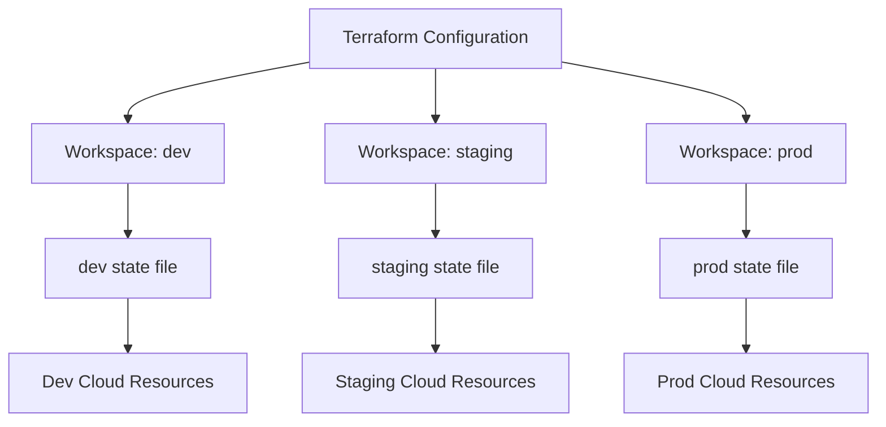
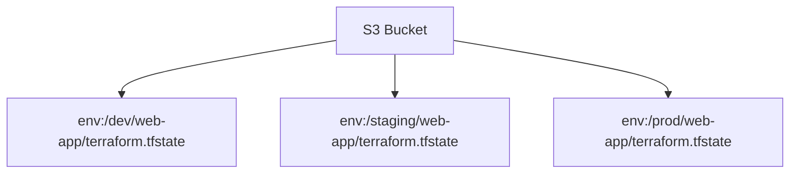

# How to Use Terraform Workspaces for Multiple Environments

Author: [nawazdhandala](https://www.github.com/nawazdhandala)

Tags: Terraform, Workspaces, Environments, Infrastructure as Code, DevOps

Description: Learn how to use Terraform workspaces to manage multiple environments like dev, staging, and production from the same codebase.

---

## Introduction

Most teams need to manage multiple environments: development, staging, and production. Each environment has the same infrastructure shape but different configurations. Terraform workspaces let you maintain a single codebase while deploying to different environments with different state files.

This guide covers how to use workspaces effectively, when they are the right choice, and when you should consider alternatives.

## What Are Terraform Workspaces?

A workspace is an isolated instance of Terraform state. Each workspace has its own state file, so resources in one workspace do not interfere with resources in another.



## Getting Started with Workspaces

Workspaces are built into Terraform. No extra setup is needed.

```bash
# List all workspaces (default workspace always exists)
terraform workspace list

# Create a new workspace for development
terraform workspace new dev

# Create workspaces for staging and production
terraform workspace new staging
terraform workspace new prod

# Switch to the dev workspace
terraform workspace select dev

# Show the current workspace
terraform workspace show
```

## Using the Workspace Name in Configuration

The current workspace name is available through `terraform.workspace`. Use it to customize resources per environment.

```hcl
# main.tf
# Use workspace name to differentiate resources across environments

locals {
  # Map workspace names to environment-specific settings
  environment = terraform.workspace

  # Define instance sizes per environment
  instance_types = {
    dev     = "t3.small"
    staging = "t3.medium"
    prod    = "t3.xlarge"
  }

  # Define replica counts per environment
  replica_counts = {
    dev     = 1
    staging = 2
    prod    = 3
  }

  # Pick the right values based on current workspace
  instance_type = local.instance_types[local.environment]
  replicas      = local.replica_counts[local.environment]
}
```

## Environment-Specific Variable Files

A cleaner approach uses variable files per environment.

```hcl
# variables.tf
# Define variables that change per environment
variable "instance_type" {
  description = "EC2 instance type"
  type        = string
}

variable "replicas" {
  description = "Number of application replicas"
  type        = number
}

variable "enable_monitoring" {
  description = "Whether to enable detailed monitoring"
  type        = bool
  default     = false
}

variable "domain_name" {
  description = "Domain name for the application"
  type        = string
}
```

Create a `.tfvars` file for each environment.

```hcl
# environments/dev.tfvars
instance_type     = "t3.small"
replicas          = 1
enable_monitoring = false
domain_name       = "dev.example.com"
```

```hcl
# environments/staging.tfvars
instance_type     = "t3.medium"
replicas          = 2
enable_monitoring = true
domain_name       = "staging.example.com"
```

```hcl
# environments/prod.tfvars
instance_type     = "t3.xlarge"
replicas          = 3
enable_monitoring = true
domain_name       = "app.example.com"
```

## Applying with Workspaces and Variable Files

Combine workspace selection with the matching variable file.

```bash
# Switch to the dev workspace and apply with dev variables
terraform workspace select dev
terraform plan -var-file="environments/dev.tfvars"
terraform apply -var-file="environments/dev.tfvars"

# Switch to prod workspace and apply with prod variables
terraform workspace select prod
terraform plan -var-file="environments/prod.tfvars"
terraform apply -var-file="environments/prod.tfvars"
```

## Resource Naming with Workspaces

Prefix resource names with the workspace to avoid naming collisions.

```hcl
# main.tf
# Prefix all resource names with the environment
resource "aws_instance" "web" {
  ami           = data.aws_ami.ubuntu.id
  instance_type = var.instance_type

  tags = {
    # Include workspace name in resource tags
    Name        = "${terraform.workspace}-web-server"
    Environment = terraform.workspace
    ManagedBy   = "terraform"
  }
}

# S3 bucket names must be globally unique
resource "aws_s3_bucket" "assets" {
  bucket = "mycompany-${terraform.workspace}-assets"

  tags = {
    Environment = terraform.workspace
  }
}

# Database identifier includes environment
resource "aws_db_instance" "main" {
  identifier     = "${terraform.workspace}-main-db"
  instance_class = var.instance_type
  engine         = "postgresql"
  engine_version = "15"

  # Use smaller storage in non-prod environments
  allocated_storage = terraform.workspace == "prod" ? 100 : 20

  tags = {
    Environment = terraform.workspace
  }
}
```

## Remote Backend with Workspaces

When using a remote backend, each workspace gets its own state file automatically.

```hcl
# backend.tf
# S3 backend with workspace-aware state paths
terraform {
  backend "s3" {
    bucket = "my-company-terraform-state"

    # The workspace name is appended to the key automatically
    # dev  -> env:/dev/web-app/terraform.tfstate
    # prod -> env:/prod/web-app/terraform.tfstate
    key = "web-app/terraform.tfstate"

    region         = "us-east-1"
    dynamodb_table = "terraform-locks"
    encrypt        = true
  }
}
```

The state file layout in S3 looks like this:



## Workspace Workflow in CI/CD

Automate workspace selection in your CI/CD pipeline.

```yaml
# .github/workflows/terraform.yml
name: Terraform Deploy

on:
  push:
    branches:
      - main        # Deploy to prod
      - develop     # Deploy to dev
      - release/*   # Deploy to staging

jobs:
  deploy:
    runs-on: ubuntu-latest

    steps:
      - uses: actions/checkout@v4

      - uses: hashicorp/setup-terraform@v3

      # Determine which workspace to use based on branch
      - name: Set workspace
        run: |
          if [[ "$GITHUB_REF" == "refs/heads/main" ]]; then
            echo "TF_WORKSPACE=prod" >> $GITHUB_ENV
            echo "VAR_FILE=environments/prod.tfvars" >> $GITHUB_ENV
          elif [[ "$GITHUB_REF" == refs/heads/release/* ]]; then
            echo "TF_WORKSPACE=staging" >> $GITHUB_ENV
            echo "VAR_FILE=environments/staging.tfvars" >> $GITHUB_ENV
          else
            echo "TF_WORKSPACE=dev" >> $GITHUB_ENV
            echo "VAR_FILE=environments/dev.tfvars" >> $GITHUB_ENV
          fi

      - name: Terraform Init
        run: terraform init

      - name: Terraform Plan
        run: terraform plan -var-file="${VAR_FILE}" -out=tfplan

      - name: Terraform Apply
        if: github.ref == 'refs/heads/main'
        run: terraform apply tfplan
```

## When Workspaces Are Not the Right Choice

Workspaces work well when environments share the same shape but differ in size. They are not ideal when:

| Scenario | Use Workspaces? | Alternative |
|----------|----------------|-------------|
| Same infra, different sizes | Yes | - |
| Completely different architectures | No | Separate root modules |
| Different cloud providers per env | No | Separate root modules |
| Need different backend configs | No | Separate directories |
| Many teams, independent lifecycles | No | Separate repositories |

## Cleaning Up Workspaces

```bash
# Switch away from the workspace you want to delete
terraform workspace select default

# Destroy all resources in the dev workspace first
terraform workspace select dev
terraform destroy -var-file="environments/dev.tfvars"

# Then delete the workspace
terraform workspace select default
terraform workspace delete dev
```

## Monitoring Across Environments

When managing multiple environments with Terraform workspaces, visibility across all of them is essential. OneUptime (https://oneuptime.com) lets you create separate monitoring projects for each environment, giving you a unified dashboard to compare the health of dev, staging, and production. Its status pages and alerting ensure that issues in any environment are detected and communicated quickly to the right team members.
