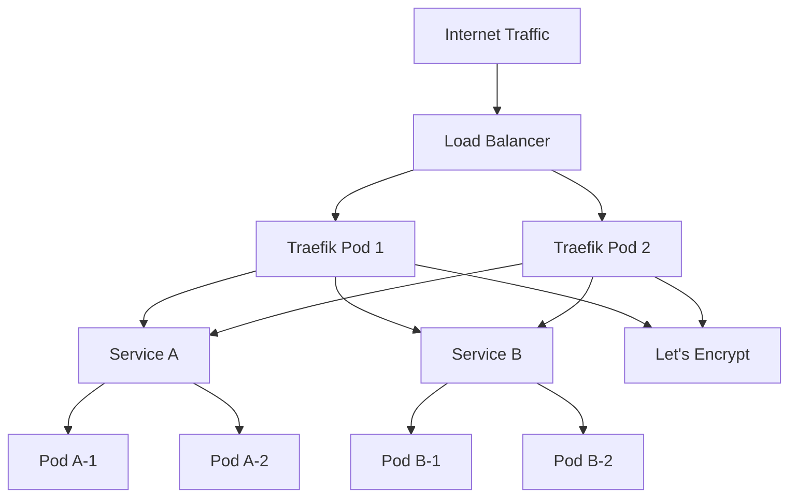
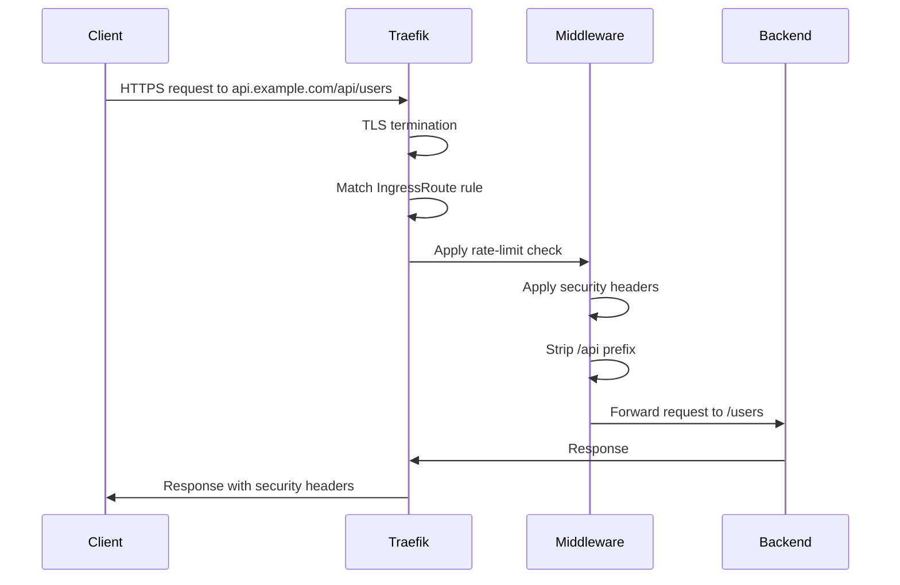
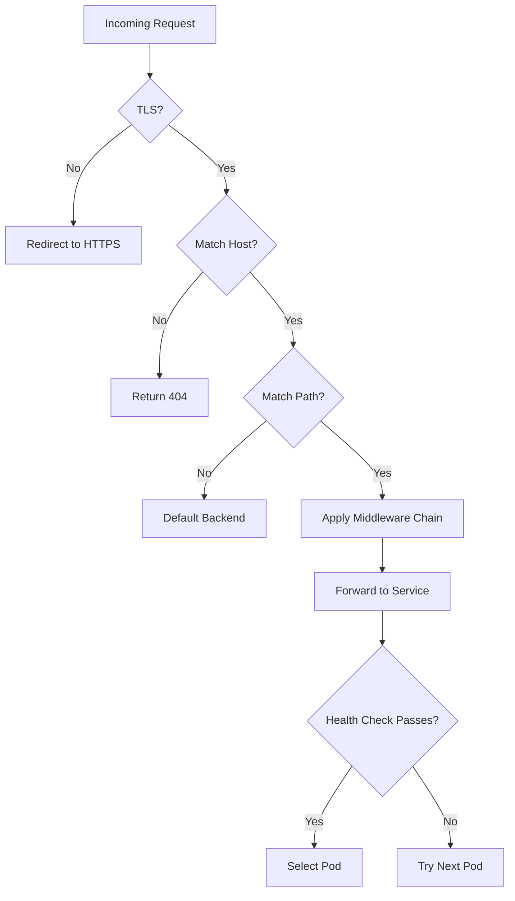

# How to Configure Traefik as a Kubernetes Ingress Controller

Author: [nawazdhandala](https://www.github.com/nawazdhandala)

Tags: Traefik, Kubernetes, Ingress, Reverse Proxy, Configuration

Description: Step-by-step guide to configuring Traefik as a Kubernetes Ingress Controller with middleware, TLS, and routing rules.

---

Traefik is a cloud-native reverse proxy that integrates tightly with Kubernetes. It discovers services automatically, provisions TLS certificates via Let's Encrypt, and supports advanced routing through IngressRoute custom resources. Unlike Nginx Ingress, Traefik was designed for dynamic environments from the start.

This guide covers installing Traefik, configuring routes, enabling TLS, and setting up middleware.

## Architecture Overview



## Installing Traefik with Helm

```bash
# install-traefik.sh
# Install Traefik using Helm with custom values

# Add the Traefik Helm repository
helm repo add traefik https://traefik.github.io/charts
helm repo update

# Install Traefik with production-ready settings
helm install traefik traefik/traefik \
  --namespace traefik \
  --create-namespace \
  --set deployment.replicas=2 \
  --set ingressRoute.dashboard.enabled=true \
  --set providers.kubernetesIngress.enabled=true \
  --set providers.kubernetesCRD.enabled=true \
  --set logs.general.level=INFO \
  --set logs.access.enabled=true \
  --set ports.web.redirectTo.port=websecure \
  --set ports.websecure.tls.enabled=true
```

## Configuring TLS with Let's Encrypt

```yaml
# traefik-values.yaml
# Helm values for Traefik with Let's Encrypt certificate resolver
additionalArguments:
  # Use Let's Encrypt production endpoint
  - "--certificatesresolvers.letsencrypt.acme.email=ops@example.com"
  - "--certificatesresolvers.letsencrypt.acme.storage=/data/acme.json"
  - "--certificatesresolvers.letsencrypt.acme.httpchallenge.entrypoint=web"
  # Enable access logs for debugging routing issues
  - "--accesslog=true"
  - "--accesslog.format=json"

# Persistent volume for storing certificate data
persistence:
  enabled: true
  size: 1Gi
  path: /data

# Resource limits to prevent runaway memory usage
resources:
  requests:
    cpu: "100m"
    memory: "128Mi"
  limits:
    cpu: "500m"
    memory: "512Mi"
```

## Basic IngressRoute

Traefik's IngressRoute CRD provides more flexibility than the standard Kubernetes Ingress resource.

```yaml
# ingressroute-api.yaml
# Routes API traffic to the backend service with TLS
apiVersion: traefik.io/v1alpha1
kind: IngressRoute
metadata:
  name: api-route
  namespace: production
spec:
  entryPoints:
    # Listen on the HTTPS entrypoint
    - websecure
  routes:
    # Match requests to api.example.com
    - match: Host(`api.example.com`)
      kind: Rule
      services:
        - name: api-service
          port: 8080
          # Use round-robin load balancing
          strategy: RoundRobin
      middlewares:
        # Apply rate limiting and security headers
        - name: rate-limit
        - name: security-headers
  tls:
    # Use Let's Encrypt for automatic certificate provisioning
    certResolver: letsencrypt
```

## Path-Based Routing

```yaml
# ingressroute-path.yaml
# Route different URL paths to different backend services
apiVersion: traefik.io/v1alpha1
kind: IngressRoute
metadata:
  name: app-routes
  namespace: production
spec:
  entryPoints:
    - websecure
  routes:
    # Frontend application
    - match: Host(`app.example.com`) && PathPrefix(`/`)
      kind: Rule
      priority: 1
      services:
        - name: frontend-service
          port: 3000

    # API backend - higher priority matches first
    - match: Host(`app.example.com`) && PathPrefix(`/api`)
      kind: Rule
      priority: 10
      services:
        - name: api-service
          port: 8080
      middlewares:
        # Strip /api prefix before forwarding
        - name: strip-api-prefix

    # WebSocket connections
    - match: Host(`app.example.com`) && PathPrefix(`/ws`)
      kind: Rule
      priority: 10
      services:
        - name: websocket-service
          port: 8081
  tls:
    certResolver: letsencrypt
```

## StripPrefix Middleware

```yaml
# middleware-strip-prefix.yaml
# Removes the /api prefix before forwarding to the backend
# e.g., /api/users becomes /users
apiVersion: traefik.io/v1alpha1
kind: Middleware
metadata:
  name: strip-api-prefix
  namespace: production
spec:
  stripPrefix:
    prefixes:
      - /api
    forceSlash: false
```

## Request Flow



## Weighted Round Robin for Canary Deployments

```yaml
# ingressroute-canary.yaml
# Split traffic between stable and canary versions
apiVersion: traefik.io/v1alpha1
kind: IngressRoute
metadata:
  name: canary-route
  namespace: production
spec:
  entryPoints:
    - websecure
  routes:
    - match: Host(`app.example.com`)
      kind: Rule
      services:
        # 90% of traffic goes to the stable version
        - name: app-stable
          port: 8080
          weight: 90
        # 10% of traffic goes to the canary version
        - name: app-canary
          port: 8080
          weight: 10
  tls:
    certResolver: letsencrypt
```

## TCP and UDP Routing

Traefik can also route non-HTTP traffic.

```yaml
# ingressroute-tcp.yaml
# Route TCP traffic for a PostgreSQL database
apiVersion: traefik.io/v1alpha1
kind: IngressRouteTCP
metadata:
  name: postgres-route
  namespace: databases
spec:
  entryPoints:
    - postgres
  routes:
    # Use TLS SNI for hostname-based TCP routing
    - match: HostSNI(`db.example.com`)
      services:
        - name: postgres-service
          port: 5432
  tls:
    passthrough: true
```

## Health Check Configuration

```yaml
# ingressroute-healthcheck.yaml
# Configure health checks so Traefik removes unhealthy backends
apiVersion: traefik.io/v1alpha1
kind: IngressRoute
metadata:
  name: app-with-healthcheck
  namespace: production
spec:
  entryPoints:
    - websecure
  routes:
    - match: Host(`app.example.com`)
      kind: Rule
      services:
        - name: app-service
          port: 8080
          # Health check configuration
          healthCheck:
            path: /healthz
            interval: 10s
            timeout: 3s
  tls:
    certResolver: letsencrypt
```

## Routing Decision Tree



## Key Takeaways

- Use Traefik's IngressRoute CRD instead of standard Ingress for richer routing capabilities.
- Enable automatic TLS with Let's Encrypt by configuring a certificate resolver.
- Use path-based routing with priorities to direct traffic to different backends from a single domain.
- Implement canary deployments with weighted services, no additional tooling required.
- Configure health checks on services so Traefik automatically removes unhealthy pods from rotation.

Traefik simplifies ingress management in Kubernetes, but you still need visibility into routing errors, certificate expiration, and backend health. Use [OneUptime](https://oneuptime.com) to monitor your Traefik instances and get alerted before a misconfigured route or an expired certificate causes downtime.
