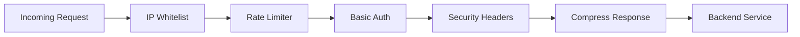
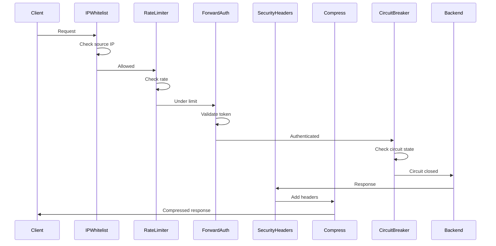

# How to Use Traefik Middleware for Request Processing

Author: [nawazdhandala](https://www.github.com/nawazdhandala)

Tags: Traefik, Middleware, Rate Limiting, Headers, Authentication

Description: Learn how to use Traefik middleware for request processing including rate limiting, authentication, headers, and compression.

---

Traefik middleware sits between the router and the backend service. It can modify requests, enforce security policies, rate-limit clients, compress responses, and chain multiple transformations together. Each middleware is defined as a Kubernetes custom resource and referenced by name in your IngressRoute.

This guide covers the most useful middleware patterns for production Kubernetes deployments.

## Middleware Pipeline



## Rate Limiting

Protect your backend from traffic spikes and abuse by limiting requests per client.

```yaml
# middleware-rate-limit.yaml
# Limits each client IP to 100 requests per second
# with a burst allowance of 200 requests
apiVersion: traefik.io/v1alpha1
kind: Middleware
metadata:
  name: rate-limit
  namespace: production
spec:
  rateLimit:
    # Average requests allowed per second
    average: 100
    # Maximum burst size above the average
    burst: 200
    # Time period for rate calculation
    period: 1s
    sourceCriterion:
      # Rate limit by client IP address
      ipStrategy:
        # Skip the first proxy IP (load balancer)
        depth: 1
```

## Security Headers

Add security-related HTTP headers to every response.

```yaml
# middleware-security-headers.yaml
# Adds standard security headers to all responses
apiVersion: traefik.io/v1alpha1
kind: Middleware
metadata:
  name: security-headers
  namespace: production
spec:
  headers:
    # Prevent clickjacking by disallowing iframe embedding
    frameDeny: true
    # Block MIME type sniffing
    contentTypeNosniff: true
    # Enable XSS protection filter in browsers
    browserXssFilter: true
    # Only send referrer for same-origin requests
    referrerPolicy: "strict-origin-when-cross-origin"
    # Content Security Policy restricting resource loading
    contentSecurityPolicy: "default-src 'self'; script-src 'self'"
    # Enforce HTTPS for 1 year including subdomains
    stsSeconds: 31536000
    stsIncludeSubdomains: true
    stsPreload: true
    # Custom headers to add
    customResponseHeaders:
      # Hide the server identity
      X-Server: ""
      # Remove the powered-by header
      X-Powered-By: ""
```

## Basic Authentication

Protect internal services with HTTP basic authentication.

```bash
# generate-auth-secret.sh
# Generate a bcrypt-hashed password and store it as a Kubernetes secret

# Create the htpasswd entry (user: admin)
CREDENTIALS=$(htpasswd -nb admin 'secure-password-here')

# Store as a Kubernetes secret
kubectl create secret generic basic-auth-secret \
  --from-literal=users="$CREDENTIALS" \
  --namespace=production
```

```yaml
# middleware-basic-auth.yaml
# Requires HTTP basic authentication using credentials from a secret
apiVersion: traefik.io/v1alpha1
kind: Middleware
metadata:
  name: basic-auth
  namespace: production
spec:
  basicAuth:
    # Reference the Kubernetes secret containing credentials
    secret: basic-auth-secret
    # Realm shown in the browser authentication dialog
    realm: "Internal Service"
    # Remove the Authorization header before forwarding
    removeHeader: true
```

## Forward Authentication

Delegate authentication to an external service, such as an OAuth2 proxy.

```yaml
# middleware-forward-auth.yaml
# Forwards authentication to an external auth service
# The auth service returns 200 to allow or 401 to deny
apiVersion: traefik.io/v1alpha1
kind: Middleware
metadata:
  name: forward-auth
  namespace: production
spec:
  forwardAuth:
    # URL of the authentication service
    address: http://oauth2-proxy.auth.svc.cluster.local:4180/oauth2/auth
    # Headers from the auth response to pass to the backend
    authResponseHeaders:
      - X-Auth-User
      - X-Auth-Email
      - X-Auth-Groups
    # Trust headers from upstream proxies
    trustForwardHeader: true
```

## IP Whitelisting

Restrict access to specific IP ranges.

```yaml
# middleware-ip-whitelist.yaml
# Only allows requests from specified IP ranges
apiVersion: traefik.io/v1alpha1
kind: Middleware
metadata:
  name: ip-whitelist
  namespace: production
spec:
  ipWhiteList:
    # Allowed source IP ranges in CIDR notation
    sourceRange:
      # Office network
      - "10.0.0.0/8"
      # VPN gateway
      - "203.0.113.0/24"
    ipStrategy:
      # Skip load balancer IP when determining client IP
      depth: 1
```

## Response Compression

Reduce bandwidth by compressing responses.

```yaml
# middleware-compress.yaml
# Enables gzip compression for responses larger than 1KB
apiVersion: traefik.io/v1alpha1
kind: Middleware
metadata:
  name: compress
  namespace: production
spec:
  compress:
    # Minimum response size to trigger compression (bytes)
    minResponseBodyBytes: 1024
    # Exclude already-compressed content types
    excludedContentTypes:
      - "image/png"
      - "image/jpeg"
      - "image/gif"
```

## Circuit Breaker

Protect backends from cascading failures by opening a circuit when error rates spike.

```yaml
# middleware-circuit-breaker.yaml
# Opens the circuit when the backend error rate exceeds 50%
apiVersion: traefik.io/v1alpha1
kind: Middleware
metadata:
  name: circuit-breaker
  namespace: production
spec:
  circuitBreaker:
    # Trip when more than 50% of requests return 5xx
    expression: "ResponseCodeRatio(500, 600, 0, 600) > 0.50"
    # Time to wait before trying the backend again
    checkPeriod: 10s
    # Time the circuit stays open before half-opening
    fallbackDuration: 30s
    # Time to probe with limited traffic in half-open state
    recoveryDuration: 60s
```

## Chaining Middleware

Apply multiple middleware in sequence by referencing them in the IngressRoute.

```yaml
# ingressroute-with-middleware.yaml
# Applies a chain of middleware to the API service
apiVersion: traefik.io/v1alpha1
kind: IngressRoute
metadata:
  name: api-route
  namespace: production
spec:
  entryPoints:
    - websecure
  routes:
    - match: Host(`api.example.com`)
      kind: Rule
      services:
        - name: api-service
          port: 8080
      middlewares:
        # Middleware is applied in the order listed
        # 1. Check IP whitelist first
        - name: ip-whitelist
        # 2. Enforce rate limits
        - name: rate-limit
        # 3. Authenticate the request
        - name: forward-auth
        # 4. Add security headers to the response
        - name: security-headers
        # 5. Compress the response body
        - name: compress
        # 6. Open circuit if backend is failing
        - name: circuit-breaker
  tls:
    certResolver: letsencrypt
```

## Middleware Execution Order



## Retry Middleware

Automatically retry failed requests against other backend pods.

```yaml
# middleware-retry.yaml
# Retries failed requests up to 3 times on different pods
apiVersion: traefik.io/v1alpha1
kind: Middleware
metadata:
  name: retry
  namespace: production
spec:
  retry:
    # Maximum number of retry attempts
    attempts: 3
    # Wait between retries
    initialInterval: 100ms
```

## Key Takeaways

- Define each middleware as a separate Kubernetes custom resource for reusability across multiple routes.
- Chain middleware in your IngressRoute in the order you want them applied. Security checks should come first.
- Use rate limiting with IP-based source criteria to protect against abuse.
- Enable circuit breakers on routes to unreliable backends to prevent cascading failures.
- Forward authentication to a dedicated auth service rather than implementing it in every backend.

Middleware is where you enforce your security and reliability policies without changing backend code. But middleware failures themselves can cause outages. Use [OneUptime](https://oneuptime.com) to monitor your Traefik instances, track middleware error rates, and get alerted when a misconfigured middleware starts rejecting legitimate traffic.
