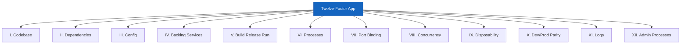
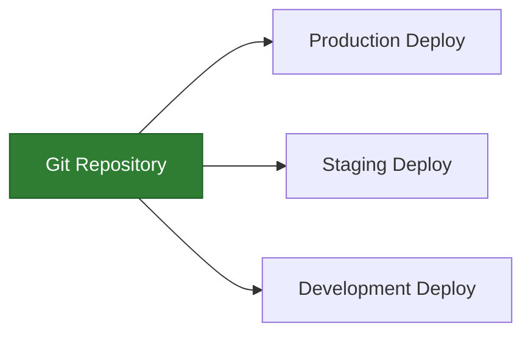
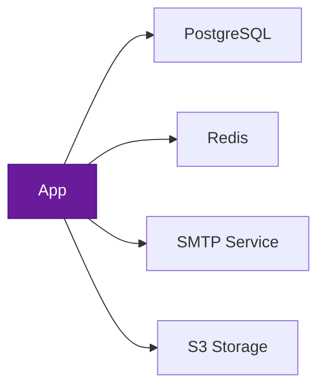
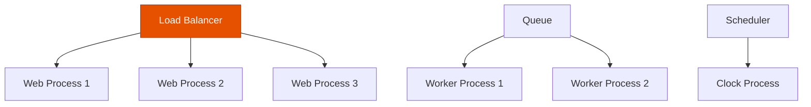

# Understanding the Twelve-Factor App Methodology

Author: [nawazdhandala](https://www.github.com/nawazdhandala)

Tags: Twelve-Factor App, Cloud Native, Best Practices, DevOps, Architecture

Description: A practical guide to the twelve-factor app methodology for building cloud-native applications that scale reliably.

---

The twelve-factor app methodology is a set of principles for building software-as-a-service applications. Originally drafted by engineers at Heroku, these principles remain the foundation of modern cloud-native development. They help you build apps that are portable, scalable, and easy to deploy.

## The Twelve Factors at a Glance



## I. Codebase - One Codebase, Many Deploys

A twelve-factor app has exactly one codebase tracked in version control, with many deploys. A deploy is a running instance of the app - production, staging, or a developer's local environment.



If you have multiple codebases, it is not an app - it is a distributed system. Each component in a distributed system should itself be a twelve-factor app.

## II. Dependencies - Explicitly Declare and Isolate

Never rely on system-wide packages. Declare all dependencies explicitly in a manifest file and use an isolation tool to ensure no implicit dependencies leak in.

```dockerfile
# Dockerfile demonstrating explicit dependency declaration
FROM python:3.12-slim

WORKDIR /app

# Copy only the dependency manifest first
# This lets Docker cache the dependency layer
COPY requirements.txt .

# Install dependencies explicitly - no system-wide packages assumed
RUN pip install --no-cache-dir -r requirements.txt

# Copy application code
COPY . .

# The app brings everything it needs
CMD ["uvicorn", "main:app", "--host", "0.0.0.0", "--port", "8000"]
```

## III. Config - Store Config in the Environment

Configuration that varies between deploys (database URLs, API keys, feature flags) must be stored in environment variables. Never hardcode config in your source code.

```python
import os

class AppConfig:
    """
    All configuration comes from environment variables.
    No hardcoded values - every deploy can differ.
    """

    # Database connection - different per environment
    DATABASE_URL: str = os.environ["DATABASE_URL"]

    # External service credentials
    REDIS_URL: str = os.environ.get("REDIS_URL", "redis://localhost:6379")

    # Feature flags and tuning parameters
    LOG_LEVEL: str = os.environ.get("LOG_LEVEL", "INFO")
    MAX_WORKERS: int = int(os.environ.get("MAX_WORKERS", "4"))

    # The app does not know or care which environment it is in
    # That distinction exists only in the config, not the code
```

## IV. Backing Services - Treat as Attached Resources

Databases, message queues, caches, and email services are all backing services. A twelve-factor app makes no distinction between local and third-party services. Swapping a local PostgreSQL for Amazon RDS should require only a config change.



## V. Build, Release, Run - Strictly Separate Stages

The codebase goes through three stages:

1. **Build** - convert code into an executable bundle
2. **Release** - combine the build with config for a specific environment
3. **Run** - launch the process in the execution environment

```yaml
# GitHub Actions pipeline showing strict stage separation
name: Deploy Pipeline

on:
  push:
    branches: [main]

jobs:
  # Stage 1: Build - produce an artifact
  build:
    runs-on: ubuntu-latest
    steps:
      - uses: actions/checkout@v4
      - name: Build Docker image
        run: docker build -t myapp:${{ github.sha }} .
      - name: Push to registry
        run: docker push myapp:${{ github.sha }}

  # Stage 2: Release - combine build artifact with environment config
  release:
    needs: build
    runs-on: ubuntu-latest
    steps:
      - name: Create release manifest
        run: |
          echo "IMAGE=myapp:${{ github.sha }}" > release.env
          echo "RELEASE_ID=${{ github.sha }}-$(date +%s)" >> release.env

  # Stage 3: Run - deploy the release
  deploy:
    needs: release
    runs-on: ubuntu-latest
    steps:
      - name: Deploy to Kubernetes
        run: kubectl set image deployment/myapp app=myapp:${{ github.sha }}
```

## VI. Processes - Execute as Stateless Processes

Twelve-factor processes are stateless and share-nothing. Any data that needs to persist must be stored in a backing service like a database.

```python
from fastapi import FastAPI
from redis import Redis

app = FastAPI()

# State lives in a backing service, not in the process
redis = Redis.from_url(os.environ["REDIS_URL"])

@app.post("/cart/{user_id}/add")
async def add_to_cart(user_id: str, item_id: str):
    """
    Cart data is stored in Redis, not in process memory.
    Any instance of this service can handle any request.
    """
    redis.sadd(f"cart:{user_id}", item_id)
    return {"status": "added"}
```

## VII. Port Binding - Export Services via Port Binding

The app is completely self-contained. It exports HTTP or other protocols by binding to a port. There is no runtime injection of a web server.

## VIII. Concurrency - Scale Out via the Process Model

Scale by running more processes, not by making a single process larger. Different process types handle different workloads.



## IX. Disposability - Fast Startup, Graceful Shutdown

Processes should start quickly and shut down gracefully. This enables elastic scaling, rapid deployments, and robust production environments.

```python
import signal
import sys

class GracefulApp:
    """
    Handles SIGTERM for graceful shutdown.
    Finishes in-flight requests before exiting.
    """
    def __init__(self):
        self.running = True
        # Register signal handler for graceful shutdown
        signal.signal(signal.SIGTERM, self._handle_sigterm)

    def _handle_sigterm(self, signum, frame):
        """Stop accepting new work and finish current tasks."""
        print("Received SIGTERM - shutting down gracefully")
        self.running = False

    def run(self):
        while self.running:
            # Process work
            self._do_work()
        # Cleanup resources before exit
        self._cleanup()
        sys.exit(0)
```

## X. Dev/Prod Parity - Keep Environments Similar

Minimize gaps between development and production. Use the same backing services, the same deployment process, and the same operating system wherever possible.

| Gap | Traditional App | Twelve-Factor App |
|-----|----------------|-------------------|
| Time | Weeks between deploys | Hours or minutes |
| Personnel | Developers write, ops deploy | Same team does both |
| Tools | SQLite locally, PostgreSQL in prod | PostgreSQL everywhere |

## XI. Logs - Treat Logs as Event Streams

A twelve-factor app never concerns itself with routing or storage of its log stream. It writes unbuffered to stdout and lets the environment handle the rest.

```python
import logging
import sys

# Configure logging to write to stdout
# The execution environment handles routing and storage
handler = logging.StreamHandler(sys.stdout)
handler.setFormatter(
    logging.Formatter("%(asctime)s %(levelname)s %(name)s %(message)s")
)

logger = logging.getLogger("myapp")
logger.addHandler(handler)
logger.setLevel(logging.INFO)

# The app just emits log events - it does not know
# whether they go to a file, a log aggregator, or /dev/null
logger.info("Order placed", extra={"order_id": "12345"})
```

## XII. Admin Processes - Run as One-Off Processes

Administrative tasks (database migrations, console sessions, one-time scripts) should run as one-off processes in an identical environment to the app's regular processes.

```bash
# Run a database migration as a one-off process
# Same image, same config, same environment - just a different command
kubectl run migration \
  --image=myapp:latest \
  --env="DATABASE_URL=$DATABASE_URL" \
  --restart=Never \
  --command -- python manage.py migrate
```

## Why It Matters Today

The twelve-factor methodology is not just theory. It directly maps to how modern platforms like Kubernetes, Docker, and serverless services work. Following these principles makes your applications naturally suited for cloud-native environments.

OneUptime is built on twelve-factor principles and helps you monitor applications that follow them. With log aggregation, health checks, and environment-aware alerting, OneUptime gives you full visibility into your cloud-native applications. Start monitoring at [https://oneuptime.com](https://oneuptime.com).
