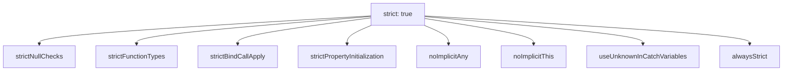
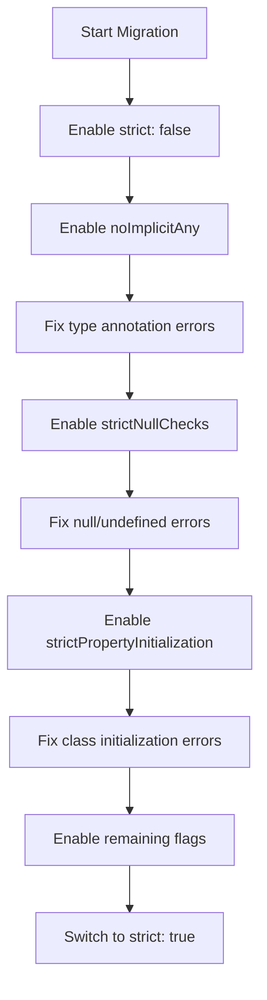

# How to Enable and Use TypeScript Strict Mode Effectively

Author: [nawazdhandala](https://www.github.com/nawazdhandala)

Tags: TypeScript, Strict Mode, Type Safety, Best Practices, Configuration

Description: Learn how to enable and leverage TypeScript strict mode for better type safety, fewer bugs, and more maintainable code.

---

TypeScript's strict mode is a collection of compiler flags that enforce stronger type checking. When enabled, it catches entire categories of bugs at compile time that would otherwise surface as runtime errors. Despite the name sounding intimidating, strict mode is the recommended configuration for all TypeScript projects, and understanding each flag helps you write safer, more predictable code.

## What Strict Mode Includes

The strict flag in tsconfig.json is a shorthand that enables multiple individual flags at once:

```json
{
    "compilerOptions": {
        "strict": true
    }
}
```

This single setting enables all of the following:



## strictNullChecks

This is the most impactful flag. Without it, null and undefined are assignable to every type, which is a major source of runtime errors:

```typescript
// WITHOUT strictNullChecks - dangerous, compiles without error
function getLength(str: string): number {
    // str could be null at runtime, causing "Cannot read property 'length' of null"
    return str.length;
}

// WITH strictNullChecks - the compiler catches the problem
function getUserName(id: string): string | null {
    // The return type explicitly says this might be null
    const user = users.find((u) => u.id === id);
    if (!user) {
        return null;
    }
    return user.name;
}

// The caller must handle the null case
const name = getUserName('abc');

// Error: Object is possibly 'null'
// console.log(name.toUpperCase());

// Correct: narrow the type first
if (name !== null) {
    console.log(name.toUpperCase()); // Safe - name is string here
}
```

## Narrowing Patterns with strictNullChecks

```typescript
// Pattern 1: If-check narrowing
function processValue(value: string | undefined): string {
    if (value === undefined) {
        return 'default';
    }
    // TypeScript knows value is string here
    return value.toUpperCase();
}

// Pattern 2: Optional chaining with nullish coalescing
interface Config {
    database?: {
        host?: string;
        port?: number;
    };
}

function getDatabaseHost(config: Config): string {
    // ?. returns undefined if any part of the chain is nullish
    // ?? provides a fallback for null or undefined
    return config.database?.host ?? 'localhost';
}

// Pattern 3: Type guard functions
function isNotNull<T>(value: T | null | undefined): value is T {
    return value !== null && value !== undefined;
}

const items: (string | null)[] = ['apple', null, 'banana', null, 'cherry'];
// filter with a type guard produces string[] instead of (string | null)[]
const validItems: string[] = items.filter(isNotNull);
```

## noImplicitAny

This flag requires you to explicitly type variables when TypeScript cannot infer the type:

```typescript
// WITHOUT noImplicitAny - parameter types default to 'any' silently
// function add(a, b) {
//     return a + b; // No type checking at all
// }

// WITH noImplicitAny - you must declare types explicitly
function add(a: number, b: number): number {
    return a + b;
}

// Array callbacks also need types when inference is not possible
const numbers = [1, 2, 3];

// OK - TypeScript infers 'n' is number from the array type
const doubled = numbers.map((n) => n * 2);

// When working with external data, use explicit types
function parseResponse(data: unknown): string[] {
    // 'unknown' forces you to validate before using the data
    if (!Array.isArray(data)) {
        throw new Error('Expected an array');
    }
    return data.map((item: unknown) => String(item));
}
```

## strictFunctionTypes

This flag enforces contravariant checking on function parameter types:

```typescript
// Define a hierarchy of types
interface Animal {
    name: string;
}

interface Dog extends Animal {
    breed: string;
}

// A function that accepts Animal
type AnimalHandler = (animal: Animal) => void;

// A function that requires Dog (a more specific type)
type DogHandler = (dog: Dog) => void;

// WITH strictFunctionTypes
const handleAnimal: AnimalHandler = (animal) => {
    console.log(animal.name);
};

const handleDog: DogHandler = (dog) => {
    console.log(dog.breed); // Accesses Dog-specific property
};

// Error: DogHandler is not assignable to AnimalHandler
// If this were allowed, calling the handler with a Cat would crash
// const handler: AnimalHandler = handleDog;

// This is safe - an AnimalHandler can be used where DogHandler is expected
// because it only uses Animal properties that Dog also has
const safeHandler: DogHandler = handleAnimal; // OK
```

## strictPropertyInitialization

Class properties must be initialized in the constructor or at declaration:

```typescript
// WITH strictPropertyInitialization

class UserService {
    // Error: Property 'db' has no initializer and is not assigned in constructor
    // private db: Database;

    // Option 1: Initialize at declaration
    private cache: Map<string, User> = new Map();

    // Option 2: Initialize in constructor
    private db: Database;

    // Option 3: Definite assignment assertion (use sparingly)
    // The ! tells TypeScript you guarantee this will be set before use
    private config!: Config;

    constructor(db: Database) {
        this.db = db;
    }

    // config is set by an init method called after construction
    async init(): Promise<void> {
        this.config = await loadConfig();
    }
}
```

## useUnknownInCatchVariables

Catch variables are typed as unknown instead of any:

```typescript
// WITH useUnknownInCatchVariables

async function fetchData(url: string): Promise<string> {
    try {
        const response = await fetch(url);
        return await response.text();
    } catch (error) {
        // 'error' is 'unknown', not 'any'
        // You must narrow the type before using it

        if (error instanceof Error) {
            // Now TypeScript knows it is an Error
            console.error(`Fetch failed: ${error.message}`);
            throw error;
        }

        // Handle non-Error throws (strings, numbers, etc.)
        console.error('Unexpected error type:', error);
        throw new Error(String(error));
    }
}
```

## A Complete Strict tsconfig.json

```json
{
    "compilerOptions": {
        "target": "ES2022",
        "module": "Node16",
        "moduleResolution": "Node16",
        "outDir": "./dist",
        "rootDir": "./src",
        "declaration": true,
        "declarationMap": true,
        "sourceMap": true,

        "strict": true,

        "noUncheckedIndexedAccess": true,
        "noUnusedLocals": true,
        "noUnusedParameters": true,
        "exactOptionalPropertyTypes": true,
        "noImplicitReturns": true,
        "noFallthroughCasesInSwitch": true,
        "forceConsistentCasingInFileNames": true,

        "esModuleInterop": true,
        "skipLibCheck": true,
        "resolveJsonModule": true
    },
    "include": ["src/**/*"],
    "exclude": ["node_modules", "dist", "**/*.test.ts"]
}
```

## noUncheckedIndexedAccess

This flag treats array and object index access as potentially undefined:

```typescript
// WITH noUncheckedIndexedAccess

const colors = ['red', 'green', 'blue'];

// Type is string | undefined, not string
const first = colors[0];

// Error: Object is possibly 'undefined'
// console.log(first.toUpperCase());

// Correct: check before using
if (first !== undefined) {
    console.log(first.toUpperCase());
}

// Also applies to Record types
const config: Record<string, string> = { host: 'localhost' };
const host = config['host']; // string | undefined

// Use a type guard or assertion after validation
function getRequiredConfig(key: string): string {
    const value = config[key];
    if (value === undefined) {
        throw new Error(`Missing required config key: ${key}`);
    }
    return value; // Type is narrowed to string
}
```

## Migrating an Existing Project



Enable flags one at a time to keep the number of errors manageable:

```json
{
    "compilerOptions": {
        "strict": false,

        "noImplicitAny": true,
        "strictNullChecks": true,
        "strictPropertyInitialization": false,
        "strictFunctionTypes": false,
        "strictBindCallApply": false,
        "useUnknownInCatchVariables": false
    }
}
```

Fix errors for each flag before enabling the next one. Once all individual flags are enabled, replace them with the single strict: true setting.

## Utility Types That Help with Strict Mode

```typescript
// NonNullable removes null and undefined from a type
type MaybeString = string | null | undefined;
type DefiniteString = NonNullable<MaybeString>; // string

// Required makes all properties non-optional
interface PartialConfig {
    host?: string;
    port?: number;
    ssl?: boolean;
}
type FullConfig = Required<PartialConfig>;
// { host: string; port: number; ssl: boolean }

// Readonly prevents mutation
interface AppState {
    users: string[];
    count: number;
}
type FrozenState = Readonly<AppState>;
// Cannot assign to 'users' or 'count' because they are read-only
```

## Conclusion

TypeScript strict mode is not an obstacle - it is a safety net. Each flag closes a specific category of potential bugs, from null reference errors to implicit any types to uninitialized properties. Enabling strict mode from the start of a project is the easiest path, but incremental migration works well for existing codebases.

If you are building TypeScript applications and want to monitor them in production, [OneUptime](https://oneuptime.com) provides application performance monitoring, error tracking, and distributed tracing that helps your team catch the runtime issues that even strict type checking cannot prevent.
