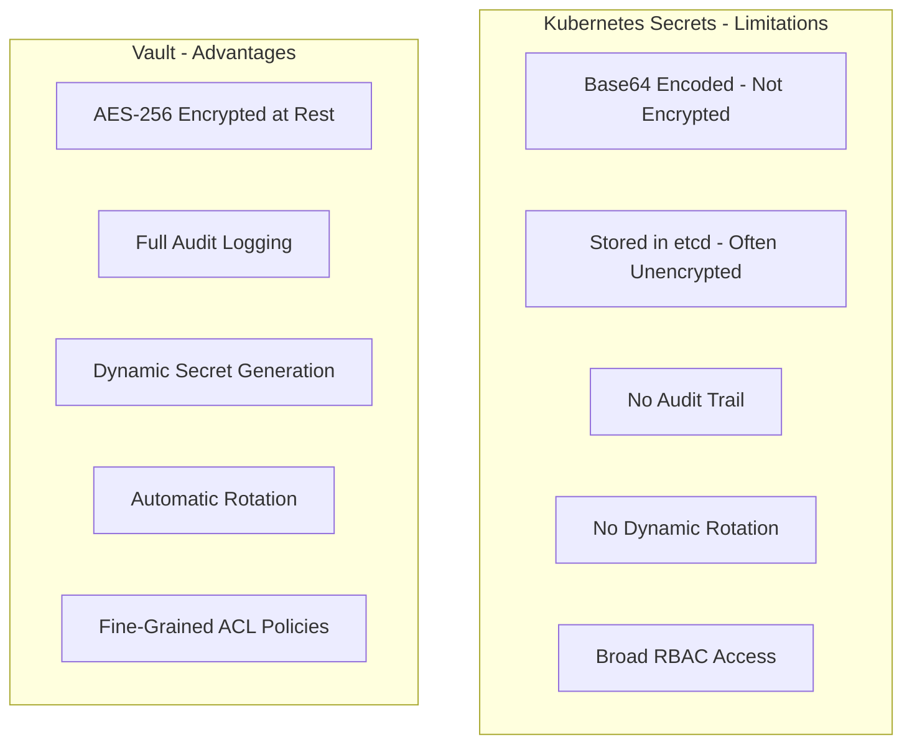
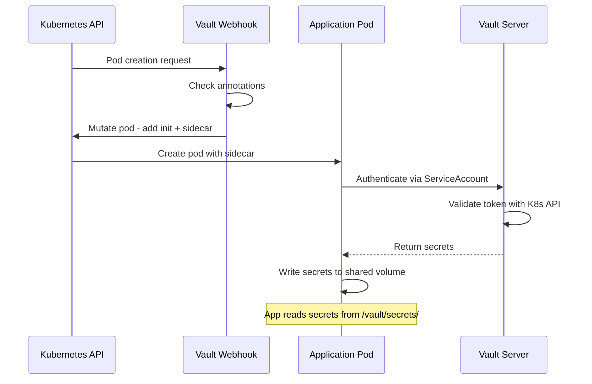
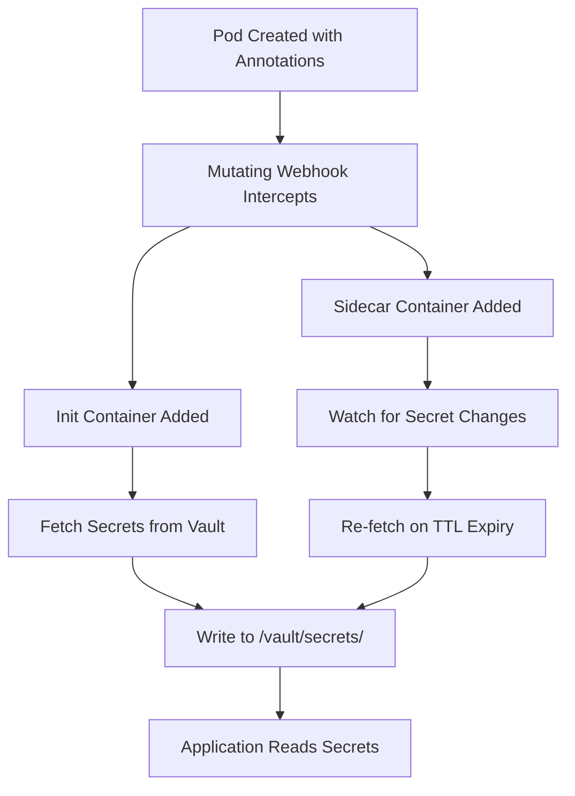

# How to Use HashiCorp Vault for Kubernetes Secrets Management

Author: [nawazdhandala](https://www.github.com/nawazdhandala)

Tags: Vault, Secrets, Kubernetes, HashiCorp, Security

Description: Learn how to use HashiCorp Vault with Kubernetes for secure secrets management using the Vault Agent Injector.

---

Kubernetes Secrets are base64-encoded by default, which is not encryption. HashiCorp Vault provides a centralized, auditable, and secure way to manage secrets. This guide shows you how to integrate Vault with Kubernetes using the Vault Agent Injector.

## Why Not Use Kubernetes Secrets Directly?

Kubernetes Secrets have several limitations that make them unsuitable for production-grade secret management.



## Architecture Overview

The Vault Agent Injector runs as a mutating admission webhook. When a pod is annotated, the injector adds a Vault Agent sidecar that fetches secrets and writes them to a shared volume.



## Installing Vault on Kubernetes

Deploy Vault using the official Helm chart.

```bash
# Add the HashiCorp Helm repository
helm repo add hashicorp https://helm.releases.hashicorp.com
helm repo update

# Install Vault in HA mode with the injector enabled
helm install vault hashicorp/vault \
  --namespace vault \
  --create-namespace \
  --values vault-values.yaml
```

```yaml
# vault-values.yaml
# Helm chart configuration for Vault.
# Enables HA mode with Raft storage and the agent injector.
server:
  # Run Vault in high-availability mode
  ha:
    enabled: true
    replicas: 3
    # Use integrated Raft storage for HA
    raft:
      enabled: true
      config: |
        ui = true

        listener "tcp" {
          tls_disable = 0
          address = "[::]:8200"
          cluster_address = "[::]:8201"
        }

        storage "raft" {
          path = "/vault/data"
        }

        service_registration "kubernetes" {}

injector:
  # Enable the Vault Agent Injector webhook
  enabled: true
  replicas: 2

ui:
  enabled: true
```

## Initializing and Unsealing Vault

After installation, Vault must be initialized and unsealed before it can serve secrets.

```bash
# Initialize Vault with 5 key shares and a threshold of 3
# This means 3 out of 5 keys are needed to unseal Vault
kubectl exec -n vault vault-0 -- vault operator init \
  -key-shares=5 \
  -key-threshold=3 \
  -format=json > vault-init.json

# Unseal Vault using 3 of the 5 keys
# Repeat this command with 3 different unseal keys
kubectl exec -n vault vault-0 -- vault operator unseal <KEY_1>
kubectl exec -n vault vault-0 -- vault operator unseal <KEY_2>
kubectl exec -n vault vault-0 -- vault operator unseal <KEY_3>
```

## Configuring Kubernetes Authentication

Enable the Kubernetes auth method so pods can authenticate with Vault using their ServiceAccount tokens.

```bash
# Enable the Kubernetes authentication method
kubectl exec -n vault vault-0 -- vault auth enable kubernetes

# Configure the auth method with the Kubernetes API details
# Vault uses this to validate ServiceAccount tokens
kubectl exec -n vault vault-0 -- vault write auth/kubernetes/config \
  kubernetes_host="https://kubernetes.default.svc:443"
```

## Creating a Secret and Policy

Store a secret in Vault and define a policy that grants read access.

```bash
# Enable the KV v2 secrets engine at the "secret" path
kubectl exec -n vault vault-0 -- vault secrets enable -path=secret kv-v2

# Store database credentials in Vault
kubectl exec -n vault vault-0 -- vault kv put secret/app/database \
  username="app_user" \
  password="s3cur3-p@ssw0rd" \
  host="postgres.production.svc" \
  port="5432"

# Create a policy file that allows reading this secret
kubectl exec -n vault vault-0 -- sh -c 'cat <<EOF > /tmp/app-policy.hcl
# app-read-policy
# Grants read-only access to the application database secret path.
path "secret/data/app/database" {
  capabilities = ["read"]
}
EOF
vault policy write app-read-policy /tmp/app-policy.hcl'
```

## Creating a Vault Role

Bind the policy to a Kubernetes ServiceAccount so pods can authenticate and retrieve secrets.

```bash
# Create a role that maps a Kubernetes ServiceAccount
# to the Vault policy defined above.
kubectl exec -n vault vault-0 -- vault write auth/kubernetes/role/app-role \
  bound_service_account_names=app-sa \
  bound_service_account_namespaces=production \
  policies=app-read-policy \
  ttl=1h
```

```yaml
# service-account.yaml
# Create the ServiceAccount that Vault will authenticate against.
apiVersion: v1
kind: ServiceAccount
metadata:
  name: app-sa
  namespace: production
```

## Injecting Secrets into Pods

Annotate your deployment so the Vault Agent Injector adds secrets as files inside the pod.

```yaml
# deployment.yaml
# The annotations tell the Vault Agent Injector
# which secrets to fetch and where to write them.
apiVersion: apps/v1
kind: Deployment
metadata:
  name: backend-api
  namespace: production
spec:
  replicas: 3
  selector:
    matchLabels:
      app: backend-api
  template:
    metadata:
      labels:
        app: backend-api
      annotations:
        # Enable Vault Agent injection for this pod
        vault.hashicorp.com/agent-inject: "true"
        # Use the Vault role we created earlier
        vault.hashicorp.com/role: "app-role"
        # Inject the database secret as a file
        vault.hashicorp.com/agent-inject-secret-db-creds: "secret/data/app/database"
        # Use a template to format the secret as env vars
        vault.hashicorp.com/agent-inject-template-db-creds: |
          {{- with secret "secret/data/app/database" -}}
          export DB_HOST={{ .Data.data.host }}
          export DB_PORT={{ .Data.data.port }}
          export DB_USER={{ .Data.data.username }}
          export DB_PASS={{ .Data.data.password }}
          {{- end }}
    spec:
      serviceAccountName: app-sa
      containers:
        - name: backend-api
          image: registry.example.com/backend:v3.1.0
          # Source the secrets file to load env vars
          command: ["/bin/sh", "-c"]
          args:
            - "source /vault/secrets/db-creds && exec ./server"
          ports:
            - containerPort: 8080
```

## How the Injection Works



## Secret Rotation

The Vault Agent sidecar continuously watches for secret changes and updates the files when secrets are rotated.

```yaml
# Add these annotations to enable automatic secret rotation.
# The agent will re-fetch secrets before the TTL expires.
metadata:
  annotations:
    vault.hashicorp.com/agent-inject: "true"
    vault.hashicorp.com/role: "app-role"
    # Cache secrets and refresh every 5 minutes
    vault.hashicorp.com/agent-cache-enable: "true"
    vault.hashicorp.com/agent-run-as-user: "1000"
    vault.hashicorp.com/agent-inject-secret-db-creds: "secret/data/app/database"
```

## Monitoring Vault Health

Vault exposes health and metrics endpoints for monitoring. Track seal status, token usage, and authentication failures.

OneUptime (https://oneuptime.com) can monitor your Vault cluster health endpoints, alert you when nodes become sealed or unreachable, and track secret access patterns through audit logs. Pairing Vault with OneUptime ensures your secrets infrastructure is always available and any anomalies are caught before they become incidents.
