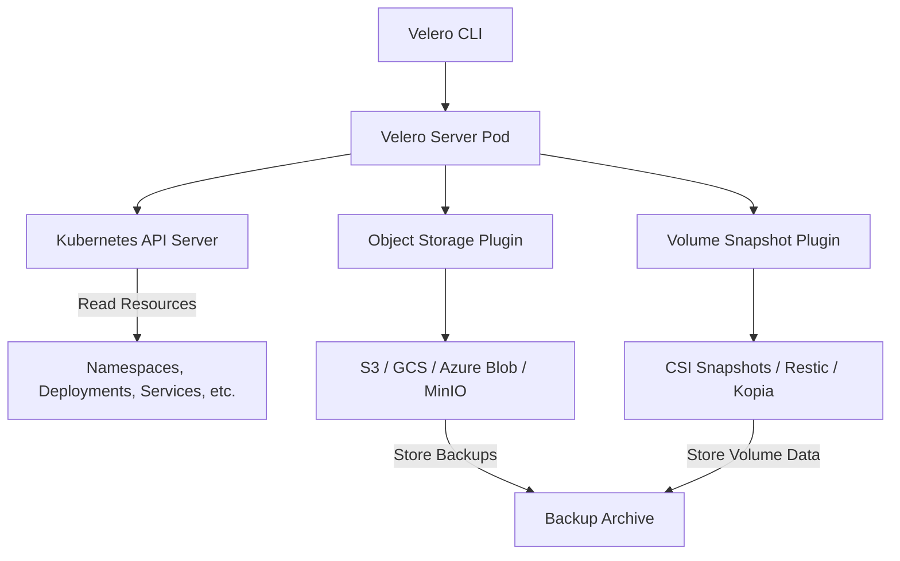
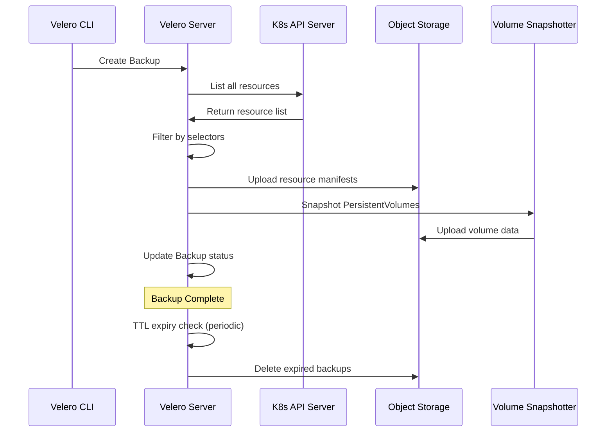
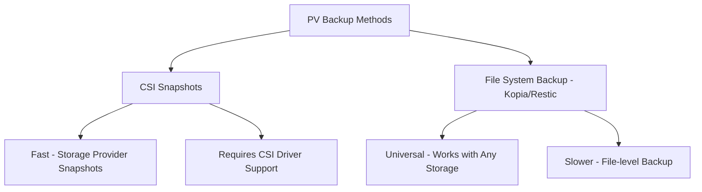
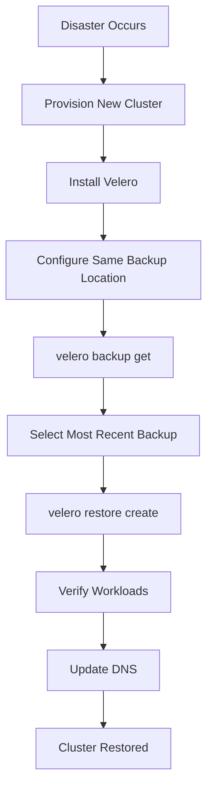

# How to Backup and Restore Kubernetes Clusters with Velero

Author: [nawazdhandala](https://www.github.com/nawazdhandala)

Tags: Velero, Kubernetes, Backup, Restore, Disaster Recovery

Description: Learn how to use Velero for Kubernetes cluster backup and restore including namespaces, resources, and persistent volumes.

---

## What is Velero?

Velero is an open-source tool for backing up and restoring Kubernetes cluster resources and persistent volumes. Originally developed by VMware (previously called Heptio Ark), Velero gives you the ability to recover from cluster failures, migrate workloads between clusters, and replicate your production environment for testing. It works with any Kubernetes distribution and supports multiple cloud providers and on-premises storage.

## How Velero Works



Velero consists of:

- A server component that runs in your cluster as a Deployment
- A CLI tool for managing backups and restores
- Plugins for different storage providers and volume snapshotters
- CRDs for defining backup schedules, restore operations, and storage locations

## Installing Velero

```bash
# Install the Velero CLI
# macOS
brew install velero

# Linux
wget https://github.com/vmware-tanzu/velero/releases/download/v1.13.0/velero-v1.13.0-linux-amd64.tar.gz
tar -xzf velero-v1.13.0-linux-amd64.tar.gz
sudo mv velero-v1.13.0-linux-amd64/velero /usr/local/bin/

# Verify the installation
velero version --client-only
```

## Setting Up Velero with S3-Compatible Storage

```bash
# Create a credentials file for S3 access
# This can be AWS S3 or any S3-compatible storage like MinIO
cat > /tmp/velero-credentials <<EOF
[default]
aws_access_key_id=your-access-key
aws_secret_access_key=your-secret-key
EOF

# Install Velero with the AWS plugin
# Using MinIO as the S3-compatible backend
velero install \
  --provider aws \
  --plugins velero/velero-plugin-for-aws:v1.9.0 \
  --bucket velero-backups \
  --secret-file /tmp/velero-credentials \
  --backup-location-config \
    region=us-east-1,s3ForcePathStyle=true,s3Url=http://minio.minio.svc:9000 \
  --snapshot-location-config region=us-east-1 \
  --use-node-agent \
  --default-volumes-to-fs-backup

# Wait for Velero to be ready
kubectl get pods -n velero

# Clean up the credentials file
rm /tmp/velero-credentials
```

## Creating a Manual Backup

```bash
# Backup the entire cluster
# This captures all namespaces and resources
velero backup create full-cluster-backup

# Backup a specific namespace
velero backup create app-backup \
  --include-namespaces production

# Backup multiple namespaces
velero backup create multi-ns-backup \
  --include-namespaces production,staging

# Backup specific resource types
velero backup create deployments-backup \
  --include-resources deployments,services,configmaps

# Backup with label selector
velero backup create labeled-backup \
  --selector app=critical

# Exclude specific resources from backup
velero backup create partial-backup \
  --exclude-resources events,endpoints

# Check backup status
velero backup describe full-cluster-backup

# List all backups
velero backup get
```

## Scheduled Backups

```bash
# Create a daily backup schedule
# Runs at 2 AM UTC every day, keeps backups for 72 hours
velero schedule create daily-backup \
  --schedule="0 2 * * *" \
  --ttl 72h0m0s

# Create a weekly full backup
# Runs every Sunday at midnight, keeps backups for 30 days
velero schedule create weekly-full \
  --schedule="0 0 * * 0" \
  --ttl 720h0m0s

# Create a namespace-specific schedule
velero schedule create production-daily \
  --schedule="0 1 * * *" \
  --include-namespaces production \
  --ttl 168h0m0s

# List all schedules
velero schedule get

# View details of a schedule
velero schedule describe daily-backup
```

## Backup Lifecycle



## Restoring from a Backup

```bash
# Restore the entire backup
velero restore create --from-backup full-cluster-backup

# Restore a specific namespace
velero restore create --from-backup full-cluster-backup \
  --include-namespaces production

# Restore specific resources only
velero restore create --from-backup full-cluster-backup \
  --include-resources deployments,services

# Restore to a different namespace (namespace mapping)
velero restore create --from-backup full-cluster-backup \
  --namespace-mappings production:production-restored

# Restore without overwriting existing resources
# By default, Velero skips existing resources
velero restore create --from-backup full-cluster-backup \
  --existing-resource-policy none

# Check restore status
velero restore describe <restore-name>

# List all restores
velero restore get

# View restore logs for debugging
velero restore logs <restore-name>
```

## Backing Up Persistent Volumes

Velero supports two methods for backing up persistent volume data:



```yaml
# To opt specific volumes into file-system backup, annotate the pod
apiVersion: v1
kind: Pod
metadata:
  name: app
  annotations:
    # Tell Velero to backup this volume using file-system backup
    backup.velero.io/backup-volumes: data,config
spec:
  containers:
    - name: app
      image: nginx:latest
      volumeMounts:
        - name: data
          mountPath: /data
        - name: config
          mountPath: /config
  volumes:
    - name: data
      persistentVolumeClaim:
        claimName: app-data
    - name: config
      persistentVolumeClaim:
        claimName: app-config
```

## Backup Storage Locations

```yaml
# backup-storage-location.yaml
# Define a primary and secondary backup storage location
apiVersion: velero.io/v1
kind: BackupStorageLocation
metadata:
  name: primary
  namespace: velero
spec:
  provider: aws
  default: true                            # Make this the default location
  objectStorage:
    bucket: velero-backups-primary
    prefix: cluster-01                     # Prefix for this cluster's backups
  config:
    region: us-east-1
    s3ForcePathStyle: "true"
    s3Url: http://minio.minio.svc:9000
  credential:
    name: velero-credentials
    key: cloud
---
# Secondary location for cross-region disaster recovery
apiVersion: velero.io/v1
kind: BackupStorageLocation
metadata:
  name: secondary
  namespace: velero
spec:
  provider: aws
  objectStorage:
    bucket: velero-backups-secondary
    prefix: cluster-01
  config:
    region: eu-west-1
    s3ForcePathStyle: "true"
    s3Url: http://minio-dr.minio.svc:9000
  credential:
    name: velero-credentials-dr
    key: cloud
```

## Cluster Migration

```bash
# Step 1: Create a backup on the source cluster
velero backup create migration-backup \
  --include-namespaces production \
  --default-volumes-to-fs-backup

# Step 2: Wait for the backup to complete
velero backup describe migration-backup --details

# Step 3: On the destination cluster, configure Velero
# with the same backup storage location

# Step 4: Restore on the destination cluster
velero restore create --from-backup migration-backup

# Step 5: Verify the restore
kubectl get all -n production
```

## Troubleshooting

```bash
# Check Velero server logs
kubectl logs -n velero deploy/velero -f

# Check node agent logs (for file-system backups)
kubectl logs -n velero daemonset/node-agent -f

# Describe a failed backup for error details
velero backup describe failed-backup --details

# View backup logs
velero backup logs failed-backup

# Check backup storage location availability
velero backup-location get

# Validate the backup storage connection
kubectl -n velero get backupstoragelocations -o json | \
  jq '.items[] | {name: .metadata.name, phase: .status.phase, lastSync: .status.lastSyncedTime}'

# Delete a corrupted backup
velero backup delete corrupted-backup
```

## Disaster Recovery Workflow



## Best Practices

- Schedule backups at least daily for production namespaces.
- Test restores regularly. A backup you have never tested is not a backup.
- Use separate backup storage locations for different environments.
- Set appropriate TTLs to manage storage costs.
- Use namespace labels to group related resources for targeted backups.
- Always backup before cluster upgrades or major changes.
- Store backup credentials in a secure secret management system.

## Monitoring with OneUptime

Backup reliability is non-negotiable for production systems. OneUptime (https://oneuptime.com) monitors your Velero backup jobs and alerts you when backups fail, are delayed, or when backup storage becomes unreachable. By tracking backup success rates and storage location health through OneUptime, you can be confident that your disaster recovery plan will work when you need it most.
