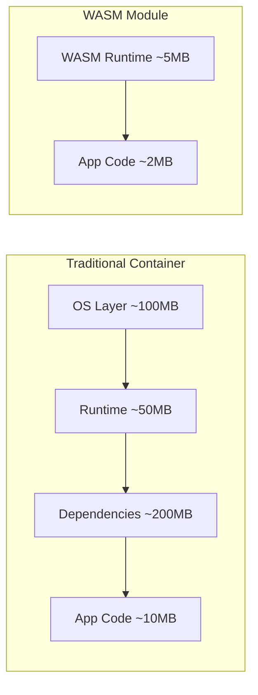
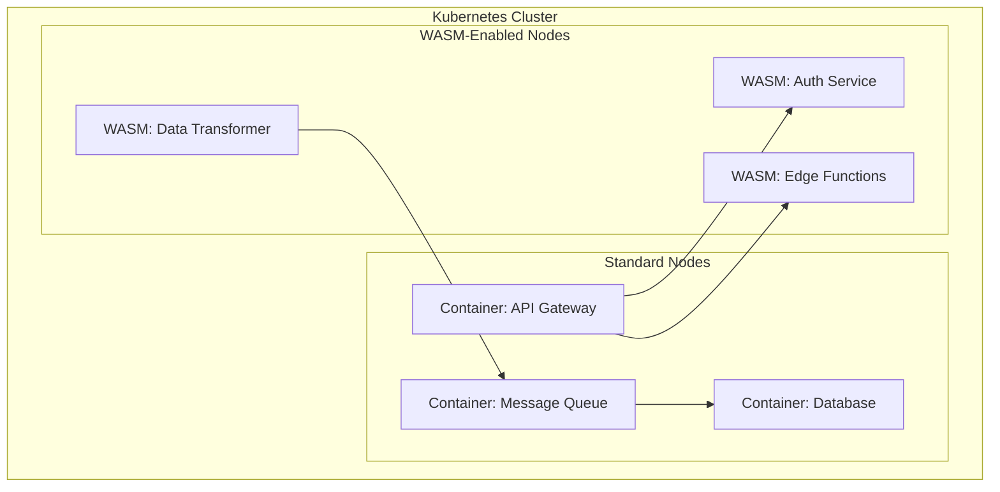

# How to Run WebAssembly Workloads on Kubernetes

Author: [nawazdhandala](https://www.github.com/nawazdhandala)

Tags: WebAssembly, WASM, Kubernetes, Edge, Cloud Native

Description: Learn how to run WebAssembly workloads on Kubernetes using SpinKube and other WASM runtimes for lightweight containers.

---

WebAssembly (WASM) is expanding beyond the browser into server-side and cloud-native environments. WASM modules start in milliseconds, use a fraction of the memory of traditional containers, and provide strong sandboxing by default. Running WASM workloads on Kubernetes lets you combine the ecosystem and orchestration capabilities of Kubernetes with the efficiency of WebAssembly.

This guide covers how to run WASM workloads on Kubernetes using SpinKube, runwasi, and other tools.

## Why WASM on Kubernetes



WASM modules are typically 10-100x smaller than equivalent container images. They start in under 1 millisecond compared to seconds for containers. They also run in a sandboxed environment with no access to the host filesystem or network unless explicitly granted.

## Step 1: Install a WASM Runtime on Kubernetes

SpinKube is the most mature solution for running WASM workloads on Kubernetes. It consists of the containerd-shim-spin runtime and the SpinKube operator.

```bash
# Install cert-manager (required by SpinKube)
kubectl apply -f https://github.com/cert-manager/cert-manager/releases/download/v1.14.0/cert-manager.yaml
kubectl wait --for=condition=Available --timeout=300s deployment/cert-manager -n cert-manager

# Install the SpinKube operator
kubectl apply -f https://github.com/spinkube/spin-operator/releases/download/v0.4.0/spin-operator.crds.yaml
kubectl apply -f https://github.com/spinkube/spin-operator/releases/download/v0.4.0/spin-operator.runtime-class.yaml
kubectl apply -f https://github.com/spinkube/spin-operator/releases/download/v0.4.0/spin-operator.shim-executor.yaml

helm install spin-operator \
  --namespace spin-operator \
  --create-namespace \
  --version 0.4.0 \
  --wait \
  oci://ghcr.io/spinkube/charts/spin-operator

# Verify the installation
kubectl get runtimeclass
# You should see "wasmtime-spin-v2" in the list
```

## Step 2: Build a WASM Application with Spin

```bash
# Install the Spin CLI
curl -fsSL https://developer.fermyon.com/downloads/install.sh | bash
sudo mv spin /usr/local/bin/

# Create a new Spin application
spin new -t http-rust my-wasm-api
cd my-wasm-api
```

```rust
// src/lib.rs
// A simple HTTP handler compiled to WebAssembly
use spin_sdk::http::{IntoResponse, Request, Response};
use spin_sdk::http_component;

/// Handle incoming HTTP requests
/// This function is compiled to WASM and runs inside the Spin runtime
#[http_component]
fn handle_request(req: Request) -> anyhow::Result<impl IntoResponse> {
    // Log the incoming request path
    println!("Received request: {} {}", req.method(), req.path());

    // Route based on the request path
    match req.path() {
        // Health check endpoint for Kubernetes probes
        "/health" => Ok(Response::builder()
            .status(200)
            .header("content-type", "application/json")
            .body(r#"{"status": "healthy"}"#)
            .build()),

        // Main API endpoint
        "/api/hello" => {
            let name = req
                .query()
                .split('&')
                .find_map(|param| {
                    let mut parts = param.splitn(2, '=');
                    if parts.next() == Some("name") {
                        parts.next()
                    } else {
                        None
                    }
                })
                .unwrap_or("World");

            let body = format!(r#"{{"message": "Hello, {}!"}}"#, name);

            Ok(Response::builder()
                .status(200)
                .header("content-type", "application/json")
                .body(body)
                .build())
        }

        // 404 for unknown paths
        _ => Ok(Response::builder()
            .status(404)
            .header("content-type", "application/json")
            .body(r#"{"error": "Not found"}"#)
            .build()),
    }
}
```

```toml
# spin.toml
# Spin application manifest
spin_manifest_version = 2

[application]
name = "my-wasm-api"
version = "1.0.0"
description = "A sample WASM API running on Kubernetes"

[[trigger.http]]
route = "/..."
component = "my-wasm-api"

[component.my-wasm-api]
source = "target/wasm32-wasip1/release/my_wasm_api.wasm"
allowed_outbound_hosts = []
[component.my-wasm-api.build]
command = "cargo build --target wasm32-wasip1 --release"
```

```bash
# Build the WASM module
spin build

# Push the application to an OCI registry
spin registry push my-registry.com/my-wasm-api:v1
```

## Step 3: Deploy on Kubernetes with SpinKube

```yaml
# spin-app.yaml
# Deploy the WASM application on Kubernetes using SpinKube
apiVersion: core.spinkube.dev/v1alpha1
kind: SpinApp
metadata:
  name: my-wasm-api
  namespace: wasm-apps
spec:
  # Reference the OCI image containing the WASM module
  image: "my-registry.com/my-wasm-api:v1"
  # Number of replicas to run
  replicas: 3
  # Use the Spin executor installed earlier
  executor: containerd-shim-spin
  # Resource requirements (much smaller than containers)
  resources:
    limits:
      cpu: 100m
      memory: 64Mi
    requests:
      cpu: 50m
      memory: 32Mi
  # Readiness probe configuration
  readinessProbe:
    httpGet:
      path: /health
      port: 80
    initialDelaySeconds: 1
    periodSeconds: 5
```

```bash
# Apply the deployment
kubectl create namespace wasm-apps
kubectl apply -f spin-app.yaml

# Verify the pods are running
kubectl get pods -n wasm-apps

# Expose the service
kubectl expose spinapp my-wasm-api \
  --namespace wasm-apps \
  --port 80 \
  --type LoadBalancer
```

## WASM vs Container Startup Comparison

```mermaid
gantt
    title Startup Time Comparison
    dateFormat X
    axisFormat %L ms

    section Traditional Container
    Pull Image       :0, 3000
    Start Runtime    :3000, 4000
    App Ready        :4000, 5000

    section WASM Module
    Pull Module      :0, 100
    Start Runtime    :100, 101
    App Ready        :101, 102
```



## Step 4: Run WASM with containerd and runwasi

If you prefer a lower-level approach without SpinKube, you can use runwasi directly with containerd.

```bash
# Install the containerd WASM shims
# These enable containerd to run WASM modules directly

# For wasmtime runtime
curl -fsSL https://github.com/containerd/runwasi/releases/download/containerd-shim-wasmtime-v0.5.0/containerd-shim-wasmtime-v1-linux-amd64.tar.gz | \
  sudo tar -xzf - -C /usr/local/bin/

# Configure containerd to use the WASM shim
cat <<EOF | sudo tee -a /etc/containerd/config.toml

[plugins."io.containerd.grpc.v1.cri".containerd.runtimes.wasmtime]
  runtime_type = "io.containerd.wasmtime.v1"
EOF

# Restart containerd to pick up the new runtime
sudo systemctl restart containerd
```

```yaml
# runtime-class.yaml
# Register the WASM runtime as a Kubernetes RuntimeClass
apiVersion: node.k8s.io/v1
kind: RuntimeClass
metadata:
  name: wasmtime
handler: wasmtime
scheduling:
  nodeSelector:
    kubernetes.io/arch: amd64
```

```yaml
# wasm-pod.yaml
# Run a WASM module directly as a Kubernetes pod
apiVersion: v1
kind: Pod
metadata:
  name: wasm-hello
  namespace: wasm-apps
spec:
  # Use the wasmtime RuntimeClass
  runtimeClassName: wasmtime
  containers:
    - name: hello
      # OCI image containing the WASM module
      image: ghcr.io/example/hello-wasm:latest
      resources:
        limits:
          cpu: 50m
          memory: 32Mi
```

## Step 5: WASM for Edge Computing

WASM is particularly powerful at the edge where resources are constrained and fast startup matters.

```yaml
# edge-deployment.yaml
# Deploy WASM workloads to edge nodes with specific tolerations
apiVersion: core.spinkube.dev/v1alpha1
kind: SpinApp
metadata:
  name: edge-processor
  namespace: edge-apps
spec:
  image: "my-registry.com/edge-processor:v1"
  replicas: 1
  executor: containerd-shim-spin
  resources:
    limits:
      cpu: 50m
      memory: 16Mi
    requests:
      cpu: 10m
      memory: 8Mi
  # Schedule on edge nodes
  nodeSelector:
    node-role: edge
  tolerations:
    - key: "edge"
      operator: "Exists"
      effect: "NoSchedule"
```

## Architecture: Mixed WASM and Container Workloads



## When to Use WASM on Kubernetes

WASM on Kubernetes works best for stateless HTTP handlers, edge computing workloads, serverless functions that need fast cold starts, and lightweight data processing tasks. It is not yet ideal for workloads that need heavy filesystem access, long-running background processes, or GPU acceleration.

## Monitoring WASM Workloads

WASM workloads still need monitoring, even though they are lightweight. [OneUptime](https://oneuptime.com) lets you monitor the health and performance of your WASM applications alongside your traditional container workloads. Set up HTTP monitors for your WASM service endpoints, track response times and error rates, and use OneUptime's alerting to get notified when something goes wrong. Since WASM workloads can scale rapidly, having centralized monitoring through OneUptime ensures you maintain visibility across your entire fleet regardless of whether services run as containers or WASM modules.
