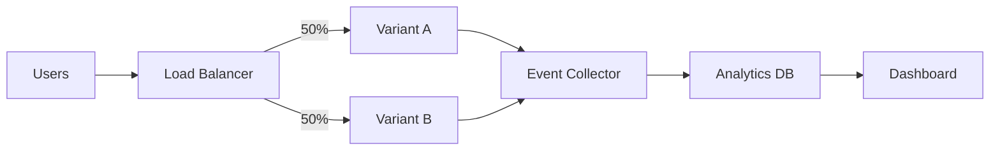

# How to Use Ansible for A/B Testing Infrastructure

Author: [nawazdhandala](https://www.github.com/nawazdhandala)

Tags: Ansible, A/B Testing, DevOps, Infrastructure

Description: Set up and manage A/B testing infrastructure with Ansible including traffic splitting, experiment tracking, and results collection pipelines.

---

A/B testing requires careful infrastructure setup. You need to split traffic between variants, track user assignments, collect metrics, and analyze results. While the statistical analysis happens in your application or analytics platform, the underlying infrastructure that makes it all work can be automated with Ansible.

This guide covers setting up A/B testing infrastructure using Ansible, from traffic splitting at the load balancer level to metrics collection pipelines.

## A/B Testing Architecture

A typical A/B testing setup involves several components:



Ansible can configure each of these components.

## Traffic Splitting with Nginx

The load balancer handles splitting traffic between variants. Here is an Ansible role that configures Nginx for A/B testing:

```yaml
# roles/ab_testing_nginx/tasks/main.yml
# Configure Nginx for A/B traffic splitting
---
- name: Deploy A/B testing Nginx configuration
  ansible.builtin.template:
    src: ab_testing.conf.j2
    dest: /etc/nginx/conf.d/ab_testing.conf
    mode: '0644'
  notify: reload nginx

- name: Deploy upstream configurations
  ansible.builtin.template:
    src: ab_upstreams.conf.j2
    dest: /etc/nginx/conf.d/ab_upstreams.conf
    mode: '0644'
  notify: reload nginx
```

```nginx
# roles/ab_testing_nginx/templates/ab_testing.conf.j2
# Nginx A/B testing configuration with sticky sessions

# Map to assign users to groups based on cookie
map $cookie_ab_group $ab_variant {
    default     "{{ ab_default_variant | default('a') }}";

    "{{ experiment.name }}_a"  "a";
    "{{ experiment.name }}_b"  "b";

}

# Split traffic based on a hash of the client IP for new visitors
split_clients "${remote_addr}${uri}" $ab_split {

    {{ experiment.variant_a_weight | default(50) }}%  a;
    *                                                   b;

}

server {
    listen 80;
    server_name {{ server_name }};


    # Experiment: {{ experiment.name }}
    location {{ experiment.path }} {
        # Set cookie if not already assigned
        if ($cookie_ab_group = "") {
            add_header Set-Cookie "ab_group={{ experiment.name }}_${ab_split};Path=/;Max-Age=2592000";
        }

        # Route to appropriate variant
        if ($ab_variant = "a") {
            proxy_pass http://{{ experiment.name }}_variant_a;
        }
        if ($ab_variant = "b") {
            proxy_pass http://{{ experiment.name }}_variant_b;
        }

        # Pass experiment info to backend
        proxy_set_header X-AB-Experiment {{ experiment.name }};
        proxy_set_header X-AB-Variant $ab_variant;
    }

}
```

```nginx
# roles/ab_testing_nginx/templates/ab_upstreams.conf.j2
# Upstream definitions for A/B test variants

upstream {{ experiment.name }}_variant_a {

    server {{ server }};

}

upstream {{ experiment.name }}_variant_b {

    server {{ server }};

}

```

## Defining Experiments as Variables

```yaml
# group_vars/all/ab_experiments.yml
# Active A/B experiments
ab_experiments:
  - name: checkout_redesign
    path: /checkout
    variant_a_weight: 50
    variant_a_servers:
      - 10.0.1.10:8080
      - 10.0.1.11:8080
    variant_b_servers:
      - 10.0.1.20:8080
      - 10.0.1.21:8080
    start_date: "2026-02-01"
    end_date: "2026-03-01"
    success_metric: conversion_rate

  - name: search_algorithm
    path: /search
    variant_a_weight: 70
    variant_a_servers:
      - 10.0.2.10:8080
    variant_b_servers:
      - 10.0.2.20:8080
    start_date: "2026-02-15"
    end_date: "2026-03-15"
    success_metric: click_through_rate
```

## Setting Up the Event Collection Pipeline

A/B tests need event data to measure results. Set up an event collection service:

```yaml
# roles/ab_event_collector/tasks/main.yml
# Deploy event collection service for A/B test metrics
---
- name: Deploy event collector Docker stack
  community.docker.docker_compose_v2:
    project_src: "{{ app_dir }}/event-collector"
    state: present
  vars:
    app_dir: /opt/ab-testing

- name: Deploy event collector compose file
  ansible.builtin.template:
    src: docker-compose.yml.j2
    dest: /opt/ab-testing/event-collector/docker-compose.yml
    mode: '0644'
```

```yaml
# roles/ab_event_collector/templates/docker-compose.yml.j2
# Event collection stack for A/B test data
version: "3.8"
services:
  collector:
    image: clickhouse/clickhouse-server:latest
    ports:
      - "8123:8123"
      - "9000:9000"
    volumes:
      - clickhouse_data:/var/lib/clickhouse
      - ./init-scripts:/docker-entrypoint-initdb.d
    environment:
      CLICKHOUSE_USER: {{ ab_db_user }}
      CLICKHOUSE_PASSWORD: {{ ab_db_password }}
      CLICKHOUSE_DB: ab_testing

  kafka:
    image: confluentinc/cp-kafka:7.5.0
    ports:
      - "9092:9092"
    environment:
      KAFKA_BROKER_ID: 1
      KAFKA_ZOOKEEPER_CONNECT: zookeeper:2181
      KAFKA_ADVERTISED_LISTENERS: PLAINTEXT://{{ inventory_hostname }}:9092

  zookeeper:
    image: confluentinc/cp-zookeeper:7.5.0
    environment:
      ZOOKEEPER_CLIENT_PORT: 2181

volumes:
  clickhouse_data:
```

## Database Schema for Experiment Tracking

```yaml
# roles/ab_event_collector/tasks/schema.yml
# Create ClickHouse tables for experiment data
---
- name: Create experiments table
  ansible.builtin.uri:
    url: "http://{{ clickhouse_host }}:8123/"
    method: POST
    body: |
      CREATE TABLE IF NOT EXISTS ab_testing.experiments (
        experiment_name String,
        variant String,
        user_id String,
        event_type String,
        event_value Float64,
        timestamp DateTime DEFAULT now(),
        session_id String,
        user_agent String,
        ip_address String
      ) ENGINE = MergeTree()
      ORDER BY (experiment_name, timestamp)
      TTL timestamp + INTERVAL {{ experiment_data_retention_days | default(90) }} DAY;
    user: "{{ ab_db_user }}"
    password: "{{ ab_db_password }}"
    status_code: 200

- name: Create materialized view for daily aggregates
  ansible.builtin.uri:
    url: "http://{{ clickhouse_host }}:8123/"
    method: POST
    body: |
      CREATE MATERIALIZED VIEW IF NOT EXISTS ab_testing.daily_metrics
      ENGINE = SummingMergeTree()
      ORDER BY (experiment_name, variant, event_date, event_type)
      AS SELECT
        experiment_name,
        variant,
        toDate(timestamp) as event_date,
        event_type,
        count() as event_count,
        sum(event_value) as total_value,
        uniqExact(user_id) as unique_users
      FROM ab_testing.experiments
      GROUP BY experiment_name, variant, event_date, event_type;
    user: "{{ ab_db_user }}"
    password: "{{ ab_db_password }}"
    status_code: 200
```

## Deploying Variant-Specific Application Code

Each variant might run a different version of your application:

```yaml
# playbooks/deploy-ab-variant.yml
# Deploy a specific variant for an A/B test
---
- name: Deploy A/B test variant
  hosts: "{{ target_hosts }}"
  become: true
  vars:
    variant: "{{ ab_variant }}"
    experiment: "{{ ab_experiment }}"

  tasks:
    - name: Deploy variant application
      ansible.builtin.include_role:
        name: app_deploy
      vars:
        app_version: "{{ variant_version }}"
        app_config_overrides:
          AB_EXPERIMENT: "{{ experiment }}"
          AB_VARIANT: "{{ variant }}"
          EVENT_COLLECTOR_URL: "http://{{ event_collector_host }}:8123"

    - name: Verify variant deployment
      ansible.builtin.uri:
        url: "http://localhost:{{ app_port }}/health"
        status_code: 200
        return_content: true
      register: health_check

    - name: Verify variant identifier in response
      ansible.builtin.assert:
        that:
          - "variant in health_check.content"
        fail_msg: "Variant {{ variant }} not properly deployed"
```

## Experiment Lifecycle Management

```yaml
# playbooks/manage-experiment.yml
# Start, stop, or graduate an A/B experiment
---
- name: Manage A/B experiment lifecycle
  hosts: loadbalancers
  become: true

  tasks:
    - name: Start experiment
      ansible.builtin.include_tasks: tasks/start-experiment.yml
      when: experiment_action == "start"

    - name: Stop experiment and route all traffic to winner
      ansible.builtin.include_tasks: tasks/stop-experiment.yml
      when: experiment_action == "stop"

    - name: Graduate winner to full production
      ansible.builtin.include_tasks: tasks/graduate-experiment.yml
      when: experiment_action == "graduate"
```

```yaml
# tasks/stop-experiment.yml
# Route all traffic to the winning variant
---
- name: Update traffic split to 100% winner
  ansible.builtin.template:
    src: ab_winner.conf.j2
    dest: "/etc/nginx/conf.d/{{ experiment_name }}_override.conf"
    mode: '0644'
  vars:
    winner_variant: "{{ winning_variant }}"
  notify: reload nginx

- name: Log experiment conclusion
  ansible.builtin.uri:
    url: "http://{{ event_collector_host }}:8123/"
    method: POST
    body: |
      INSERT INTO ab_testing.experiment_results
      (experiment_name, winner, concluded_at, notes)
      VALUES ('{{ experiment_name }}', '{{ winning_variant }}', now(), '{{ conclusion_notes | default("") }}');
    status_code: 200
```

## Key Takeaways

A/B testing infrastructure involves traffic splitting, event collection, and experiment management. Ansible handles all of these by configuring load balancers for traffic splitting, deploying event collection services, managing database schemas for metrics, and automating the experiment lifecycle. Define experiments as variables in your inventory so they are version controlled and environment specific. Use the playbook pattern for starting, stopping, and graduating experiments so the process is repeatable and auditable.
