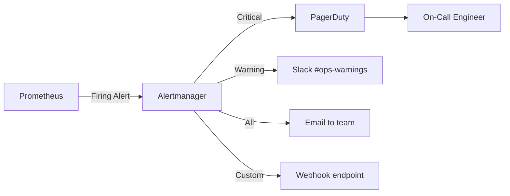

# How to Use Ansible to Configure Alert Notifications

Author: [nawazdhandala](https://www.github.com/nawazdhandala)

Tags: Ansible, Alerting, Monitoring, DevOps, Prometheus

Description: Automate alert notification setup across Slack, email, PagerDuty, and webhooks using Ansible with Prometheus Alertmanager.

---

Monitoring without alerting is just data collection. The real value comes when your systems tell you something is wrong before your users do. Setting up alert notifications manually is tedious, especially when you have multiple environments and notification channels. Ansible takes the pain out of this by letting you define your alerting configuration as code and deploy it consistently.

In this post, I will walk through configuring alert notifications using Ansible. We will set up Prometheus Alertmanager with multiple notification channels including Slack, email, PagerDuty, and custom webhooks. You will also see how to implement smart routing so critical alerts go to on-call engineers while warnings land in a Slack channel.

## Alert Flow Architecture



Prometheus evaluates alerting rules and sends firing alerts to Alertmanager. Alertmanager then routes each alert to the right channel based on severity, team, or any other label.

## Project Structure

```bash
alert-notifications/
  inventory/
    hosts.ini
  group_vars/
    all.yml
    production.yml
    staging.yml
  roles/
    alertmanager/
      tasks/main.yml
      templates/alertmanager.yml.j2
      handlers/main.yml
      defaults/main.yml
    prometheus-rules/
      tasks/main.yml
      templates/alerts/
  site.yml
```

## Variables for Alert Configuration

Define notification channels and routing rules as Ansible variables. This makes it easy to have different configurations per environment.

```yaml
# group_vars/all.yml
alertmanager_version: "0.27.0"
alertmanager_port: 9093
alertmanager_resolve_timeout: 5m

# Notification channels
alert_slack_api_url: "{{ vault_slack_webhook }}"
alert_slack_channel_critical: "#ops-critical"
alert_slack_channel_warnings: "#ops-warnings"

alert_email_smarthost: "smtp.company.com:587"
alert_email_from: "alerts@company.com"
alert_email_to: "oncall-team@company.com"
alert_email_auth_username: "{{ vault_smtp_username }}"
alert_email_auth_password: "{{ vault_smtp_password }}"

alert_pagerduty_service_key: "{{ vault_pagerduty_key }}"

alert_webhook_url: "https://hooks.internal.company.com/alerts"

# Routing configuration
alert_group_wait: 30s
alert_group_interval: 5m
alert_repeat_interval_critical: 1h
alert_repeat_interval_warning: 4h
```

For production, override with stricter settings.

```yaml
# group_vars/production.yml
alert_repeat_interval_critical: 30m
alert_group_wait: 15s
```

## Alertmanager Role

The main tasks install and configure Alertmanager.

```yaml
# roles/alertmanager/tasks/main.yml
---
- name: Create alertmanager system user
  ansible.builtin.user:
    name: alertmanager
    system: yes
    shell: /usr/sbin/nologin
    create_home: no

- name: Create required directories
  ansible.builtin.file:
    path: "{{ item }}"
    state: directory
    owner: alertmanager
    group: alertmanager
    mode: '0755'
  loop:
    - /etc/alertmanager
    - /etc/alertmanager/templates
    - /var/lib/alertmanager

- name: Download Alertmanager
  ansible.builtin.get_url:
    url: "https://github.com/prometheus/alertmanager/releases/download/v{{ alertmanager_version }}/alertmanager-{{ alertmanager_version }}.linux-amd64.tar.gz"
    dest: /tmp/alertmanager.tar.gz

- name: Extract Alertmanager binaries
  ansible.builtin.unarchive:
    src: /tmp/alertmanager.tar.gz
    dest: /tmp/
    remote_src: yes

- name: Install Alertmanager binaries
  ansible.builtin.copy:
    src: "/tmp/alertmanager-{{ alertmanager_version }}.linux-amd64/{{ item }}"
    dest: "/usr/local/bin/{{ item }}"
    remote_src: yes
    owner: root
    group: root
    mode: '0755'
  loop:
    - alertmanager
    - amtool

- name: Deploy Alertmanager configuration
  ansible.builtin.template:
    src: alertmanager.yml.j2
    dest: /etc/alertmanager/alertmanager.yml
    owner: alertmanager
    group: alertmanager
    mode: '0640'
  notify: Restart Alertmanager

- name: Deploy notification templates
  ansible.builtin.template:
    src: notification.tmpl.j2
    dest: /etc/alertmanager/templates/notification.tmpl
    owner: alertmanager
    group: alertmanager
    mode: '0644'
  notify: Restart Alertmanager

- name: Deploy systemd unit
  ansible.builtin.template:
    src: alertmanager.service.j2
    dest: /etc/systemd/system/alertmanager.service
    mode: '0644'
  notify:
    - Reload systemd
    - Restart Alertmanager

- name: Validate configuration
  ansible.builtin.command:
    cmd: /usr/local/bin/amtool check-config /etc/alertmanager/alertmanager.yml
  changed_when: false

- name: Start and enable Alertmanager
  ansible.builtin.service:
    name: alertmanager
    state: started
    enabled: yes
```

## Alertmanager Configuration Template

This is where the routing magic happens. Alerts get directed to different channels based on their labels.

```jinja2
# roles/alertmanager/templates/alertmanager.yml.j2
# Alertmanager configuration - Managed by Ansible
global:
  resolve_timeout: {{ alertmanager_resolve_timeout }}
  smtp_smarthost: '{{ alert_email_smarthost }}'
  smtp_from: '{{ alert_email_from }}'
  smtp_auth_username: '{{ alert_email_auth_username }}'
  smtp_auth_password: '{{ alert_email_auth_password }}'
  smtp_require_tls: true

  pagerduty_url: 'https://events.pagerduty.com/v2/enqueue'


# Load custom notification templates
templates:
  - '/etc/alertmanager/templates/*.tmpl'

# Route tree for alert routing
route:
  group_by: ['alertname', 'cluster', 'service']
  group_wait: {{ alert_group_wait }}
  group_interval: {{ alert_group_interval }}
  repeat_interval: {{ alert_repeat_interval_warning }}
  receiver: 'slack-warnings'

  routes:
    # Critical alerts go to PagerDuty and Slack critical channel
    - match:
        severity: critical
      receiver: 'pagerduty-critical'
      repeat_interval: {{ alert_repeat_interval_critical }}
      continue: true

    - match:
        severity: critical
      receiver: 'slack-critical'
      repeat_interval: {{ alert_repeat_interval_critical }}

    # Warnings go to Slack warnings channel
    - match:
        severity: warning
      receiver: 'slack-warnings'
      repeat_interval: {{ alert_repeat_interval_warning }}

    # Database alerts go to the DBA team
    - match_re:
        service: 'postgres|mysql|redis'
      receiver: 'email-dba'
      repeat_interval: 2h

    # Catch-all webhook for integration with other tools
    - match:
        notify: webhook
      receiver: 'generic-webhook'

# Inhibition rules to suppress less important alerts
# when a more critical one is already firing
inhibit_rules:
  - source_match:
      severity: 'critical'
    target_match:
      severity: 'warning'
    equal: ['alertname', 'instance']

receivers:
  - name: 'slack-critical'
    slack_configs:
      - api_url: '{{ alert_slack_api_url }}'
        channel: '{{ alert_slack_channel_critical }}'
        title: '{{ "{{ .GroupLabels.alertname }}" }}'
        text: '{{ "{{ template \"slack.custom.text\" . }}" }}'
        send_resolved: true
        color: '{{ "{{ if eq .Status \"firing\" }}danger{{ else }}good{{ end }}" }}'

  - name: 'slack-warnings'
    slack_configs:
      - api_url: '{{ alert_slack_api_url }}'
        channel: '{{ alert_slack_channel_warnings }}'
        title: '{{ "{{ .GroupLabels.alertname }}" }}'
        text: '{{ "{{ template \"slack.custom.text\" . }}" }}'
        send_resolved: true


  - name: 'pagerduty-critical'
    pagerduty_configs:
      - service_key: '{{ alert_pagerduty_service_key }}'
        description: '{{ "{{ .GroupLabels.alertname }}: {{ .CommonAnnotations.summary }}" }}'
        severity: '{{ "{{ if eq .CommonLabels.severity \"critical\" }}critical{{ else }}warning{{ end }}" }}'
        client: 'Prometheus Alertmanager'
        client_url: 'http://{{ ansible_fqdn }}:{{ alertmanager_port }}'


  - name: 'email-dba'
    email_configs:
      - to: '{{ alert_email_to }}'
        headers:
          Subject: '[ALERT] {{ "{{ .GroupLabels.alertname }}" }} - {{ "{{ .CommonLabels.service }}" }}'
        send_resolved: true

  - name: 'generic-webhook'
    webhook_configs:
      - url: '{{ alert_webhook_url }}'
        send_resolved: true
        max_alerts: 10
```

## Custom Notification Template

Create a cleaner message format for Slack notifications.

```jinja2
# roles/alertmanager/templates/notification.tmpl.j2
{{ "{{ define \"slack.custom.text\" }}" }}
{{ "{{ range .Alerts }}" }}
*Alert:* {{ "{{ .Annotations.summary }}" }}
*Severity:* {{ "{{ .Labels.severity }}" }}
*Instance:* {{ "{{ .Labels.instance }}" }}
*Description:* {{ "{{ .Annotations.description }}" }}
*Started:* {{ "{{ .StartsAt.Format \"2006-01-02 15:04:05 MST\" }}" }}
{{ "{{ if .EndsAt }}*Resolved:* {{ .EndsAt.Format \"2006-01-02 15:04:05 MST\" }}{{ end }}" }}
---
{{ "{{ end }}" }}
{{ "{{ end }}" }}
```

## Alert Rules

Define the actual alert rules that Prometheus evaluates.

```yaml
# roles/prometheus-rules/templates/alerts/infrastructure.yml.j2
groups:
  - name: infrastructure
    rules:
      - alert: InstanceDown
        expr: up == 0
        for: 2m
        labels:
          severity: critical
        annotations:
          summary: "Instance {{ '{{ $labels.instance }}' }} is down"
          description: "{{ '{{ $labels.instance }}' }} of job {{ '{{ $labels.job }}' }} has been down for more than 2 minutes."

      - alert: HighMemoryUsage
        expr: (1 - (node_memory_MemAvailable_bytes / node_memory_MemTotal_bytes)) * 100 > 90
        for: 5m
        labels:
          severity: warning
        annotations:
          summary: "High memory usage on {{ '{{ $labels.instance }}' }}"
          description: "Memory usage is {{ '{{ $value | printf \"%.1f\" }}' }}% on {{ '{{ $labels.instance }}' }}."

      - alert: HighCPUUsage
        expr: 100 - (avg by(instance) (rate(node_cpu_seconds_total{mode="idle"}[5m])) * 100) > 85
        for: 10m
        labels:
          severity: warning
        annotations:
          summary: "High CPU usage on {{ '{{ $labels.instance }}' }}"
          description: "CPU usage is {{ '{{ $value | printf \"%.1f\" }}' }}% on {{ '{{ $labels.instance }}' }}."

      - alert: DiskSpaceLow
        expr: (node_filesystem_avail_bytes{mountpoint="/"} / node_filesystem_size_bytes{mountpoint="/"}) * 100 < 10
        for: 5m
        labels:
          severity: critical
        annotations:
          summary: "Disk space critically low on {{ '{{ $labels.instance }}' }}"
          description: "Only {{ '{{ $value | printf \"%.1f\" }}' }}% disk space remaining on {{ '{{ $labels.instance }}' }}."
```

## Handlers

```yaml
# roles/alertmanager/handlers/main.yml
---
- name: Reload systemd
  ansible.builtin.systemd:
    daemon_reload: yes

- name: Restart Alertmanager
  ansible.builtin.service:
    name: alertmanager
    state: restarted
```

## Testing Alert Routing

After deployment, test that alerts route correctly by sending a test alert through the API.

```yaml
# test-alerts.yml
---
- name: Test alert notification routing
  hosts: monitoring
  tasks:
    - name: Send a test critical alert
      ansible.builtin.uri:
        url: "http://localhost:{{ alertmanager_port }}/api/v1/alerts"
        method: POST
        body_format: json
        body:
          - labels:
              alertname: "TestAlert"
              severity: "critical"
              instance: "test-instance:9090"
            annotations:
              summary: "This is a test critical alert"
              description: "Testing Ansible-deployed alert notifications"
            startsAt: "{{ ansible_date_time.iso8601 }}"
        status_code: 200

    - name: Wait for alert to be processed
      ansible.builtin.pause:
        seconds: 10

    - name: Resolve the test alert
      ansible.builtin.uri:
        url: "http://localhost:{{ alertmanager_port }}/api/v1/alerts"
        method: POST
        body_format: json
        body:
          - labels:
              alertname: "TestAlert"
              severity: "critical"
              instance: "test-instance:9090"
            endsAt: "{{ ansible_date_time.iso8601 }}"
        status_code: 200
```

## Running the Playbook

```bash
# Deploy alerting configuration
ansible-playbook -i inventory/hosts.ini site.yml

# Test alert routing
ansible-playbook -i inventory/hosts.ini test-alerts.yml

# Deploy only to production
ansible-playbook -i inventory/hosts.ini site.yml --limit production
```

## Wrapping Up

With Ansible managing your alert notification configuration, you get consistency across environments, version control for your routing rules, and the ability to test changes before applying them to production. The key patterns here are using variables for environment-specific settings, leveraging Alertmanager's routing tree for smart notification delivery, and keeping secrets in Ansible Vault. When your on-call rotation changes or you add a new notification channel, it is a variable change and a playbook run rather than manual clicking through a web interface.
