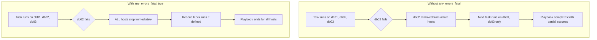

# How to Use the any_errors_fatal Option in Ansible Playbooks

Author: [nawazdhandala](https://www.github.com/nawazdhandala)

Tags: Ansible, Error Handling, Playbook, Deployment Safety

Description: Learn how to use any_errors_fatal in Ansible to stop playbook execution immediately when any host fails, preventing partial deployments.

---

By default, when a task fails on one host in Ansible, execution continues on the other hosts. The failed host gets removed from the active list, but the rest of the playbook keeps running. This is fine for many scenarios, but it can be dangerous during deployments where partial rollouts leave your infrastructure in an inconsistent state.

The `any_errors_fatal` option changes this behavior. When set to `true`, if any single host fails on any task, the entire playbook stops for all hosts. It is a kill switch that prevents partial deployments.

## The Problem Without any_errors_fatal

Consider a database migration scenario. You have three database replicas and need to run a schema migration on all of them. If the migration fails on one replica but succeeds on the others, you end up with mismatched schemas.

```yaml
# dangerous-migration.yml - without any_errors_fatal
---
- name: Run database migration
  hosts: dbservers
  become: yes

  tasks:
    - name: Stop application connections
      service:
        name: myapp
        state: stopped

    - name: Run schema migration
      command: /opt/db/migrate.sh --version 42
      register: migration_result

    - name: Start application connections
      service:
        name: myapp
        state: started
```

If `db02` fails the migration but `db01` and `db03` succeed, you now have two databases on schema version 42 and one on version 41. The application will have problems talking to the mixed fleet.

## Adding any_errors_fatal

Adding `any_errors_fatal: true` at the play level fixes this.

```yaml
# safe-migration.yml - with any_errors_fatal enabled
---
- name: Run database migration
  hosts: dbservers
  become: yes
  any_errors_fatal: true

  tasks:
    - name: Stop application connections
      service:
        name: myapp
        state: stopped

    - name: Run schema migration
      command: /opt/db/migrate.sh --version 42
      register: migration_result

    - name: Start application connections
      service:
        name: myapp
        state: started
```

Now if the migration fails on any single host, the entire play stops on all hosts. No host will proceed to the "Start application connections" task. This gives you a chance to investigate and fix the issue before proceeding.

## How any_errors_fatal Works

Here is the execution flow with and without the option.



## Real-World Use Cases

### Cluster Upgrades

When upgrading a clustered service, all nodes need to be on the same version.

```yaml
# cluster-upgrade.yml - upgrades all nodes or none
---
- name: Upgrade Elasticsearch cluster
  hosts: elasticsearch
  become: yes
  any_errors_fatal: true
  serial: 1

  tasks:
    - name: Disable shard allocation
      uri:
        url: "http://localhost:9200/_cluster/settings"
        method: PUT
        body_format: json
        body:
          persistent:
            cluster.routing.allocation.enable: "primaries"
      run_once: true

    - name: Stop Elasticsearch
      service:
        name: elasticsearch
        state: stopped

    - name: Upgrade Elasticsearch package
      apt:
        name: "elasticsearch={{ es_target_version }}"
        state: present

    - name: Start Elasticsearch
      service:
        name: elasticsearch
        state: started

    - name: Wait for node to join cluster
      uri:
        url: "http://localhost:9200/_cluster/health"
        return_content: yes
      register: cluster_health
      until: cluster_health.json.status in ['green', 'yellow']
      retries: 30
      delay: 10

    - name: Re-enable shard allocation
      uri:
        url: "http://localhost:9200/_cluster/settings"
        method: PUT
        body_format: json
        body:
          persistent:
            cluster.routing.allocation.enable: null
      run_once: true
```

If any node fails to upgrade or rejoin the cluster, the entire operation stops. You do not want to continue upgrading more nodes when one is already in trouble.

### Pre-deployment Validation

Use `any_errors_fatal` for validation plays that must pass on all hosts before deployment proceeds.

```yaml
# validated-deploy.yml - validates all hosts before deploying
---
# Play 1: Validate prerequisites (must pass on ALL hosts)
- name: Pre-deployment validation
  hosts: webservers
  any_errors_fatal: true

  tasks:
    - name: Check minimum disk space
      assert:
        that:
          - ansible_mounts | selectattr('mount', 'equalto', '/') | map(attribute='size_available') | first > 2147483648
        fail_msg: "Need at least 2GB free disk space"

    - name: Check application service is healthy
      uri:
        url: "http://localhost:8080/health"
        status_code: 200
      register: health

    - name: Verify database connectivity
      command: /opt/myapp/check-db-connection.sh
      changed_when: false

# Play 2: Deploy (only runs if all hosts passed validation)
- name: Deploy application
  hosts: webservers
  become: yes
  serial: 2

  tasks:
    - name: Deploy new application version
      synchronize:
        src: /opt/releases/v2.5.0/
        dest: /var/www/myapp/

    - name: Restart application
      service:
        name: myapp
        state: restarted
```

## Combining with Rescue Blocks

When `any_errors_fatal` triggers, you can still run cleanup tasks using a `rescue` block.

```yaml
# safe-deploy-with-rescue.yml - handles failures gracefully
---
- name: Deploy with rollback capability
  hosts: webservers
  become: yes
  any_errors_fatal: true

  tasks:
    - block:
        - name: Backup current version
          command: cp -r /var/www/myapp /var/www/myapp.backup

        - name: Deploy new version
          synchronize:
            src: /opt/releases/new/
            dest: /var/www/myapp/

        - name: Run smoke tests
          uri:
            url: "http://localhost:8080/health"
            status_code: 200
          register: smoke_test
          retries: 3
          delay: 5

      rescue:
        - name: Rollback to previous version
          command: cp -r /var/www/myapp.backup /var/www/myapp

        - name: Restart with old version
          service:
            name: myapp
            state: restarted

        - name: Send failure notification
          uri:
            url: "https://hooks.slack.com/services/YOUR/WEBHOOK/URL"
            method: POST
            body_format: json
            body:
              text: "Deployment failed on {{ inventory_hostname }}. Rolled back."
```

## any_errors_fatal vs max_fail_percentage

These two options serve different purposes:

- `any_errors_fatal: true` stops everything the moment any host fails (zero tolerance)
- `max_fail_percentage` lets you set a threshold (e.g., stop if more than 20% of hosts fail)

```yaml
# Zero tolerance - stops on first failure
- name: Critical operation
  hosts: all
  any_errors_fatal: true

# Threshold - stops if more than 30% fail
- name: Less critical operation
  hosts: all
  max_fail_percentage: 30
```

Choose `any_errors_fatal` when consistency across all hosts is non-negotiable (database migrations, cluster upgrades). Choose `max_fail_percentage` when some failure is acceptable (updating monitoring agents, rotating log files).

## Setting any_errors_fatal on Task Blocks

You can also set `any_errors_fatal` on a block instead of the entire play.

```yaml
# block-level-fatal.yml - only critical section is fail-fast
---
- name: Mixed criticality tasks
  hosts: all
  become: yes

  tasks:
    - name: Update monitoring agent (non-critical)
      apt:
        name: monitoring-agent
        state: latest
      ignore_errors: yes

    - block:
        - name: Update critical security component
          apt:
            name: security-agent
            state: latest

        - name: Verify security agent is running
          service:
            name: security-agent
            state: started
      any_errors_fatal: true

    - name: Clean up old packages
      apt:
        autoremove: yes
```

In this example, if the monitoring agent update fails on some hosts, execution continues. But if the security agent update or verification fails on any host, everything stops.

## Best Practices

- Use `any_errors_fatal: true` for operations that must succeed on all hosts (database migrations, schema changes, cluster configuration)
- Combine with rescue blocks to handle failures gracefully
- Pair with pre-validation plays to catch issues before making changes
- Do not use it everywhere; for routine maintenance tasks, the default behavior (continue on other hosts) is usually fine

The `any_errors_fatal` option is about protecting your infrastructure from the risk of partial changes. When consistency matters more than throughput, it is the right tool for the job.
