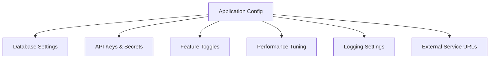

# How to Use Ansible for Application Configuration Management

Author: [nawazdhandala](https://www.github.com/nawazdhandala)

Tags: Ansible, Configuration Management, Application Deployment, DevOps

Description: Manage application configuration files, environment variables, and runtime settings across multiple environments using Ansible templates and variables.

---

Application configuration is the glue between your code and your infrastructure. Database connection strings, API keys, feature toggles, performance tuning parameters, and logging levels all need to be set correctly for each environment. Ansible excels at managing this configuration because it can template files, set environment variables, and manage secrets while keeping everything version-controlled.

This post covers practical patterns for managing application configuration with Ansible.

## The Configuration Problem

Most applications need different configuration in each environment. A database URL in development points to localhost, while production points to a replicated cluster. Manually managing these differences leads to configuration drift and deployment failures.



## Template-Based Configuration

The most common approach is using Jinja2 templates:

```yaml
# roles/app_config/tasks/main.yml
# Deploy application configuration files
---
- name: Create config directory
  ansible.builtin.file:
    path: "{{ app_config_dir }}"
    state: directory
    owner: "{{ app_user }}"
    group: "{{ app_group }}"
    mode: '0750'

- name: Deploy main application config
  ansible.builtin.template:
    src: application.yml.j2
    dest: "{{ app_config_dir }}/application.yml"
    owner: "{{ app_user }}"
    group: "{{ app_group }}"
    mode: '0640'
    validate: "python3 -c 'import yaml; yaml.safe_load(open(\"%s\"))'"
  notify: restart application

- name: Deploy database config
  ansible.builtin.template:
    src: database.yml.j2
    dest: "{{ app_config_dir }}/database.yml"
    owner: "{{ app_user }}"
    group: "{{ app_group }}"
    mode: '0640'
  notify: restart application

- name: Deploy logging config
  ansible.builtin.template:
    src: logging.yml.j2
    dest: "{{ app_config_dir }}/logging.yml"
    owner: "{{ app_user }}"
    group: "{{ app_group }}"
    mode: '0644'
  notify: reload application
```

The application template:

```yaml
# roles/app_config/templates/application.yml.j2
# Application configuration - managed by Ansible
# Do not edit manually on servers
server:
  port: {{ app_port | default(8080) }}
  host: {{ app_bind_address | default('0.0.0.0') }}
  workers: {{ app_workers | default(ansible_processor_vcpus) }}
  max_request_size: {{ app_max_request_size | default('10MB') }}

database:
  url: "postgresql://{{ db_user }}:{{ db_password }}@{{ db_host }}:{{ db_port }}/{{ db_name }}"
  pool_size: {{ db_pool_size | default(10) }}
  pool_timeout: {{ db_pool_timeout | default(30) }}
  statement_timeout: {{ db_statement_timeout | default(30000) }}

cache:
  backend: {{ cache_backend | default('redis') }}
  url: "redis://{{ redis_host }}:{{ redis_port }}/{{ redis_db | default(0) }}"
  ttl: {{ cache_default_ttl | default(3600) }}


mail:
  smtp_host: {{ mail_smtp_host }}
  smtp_port: {{ mail_smtp_port }}
  from_address: {{ mail_from_address }}
  use_tls: {{ mail_use_tls | default(true) | lower }}


external_services:

  {{ service.name }}:
    url: {{ service.url }}
    timeout: {{ service.timeout | default(30) }}

    api_key: {{ service.api_key }}


```

## Layered Variable Organization

Use Ansible's variable precedence to layer configuration:

```yaml
# group_vars/all/app_defaults.yml
# Default configuration values
---
app_port: 8080
app_workers: 4
db_pool_size: 10
cache_default_ttl: 3600
log_level: info
log_format: json
mail_enabled: false

external_services:
  - name: payment_gateway
    url: https://api.stripe.com/v1
    timeout: 30
  - name: email_service
    url: https://api.sendgrid.com/v3
    timeout: 15
```

```yaml
# inventories/production/group_vars/all.yml
# Production overrides
---
app_workers: "{{ ansible_processor_vcpus * 2 }}"
db_pool_size: 50
db_host: db-primary.prod.internal
cache_default_ttl: 7200
log_level: warn
mail_enabled: true
mail_smtp_host: smtp.prod.internal
mail_smtp_port: 587
mail_from_address: noreply@example.com
```

```yaml
# inventories/development/group_vars/all.yml
# Development overrides
---
app_workers: 2
db_pool_size: 5
db_host: localhost
log_level: debug
log_format: text
```

## Managing Secrets Separately

Never put secrets in plain text variable files. Use Ansible Vault:

```bash
# Create an encrypted secrets file
ansible-vault create inventories/production/group_vars/all/secrets.yml
```

```yaml
# inventories/production/group_vars/all/secrets.yml (encrypted)
# Sensitive configuration values
---
db_password: "super_secret_password_here"
redis_password: "another_secret"
stripe_api_key: "sk_live_abc123"
sendgrid_api_key: "SG.xyz789"
jwt_secret: "long_random_string_for_jwt"
```

Reference these in your templates the same way as any other variable:

```yaml
# The template does not care if the variable is vaulted or not
database:
  url: "postgresql://{{ db_user }}:{{ db_password }}@{{ db_host }}:{{ db_port }}/{{ db_name }}"
```

## Environment File Management

For applications that read .env files or systemd environment files:

```yaml
# roles/app_config/tasks/env_file.yml
# Deploy environment file for the application
---
- name: Deploy environment file
  ansible.builtin.template:
    src: app.env.j2
    dest: "/etc/{{ app_name }}/environment"
    owner: root
    group: "{{ app_group }}"
    mode: '0640'
  notify: restart application
```

```bash
# roles/app_config/templates/app.env.j2
# Environment variables for {{ app_name }}
# Managed by Ansible - do not edit
APP_ENV={{ environment_name }}
APP_PORT={{ app_port }}
DATABASE_URL=postgresql://{{ db_user }}:{{ db_password }}@{{ db_host }}:{{ db_port }}/{{ db_name }}
REDIS_URL=redis://{{ redis_host }}:{{ redis_port }}/{{ redis_db | default(0) }}
LOG_LEVEL={{ log_level }}

{{ key }}={{ value }}

```

## Configuration Validation

Always validate configuration before deploying:

```yaml
# roles/app_config/tasks/validate.yml
# Validate configuration before applying
---
- name: Generate config to temporary location
  ansible.builtin.template:
    src: application.yml.j2
    dest: /tmp/app_config_validate.yml
    mode: '0644'

- name: Validate YAML syntax
  ansible.builtin.command:
    cmd: python3 -c "import yaml; yaml.safe_load(open('/tmp/app_config_validate.yml'))"
  changed_when: false

- name: Validate required fields are present
  ansible.builtin.command:
    cmd: >
      python3 -c "
      import yaml
      config = yaml.safe_load(open('/tmp/app_config_validate.yml'))
      required = ['server', 'database', 'cache']
      missing = [r for r in required if r not in config]
      if missing:
          raise ValueError(f'Missing required config sections: {missing}')
      print('Config validation passed')
      "
  changed_when: false

- name: Remove temporary validation file
  ansible.builtin.file:
    path: /tmp/app_config_validate.yml
    state: absent
```

## Configuration Drift Detection

Check if running configuration matches what Ansible would deploy:

```yaml
# playbooks/check-config-drift.yml
# Detect configuration drift without making changes
---
- name: Check for configuration drift
  hosts: app_servers
  become: true

  tasks:
    - name: Check application config
      ansible.builtin.template:
        src: roles/app_config/templates/application.yml.j2
        dest: "{{ app_config_dir }}/application.yml"
      check_mode: true
      diff: true
      register: config_drift

    - name: Report drift
      ansible.builtin.debug:
        msg: "Configuration drift detected on {{ inventory_hostname }}"
      when: config_drift.changed

    - name: Send alert on drift
      community.general.slack:
        token: "{{ slack_token }}"
        channel: "#config-alerts"
        msg: "Config drift detected on {{ inventory_hostname }}: {{ config_drift.diff | default('unknown') }}"
      when: config_drift.changed
      delegate_to: localhost
```

## Hot Reload vs Restart

Some configuration changes need a full restart while others can be hot-reloaded:

```yaml
# roles/app_config/handlers/main.yml
# Different reload strategies based on what changed
---
- name: restart application
  ansible.builtin.systemd:
    name: "{{ app_name }}"
    state: restarted

- name: reload application
  ansible.builtin.systemd:
    name: "{{ app_name }}"
    state: reloaded

- name: signal config reload
  ansible.builtin.command:
    cmd: "kill -HUP $(cat /var/run/{{ app_name }}.pid)"
  changed_when: true
```

## Key Takeaways

Application configuration management with Ansible comes down to three things: using templates to generate environment-specific configuration files, layering variables so defaults can be overridden per environment, and keeping secrets encrypted with Ansible Vault. Always validate configuration before deploying it, and use check mode to detect drift. The goal is that every configuration file on every server is generated from your Ansible code, and any manual change is detected and corrected on the next run.
