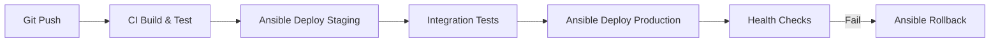

# How to Use Ansible to Automate Application Deployment Pipelines

Author: [nawazdhandala](https://www.github.com/nawazdhandala)

Tags: Ansible, Deployment, CI/CD, DevOps, Automation

Description: Build automated application deployment pipelines with Ansible using rolling updates, health checks, and rollback strategies for zero-downtime releases.

---

Every production application needs a deployment pipeline that is reliable, repeatable, and ideally automated. While CI tools like Jenkins or GitLab CI handle building and testing, Ansible excels at the actual deployment step where you push code to servers, restart services, and verify everything is healthy. Combining Ansible with your CI system creates a deployment pipeline that handles the full journey from code commit to production.

This guide covers building an application deployment pipeline with Ansible, including multi-stage deployments, health checks, and automatic rollback on failure.

## Pipeline Architecture



## Role Defaults

```yaml
# roles/deploy/defaults/main.yml - Deployment configuration
app_name: myapp
app_user: deploy
app_group: deploy
app_base_dir: /opt/{{ app_name }}
app_current_link: "{{ app_base_dir }}/current"
app_releases_dir: "{{ app_base_dir }}/releases"
app_shared_dir: "{{ app_base_dir }}/shared"
app_keep_releases: 5

# Artifact source
app_artifact_url: "https://artifacts.example.com/{{ app_name }}/{{ app_version }}.tar.gz"

# Health check configuration
app_health_endpoint: "http://localhost:8080/health"
app_health_retries: 10
app_health_delay: 5

# Rolling update settings
app_serial: "25%"
app_max_fail_percentage: 0
```

## Deployment Tasks

```yaml
# roles/deploy/tasks/main.yml - Application deployment
---
- name: Create release directory structure
  file:
    path: "{{ item }}"
    state: directory
    owner: "{{ app_user }}"
    group: "{{ app_group }}"
    mode: '0755'
  loop:
    - "{{ app_releases_dir }}"
    - "{{ app_shared_dir }}"
    - "{{ app_shared_dir }}/config"
    - "{{ app_shared_dir }}/logs"

- name: Set release timestamp
  set_fact:
    release_timestamp: "{{ ansible_date_time.iso8601_basic_short }}"

- name: Create new release directory
  file:
    path: "{{ app_releases_dir }}/{{ release_timestamp }}"
    state: directory
    owner: "{{ app_user }}"
    group: "{{ app_group }}"

- name: Download application artifact
  get_url:
    url: "{{ app_artifact_url }}"
    dest: "/tmp/{{ app_name }}-{{ app_version }}.tar.gz"
    mode: '0644'

- name: Extract application to release directory
  unarchive:
    src: "/tmp/{{ app_name }}-{{ app_version }}.tar.gz"
    dest: "{{ app_releases_dir }}/{{ release_timestamp }}"
    remote_src: yes
    owner: "{{ app_user }}"
    group: "{{ app_group }}"

- name: Link shared configuration
  file:
    src: "{{ app_shared_dir }}/config/{{ item }}"
    dest: "{{ app_releases_dir }}/{{ release_timestamp }}/config/{{ item }}"
    state: link
    force: yes
  loop:
    - application.yml
    - database.yml

- name: Save current release for potential rollback
  stat:
    path: "{{ app_current_link }}"
  register: current_release

- name: Record previous release path
  copy:
    content: "{{ current_release.stat.lnk_target }}"
    dest: "{{ app_base_dir }}/.previous_release"
    mode: '0644'
  when: current_release.stat.exists and current_release.stat.islnk

- name: Update current symlink to new release
  file:
    src: "{{ app_releases_dir }}/{{ release_timestamp }}"
    dest: "{{ app_current_link }}"
    state: link
    owner: "{{ app_user }}"
    group: "{{ app_group }}"
  notify: restart application

- name: Force handler execution for service restart
  meta: flush_handlers

- name: Run health check
  include_tasks: healthcheck.yml

- name: Clean up old releases
  shell: |
    cd {{ app_releases_dir }}
    ls -dt */ | tail -n +{{ app_keep_releases + 1 }} | xargs rm -rf
  changed_when: false
```

## Health Check Tasks

```yaml
# roles/deploy/tasks/healthcheck.yml - Verify deployment health
---
- name: Wait for application to become healthy
  uri:
    url: "{{ app_health_endpoint }}"
    status_code: 200
    return_content: yes
  register: health_result
  until: health_result.status == 200
  retries: "{{ app_health_retries }}"
  delay: "{{ app_health_delay }}"
  ignore_errors: yes

- name: Trigger rollback on health check failure
  include_tasks: rollback.yml
  when: health_result.failed | default(false)
```

## Rollback Tasks

```yaml
# roles/deploy/tasks/rollback.yml - Automatic rollback on failure
---
- name: Read previous release path
  slurp:
    src: "{{ app_base_dir }}/.previous_release"
  register: previous_release

- name: Revert symlink to previous release
  file:
    src: "{{ previous_release.content | b64decode | trim }}"
    dest: "{{ app_current_link }}"
    state: link
  notify: restart application

- name: Force restart after rollback
  meta: flush_handlers

- name: Verify rollback health
  uri:
    url: "{{ app_health_endpoint }}"
    status_code: 200
  register: rollback_health
  until: rollback_health.status == 200
  retries: 10
  delay: 5

- name: Fail with rollback notification
  fail:
    msg: "Deployment of version {{ app_version }} failed. Rolled back to previous release."
```

## Main Playbook with Rolling Update

```yaml
# deploy.yml - Rolling deployment playbook
---
- hosts: app_servers
  become: yes
  serial: "{{ app_serial }}"
  max_fail_percentage: "{{ app_max_fail_percentage }}"
  roles:
    - deploy
```

## Handlers

```yaml
# roles/deploy/handlers/main.yml
---
- name: restart application
  systemd:
    name: "{{ app_name }}"
    state: restarted
```

## Running the Deployment

```bash
# Deploy to staging first
ansible-playbook -i inventory/staging.ini deploy.yml -e "app_version=1.2.3"

# Then deploy to production with rolling updates
ansible-playbook -i inventory/production.ini deploy.yml -e "app_version=1.2.3"

# Manual rollback if needed
ansible-playbook -i inventory/production.ini rollback.yml
```

## Summary

This Ansible deployment pipeline implements industry best practices: symlink-based releases for instant switching, shared configuration across releases, health checks after deployment, automatic rollback on failure, and rolling updates to maintain availability. Integrate it with your CI system by calling the ansible-playbook command as a post-build step, and you have a complete deployment pipeline that goes from build artifact to running in production with safety nets at every step.
