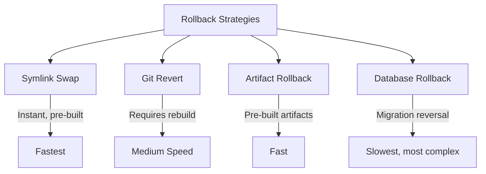

# How to Use Ansible for Application Rollback

Author: [nawazdhandala](https://www.github.com/nawazdhandala)

Tags: Ansible, Rollback, Deployment, Disaster Recovery, DevOps

Description: Implement application rollback strategies with Ansible including symlink swaps, database rollback, and automated failure detection.

---

Deployments fail. Code passes all tests in CI but breaks in production. A database migration corrupts data. A configuration change causes cascading failures. When this happens, you need to roll back quickly. Having a tested rollback procedure is just as important as having a deployment pipeline. Ansible can automate rollback so that recovering from a failed deployment takes seconds instead of panicked manual intervention.

This guide covers building rollback capabilities into your Ansible deployment process, including release-based rollbacks, database migration reversal, and automated rollback triggers.

## Rollback Strategies

There are several approaches to rollback, each with different trade-offs:



1. **Symlink Swap**: Keep multiple release directories, switch symlink to the previous one. Instant.
2. **Git Revert**: Check out the previous commit and rebuild. Takes longer but is simpler to set up.
3. **Artifact Rollback**: Re-deploy a previous build artifact (JAR, Docker image, etc.).
4. **Database Rollback**: Reverse database migrations. Complex and not always possible.

## Project Structure

```
rollback-setup/
  inventory/
    production.yml
  group_vars/
    all.yml
  roles/
    deploy_with_rollback/
      tasks/
        main.yml
        deploy.yml
        rollback.yml
        health_check.yml
      templates/
        service.j2
      handlers/
        main.yml
  deploy.yml
  rollback.yml
  auto-rollback-deploy.yml
```

## Variables

```yaml
# group_vars/all.yml
app_name: myapp
app_user: deploy
app_group: deploy
app_dir: /opt/myapp
releases_dir: /opt/myapp/releases
shared_dir: /opt/myapp/shared
current_link: /opt/myapp/current
app_repo: git@github.com:yourorg/myapp.git
app_branch: main
keep_releases: 5
app_port: 8000
health_check_url: "http://127.0.0.1:{{ app_port }}/health"
health_check_retries: 5
health_check_delay: 10
auto_rollback_on_failure: true
```

## Deployment Tasks with Rollback Support

```yaml
# roles/deploy_with_rollback/tasks/deploy.yml
---
- name: Create directory structure
  file:
    path: "{{ item }}"
    state: directory
    owner: "{{ app_user }}"
    group: "{{ app_group }}"
    mode: '0755'
  loop:
    - "{{ releases_dir }}"
    - "{{ shared_dir }}"
    - "{{ shared_dir }}/config"
    - "{{ shared_dir }}/logs"
    - "{{ shared_dir }}/uploads"

- name: Record current release before deployment
  stat:
    path: "{{ current_link }}"
  register: current_release_stat

- name: Save current release path for potential rollback
  set_fact:
    previous_release: "{{ current_release_stat.stat.lnk_source | default('') }}"
  when: current_release_stat.stat.exists | default(false)

- name: Generate new release directory name
  set_fact:
    new_release_dir: "{{ releases_dir }}/{{ ansible_date_time.iso8601_basic_short }}"

- name: Clone application code into new release directory
  git:
    repo: "{{ app_repo }}"
    dest: "{{ new_release_dir }}"
    version: "{{ app_branch }}"
    depth: 1
    accept_hostkey: yes
  become_user: "{{ app_user }}"
  register: git_clone

- name: Save deployment metadata
  copy:
    content: |
      {
        "commit": "{{ git_clone.after }}",
        "branch": "{{ app_branch }}",
        "deployed_at": "{{ ansible_date_time.iso8601 }}",
        "deployed_by": "{{ lookup('env', 'USER') }}",
        "previous_release": "{{ previous_release | default('none') }}"
      }
    dest: "{{ new_release_dir }}/DEPLOY_INFO.json"
    owner: "{{ app_user }}"
    group: "{{ app_group }}"
    mode: '0644'

- name: Link shared directories into the release
  file:
    src: "{{ shared_dir }}/{{ item }}"
    dest: "{{ new_release_dir }}/{{ item }}"
    state: link
    force: yes
  loop:
    - config
    - logs
    - uploads
  become_user: "{{ app_user }}"

- name: Run build steps in the new release
  command: "{{ item }}"
  args:
    chdir: "{{ new_release_dir }}"
  become_user: "{{ app_user }}"
  loop: "{{ build_commands | default(['npm ci --production', 'npm run build']) }}"

- name: Switch the current symlink to the new release
  file:
    src: "{{ new_release_dir }}"
    dest: "{{ current_link }}"
    state: link
    force: yes
  notify: restart application

- name: Flush handlers to restart the application
  meta: flush_handlers

- name: Run health checks
  include_tasks: health_check.yml

- name: Clean up old releases
  include_tasks: cleanup_releases.yml
```

## Health Check Tasks

```yaml
# roles/deploy_with_rollback/tasks/health_check.yml
---
- name: Wait for application port to open
  wait_for:
    port: "{{ app_port }}"
    delay: 5
    timeout: 60
  register: port_check
  ignore_errors: yes

- name: Check application health endpoint
  uri:
    url: "{{ health_check_url }}"
    status_code: 200
    timeout: 10
  register: health_result
  retries: "{{ health_check_retries }}"
  delay: "{{ health_check_delay }}"
  until: health_result.status == 200
  ignore_errors: yes

- name: Set deployment health status
  set_fact:
    deployment_healthy: "{{ health_result.status | default(0) == 200 }}"

- name: Trigger rollback if health check fails
  include_tasks: rollback.yml
  when:
    - not deployment_healthy
    - auto_rollback_on_failure
    - previous_release is defined
    - previous_release != ''

- name: Fail deployment if unhealthy and no auto-rollback
  fail:
    msg: |
      Deployment failed health check.
      URL: {{ health_check_url }}
      Status: {{ health_result.status | default('unreachable') }}
      Previous release: {{ previous_release | default('none') }}
      Run rollback manually: ansible-playbook rollback.yml
  when:
    - not deployment_healthy
    - not auto_rollback_on_failure
```

## Rollback Tasks

```yaml
# roles/deploy_with_rollback/tasks/rollback.yml
---
- name: Display rollback information
  debug:
    msg: |
      ROLLING BACK DEPLOYMENT
      Failed release: {{ new_release_dir | default('unknown') }}
      Rolling back to: {{ previous_release }}

- name: Switch symlink back to previous release
  file:
    src: "{{ previous_release }}"
    dest: "{{ current_link }}"
    state: link
    force: yes
  notify: restart application

- name: Flush handlers to restart with previous release
  meta: flush_handlers

- name: Verify rollback health
  uri:
    url: "{{ health_check_url }}"
    status_code: 200
    timeout: 10
  retries: 3
  delay: 10
  register: rollback_health

- name: Report rollback status
  debug:
    msg: "Rollback {{ 'SUCCESSFUL' if rollback_health.status == 200 else 'FAILED' }}"

- name: Remove the failed release directory
  file:
    path: "{{ new_release_dir }}"
    state: absent
  when: new_release_dir is defined

- name: Save rollback event to log
  lineinfile:
    path: "{{ shared_dir }}/rollback.log"
    line: "{{ ansible_date_time.iso8601 }} - Rolled back from {{ new_release_dir | default('unknown') }} to {{ previous_release }}"
    create: yes
```

## Manual Rollback Playbook

This separate playbook lets operators trigger a rollback manually:

```yaml
# rollback.yml - Manual rollback to a specific or previous release
---
- name: Application Rollback
  hosts: all
  become: yes
  serial: 1
  vars_prompt:
    - name: confirm_rollback
      prompt: "Are you sure you want to rollback? (yes/no)"
      private: no

  tasks:
    - name: Abort if not confirmed
      fail:
        msg: "Rollback cancelled by operator"
      when: confirm_rollback != "yes"

    - name: List available releases
      find:
        paths: "{{ releases_dir }}"
        file_type: directory
      register: available_releases

    - name: Sort releases by date
      set_fact:
        sorted_releases: "{{ available_releases.files | sort(attribute='mtime') | map(attribute='path') | list }}"

    - name: Identify current release
      stat:
        path: "{{ current_link }}"
      register: current

    - name: Display available releases
      debug:
        msg: |
          Available releases:
          
          {{ '>> ' if release == current.stat.lnk_source else '   ' }}{{ release | basename }}
          
          Current: {{ current.stat.lnk_source | basename }}

    - name: Set rollback target
      set_fact:
        rollback_target: "{{ rollback_to | default(sorted_releases[-2]) }}"
      when: sorted_releases | length >= 2

    - name: Read rollback target deployment info
      slurp:
        src: "{{ rollback_target }}/DEPLOY_INFO.json"
      register: target_info
      ignore_errors: yes

    - name: Display rollback target info
      debug:
        msg: "Rolling back to: {{ rollback_target | basename }} - {{ (target_info.content | b64decode | from_json).commit | default('unknown commit') }}"
      when: target_info is not failed

    - name: Switch to rollback target
      file:
        src: "{{ rollback_target }}"
        dest: "{{ current_link }}"
        state: link
        force: yes
      notify: restart application

    - meta: flush_handlers

    - name: Verify rollback
      uri:
        url: "{{ health_check_url }}"
        status_code: 200
      retries: 5
      delay: 5

    - name: Rollback complete
      debug:
        msg: "Successfully rolled back to {{ rollback_target | basename }}"
```

## Database Rollback

Database migrations make rollbacks more complex. Here is how to handle them:

```yaml
# Database rollback tasks
- name: Read migration status before deployment
  command: "{{ venv_dir }}/bin/python manage.py showmigrations --list"
  args:
    chdir: "{{ current_link }}"
  register: pre_deploy_migrations
  become_user: "{{ app_user }}"

- name: Save pre-deployment migration state
  copy:
    content: "{{ pre_deploy_migrations.stdout }}"
    dest: "{{ shared_dir }}/migration_state_{{ ansible_date_time.epoch }}.txt"

# During rollback, reverse migrations to the previous state
- name: Reverse database migrations
  command: "{{ venv_dir }}/bin/python manage.py migrate {{ item.app }} {{ item.migration }}"
  args:
    chdir: "{{ previous_release }}"
  become_user: "{{ app_user }}"
  loop: "{{ rollback_migrations | default([]) }}"
  when: rollback_database | default(false)
```

## Handlers

```yaml
# roles/deploy_with_rollback/handlers/main.yml
---
- name: restart application
  systemd:
    name: "{{ app_name }}"
    state: restarted
```

## Running the Playbooks

```bash
# Deploy with automatic rollback on failure
ansible-playbook -i inventory/production.yml deploy.yml

# Deploy without automatic rollback
ansible-playbook -i inventory/production.yml deploy.yml -e "auto_rollback_on_failure=false"

# Manual rollback to the previous release
ansible-playbook -i inventory/production.yml rollback.yml

# Rollback to a specific release
ansible-playbook -i inventory/production.yml rollback.yml -e "rollback_to=/opt/myapp/releases/20260220T143000"
```

## Wrapping Up

A deployment without a rollback plan is a deployment you are gambling on. This Ansible setup builds rollback into the deployment process itself. The release-based approach gives you instant rollback through symlink swaps. The automatic health check and rollback mechanism catches failures within seconds of deployment. The manual rollback playbook provides a safety net for issues that surface later. The key is to practice rollbacks regularly so that when you need one for real, the process is familiar and trusted.
