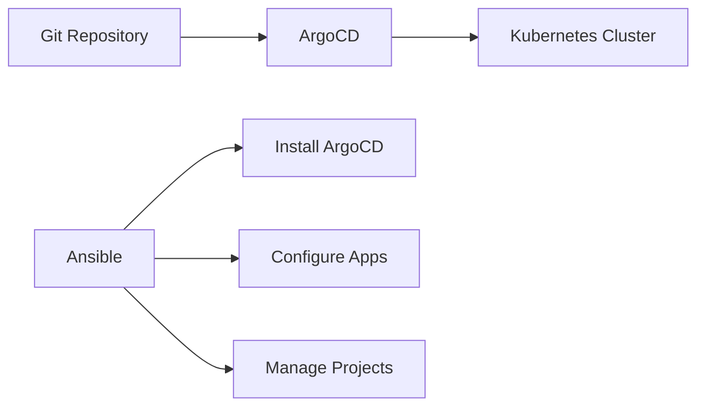

# How to Use Ansible with ArgoCD for GitOps

Author: [nawazdhandala](https://www.github.com/nawazdhandala)

Tags: Ansible, ArgoCD, GitOps, Kubernetes

Description: Set up ArgoCD with Ansible for GitOps-based continuous delivery to Kubernetes clusters with automated sync and drift detection.

---

ArgoCD is a GitOps continuous delivery tool for Kubernetes. It watches Git repositories and automatically syncs your cluster state to match the desired state in Git. Ansible can install ArgoCD, configure applications, manage projects, and integrate with your CI/CD pipeline.

## GitOps Architecture



## Installing ArgoCD with Ansible

```yaml
# roles/argocd_install/tasks/main.yml
# Install ArgoCD on Kubernetes
---
- name: Create ArgoCD namespace
  kubernetes.core.k8s:
    state: present
    definition:
      apiVersion: v1
      kind: Namespace
      metadata:
        name: argocd

- name: Install ArgoCD
  kubernetes.core.k8s:
    state: present
    src: "https://raw.githubusercontent.com/argoproj/argo-cd/{{ argocd_version }}/manifests/install.yaml"
    namespace: argocd

- name: Wait for ArgoCD server to be ready
  kubernetes.core.k8s_info:
    kind: Deployment
    namespace: argocd
    name: argocd-server
    wait: true
    wait_timeout: 300
    wait_condition:
      type: Available
      status: "True"

- name: Get initial admin password
  kubernetes.core.k8s_info:
    kind: Secret
    namespace: argocd
    name: argocd-initial-admin-secret
  register: argocd_secret

- name: Display admin password
  ansible.builtin.debug:
    msg: "ArgoCD admin password: {{ argocd_secret.resources[0].data.password | b64decode }}"
  no_log: false
```

## Configuring ArgoCD Applications

```yaml
# roles/argocd_apps/tasks/main.yml
# Configure ArgoCD applications
---
- name: Create ArgoCD Application
  kubernetes.core.k8s:
    state: present
    definition:
      apiVersion: argoproj.io/v1alpha1
      kind: Application
      metadata:
        name: "{{ item.name }}"
        namespace: argocd
      spec:
        project: "{{ item.project | default('default') }}"
        source:
          repoURL: "{{ item.repo_url }}"
          targetRevision: "{{ item.branch | default('main') }}"
          path: "{{ item.path }}"
        destination:
          server: https://kubernetes.default.svc
          namespace: "{{ item.namespace }}"
        syncPolicy:
          automated:
            prune: true
            selfHeal: true
          syncOptions:
            - CreateNamespace=true
  loop: "{{ argocd_applications }}"
```

Define applications as variables:

```yaml
# group_vars/all/argocd.yml
argocd_applications:
  - name: myapp-production
    repo_url: https://github.com/myorg/k8s-manifests.git
    branch: main
    path: overlays/production
    namespace: production
    project: production

  - name: myapp-staging
    repo_url: https://github.com/myorg/k8s-manifests.git
    branch: develop
    path: overlays/staging
    namespace: staging
    project: staging

  - name: monitoring
    repo_url: https://github.com/myorg/k8s-manifests.git
    path: monitoring
    namespace: monitoring
```

## Managing ArgoCD Projects

```yaml
# tasks/argocd-projects.yml
---
- name: Create ArgoCD projects
  kubernetes.core.k8s:
    state: present
    definition:
      apiVersion: argoproj.io/v1alpha1
      kind: AppProject
      metadata:
        name: "{{ item.name }}"
        namespace: argocd
      spec:
        description: "{{ item.description }}"
        sourceRepos:
          - "{{ item.repo }}"
        destinations:
          - namespace: "{{ item.namespace }}"
            server: https://kubernetes.default.svc
        clusterResourceWhitelist:
          - group: ''
            kind: Namespace
  loop:
    - { name: production, description: "Production apps", repo: "https://github.com/myorg/*", namespace: production }
    - { name: staging, description: "Staging apps", repo: "https://github.com/myorg/*", namespace: staging }
```

## Triggering Sync from CI

```yaml
# playbooks/trigger-argocd-sync.yml
# Trigger ArgoCD sync after pushing new manifests
---
- name: Trigger ArgoCD sync
  hosts: localhost
  connection: local
  tasks:
    - name: Sync ArgoCD application
      ansible.builtin.command:
        cmd: >
          argocd app sync {{ app_name }}
          --server {{ argocd_server }}
          --auth-token {{ argocd_token }}
          --grpc-web
      register: sync_result
      changed_when: "'succeeded' in sync_result.stdout"

    - name: Wait for sync to complete
      ansible.builtin.command:
        cmd: >
          argocd app wait {{ app_name }}
          --server {{ argocd_server }}
          --auth-token {{ argocd_token }}
          --grpc-web
          --timeout 300
      changed_when: false
```

## Key Takeaways

ArgoCD and Ansible complement each other in a GitOps workflow. Ansible handles the initial ArgoCD installation and configuration. ArgoCD handles the ongoing synchronization of Kubernetes state with Git. Use Ansible to define ArgoCD applications and projects as code. Trigger syncs from your CI pipeline when new manifests are pushed. This gives you a fully automated, Git-driven deployment pipeline for Kubernetes.

## Common Use Cases

Here are several practical scenarios where this module proves essential in real-world playbooks.

### Infrastructure Provisioning Workflow

```yaml
# Complete workflow incorporating this module
- name: Infrastructure provisioning
  hosts: all
  become: true
  gather_facts: true
  tasks:
    - name: Gather system information
      ansible.builtin.setup:
        gather_subset:
          - hardware
          - network

    - name: Display system summary
      ansible.builtin.debug:
        msg: >-
          Host {{ inventory_hostname }} has
          {{ ansible_memtotal_mb }}MB RAM,
          {{ ansible_processor_vcpus }} vCPUs,
          running {{ ansible_distribution }} {{ ansible_distribution_version }}

    - name: Install required packages
      ansible.builtin.package:
        name:
          - curl
          - wget
          - git
          - vim
          - htop
          - jq
        state: present

    - name: Configure system timezone
      ansible.builtin.timezone:
        name: "{{ system_timezone | default('UTC') }}"

    - name: Configure hostname
      ansible.builtin.hostname:
        name: "{{ inventory_hostname }}"

    - name: Update /etc/hosts
      ansible.builtin.lineinfile:
        path: /etc/hosts
        regexp: '^127\.0\.1\.1'
        line: "127.0.1.1 {{ inventory_hostname }}"

    - name: Configure SSH hardening
      ansible.builtin.lineinfile:
        path: /etc/ssh/sshd_config
        regexp: "{{ item.regexp }}"
        line: "{{ item.line }}"
      loop:
        - { regexp: '^PermitRootLogin', line: 'PermitRootLogin no' }
        - { regexp: '^PasswordAuthentication', line: 'PasswordAuthentication no' }
      notify: restart sshd

    - name: Configure firewall rules
      community.general.ufw:
        rule: allow
        port: "{{ item }}"
        proto: tcp
      loop:
        - "22"
        - "80"
        - "443"

    - name: Enable firewall
      community.general.ufw:
        state: enabled
        policy: deny

  handlers:
    - name: restart sshd
      ansible.builtin.service:
        name: sshd
        state: restarted
```

### Integration with Monitoring

```yaml
# Using gathered facts to configure monitoring thresholds
- name: Configure monitoring based on system specs
  hosts: all
  become: true
  tasks:
    - name: Set monitoring thresholds based on hardware
      ansible.builtin.template:
        src: monitoring_config.yml.j2
        dest: /etc/monitoring/config.yml
      vars:
        memory_warning_threshold: "{{ (ansible_memtotal_mb * 0.8) | int }}"
        memory_critical_threshold: "{{ (ansible_memtotal_mb * 0.95) | int }}"
        cpu_warning_threshold: 80
        cpu_critical_threshold: 95

    - name: Register host with monitoring system
      ansible.builtin.uri:
        url: "https://monitoring.example.com/api/hosts"
        method: POST
        body_format: json
        body:
          hostname: "{{ inventory_hostname }}"
          ip_address: "{{ ansible_default_ipv4.address }}"
          os: "{{ ansible_distribution }}"
          memory_mb: "{{ ansible_memtotal_mb }}"
          cpus: "{{ ansible_processor_vcpus }}"
        headers:
          Authorization: "Bearer {{ monitoring_api_token }}"
        status_code: [200, 201, 409]
```

### Error Handling Patterns

```yaml
# Robust error handling with this module
- name: Robust task execution
  hosts: all
  tasks:
    - name: Attempt primary operation
      ansible.builtin.command: /opt/app/primary-task.sh
      register: primary_result
      failed_when: false

    - name: Handle primary failure with fallback
      ansible.builtin.command: /opt/app/fallback-task.sh
      when: primary_result.rc != 0
      register: fallback_result

    - name: Report final status
      ansible.builtin.debug:
        msg: >-
          Task completed via {{ 'primary' if primary_result.rc == 0 else 'fallback' }} path.
          Return code: {{ primary_result.rc if primary_result.rc == 0 else fallback_result.rc }}

    - name: Fail if both paths failed
      ansible.builtin.fail:
        msg: "Both primary and fallback operations failed"
      when:
        - primary_result.rc != 0
        - fallback_result is defined
        - fallback_result.rc != 0
```

### Scheduling and Automation

```yaml
# Set up scheduled compliance scans using cron
- name: Configure automated scans
  hosts: all
  become: true
  tasks:
    - name: Create scan script
      ansible.builtin.copy:
        dest: /opt/scripts/compliance_scan.sh
        mode: '0755'
        content: |
          #!/bin/bash
          cd /opt/ansible
          ansible-playbook playbooks/validate.yml -i inventory/ > /var/log/compliance_scan.log 2>&1
          EXIT_CODE=$?
          if [ $EXIT_CODE -ne 0 ]; then
            curl -X POST https://hooks.example.com/alert \
              -H "Content-Type: application/json" \
              -d "{\"text\":\"Compliance scan failed on $(hostname)\"}"
          fi
          exit $EXIT_CODE

    - name: Schedule weekly compliance scan
      ansible.builtin.cron:
        name: "Weekly compliance scan"
        minute: "0"
        hour: "3"
        weekday: "1"
        job: "/opt/scripts/compliance_scan.sh"
        user: ansible
```

