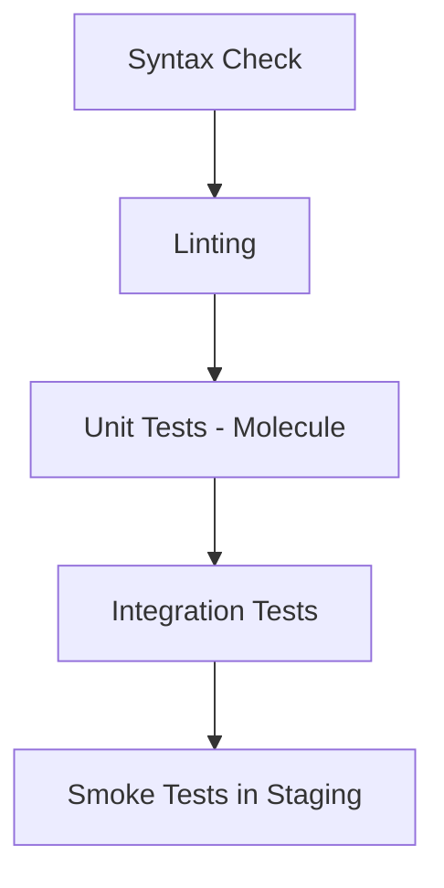

# How to Use Ansible for Automated Testing

Author: [nawazdhandala](https://www.github.com/nawazdhandala)

Tags: Ansible, Automated Testing, DevOps, Molecule

Description: Set up automated testing for your Ansible roles and playbooks using Molecule, Testinfra, and CI pipelines to catch configuration errors early.

---

Writing Ansible playbooks without testing them is like writing application code without unit tests. It works until it does not. Automated testing for your Ansible code catches bugs before they hit production, validates that your roles work on different operating systems, and gives you confidence to refactor.

In this guide, I will cover how to test Ansible code using Molecule, Testinfra, and integration testing patterns that work in CI pipelines.

## Testing Levels for Ansible

There are several levels of testing you should consider:



Each level catches different types of problems. Syntax checks catch YAML errors. Linting catches bad practices. Molecule tests verify role behavior. Integration tests verify that roles work together.

## Setting Up Molecule

Molecule is the standard testing framework for Ansible roles. It creates isolated environments (using Docker, Vagrant, or cloud instances), runs your role against them, and verifies the results.

Install Molecule with Docker support:

```bash
# Install molecule with the Docker driver
pip install molecule molecule-docker ansible-lint
```

Initialize a new role with Molecule testing:

```bash
# Create a new role with built-in Molecule tests
molecule init role my_nginx --driver-name docker
```

Or add Molecule to an existing role:

```bash
# Add Molecule to an existing role
cd roles/nginx
molecule init scenario --driver-name docker
```

## Molecule Configuration

The `molecule.yml` file defines your test environment:

```yaml
# roles/nginx/molecule/default/molecule.yml
# Test configuration for the nginx role
---
dependency:
  name: galaxy
  options:
    requirements-file: requirements.yml

driver:
  name: docker

platforms:
  # Test on Ubuntu 22.04
  - name: ubuntu-test
    image: geerlingguy/docker-ubuntu2204-ansible:latest
    command: ""
    pre_build_image: true
    volumes:
      - /sys/fs/cgroup:/sys/fs/cgroup:rw
    cgroupns_mode: host
    privileged: true

  # Test on Rocky Linux 9
  - name: rocky-test
    image: geerlingguy/docker-rockylinux9-ansible:latest
    command: ""
    pre_build_image: true
    volumes:
      - /sys/fs/cgroup:/sys/fs/cgroup:rw
    cgroupns_mode: host
    privileged: true

provisioner:
  name: ansible
  config_options:
    defaults:
      callbacks_enabled: timer, profile_tasks
  inventory:
    group_vars:
      all:
        nginx_port: 8080
        nginx_server_name: testserver

verifier:
  name: testinfra
```

## Writing the Converge Playbook

The converge playbook applies your role to the test instances:

```yaml
# roles/nginx/molecule/default/converge.yml
# Apply the nginx role to test instances
---
- name: Converge
  hosts: all
  become: true
  vars:
    nginx_port: 8080
    nginx_vhosts:
      - server_name: testserver
        root: /var/www/testserver
        index: index.html

  pre_tasks:
    - name: Update apt cache on Debian
      ansible.builtin.apt:
        update_cache: true
        cache_valid_time: 600
      when: ansible_os_family == 'Debian'

  roles:
    - role: nginx
```

## Writing Testinfra Verification Tests

Testinfra lets you write Python tests that verify the state of your test instances:

```python
# roles/nginx/molecule/default/tests/test_default.py
# Verify that the nginx role configured everything correctly
import pytest


def test_nginx_is_installed(host):
    """Nginx package should be installed."""
    nginx = host.package("nginx")
    assert nginx.is_installed


def test_nginx_service_running(host):
    """Nginx service should be running and enabled."""
    nginx = host.service("nginx")
    assert nginx.is_running
    assert nginx.is_enabled


def test_nginx_config_valid(host):
    """Nginx configuration should pass syntax check."""
    cmd = host.run("nginx -t")
    assert cmd.rc == 0


def test_nginx_listening(host):
    """Nginx should be listening on configured port."""
    socket = host.socket("tcp://0.0.0.0:8080")
    assert socket.is_listening


def test_nginx_config_file(host):
    """Main nginx config file should exist with correct permissions."""
    config = host.file("/etc/nginx/nginx.conf")
    assert config.exists
    assert config.user == "root"
    assert config.group == "root"
    assert config.mode == 0o644


def test_vhost_config(host):
    """Virtual host configuration should be in place."""
    vhost = host.file("/etc/nginx/sites-enabled/testserver.conf")
    assert vhost.exists
    assert vhost.contains("listen 8080")
    assert vhost.contains("server_name testserver")


def test_document_root(host):
    """Document root should exist with correct ownership."""
    docroot = host.file("/var/www/testserver")
    assert docroot.exists
    assert docroot.is_directory
    assert docroot.user == "www-data"
```

## Running Molecule Tests

Molecule has a full test lifecycle:

```bash
# Run the complete test sequence
molecule test

# This runs these steps in order:
# 1. dependency - install role dependencies
# 2. lint - run ansible-lint
# 3. cleanup - clean previous test artifacts
# 4. destroy - remove old test instances
# 5. syntax - check playbook syntax
# 6. create - create test instances
# 7. prepare - run preparation tasks
# 8. converge - apply the role
# 9. idempotence - run again to verify idempotency
# 10. side_effect - run side effect playbook
# 11. verify - run testinfra tests
# 12. cleanup - clean up
# 13. destroy - destroy test instances
```

During development, you can run individual steps:

```bash
# Just create instances and apply the role
molecule converge

# Run only the verification tests
molecule verify

# Log into a test instance for debugging
molecule login --host ubuntu-test

# Run the idempotence test
molecule idempotence

# Destroy test instances when done
molecule destroy
```

## Testing Idempotency

The idempotence check runs your playbook twice and verifies that the second run makes no changes. This is critical because non-idempotent playbooks cause unexpected behavior in production.

If the idempotence check fails, you will see output like:

```
CRITICAL Idempotence test failed because of the following tasks:
* [ubuntu-test] => nginx : Generate dhparam file
```

This tells you exactly which task is not idempotent, so you can fix it.

## Ansible-lint for Static Analysis

Ansible-lint catches common mistakes and enforces best practices:

```yaml
# .ansible-lint
# Linting configuration
---
profile: production

exclude_paths:
  - .cache/
  - .github/

enable_list:
  - fqcn-builtins
  - no-changed-when
  - no-handler

skip_list:
  - yaml[line-length]

warn_list:
  - experimental
```

Run it against your playbooks:

```bash
# Lint all playbooks and roles
ansible-lint playbooks/ roles/
```

## CI Pipeline for Ansible Testing

Here is a GitHub Actions workflow that tests your roles:

```yaml
# .github/workflows/test-roles.yml
# CI pipeline to test Ansible roles
name: Test Ansible Roles
on:
  pull_request:
    paths:
      - 'roles/**'
      - 'playbooks/**'

jobs:
  lint:
    runs-on: ubuntu-latest
    steps:
      - uses: actions/checkout@v4
      - name: Run ansible-lint
        uses: ansible/ansible-lint@main

  molecule:
    needs: lint
    runs-on: ubuntu-latest
    strategy:
      matrix:
        role:
          - nginx
          - postgresql
          - common
          - firewall
    steps:
      - uses: actions/checkout@v4
      - name: Setup Python
        uses: actions/setup-python@v5
        with:
          python-version: '3.11'
      - name: Install dependencies
        run: pip install molecule molecule-docker ansible
      - name: Run Molecule tests
        run: molecule test
        working-directory: roles/${{ matrix.role }}
        env:
          PY_COLORS: '1'
          ANSIBLE_FORCE_COLOR: '1'
```

## Integration Testing

Beyond individual role tests, you should test how roles work together:

```yaml
# molecule/integration/converge.yml
# Integration test that applies multiple roles together
---
- name: Integration test - full stack
  hosts: all
  become: true

  roles:
    - common
    - firewall
    - nginx
    - app_deploy

  post_tasks:
    - name: Verify full stack works end to end
      ansible.builtin.uri:
        url: http://localhost:8080/health
        status_code: 200
      register: result
      retries: 10
      delay: 3
      until: result.status == 200
```

## Key Takeaways

Testing Ansible code is not optional for production workloads. Use Molecule to test individual roles in isolated containers. Write Testinfra tests to verify system state after convergence. Always run idempotency checks. Use ansible-lint for static analysis. Set up CI pipelines that run these tests on every pull request. The investment in testing pays off when you can refactor roles confidently and catch breaking changes before they reach production servers.
