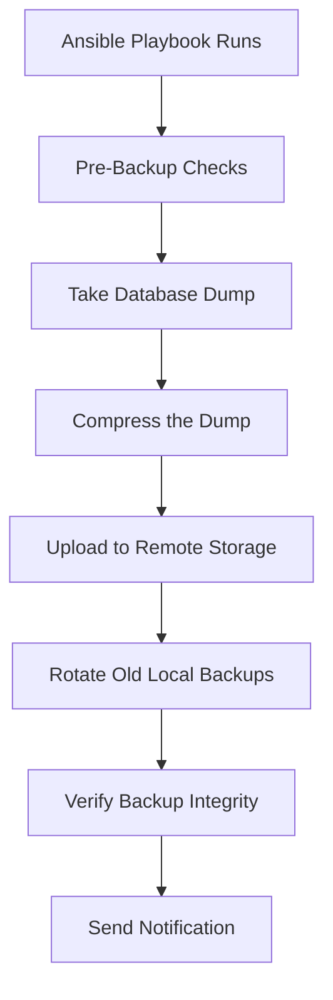

# How to Use Ansible to Backup Databases

Author: [nawazdhandala](https://www.github.com/nawazdhandala)

Tags: Ansible, Database Backup, Disaster Recovery, PostgreSQL, MySQL

Description: Automate database backups for PostgreSQL, MySQL, and MongoDB using Ansible playbooks with compression, rotation, and remote storage.

---

Database backups are like insurance. You hope you never need them, but when you do, nothing else matters. The problem with backups is that they need to be automatic, tested, and stored offsite. If someone has to remember to run a backup script every day, eventually they will forget. Ansible automates the entire backup lifecycle: taking the dump, compressing it, uploading to remote storage, and cleaning up old backups.

This guide covers automating database backups for PostgreSQL, MySQL, and MongoDB using Ansible.

## Backup Strategy Overview



## Inventory

```ini
# inventory/databases.ini
[postgres_servers]
pg-primary ansible_host=10.0.9.10

[mysql_servers]
mysql-primary ansible_host=10.0.9.20

[mongodb_servers]
mongo-primary ansible_host=10.0.9.30

[all:vars]
ansible_user=ubuntu
backup_base_dir=/var/backups/databases
backup_retention_days=14
```

## PostgreSQL Backup Playbook

```yaml
# playbooks/backup-postgresql.yml
---
- name: Backup PostgreSQL databases
  hosts: postgres_servers
  become: true
  vars_files:
    - ../vault/db-secrets.yml
  vars:
    pg_databases:
      - myapp_production
      - analytics_db
    backup_dir: "{{ backup_base_dir }}/postgresql"
    timestamp: "{{ ansible_date_time.date }}_{{ ansible_date_time.hour }}{{ ansible_date_time.minute }}"

  tasks:
    - name: Create backup directory
      ansible.builtin.file:
        path: "{{ backup_dir }}"
        state: directory
        owner: postgres
        group: postgres
        mode: "0750"

    - name: Check database sizes before backup
      community.postgresql.postgresql_query:
        db: "{{ item }}"
        login_user: "{{ vault_pg_backup_user }}"
        login_password: "{{ vault_pg_backup_password }}"
        query: "SELECT pg_size_pretty(pg_database_size(current_database())) as size"
      loop: "{{ pg_databases }}"
      register: db_sizes

    - name: Display database sizes
      ansible.builtin.debug:
        msg: "{{ item.item }}: {{ item.query_result[0].size }}"
      loop: "{{ db_sizes.results }}"
      loop_control:
        label: "{{ item.item }}"

    - name: Dump each PostgreSQL database using pg_dump
      ansible.builtin.command:
        cmd: >
          pg_dump
          --host=localhost
          --username={{ vault_pg_backup_user }}
          --format=custom
          --compress=9
          --file={{ backup_dir }}/{{ item }}_{{ timestamp }}.dump
          {{ item }}
      environment:
        PGPASSWORD: "{{ vault_pg_backup_password }}"
      loop: "{{ pg_databases }}"
      changed_when: true
      no_log: true

    - name: Take a full cluster backup with pg_basebackup
      ansible.builtin.command:
        cmd: >
          pg_basebackup
          --host=localhost
          --username={{ vault_pg_backup_user }}
          --pgdata={{ backup_dir }}/basebackup_{{ timestamp }}
          --format=tar
          --gzip
          --checkpoint=fast
      environment:
        PGPASSWORD: "{{ vault_pg_backup_password }}"
      changed_when: true
      no_log: true

    - name: Verify backup files were created
      ansible.builtin.stat:
        path: "{{ backup_dir }}/{{ item }}_{{ timestamp }}.dump"
      loop: "{{ pg_databases }}"
      register: backup_files

    - name: Fail if any backup file is missing
      ansible.builtin.fail:
        msg: "Backup file for {{ item.item }} was not created"
      when: not item.stat.exists
      loop: "{{ backup_files.results }}"
      loop_control:
        label: "{{ item.item }}"
```

## MySQL Backup Playbook

```yaml
# playbooks/backup-mysql.yml
---
- name: Backup MySQL databases
  hosts: mysql_servers
  become: true
  vars_files:
    - ../vault/db-secrets.yml
  vars:
    mysql_databases:
      - myapp_production
      - user_service_db
    backup_dir: "{{ backup_base_dir }}/mysql"
    timestamp: "{{ ansible_date_time.date }}_{{ ansible_date_time.hour }}{{ ansible_date_time.minute }}"

  tasks:
    - name: Create backup directory
      ansible.builtin.file:
        path: "{{ backup_dir }}"
        state: directory
        owner: mysql
        group: mysql
        mode: "0750"

    - name: Dump each MySQL database with mysqldump
      ansible.builtin.command:
        cmd: >
          mysqldump
          --host=localhost
          --user={{ vault_mysql_backup_user }}
          --password={{ vault_mysql_backup_password }}
          --single-transaction
          --routines
          --triggers
          --events
          --quick
          {{ item }}
      register: mysql_dump
      loop: "{{ mysql_databases }}"
      changed_when: true
      no_log: true

    - name: Write and compress each dump to a file
      ansible.builtin.shell:
        cmd: >
          mysqldump
          --host=localhost
          --user={{ vault_mysql_backup_user }}
          --password={{ vault_mysql_backup_password }}
          --single-transaction
          --routines
          --triggers
          --events
          {{ item }}
          | gzip > {{ backup_dir }}/{{ item }}_{{ timestamp }}.sql.gz
      loop: "{{ mysql_databases }}"
      changed_when: true
      no_log: true

    - name: Verify backup files exist
      ansible.builtin.stat:
        path: "{{ backup_dir }}/{{ item }}_{{ timestamp }}.sql.gz"
      loop: "{{ mysql_databases }}"
      register: mysql_backup_files

    - name: Display backup file sizes
      ansible.builtin.debug:
        msg: "{{ item.item }}: {{ (item.stat.size / 1048576) | round(2) }} MB"
      loop: "{{ mysql_backup_files.results }}"
      loop_control:
        label: "{{ item.item }}"
      when: item.stat.exists
```

## MongoDB Backup Playbook

```yaml
# playbooks/backup-mongodb.yml
---
- name: Backup MongoDB databases
  hosts: mongodb_servers
  become: true
  vars_files:
    - ../vault/db-secrets.yml
  vars:
    backup_dir: "{{ backup_base_dir }}/mongodb"
    timestamp: "{{ ansible_date_time.date }}_{{ ansible_date_time.hour }}{{ ansible_date_time.minute }}"

  tasks:
    - name: Create backup directory
      ansible.builtin.file:
        path: "{{ backup_dir }}"
        state: directory
        mode: "0750"

    - name: Run mongodump for all databases
      ansible.builtin.command:
        cmd: >
          mongodump
          --host=localhost
          --port=27017
          --username={{ vault_mongo_backup_user }}
          --password={{ vault_mongo_backup_password }}
          --authenticationDatabase=admin
          --out={{ backup_dir }}/full_{{ timestamp }}
          --gzip
      changed_when: true
      no_log: true

    - name: Compress the backup directory into a single archive
      ansible.builtin.command:
        cmd: >
          tar -czf {{ backup_dir }}/mongodb_full_{{ timestamp }}.tar.gz
          -C {{ backup_dir }} full_{{ timestamp }}
      changed_when: true

    - name: Remove the uncompressed backup directory
      ansible.builtin.file:
        path: "{{ backup_dir }}/full_{{ timestamp }}"
        state: absent
```

## Uploading Backups to S3

Local backups are not enough. Upload to remote storage for disaster recovery.

```yaml
# playbooks/upload-backups-s3.yml
---
- name: Upload database backups to S3
  hosts: all
  become: true
  vars:
    s3_bucket: mycompany-db-backups
    s3_prefix: "{{ inventory_hostname }}/{{ ansible_date_time.date }}"

  tasks:
    - name: Install AWS CLI if not present
      ansible.builtin.apt:
        name: awscli
        state: present

    - name: Upload all backup files to S3
      ansible.builtin.command:
        cmd: >
          aws s3 sync {{ backup_base_dir }}/
          s3://{{ s3_bucket }}/{{ s3_prefix }}/
          --exclude "*"
          --include "*.dump"
          --include "*.sql.gz"
          --include "*.tar.gz"
          --storage-class STANDARD_IA
      changed_when: true
      environment:
        AWS_ACCESS_KEY_ID: "{{ vault_aws_access_key }}"
        AWS_SECRET_ACCESS_KEY: "{{ vault_aws_secret_key }}"
        AWS_DEFAULT_REGION: "{{ aws_region | default('us-east-1') }}"
```

## Backup Rotation

Clean up old backups to prevent disk from filling up.

```yaml
# playbooks/rotate-backups.yml
---
- name: Rotate old database backups
  hosts: all
  become: true

  tasks:
    - name: Remove local backups older than retention period
      ansible.builtin.find:
        paths: "{{ backup_base_dir }}"
        age: "{{ backup_retention_days }}d"
        recurse: true
        file_type: file
        patterns:
          - "*.dump"
          - "*.sql.gz"
          - "*.tar.gz"
      register: old_backups

    - name: Display files to be removed
      ansible.builtin.debug:
        msg: "Removing {{ old_backups.files | length }} old backup files"

    - name: Delete old backup files
      ansible.builtin.file:
        path: "{{ item.path }}"
        state: absent
      loop: "{{ old_backups.files }}"
      loop_control:
        label: "{{ item.path | basename }}"
```

## Scheduling Backups with Cron

```yaml
# playbooks/schedule-backups.yml
---
- name: Schedule automated database backups
  hosts: all
  become: true

  tasks:
    - name: Install the backup cron job
      ansible.builtin.cron:
        name: "Database backup - {{ inventory_hostname }}"
        minute: "0"
        hour: "3"
        job: >
          /usr/local/bin/ansible-playbook
          /opt/ansible/playbooks/backup-{{ db_type }}.yml
          -i /opt/ansible/inventory/databases.ini
          --vault-password-file /opt/ansible/.vault_pass
          --limit {{ inventory_hostname }}
          >> /var/log/db-backup.log 2>&1
        user: root
```

## Tips for Reliable Backups

1. **Test restores regularly.** A backup you have never restored is not really a backup. Schedule monthly restore tests to a staging environment.

2. **Use `--single-transaction` for MySQL.** This takes a consistent snapshot without locking tables. Without it, you get inconsistent backups on busy databases.

3. **Use `--format=custom` for pg_dump.** The custom format is compressed by default and supports parallel restore. Plain SQL dumps cannot be restored in parallel.

4. **Monitor backup size trends.** If your backup suddenly gets much smaller, something might be wrong (tables dropped, data deleted). Track backup sizes over time.

5. **Encrypt backups at rest.** If you upload to S3, enable server-side encryption. For extra security, encrypt the dump files before upload using GPG.

## Conclusion

Automating database backups with Ansible removes the human element from one of the most critical operations in your infrastructure. The playbooks in this guide cover PostgreSQL, MySQL, and MongoDB backups, remote upload to S3, and rotation of old files. Run these playbooks on a schedule, test restores regularly, and sleep better knowing your data is protected.
