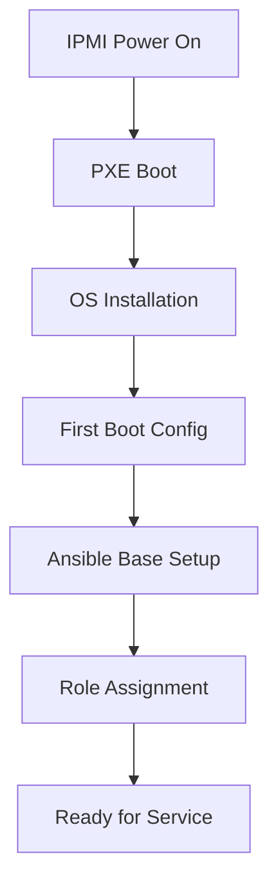

# How to Use Ansible for Bare Metal Server Provisioning

Author: [nawazdhandala](https://www.github.com/nawazdhandala)

Tags: Ansible, Bare Metal, Server Provisioning, Infrastructure

Description: Provision bare metal servers from scratch using Ansible with PXE boot, IPMI control, RAID configuration, and OS installation automation.

---

Bare metal server provisioning is more involved than spinning up cloud VMs. You need to configure BIOS settings, set up RAID arrays, install the operating system, and apply your base configuration. Ansible can automate most of this process, especially when combined with PXE boot and IPMI for out-of-band management.

This post walks through automating bare metal provisioning with Ansible.

## Bare Metal Provisioning Flow



## Server Inventory with IPMI Details

```yaml
# inventories/bare-metal/hosts.yml
all:
  children:
    bare_metal:
      hosts:
        bm-web-01:
          ansible_host: 10.0.1.10
          ipmi_host: 10.0.100.10
          ipmi_user: admin
          ipmi_password: "{{ vault_ipmi_password }}"
          mac_address: "aa:bb:cc:dd:ee:01"
          server_role: webserver
          raid_config: raid1
          os_version: ubuntu-2204
        bm-db-01:
          ansible_host: 10.0.2.10
          ipmi_host: 10.0.100.20
          ipmi_user: admin
          ipmi_password: "{{ vault_ipmi_password }}"
          mac_address: "aa:bb:cc:dd:ee:02"
          server_role: database
          raid_config: raid10
          os_version: ubuntu-2204
```

## IPMI Power Management

```yaml
# roles/bare_metal_ipmi/tasks/main.yml
# Control bare metal servers via IPMI
---
- name: Install IPMI tools
  ansible.builtin.apt:
    name: ipmitool
    state: present
  delegate_to: localhost

- name: Set PXE boot for next boot
  ansible.builtin.command:
    cmd: >
      ipmitool -I lanplus
      -H {{ ipmi_host }}
      -U {{ ipmi_user }}
      -P {{ ipmi_password }}
      chassis bootdev pxe options=efiboot
  delegate_to: localhost
  changed_when: true
  no_log: true

- name: Power cycle the server
  ansible.builtin.command:
    cmd: >
      ipmitool -I lanplus
      -H {{ ipmi_host }}
      -U {{ ipmi_user }}
      -P {{ ipmi_password }}
      chassis power cycle
  delegate_to: localhost
  changed_when: true
  no_log: true

- name: Wait for server to boot and become reachable
  ansible.builtin.wait_for:
    host: "{{ ansible_host }}"
    port: 22
    timeout: 1200
    delay: 120
  delegate_to: localhost
```

## PXE Boot Server Configuration

Set up the PXE boot server that provisions new machines:

```yaml
# roles/pxe_server/tasks/main.yml
# Configure PXE boot server for bare metal provisioning
---
- name: Install PXE server packages
  ansible.builtin.apt:
    name:
      - tftpd-hpa
      - dnsmasq
      - nginx
    state: present

- name: Configure dnsmasq for PXE
  ansible.builtin.template:
    src: dnsmasq-pxe.conf.j2
    dest: /etc/dnsmasq.d/pxe.conf
    mode: '0644'
  notify: restart dnsmasq

- name: Download Ubuntu installer
  ansible.builtin.get_url:
    url: "https://releases.ubuntu.com/22.04/ubuntu-22.04-live-server-amd64.iso"
    dest: /srv/tftp/ubuntu-22.04.iso
    mode: '0644'

- name: Mount installer ISO
  ansible.posix.mount:
    src: /srv/tftp/ubuntu-22.04.iso
    path: /srv/tftp/ubuntu-22.04
    fstype: iso9660
    opts: loop,ro
    state: mounted

- name: Deploy per-server autoinstall configs
  ansible.builtin.template:
    src: autoinstall.yml.j2
    dest: "/srv/www/autoinstall/{{ item }}.yml"
    mode: '0644'
  loop: "{{ groups['bare_metal'] }}"
```

The autoinstall template for Ubuntu:

```yaml
# roles/pxe_server/templates/autoinstall.yml.j2
# Ubuntu autoinstall configuration for {{ inventory_hostname }}
#cloud-config
autoinstall:
  version: 1
  locale: en_US.UTF-8
  keyboard:
    layout: us
  network:
    version: 2
    ethernets:
      {{ primary_interface | default('eno1') }}:
        addresses:
          - {{ hostvars[item].ansible_host }}/24
        gateway4: {{ gateway }}
        nameservers:
          addresses: {{ dns_servers | to_json }}
  storage:

    config:
      - id: disk0
        type: disk
        ptable: gpt
        path: /dev/sda
        grub_device: true
      - id: disk1
        type: disk
        ptable: gpt
        path: /dev/sdb
      - id: md0
        type: raid
        name: md0
        raidlevel: 1
        devices: [disk0, disk1]
      - id: md0-part1
        type: partition
        device: md0
        size: -1
      - id: md0-format
        type: format
        volume: md0-part1
        fstype: ext4
      - id: md0-mount
        type: mount
        device: md0-format
        path: /

  identity:
    hostname: {{ item }}
    username: deploy
    password: {{ deploy_password_hash }}
  ssh:
    install-server: true
    authorized-keys:
      - {{ deploy_ssh_public_key }}
  packages:
    - python3
    - python3-apt
    - openssh-server
  late-commands:
    - 'echo "{{ item }} provisioned by Ansible PXE" > /target/etc/provisioning-info'
```

## Post-Install Base Configuration

After the OS is installed, run the base configuration:

```yaml
# playbooks/provision-bare-metal.yml
# Complete bare metal provisioning workflow
---
- name: Trigger PXE boot on target servers
  hosts: "{{ target_servers }}"
  gather_facts: false
  tasks:
    - name: Configure and power cycle via IPMI
      ansible.builtin.include_role:
        name: bare_metal_ipmi

- name: Wait for OS installation to complete
  hosts: "{{ target_servers }}"
  gather_facts: false
  tasks:
    - name: Wait for SSH access
      ansible.builtin.wait_for_connection:
        timeout: 3600
        delay: 300

- name: Apply base configuration
  hosts: "{{ target_servers }}"
  become: true
  roles:
    - common
    - security_baseline
    - monitoring_agent
    - firmware_updates

- name: Apply role-specific configuration
  hosts: "{{ target_servers }}"
  become: true
  tasks:
    - name: Apply server role
      ansible.builtin.include_role:
        name: "{{ server_role }}"
```

## Hardware Health Monitoring

```yaml
# roles/bare_metal_monitoring/tasks/main.yml
# Set up hardware health monitoring
---
- name: Install hardware monitoring tools
  ansible.builtin.apt:
    name:
      - lm-sensors
      - smartmontools
      - megacli
    state: present

- name: Run sensors detection
  ansible.builtin.command: sensors-detect --auto
  changed_when: true

- name: Configure SMART monitoring
  ansible.builtin.template:
    src: smartd.conf.j2
    dest: /etc/smartd.conf
    mode: '0644'
  notify: restart smartd

- name: Deploy hardware metrics exporter
  ansible.builtin.include_role:
    name: node_exporter
  vars:
    collectors:
      - hwmon
      - diskstats
      - mdadm
```

## Key Takeaways

Bare metal provisioning with Ansible combines IPMI for power management, PXE for OS installation, and standard Ansible playbooks for configuration. Automate the entire flow from power-on to ready-for-service. Use autoinstall configs to make OS installation hands-free. Include RAID configuration in the autoinstall. After the OS is installed, apply the same roles you would use for any other server. Hardware monitoring is essential for bare metal since you do not have a cloud provider watching the hardware for you.
