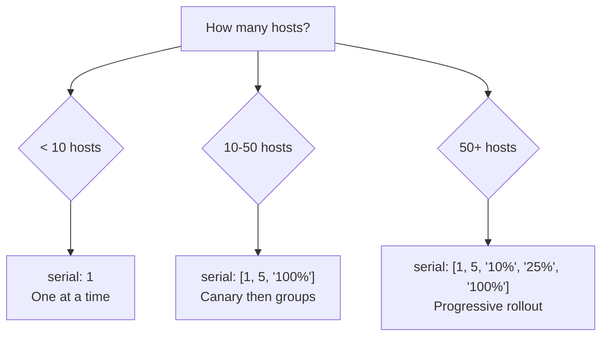

# How to Use Ansible Batch Size for Phased Rollouts

Author: [nawazdhandala](https://www.github.com/nawazdhandala)

Tags: Ansible, Batch Size, Rollouts, Deployment, Serial

Description: Control Ansible batch sizes using serial with fixed numbers, percentages, and progressive lists to implement phased deployment rollouts.

---

Phased rollouts deploy changes to your infrastructure in controlled stages. Instead of updating everything at once, you process groups of hosts in batches, verifying each batch before moving to the next. Ansible's `serial` keyword with its various batch size options gives you fine-grained control over how these phases work.

## Fixed Batch Size

The simplest approach is a fixed number:

```yaml
# fixed-batch.yml - Process 5 hosts at a time
---
- name: Deploy in fixed batches
  hosts: webservers  # 50 hosts
  serial: 5

  tasks:
    - name: Deploy application
      copy:
        src: "app-v{{ version }}.tar.gz"
        dest: /opt/app/

    - name: Restart service
      service:
        name: myapp
        state: restarted

    - name: Verify health
      uri:
        url: "http://localhost:8080/health"
        status_code: 200
      retries: 5
      delay: 3
      register: health
      until: health.status == 200
```

With 50 hosts and `serial: 5`, the play runs 10 batches. Each batch of 5 hosts completes all tasks before the next batch starts.

## Percentage-Based Batches

Use a percentage of the total inventory:

```yaml
# percent-batch.yml - Process 10% of hosts at a time
---
- name: Deploy in percentage batches
  hosts: webservers  # 100 hosts
  serial: "10%"

  tasks:
    - name: Deploy and restart
      include_role:
        name: deploy
```

With 100 hosts and `serial: "10%"`, each batch has 10 hosts. With 50 hosts, each batch has 5.

Percentages are especially useful when the same playbook runs against inventories of different sizes. `serial: "10%"` scales automatically.

## Progressive Batch Sizes

The most powerful option is a list of batch sizes that increase progressively:

```yaml
# progressive-batch.yml - Start small, grow batch size
---
- name: Progressive deployment
  hosts: webservers  # 100 hosts
  serial:
    - 1        # Batch 1: 1 host (canary)
    - 5        # Batch 2: 5 hosts
    - 10       # Batch 3: 10 hosts
    - "25%"    # Batch 4: 25 hosts (25% of 100)
    - "100%"   # Batch 5: remaining hosts

  tasks:
    - name: Deploy application
      include_role:
        name: deploy

    - name: Run integration tests
      include_role:
        name: verify
```

The progression for 100 hosts:

```
Batch 1: 1 host     (canary - test on a single host)
Batch 2: 5 hosts    (small group - build confidence)
Batch 3: 10 hosts   (medium group - verify at scale)
Batch 4: 25 hosts   (large group)
Batch 5: 59 hosts   (remaining hosts)
```

If any batch fails, the rollout stops before affecting more hosts. The early small batches act as increasingly confident checks.

## Mixing Fixed Numbers and Percentages

You can mix both in a progressive list:

```yaml
serial:
  - 1          # Exactly 1 host
  - 5          # Exactly 5 hosts
  - "20%"      # 20% of total inventory
  - "50%"      # 50% of total (processes what's left up to this amount)
  - "100%"     # Everything remaining
```

## Batch Size Planning

Choosing batch sizes depends on your service architecture:



General guidelines:

- **Under 10 hosts**: `serial: 1` or `serial: 2`. Small enough to go one at a time.
- **10-50 hosts**: `serial: [1, 5, "100%"]`. Quick canary check, then batch.
- **50-200 hosts**: `serial: [1, 5, "10%", "25%", "100%"]`. Full progressive rollout.
- **200+ hosts**: `serial: [1, 5, 10, "5%", "10%", "25%", "100%"]`. Very gradual.

## Batch Size with Failure Thresholds

Combine batch sizes with `max_fail_percentage` for automatic rollback:

```yaml
# safe-phased-rollout.yml
---
- name: Safe phased deployment
  hosts: webservers
  serial:
    - 1
    - 5
    - "20%"
    - "100%"
  max_fail_percentage: 0  # Zero tolerance during canary and early batches

  tasks:
    - name: Deploy
      include_role:
        name: deploy

    - name: Smoke test
      uri:
        url: "http://{{ ansible_host }}:8080/smoke"
        status_code: 200
        timeout: 10
```

With `max_fail_percentage: 0`, any failure in any batch stops the rollout. This is strict but safe for the canary phase.

For more nuance, use different playbooks for different phases:

```yaml
# canary.yml - Strict: deploy to 1 host
---
- name: Canary deployment
  hosts: webservers
  serial: 1
  max_fail_percentage: 0
  any_errors_fatal: true

  tasks:
    - name: Deploy and verify
      include_role:
        name: deploy
    # If this fails, nothing else runs
```

```yaml
# rollout.yml - After canary succeeds, deploy to the rest
---
- name: Full rollout
  hosts: webservers
  serial: "10%"
  max_fail_percentage: 10

  tasks:
    - name: Deploy and verify
      include_role:
        name: deploy
```

## Batch Tracking Variables

Ansible provides variables to track batch progress:

```yaml
- name: Deployment with batch tracking
  hosts: webservers
  serial: 5

  tasks:
    - name: Show batch info
      debug:
        msg: >
          Host {{ inventory_hostname }}
          in batch {{ ansible_play_batch }}
          (hosts in batch: {{ ansible_play_hosts | join(', ') }})
      run_once: true
```

- `ansible_play_batch`: The current batch number (list index)
- `ansible_play_hosts`: List of hosts in the current batch
- `ansible_play_hosts_all`: All hosts in the play

## Wait Between Batches

Add a pause between batches for observation:

```yaml
- name: Deploy with observation pauses
  hosts: webservers
  serial: 10

  tasks:
    - name: Deploy
      include_role:
        name: deploy

    - name: Verify health
      uri:
        url: "http://{{ ansible_host }}:8080/health"
        status_code: 200

    # Pause at the end of each batch for manual observation
    - name: Pause for observation
      pause:
        minutes: 2
        prompt: "Batch complete. Check dashboards. Press Enter to continue..."
      run_once: true
      when: ansible_play_batch | int < (groups['webservers'] | length / 10) | int
```

## Notifications Per Batch

Send notifications at batch boundaries:

```yaml
- name: Deploy with notifications
  hosts: webservers
  serial:
    - 1
    - 5
    - "100%"

  post_tasks:
    - name: Notify team of batch completion
      community.general.slack:
        token: "{{ slack_token }}"
        channel: "#deployments"
        msg: >
          Batch {{ ansible_play_batch }} complete:
          {{ ansible_play_hosts | length }} hosts updated.
          {{ groups['webservers'] | length - ansible_play_hosts_all | length }} remaining.
      run_once: true
      delegate_to: localhost
```

Batch sizes are the primary control mechanism for safe deployments. Start with conservative sizes for critical production changes and increase batch sizes as you gain confidence. The progressive batch list is particularly powerful because it encodes the entire deployment philosophy (canary, then gradual expansion) in a single configuration line.
