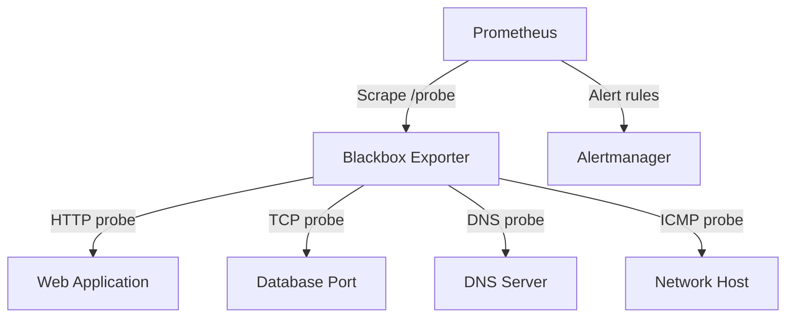

# How to Use Ansible to Configure Blackbox Exporter

Author: [nawazdhandala](https://www.github.com/nawazdhandala)

Tags: Ansible, Blackbox Exporter, Prometheus, Monitoring, DevOps

Description: Deploy and configure Prometheus Blackbox Exporter with Ansible for HTTP, TCP, DNS, and ICMP endpoint probing across your infrastructure.

---

Blackbox Exporter is one of the most useful components in the Prometheus ecosystem. While most exporters scrape metrics from inside a service, Blackbox Exporter probes services from the outside, just like your users would. It answers questions like "Can I reach this HTTP endpoint?", "Is this TCP port accepting connections?", "Does DNS resolve correctly?", and "Is the SSL certificate still valid?"

Deploying Blackbox Exporter with Ansible ensures every monitoring node has the exact same probe configuration. When you add new endpoints to monitor, a single playbook run updates everything. In this guide, I will cover a thorough deployment including custom probe modules, Prometheus scrape configuration, and alerting rules.

## Architecture



## Variables

Define the Blackbox Exporter version, probe modules, and the targets to monitor.

```yaml
# group_vars/monitoring.yml
blackbox_version: "0.24.0"
blackbox_listen_port: 9115
blackbox_config_dir: /etc/blackbox_exporter

# Probe module definitions
blackbox_modules:
  http_2xx:
    prober: http
    timeout: 10s
    http:
      valid_http_versions: ["HTTP/1.1", "HTTP/2.0"]
      valid_status_codes: [200, 201, 204]
      method: GET
      follow_redirects: true
      preferred_ip_protocol: ip4
      tls_config:
        insecure_skip_verify: false

  http_post_2xx:
    prober: http
    timeout: 10s
    http:
      method: POST
      headers:
        Content-Type: application/json
      body: '{"check": "health"}'
      valid_status_codes: [200]

  http_401:
    prober: http
    timeout: 10s
    http:
      valid_status_codes: [401]

  tcp_connect:
    prober: tcp
    timeout: 5s

  tcp_tls:
    prober: tcp
    timeout: 5s
    tcp:
      tls: true
      tls_config:
        insecure_skip_verify: false

  dns_lookup:
    prober: dns
    timeout: 5s
    dns:
      query_name: "example.com"
      query_type: "A"
      valid_rcodes:
        - NOERROR

  icmp_ping:
    prober: icmp
    timeout: 5s
    icmp:
      preferred_ip_protocol: ip4

# Targets organized by probe type
blackbox_http_targets:
  - url: https://api.example.com/health
    name: Production API
    module: http_2xx
  - url: https://www.example.com
    name: Company Website
    module: http_2xx
  - url: https://admin.example.com
    name: Admin Panel (auth required)
    module: http_401
  - url: https://api.example.com/webhook
    name: Webhook Endpoint
    module: http_post_2xx

blackbox_tcp_targets:
  - host: db-primary.internal:5432
    name: PostgreSQL Primary
    module: tcp_connect
  - host: db-replica.internal:5432
    name: PostgreSQL Replica
    module: tcp_connect
  - host: redis.internal:6379
    name: Redis
    module: tcp_connect
  - host: mail.example.com:465
    name: SMTP TLS
    module: tcp_tls

blackbox_dns_targets:
  - server: 10.0.0.2
    name: Internal DNS
  - server: 8.8.8.8
    name: Google DNS

blackbox_icmp_targets:
  - host: 10.0.0.1
    name: Core Router
  - host: 10.0.1.1
    name: App Subnet Gateway
```

## Blackbox Exporter Role

```yaml
# roles/blackbox-exporter/tasks/main.yml
---
- name: Create blackbox_exporter user
  ansible.builtin.user:
    name: blackbox_exporter
    system: yes
    shell: /usr/sbin/nologin
    create_home: no

- name: Create configuration directory
  ansible.builtin.file:
    path: "{{ blackbox_config_dir }}"
    state: directory
    owner: blackbox_exporter
    group: blackbox_exporter
    mode: '0755'

- name: Download Blackbox Exporter
  ansible.builtin.get_url:
    url: "https://github.com/prometheus/blackbox_exporter/releases/download/v{{ blackbox_version }}/blackbox_exporter-{{ blackbox_version }}.linux-amd64.tar.gz"
    dest: /tmp/blackbox_exporter.tar.gz
    checksum: "sha256:{{ blackbox_checksum | default(omit) }}"

- name: Extract Blackbox Exporter
  ansible.builtin.unarchive:
    src: /tmp/blackbox_exporter.tar.gz
    dest: /tmp/
    remote_src: yes

- name: Install binary
  ansible.builtin.copy:
    src: "/tmp/blackbox_exporter-{{ blackbox_version }}.linux-amd64/blackbox_exporter"
    dest: /usr/local/bin/blackbox_exporter
    remote_src: yes
    owner: root
    group: root
    mode: '0755'
  notify: Restart Blackbox Exporter

- name: Deploy configuration file
  ansible.builtin.template:
    src: blackbox.yml.j2
    dest: "{{ blackbox_config_dir }}/blackbox.yml"
    owner: blackbox_exporter
    group: blackbox_exporter
    mode: '0644'
    validate: "/usr/local/bin/blackbox_exporter --config.check --config.file=%s"
  notify: Restart Blackbox Exporter

- name: Deploy systemd service
  ansible.builtin.template:
    src: blackbox_exporter.service.j2
    dest: /etc/systemd/system/blackbox_exporter.service
    mode: '0644'
  notify:
    - Reload systemd
    - Restart Blackbox Exporter

- name: Start and enable Blackbox Exporter
  ansible.builtin.service:
    name: blackbox_exporter
    state: started
    enabled: yes
```

## Configuration Template

```jinja2
# roles/blackbox-exporter/templates/blackbox.yml.j2
# Blackbox Exporter configuration - Managed by Ansible
modules:

  {{ name }}:
    prober: {{ config.prober }}
    timeout: {{ config.timeout | default('10s') }}

    http:


      {{ key }}:

        {{ k }}: {{ v }}


      {{ key }}:

        - {{ item }}


      {{ key }}: {{ value }}




    tcp:


      {{ key }}:

        {{ k }}: {{ v }}


      {{ key }}: {{ value }}




    dns:


      {{ key }}:

        - {{ item }}


      {{ key }}: "{{ value }}"




    icmp:

      {{ key }}: {{ value }}



```

## Systemd Service

```jinja2
# roles/blackbox-exporter/templates/blackbox_exporter.service.j2
[Unit]
Description=Prometheus Blackbox Exporter
Wants=network-online.target
After=network-online.target

[Service]
User=blackbox_exporter
Group=blackbox_exporter
Type=simple
ExecStart=/usr/local/bin/blackbox_exporter \
  --config.file={{ blackbox_config_dir }}/blackbox.yml \
  --web.listen-address=:{{ blackbox_listen_port }} \
  --log.level=info
Restart=always
RestartSec=5

# Required for ICMP probes
AmbientCapabilities=CAP_NET_RAW

[Install]
WantedBy=multi-user.target
```

## Prometheus Scrape Configuration

Generate the Prometheus scrape configs that use Blackbox Exporter for probing.

```jinja2
# roles/prometheus/templates/blackbox-scrape.yml.j2
# Blackbox Exporter scrape configs - Managed by Ansible

# HTTP probes

- job_name: 'blackbox_http_{{ target.name | lower | replace(" ", "_") }}'
  metrics_path: /probe
  params:
    module: [{{ target.module }}]
  static_configs:
    - targets:
        - {{ target.url }}
      labels:
        target_name: "{{ target.name }}"
  scrape_interval: {{ target.interval | default('30s') }}
  scrape_timeout: {{ target.timeout | default('15s') }}
  relabel_configs:
    - source_labels: [__address__]
      target_label: __param_target
    - source_labels: [__param_target]
      target_label: instance
    - target_label: __address__
      replacement: localhost:{{ blackbox_listen_port }}


# TCP probes
- job_name: 'blackbox_tcp'
  metrics_path: /probe
  params:
    module: [tcp_connect]
  static_configs:
    - targets:

        - {{ target.host }}  # {{ target.name }}

  relabel_configs:
    - source_labels: [__address__]
      target_label: __param_target
    - source_labels: [__param_target]
      target_label: instance
    - target_label: __address__
      replacement: localhost:{{ blackbox_listen_port }}

# ICMP probes
- job_name: 'blackbox_icmp'
  metrics_path: /probe
  params:
    module: [icmp_ping]
  static_configs:
    - targets:

        - {{ target.host }}  # {{ target.name }}

  relabel_configs:
    - source_labels: [__address__]
      target_label: __param_target
    - source_labels: [__param_target]
      target_label: instance
    - target_label: __address__
      replacement: localhost:{{ blackbox_listen_port }}

# DNS probes
- job_name: 'blackbox_dns'
  metrics_path: /probe
  params:
    module: [dns_lookup]
  static_configs:
    - targets:

        - {{ target.server }}  # {{ target.name }}

  relabel_configs:
    - source_labels: [__address__]
      target_label: __param_target
    - source_labels: [__param_target]
      target_label: instance
    - target_label: __address__
      replacement: localhost:{{ blackbox_listen_port }}
```

## Alert Rules

```yaml
# roles/prometheus/templates/blackbox-alerts.yml.j2
groups:
  - name: blackbox_alerts
    rules:
      - alert: EndpointDown
        expr: probe_success == 0
        for: 2m
        labels:
          severity: critical
        annotations:
          summary: "Endpoint {{ '{{ $labels.instance }}' }} is unreachable"

      - alert: SSLCertExpiring
        expr: (probe_ssl_earliest_cert_expiry - time()) / 86400 < 14
        for: 1h
        labels:
          severity: warning
        annotations:
          summary: "SSL cert for {{ '{{ $labels.instance }}' }} expires in {{ '{{ $value | printf \"%.0f\" }}' }} days"

      - alert: SlowProbe
        expr: probe_duration_seconds > 5
        for: 5m
        labels:
          severity: warning
        annotations:
          summary: "Probe to {{ '{{ $labels.instance }}' }} is slow at {{ '{{ $value | printf \"%.2f\" }}' }}s"

      - alert: DNSResolutionFailure
        expr: probe_dns_lookup_time_seconds == 0 and probe_success == 0
        for: 2m
        labels:
          severity: critical
        annotations:
          summary: "DNS resolution failed for {{ '{{ $labels.instance }}' }}"
```

## Handlers

```yaml
# roles/blackbox-exporter/handlers/main.yml
---
- name: Reload systemd
  ansible.builtin.systemd:
    daemon_reload: yes

- name: Restart Blackbox Exporter
  ansible.builtin.service:
    name: blackbox_exporter
    state: restarted
```

## Verification

```yaml
# verify-blackbox.yml
---
- name: Verify Blackbox Exporter
  hosts: monitoring
  tasks:
    - name: Check Blackbox Exporter is healthy
      ansible.builtin.uri:
        url: "http://localhost:{{ blackbox_listen_port }}/-/healthy"
        status_code: 200

    - name: Run a test HTTP probe
      ansible.builtin.uri:
        url: "http://localhost:{{ blackbox_listen_port }}/probe?target=https://www.google.com&module=http_2xx"
        status_code: 200
      register: test_probe

    - name: Show probe result
      ansible.builtin.debug:
        msg: "Test probe completed successfully"
      when: test_probe.status == 200
```

## Running the Playbook

```bash
# Deploy Blackbox Exporter
ansible-playbook -i inventory/hosts.ini site.yml

# Verify the deployment
ansible-playbook -i inventory/hosts.ini verify-blackbox.yml

# Update targets without restarting (Prometheus reload)
ansible-playbook -i inventory/hosts.ini site.yml --tags targets
```

## Wrapping Up

Blackbox Exporter is one of those tools that earns its keep immediately. Combined with Ansible, you get a probing infrastructure that is defined in code and easy to extend. Adding a new endpoint to monitor means adding a line to your variables file. The probe modules cover the most common check types, and you can build custom modules for specialized protocols. The key metrics to alert on are probe_success for availability, probe_ssl_earliest_cert_expiry for certificate management, and probe_duration_seconds for latency tracking.
