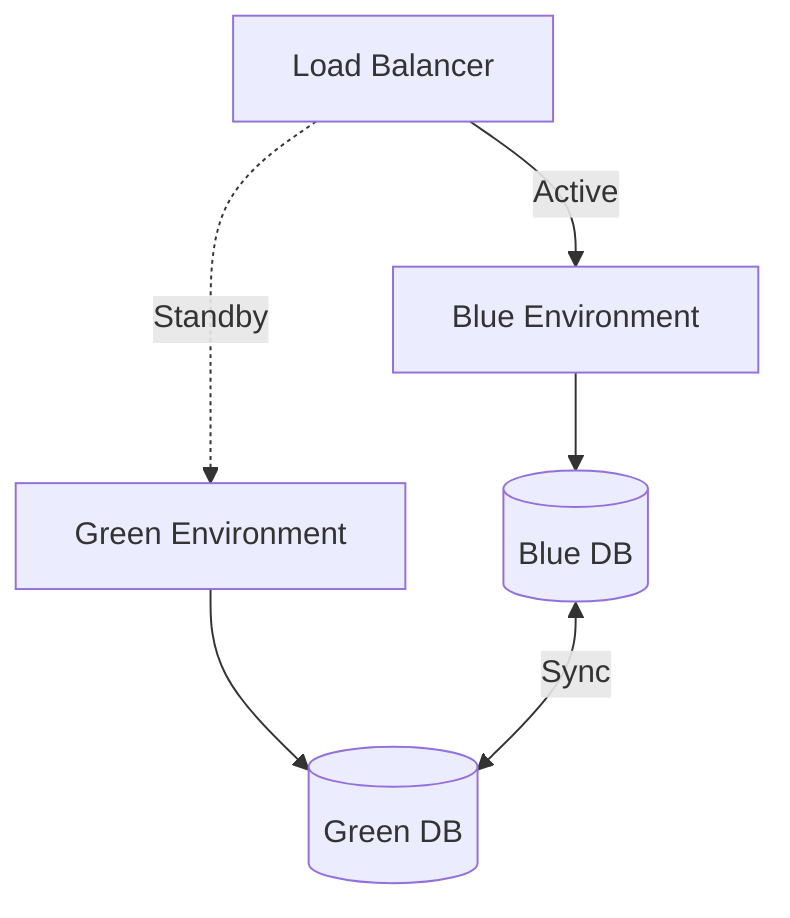

# How to Use Ansible to Set Up Blue-Green Infrastructure

Author: [nawazdhandala](https://www.github.com/nawazdhandala)

Tags: Ansible, Blue-Green, Deployment, DevOps, Zero-Downtime

Description: Implement blue-green deployment infrastructure with Ansible including environment provisioning, traffic switching, and rollback capabilities.

---

Blue-green deployment is a release strategy that reduces downtime and risk by running two identical production environments called Blue and Green. At any time, only one environment serves live traffic. When you deploy a new version, you deploy it to the inactive environment, test it, and then switch the router to direct traffic to it. If something goes wrong, you switch back to the previous environment. Ansible is well-suited for managing this infrastructure pattern.

## Blue-Green Architecture



## Role Defaults

```yaml
# roles/blue_green/defaults/main.yml - Blue-green configuration
bg_active_env: blue
bg_blue_servers: "{{ groups['blue'] }}"
bg_green_servers: "{{ groups['green'] }}"
bg_load_balancer: lb.example.com
bg_app_port: 8080
bg_health_endpoint: /health
bg_switch_delay: 30
```

## Deployment to Inactive Environment

```yaml
# roles/blue_green/tasks/deploy.yml - Deploy to the inactive environment
---
- name: Determine inactive environment
  set_fact:
    inactive_env: "{{ 'green' if bg_active_env == 'blue' else 'blue' }}"
    inactive_servers: "{{ bg_green_servers if bg_active_env == 'blue' else bg_blue_servers }}"

- name: Deploy new version to inactive environment
  include_role:
    name: app_deploy
  delegate_to: "{{ item }}"
  loop: "{{ inactive_servers }}"

- name: Verify deployment on inactive environment
  uri:
    url: "http://{{ item }}:{{ bg_app_port }}{{ bg_health_endpoint }}"
    status_code: 200
  loop: "{{ inactive_servers }}"
  register: health_check
  until: health_check.status == 200
  retries: 10
  delay: 5

- name: Run integration tests against inactive environment
  command: "pytest tests/ --base-url=http://{{ inactive_servers[0] }}:{{ bg_app_port }}"
  delegate_to: localhost
  register: test_result

- name: Abort if tests fail
  fail:
    msg: "Integration tests failed on {{ inactive_env }} environment. Not switching traffic."
  when: test_result.rc != 0
```

## Traffic Switch

```yaml
# roles/blue_green/tasks/switch.yml - Switch traffic between environments
---
- name: Update load balancer to point to new environment
  template:
    src: haproxy_backend.cfg.j2
    dest: /etc/haproxy/conf.d/app-backend.cfg
    mode: '0644'
  delegate_to: "{{ bg_load_balancer }}"
  vars:
    active_servers: "{{ inactive_servers }}"
  notify: reload haproxy

- name: Wait for traffic switch to stabilize
  pause:
    seconds: "{{ bg_switch_delay }}"

- name: Verify new active environment is serving traffic
  uri:
    url: "https://app.example.com{{ bg_health_endpoint }}"
    status_code: 200
  register: live_check
  retries: 5
  delay: 5
  delegate_to: localhost

- name: Update active environment marker
  copy:
    content: "{{ inactive_env }}"
    dest: /opt/blue-green/active_env
    mode: '0644'
  delegate_to: localhost
```

## Rollback

```yaml
# roles/blue_green/tasks/rollback.yml - Switch back to previous environment
---
- name: Read current active environment
  slurp:
    src: /opt/blue-green/active_env
  register: current_active
  delegate_to: localhost

- name: Switch back to previous environment
  template:
    src: haproxy_backend.cfg.j2
    dest: /etc/haproxy/conf.d/app-backend.cfg
    mode: '0644'
  delegate_to: "{{ bg_load_balancer }}"
  vars:
    active_servers: "{{ bg_blue_servers if current_active.content | b64decode | trim == 'green' else bg_green_servers }}"
  notify: reload haproxy
```

## Running the Deployment

```bash
# Deploy to inactive environment and switch traffic
ansible-playbook -i inventory/hosts.ini deploy-bg.yml -e "app_version=2.0.0"

# Rollback to previous environment
ansible-playbook -i inventory/hosts.ini rollback-bg.yml
```

## Summary

Blue-green deployment with Ansible gives you zero-downtime releases with instant rollback capability. The inactive environment gets the new version, undergoes testing, and only receives live traffic after passing validation. If anything goes wrong post-switch, rolling back is just another traffic switch away. This pattern works with any load balancer that supports dynamic backend configuration.

## Common Use Cases

Here are several practical scenarios where this module proves essential in real-world playbooks.

### Infrastructure Provisioning Workflow

```yaml
# Complete workflow incorporating this module
- name: Infrastructure provisioning
  hosts: all
  become: true
  gather_facts: true
  tasks:
    - name: Gather system information
      ansible.builtin.setup:
        gather_subset:
          - hardware
          - network

    - name: Display system summary
      ansible.builtin.debug:
        msg: >-
          Host {{ inventory_hostname }} has
          {{ ansible_memtotal_mb }}MB RAM,
          {{ ansible_processor_vcpus }} vCPUs,
          running {{ ansible_distribution }} {{ ansible_distribution_version }}

    - name: Install required packages
      ansible.builtin.package:
        name:
          - curl
          - wget
          - git
          - vim
          - htop
          - jq
        state: present

    - name: Configure system timezone
      ansible.builtin.timezone:
        name: "{{ system_timezone | default('UTC') }}"

    - name: Configure hostname
      ansible.builtin.hostname:
        name: "{{ inventory_hostname }}"

    - name: Update /etc/hosts
      ansible.builtin.lineinfile:
        path: /etc/hosts
        regexp: '^127\.0\.1\.1'
        line: "127.0.1.1 {{ inventory_hostname }}"

    - name: Configure SSH hardening
      ansible.builtin.lineinfile:
        path: /etc/ssh/sshd_config
        regexp: "{{ item.regexp }}"
        line: "{{ item.line }}"
      loop:
        - { regexp: '^PermitRootLogin', line: 'PermitRootLogin no' }
        - { regexp: '^PasswordAuthentication', line: 'PasswordAuthentication no' }
      notify: restart sshd

    - name: Configure firewall rules
      community.general.ufw:
        rule: allow
        port: "{{ item }}"
        proto: tcp
      loop:
        - "22"
        - "80"
        - "443"

    - name: Enable firewall
      community.general.ufw:
        state: enabled
        policy: deny

  handlers:
    - name: restart sshd
      ansible.builtin.service:
        name: sshd
        state: restarted
```

### Integration with Monitoring

```yaml
# Using gathered facts to configure monitoring thresholds
- name: Configure monitoring based on system specs
  hosts: all
  become: true
  tasks:
    - name: Set monitoring thresholds based on hardware
      ansible.builtin.template:
        src: monitoring_config.yml.j2
        dest: /etc/monitoring/config.yml
      vars:
        memory_warning_threshold: "{{ (ansible_memtotal_mb * 0.8) | int }}"
        memory_critical_threshold: "{{ (ansible_memtotal_mb * 0.95) | int }}"
        cpu_warning_threshold: 80
        cpu_critical_threshold: 95

    - name: Register host with monitoring system
      ansible.builtin.uri:
        url: "https://monitoring.example.com/api/hosts"
        method: POST
        body_format: json
        body:
          hostname: "{{ inventory_hostname }}"
          ip_address: "{{ ansible_default_ipv4.address }}"
          os: "{{ ansible_distribution }}"
          memory_mb: "{{ ansible_memtotal_mb }}"
          cpus: "{{ ansible_processor_vcpus }}"
        headers:
          Authorization: "Bearer {{ monitoring_api_token }}"
        status_code: [200, 201, 409]
```

### Error Handling Patterns

```yaml
# Robust error handling with this module
- name: Robust task execution
  hosts: all
  tasks:
    - name: Attempt primary operation
      ansible.builtin.command: /opt/app/primary-task.sh
      register: primary_result
      failed_when: false

    - name: Handle primary failure with fallback
      ansible.builtin.command: /opt/app/fallback-task.sh
      when: primary_result.rc != 0
      register: fallback_result

    - name: Report final status
      ansible.builtin.debug:
        msg: >-
          Task completed via {{ 'primary' if primary_result.rc == 0 else 'fallback' }} path.
          Return code: {{ primary_result.rc if primary_result.rc == 0 else fallback_result.rc }}

    - name: Fail if both paths failed
      ansible.builtin.fail:
        msg: "Both primary and fallback operations failed"
      when:
        - primary_result.rc != 0
        - fallback_result is defined
        - fallback_result.rc != 0
```

### Scheduling and Automation

```yaml
# Set up scheduled compliance scans using cron
- name: Configure automated scans
  hosts: all
  become: true
  tasks:
    - name: Create scan script
      ansible.builtin.copy:
        dest: /opt/scripts/compliance_scan.sh
        mode: '0755'
        content: |
          #!/bin/bash
          cd /opt/ansible
          ansible-playbook playbooks/validate.yml -i inventory/ > /var/log/compliance_scan.log 2>&1
          EXIT_CODE=$?
          if [ $EXIT_CODE -ne 0 ]; then
            curl -X POST https://hooks.example.com/alert \
              -H "Content-Type: application/json" \
              -d "{\"text\":\"Compliance scan failed on $(hostname)\"}"
          fi
          exit $EXIT_CODE

    - name: Schedule weekly compliance scan
      ansible.builtin.cron:
        name: "Weekly compliance scan"
        minute: "0"
        hour: "3"
        weekday: "1"
        job: "/opt/scripts/compliance_scan.sh"
        user: ansible
```

