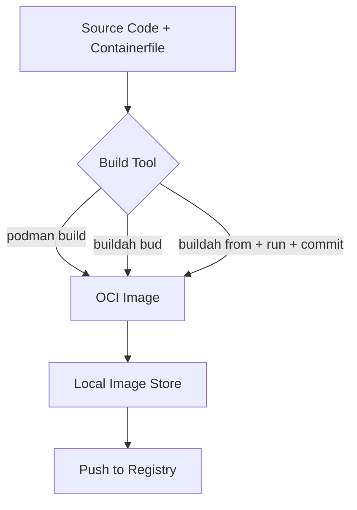

# How to Use Ansible to Build Podman Images

Author: [nawazdhandala](https://www.github.com/nawazdhandala)

Tags: Ansible, Podman, Container Images, Buildah, DevOps

Description: Build container images using Ansible with Podman and Buildah for automated, reproducible image creation workflows.

---

Building container images is a core part of any container workflow. Podman includes built-in image building capabilities and also works seamlessly with Buildah, a dedicated tool for building OCI-compliant images. Ansible can orchestrate the entire build process, from checking out source code to pushing finished images to a registry. This post walks through building images with Podman and Buildah using Ansible.

## Podman Build vs Buildah

Podman can build images using `podman build`, which processes a Containerfile (or Dockerfile). Buildah goes further by letting you build images step by step without a Containerfile, which is useful for complex build scenarios or when you want to avoid shell-in-shell scripting.



## Building Images with the podman_image Module

The `containers.podman.podman_image` module handles both pulling and building images:

```yaml
# build_image.yml - Build a Podman image from a Containerfile
---
- name: Build Container Image with Podman
  hosts: build_servers
  become: false

  tasks:
    - name: Create build context directory
      ansible.builtin.file:
        path: /tmp/build/myapp
        state: directory
        mode: '0755'

    - name: Copy application source to build context
      ansible.builtin.copy:
        src: app/
        dest: /tmp/build/myapp/
        mode: '0644'

    - name: Create Containerfile
      ansible.builtin.copy:
        dest: /tmp/build/myapp/Containerfile
        mode: '0644'
        content: |
          FROM docker.io/library/python:3.12-slim

          WORKDIR /app

          # Install dependencies first for better layer caching
          COPY requirements.txt .
          RUN pip install --no-cache-dir -r requirements.txt

          # Copy application code
          COPY . .

          EXPOSE 8000

          HEALTHCHECK --interval=30s --timeout=5s \
            CMD curl -f http://localhost:8000/health || exit 1

          CMD ["gunicorn", "--bind", "0.0.0.0:8000", "app:create_app()"]

    - name: Build the image
      containers.podman.podman_image:
        name: myapp
        tag: "1.0.0"
        path: /tmp/build/myapp
        build:
          file: Containerfile
          cache: true
          rm: true
          format: oci
        state: build
      register: build_result

    - name: Show build result
      ansible.builtin.debug:
        msg: "Built image: {{ build_result.image.Id }}"
```

## Multi-Stage Builds

Multi-stage builds keep your final image small by separating the build environment from the runtime environment:

```yaml
# multistage_build.yml - Build image using multi-stage Containerfile
---
- name: Multi-Stage Image Build
  hosts: build_servers
  become: false
  vars:
    app_version: "2.0.0"

  tasks:
    - name: Create Containerfile with multi-stage build
      ansible.builtin.copy:
        dest: /tmp/build/Containerfile
        mode: '0644'
        content: |
          # Stage 1: Build the Go application
          FROM docker.io/library/golang:1.22 AS builder

          WORKDIR /src
          COPY go.mod go.sum ./
          RUN go mod download
          COPY . .
          RUN CGO_ENABLED=0 GOOS=linux go build -o /app/server ./cmd/server

          # Stage 2: Create minimal runtime image
          FROM docker.io/library/alpine:3.19

          RUN apk --no-cache add ca-certificates
          COPY --from=builder /app/server /usr/local/bin/server

          RUN adduser -D -u 1000 appuser
          USER appuser

          EXPOSE 8080
          ENTRYPOINT ["server"]

    - name: Build multi-stage image
      containers.podman.podman_image:
        name: "registry.example.com/myapp"
        tag: "{{ app_version }}"
        path: /tmp/build
        build:
          file: Containerfile
          cache: true
        state: build
```

## Building with Build Arguments

Pass build-time variables to customize the image:

```yaml
# build_with_args.yml - Build with build arguments
---
- name: Build Image with Arguments
  hosts: build_servers
  become: false
  vars:
    build_args:
      APP_VERSION: "3.1.0"
      BUILD_DATE: "{{ ansible_date_time.iso8601 }}"
      GIT_COMMIT: "{{ git_hash }}"
      BASE_IMAGE: "python:3.12-slim"

  tasks:
    - name: Get git commit hash
      ansible.builtin.command:
        cmd: git rev-parse --short HEAD
        chdir: /opt/source/myapp
      register: git_info
      changed_when: false

    - name: Set git hash fact
      ansible.builtin.set_fact:
        git_hash: "{{ git_info.stdout }}"

    - name: Create Containerfile with ARG directives
      ansible.builtin.copy:
        dest: /opt/source/myapp/Containerfile
        mode: '0644'
        content: |
          ARG BASE_IMAGE=python:3.12-slim
          FROM docker.io/library/${BASE_IMAGE}

          ARG APP_VERSION
          ARG BUILD_DATE
          ARG GIT_COMMIT

          LABEL org.opencontainers.image.version="${APP_VERSION}" \
                org.opencontainers.image.created="${BUILD_DATE}" \
                org.opencontainers.image.revision="${GIT_COMMIT}"

          WORKDIR /app
          COPY . .
          RUN pip install --no-cache-dir -r requirements.txt

          ENV APP_VERSION=${APP_VERSION}
          CMD ["python", "main.py"]

    - name: Build image with arguments
      containers.podman.podman_image:
        name: "registry.example.com/myapp"
        tag: "{{ build_args.APP_VERSION }}"
        path: /opt/source/myapp
        build:
          file: Containerfile
          extra_args: >-
            --build-arg APP_VERSION={{ build_args.APP_VERSION }}
            --build-arg BUILD_DATE={{ build_args.BUILD_DATE }}
            --build-arg GIT_COMMIT={{ git_hash }}
            --build-arg BASE_IMAGE={{ build_args.BASE_IMAGE }}
        state: build
```

## Building with Buildah

For more complex scenarios, Buildah lets you build images step by step. This is powerful for images that are hard to express in a Containerfile:

```yaml
# buildah_build.yml - Build an image step-by-step with Buildah
---
- name: Build Image with Buildah
  hosts: build_servers
  become: false

  tasks:
    - name: Create a new container from base image
      ansible.builtin.command:
        cmd: buildah from docker.io/library/ubuntu:22.04
      register: container_id
      changed_when: true

    - name: Install packages
      ansible.builtin.command:
        cmd: >
          buildah run {{ container_id.stdout }} --
          bash -c "apt-get update && apt-get install -y python3 python3-pip nginx && rm -rf /var/lib/apt/lists/*"
      changed_when: true

    - name: Copy application files into the container
      ansible.builtin.command:
        cmd: "buildah copy {{ container_id.stdout }} /opt/source/myapp /app"
      changed_when: true

    - name: Install Python dependencies
      ansible.builtin.command:
        cmd: "buildah run {{ container_id.stdout }} -- pip3 install -r /app/requirements.txt"
      changed_when: true

    - name: Configure the image metadata
      ansible.builtin.command:
        cmd: "{{ item }}"
      loop:
        - "buildah config --port 8080 {{ container_id.stdout }}"
        - "buildah config --workingdir /app {{ container_id.stdout }}"
        - "buildah config --cmd 'python3 main.py' {{ container_id.stdout }}"
        - "buildah config --label maintainer='devops@example.com' {{ container_id.stdout }}"
        - "buildah config --env APP_ENV=production {{ container_id.stdout }}"
      changed_when: true

    - name: Commit the container as an image
      ansible.builtin.command:
        cmd: "buildah commit {{ container_id.stdout }} registry.example.com/myapp:latest"
      changed_when: true

    - name: Remove the working container
      ansible.builtin.command:
        cmd: "buildah rm {{ container_id.stdout }}"
      changed_when: true
```

## Pushing Images to a Registry

After building, push the image to a registry:

```yaml
# push_image.yml - Push a Podman image to a registry
---
- name: Push Image to Registry
  hosts: build_servers
  become: false
  vars:
    registry: registry.example.com
    image_name: myapp
    image_tag: "1.0.0"

  tasks:
    - name: Login to registry
      containers.podman.podman_login:
        registry: "{{ registry }}"
        username: "{{ registry_user }}"
        password: "{{ vault_registry_password }}"

    - name: Push the image
      containers.podman.podman_image:
        name: "{{ registry }}/{{ image_name }}"
        tag: "{{ image_tag }}"
        push: true
        push_args:
          dest: "{{ registry }}/{{ image_name }}:{{ image_tag }}"

    - name: Also tag and push as latest
      containers.podman.podman_image:
        name: "{{ registry }}/{{ image_name }}"
        tag: "{{ image_tag }}"
        push: true
        push_args:
          dest: "{{ registry }}/{{ image_name }}:latest"

    - name: Logout from registry
      containers.podman.podman_logout:
        registry: "{{ registry }}"
```

## Complete CI Build Pipeline

Here is a full pipeline that clones, builds, tests, and pushes:

```yaml
# ci_pipeline.yml - Full CI build pipeline with Podman
---
- name: CI Build Pipeline
  hosts: build_servers
  become: false
  vars:
    repo_url: "https://github.com/myorg/myapp.git"
    branch: main
    registry: registry.example.com
    image_name: myapp

  tasks:
    - name: Clone the repository
      ansible.builtin.git:
        repo: "{{ repo_url }}"
        dest: /tmp/ci-build/myapp
        version: "{{ branch }}"
        force: true

    - name: Get commit hash for tagging
      ansible.builtin.command:
        cmd: git rev-parse --short HEAD
        chdir: /tmp/ci-build/myapp
      register: commit_hash
      changed_when: false

    - name: Build the image
      containers.podman.podman_image:
        name: "{{ registry }}/{{ image_name }}"
        tag: "{{ commit_hash.stdout }}"
        path: /tmp/ci-build/myapp
        build:
          cache: true
        state: build

    - name: Run tests against the built image
      ansible.builtin.command:
        cmd: >
          podman run --rm
          {{ registry }}/{{ image_name }}:{{ commit_hash.stdout }}
          python -m pytest tests/ -v
      register: test_result
      changed_when: false

    - name: Push image if tests pass
      containers.podman.podman_image:
        name: "{{ registry }}/{{ image_name }}"
        tag: "{{ commit_hash.stdout }}"
        push: true
      when: test_result.rc == 0

    - name: Clean up build directory
      ansible.builtin.file:
        path: /tmp/ci-build/myapp
        state: absent
```

## Cleaning Up Build Artifacts

Builds produce a lot of cached layers. Clean up periodically:

```yaml
# cleanup_builds.yml - Remove unused images and build cache
---
- name: Clean Up Build Artifacts
  hosts: build_servers
  become: false

  tasks:
    - name: Remove dangling images
      ansible.builtin.command:
        cmd: podman image prune -f
      register: prune_result
      changed_when: prune_result.stdout_lines | length > 0

    - name: Remove images older than 7 days
      ansible.builtin.command:
        cmd: podman image prune -a --filter until=168h -f
      changed_when: true

    - name: Clean Buildah containers
      ansible.builtin.command:
        cmd: buildah rm --all
      changed_when: true
      ignore_errors: true
```

## Summary

Building container images with Ansible and Podman gives you reproducible, automated builds without needing a Docker daemon. The `containers.podman.podman_image` module handles straightforward Containerfile-based builds, while Buildah provides step-by-step control for complex scenarios. Combined with registry login and push capabilities, you can build complete CI pipelines entirely within Ansible. The rootless operation means your build server does not need to run privileged daemons, which simplifies security compliance in enterprise environments.
