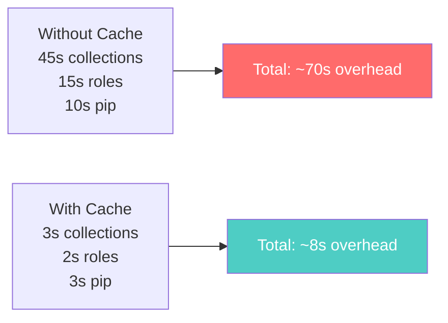

# How to Cache Ansible Collections in CI/CD Pipelines

Author: [nawazdhandala](https://www.github.com/nawazdhandala)

Tags: Ansible, CI/CD, Caching, Performance

Description: Speed up your CI/CD pipelines by caching Ansible collections and roles instead of downloading them on every build run.

---

Every time your CI/CD pipeline runs, it installs Ansible, downloads collections from Galaxy, and pulls roles from Git. On a busy project, this adds up to minutes of wasted time per build. Caching Ansible collections and roles cuts this overhead significantly. A collection install that takes 30 seconds from Galaxy takes under a second from cache.

This post shows you how to cache Ansible collections and roles in GitHub Actions, GitLab CI, and Jenkins, along with strategies for cache invalidation.

## What Gets Downloaded

A typical Ansible CI/CD job downloads several things. First, the Ansible package itself and its Python dependencies. Second, collections from Ansible Galaxy (like `community.general`, `amazon.aws`, etc.). Third, roles from Galaxy or Git repositories. Caching all of these saves significant time.

## requirements.yml File

Start by pinning your collection and role versions in a `requirements.yml` file. This is both a best practice and a prerequisite for effective caching.

```yaml
# requirements.yml
# Pin collection and role versions for reproducible builds
collections:
  - name: community.general
    version: "8.3.0"
  - name: amazon.aws
    version: "7.2.0"
  - name: community.postgresql
    version: "3.3.0"
  - name: community.mysql
    version: "3.9.0"
  - name: community.hashi_vault
    version: "6.1.0"

roles:
  - name: geerlingguy.docker
    version: "7.1.0"
  - name: geerlingguy.nginx
    version: "3.2.0"
```

## GitHub Actions Caching

GitHub Actions has built-in cache support. Here is how to cache Ansible collections.

```yaml
# .github/workflows/deploy.yml
# Cache Ansible collections to speed up pipeline runs
name: Deploy

on:
  push:
    branches: [main]

jobs:
  deploy:
    runs-on: ubuntu-latest

    steps:
      - uses: actions/checkout@v4

      - name: Setup Python
        uses: actions/setup-python@v5
        with:
          python-version: '3.11'

      - name: Cache pip packages
        uses: actions/cache@v4
        with:
          path: ~/.cache/pip
          key: pip-${{ hashFiles('requirements-pip.txt') }}
          restore-keys: |
            pip-

      - name: Cache Ansible collections
        uses: actions/cache@v4
        with:
          path: ~/.ansible/collections
          key: ansible-collections-${{ hashFiles('requirements.yml') }}
          restore-keys: |
            ansible-collections-

      - name: Cache Ansible roles
        uses: actions/cache@v4
        with:
          path: ~/.ansible/roles
          key: ansible-roles-${{ hashFiles('requirements.yml') }}
          restore-keys: |
            ansible-roles-

      - name: Install Ansible
        run: pip install ansible

      - name: Install collections and roles
        run: |
          ansible-galaxy collection install -r requirements.yml --force-with-deps
          ansible-galaxy role install -r requirements.yml --force

      - name: Run playbook
        run: |
          ansible-playbook playbooks/deploy.yml \
            -i inventories/production/ \
            -e "deploy_version=${{ github.sha }}"
```

The cache key is based on the hash of `requirements.yml`. When you update a collection version, the hash changes and a fresh download happens. Otherwise, the cache is restored.

## GitLab CI Caching

GitLab CI uses a different caching mechanism but achieves the same result.

```yaml
# .gitlab-ci.yml
# Cache Ansible dependencies between pipeline runs
variables:
  ANSIBLE_COLLECTIONS_PATH: "${CI_PROJECT_DIR}/.ansible/collections"
  ANSIBLE_ROLES_PATH: "${CI_PROJECT_DIR}/.ansible/roles"
  PIP_CACHE_DIR: "${CI_PROJECT_DIR}/.pip-cache"

stages:
  - deploy

deploy:
  stage: deploy
  image: python:3.11-slim
  cache:
    - key:
        files:
          - requirements.yml
      paths:
        - .ansible/collections/
        - .ansible/roles/
      policy: pull-push
    - key:
        files:
          - requirements-pip.txt
      paths:
        - .pip-cache/
      policy: pull-push

  before_script:
    - pip install ansible
    - ansible-galaxy collection install -r requirements.yml
    - ansible-galaxy role install -r requirements.yml

  script:
    - ansible-playbook playbooks/deploy.yml
        -i inventories/production/
        -e "deploy_version=${CI_COMMIT_SHORT_SHA}"
```

The `policy: pull-push` means the job will try to restore the cache at the start and update it at the end.

## Jenkins Caching

Jenkins does not have built-in caching like GitHub Actions or GitLab CI, but you can use a persistent workspace or a shared volume.

```groovy
// Jenkinsfile
// Use a persistent directory for Ansible collections cache
pipeline {
    agent any

    environment {
        ANSIBLE_COLLECTIONS_PATH = "${WORKSPACE}/.ansible-cache/collections"
        ANSIBLE_ROLES_PATH = "${WORKSPACE}/.ansible-cache/roles"
    }

    stages {
        stage('Setup') {
            steps {
                sh '''
                    pip install ansible
                    mkdir -p ${ANSIBLE_COLLECTIONS_PATH}
                    mkdir -p ${ANSIBLE_ROLES_PATH}
                    ansible-galaxy collection install -r requirements.yml
                    ansible-galaxy role install -r requirements.yml
                '''
            }
        }

        stage('Deploy') {
            steps {
                sh '''
                    ansible-playbook playbooks/deploy.yml \
                      -i inventories/production/ \
                      -e "deploy_version=${GIT_COMMIT}"
                '''
            }
        }
    }
}
```

For better caching in Jenkins, use the `stash/unstash` steps or the Job Cacher plugin.

```groovy
// Using Jenkins stash for collection caching
stage('Cache Collections') {
    steps {
        script {
            def cacheExists = fileExists('.ansible-cache/collections')
            if (!cacheExists) {
                sh 'ansible-galaxy collection install -r requirements.yml -p .ansible-cache/collections'
            }
        }
        stash includes: '.ansible-cache/**', name: 'ansible-cache'
    }
}
```

## Cache Invalidation Strategies

Cache invalidation is important. You do not want stale collections causing weird bugs. Here are three strategies.

Strategy 1: Hash-based keys (recommended). The cache key includes a hash of `requirements.yml`, so any version change invalidates the cache.

Strategy 2: Time-based expiry. Some CI systems support TTL on caches.

```yaml
# GitLab CI cache with expiry - rebuild weekly regardless
cache:
  key:
    files:
      - requirements.yml
  paths:
    - .ansible/collections/
  when: on_success
```

Strategy 3: Manual invalidation. Increment a version number in the cache key.

```yaml
# GitHub Actions - bump CACHE_VERSION to force a fresh download
- uses: actions/cache@v4
  with:
    path: ~/.ansible/collections
    key: v2-ansible-collections-${{ hashFiles('requirements.yml') }}
```

## Measuring Cache Impact

Here is a simple way to measure the time savings from caching.

```yaml
# .github/workflows/deploy.yml
# Time the collection install to measure cache effectiveness
- name: Install collections (timed)
  run: |
    START=$(date +%s)
    ansible-galaxy collection install -r requirements.yml
    END=$(date +%s)
    echo "Collection install took $((END - START)) seconds"
```

In my experience, the first run (no cache) takes 25-45 seconds for a typical set of 5-6 collections. Subsequent cached runs take 2-5 seconds because `ansible-galaxy` checks local paths first.

## Caching in Docker-Based CI/CD

If your CI/CD uses Docker containers, you can bake the collections into a custom image.

```dockerfile
# Dockerfile.ansible
# Custom CI image with pre-installed Ansible collections
FROM python:3.11-slim

RUN pip install ansible==9.2.0

COPY requirements.yml /tmp/requirements.yml
RUN ansible-galaxy collection install -r /tmp/requirements.yml && \
    ansible-galaxy role install -r /tmp/requirements.yml

WORKDIR /ansible
```

```yaml
# .gitlab-ci.yml using the custom image
deploy:
  image: registry.myorg.com/ansible-ci:latest
  script:
    - ansible-playbook playbooks/deploy.yml -i inventories/production/
```

This approach moves the collection download to image build time, so CI/CD jobs start with everything pre-installed. Rebuild the image when `requirements.yml` changes.

## Pipeline Time Savings



## Conclusion

Caching Ansible collections in CI/CD is a low-effort, high-impact optimization. Pin your collection versions in `requirements.yml`, use your CI platform's caching mechanism, and key the cache on the hash of the requirements file. For the fastest possible pipeline, bake collections into a custom Docker image. The time savings compound quickly when you have multiple pipelines running dozens of times a day.
