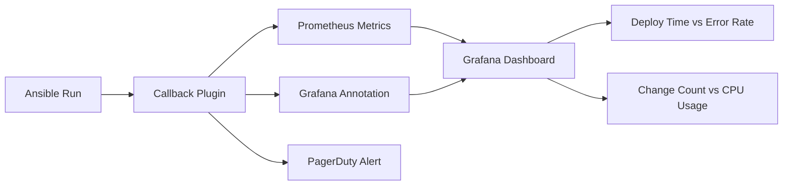

# How to Use Ansible Callback Plugins for Monitoring Integration

Author: [nawazdhandala](https://www.github.com/nawazdhandala)

Tags: Ansible, Callback Plugins, Monitoring, Observability, DevOps

Description: Integrate Ansible with monitoring systems like Prometheus, Grafana, Datadog, and PagerDuty using callback plugins for full deployment observability.

---

Ansible callback plugins provide a bridge between your automation runs and your monitoring stack. Instead of Ansible being a black box where you only know "it ran" or "it failed," you can feed detailed event data into Prometheus, Grafana, Datadog, PagerDuty, or any monitoring system. This gives you deployment metrics, alerting on failures, and correlation between infrastructure changes and performance issues.

## The Monitoring Integration Pattern

The general approach is:

1. Enable a callback plugin that sends data to your monitoring system
2. The callback fires events for task results, timing, and failures
3. Your monitoring system ingests these events as metrics or logs
4. You build dashboards and alerts on the data

Some monitoring systems have dedicated Ansible callbacks. For others, you write a custom callback or use a webhook.

## Prometheus Integration

Prometheus uses a pull model, so you need a bridge. The common approach is to use the Pushgateway to push Ansible metrics:

```python
# callback_plugins/prometheus_pushgw.py - Push Ansible metrics to Prometheus
import os
import time
from ansible.plugins.callback import CallbackBase

try:
    from prometheus_client import CollectorRegistry, Gauge, Counter, push_to_gateway
    HAS_PROMETHEUS = True
except ImportError:
    HAS_PROMETHEUS = False


class CallbackModule(CallbackBase):
    """Push Ansible run metrics to Prometheus Pushgateway."""

    CALLBACK_VERSION = 2.0
    CALLBACK_TYPE = 'notification'
    CALLBACK_NAME = 'prometheus_pushgw'
    CALLBACK_NEEDS_WHITELIST = True

    def __init__(self):
        super().__init__()
        self.pushgw_url = os.environ.get('PROMETHEUS_PUSHGATEWAY', 'localhost:9091')
        self.start_time = None
        self.task_count = 0
        self.failure_count = 0
        self.change_count = 0
        self.playbook_name = ''

        if not HAS_PROMETHEUS:
            self._display.warning('prometheus_client library not installed')

    def v2_playbook_on_start(self, playbook):
        self.start_time = time.time()
        self.playbook_name = os.path.basename(playbook._file_name)

    def v2_runner_on_ok(self, result):
        self.task_count += 1
        if result._result.get('changed', False):
            self.change_count += 1

    def v2_runner_on_failed(self, result, ignore_errors=False):
        self.task_count += 1
        if not ignore_errors:
            self.failure_count += 1

    def v2_playbook_on_stats(self, stats):
        if not HAS_PROMETHEUS:
            return

        duration = time.time() - self.start_time
        registry = CollectorRegistry()

        # Create metrics
        duration_gauge = Gauge(
            'ansible_playbook_duration_seconds',
            'Playbook execution duration',
            ['playbook'],
            registry=registry
        )
        tasks_total = Gauge(
            'ansible_tasks_total',
            'Total tasks executed',
            ['playbook'],
            registry=registry
        )
        failures_total = Gauge(
            'ansible_failures_total',
            'Total task failures',
            ['playbook'],
            registry=registry
        )
        changes_total = Gauge(
            'ansible_changes_total',
            'Total changed tasks',
            ['playbook'],
            registry=registry
        )

        # Set values
        duration_gauge.labels(playbook=self.playbook_name).set(duration)
        tasks_total.labels(playbook=self.playbook_name).set(self.task_count)
        failures_total.labels(playbook=self.playbook_name).set(self.failure_count)
        changes_total.labels(playbook=self.playbook_name).set(self.change_count)

        # Push to gateway
        try:
            push_to_gateway(
                self.pushgw_url,
                job='ansible',
                registry=registry
            )
        except Exception as e:
            self._display.warning(f'Failed to push to Prometheus: {e}')
```

Enable and configure:

```ini
# ansible.cfg
[defaults]
callback_whitelist = prometheus_pushgw
callback_plugins = ./callback_plugins
```

```bash
# Set the Pushgateway URL
export PROMETHEUS_PUSHGATEWAY=pushgateway.example.com:9091
pip install prometheus_client
```

## Datadog Integration

Datadog has a community callback plugin:

```bash
# Install the Datadog callback
pip install datadog
ansible-galaxy collection install community.general
```

```ini
# ansible.cfg - Datadog integration
[defaults]
callback_whitelist = community.general.datadog

[callback_datadog]
api_key = {{ lookup('env', 'DATADOG_API_KEY') }}
```

The Datadog callback sends events to the Datadog Events API and creates metrics for:

- Playbook duration
- Task success/failure counts
- Host status
- Change counts

You can then build Datadog dashboards and monitors on these metrics.

## PagerDuty Integration

Alert on-call engineers when Ansible playbooks fail:

```python
# callback_plugins/pagerduty_alert.py - Alert PagerDuty on Ansible failures
import os
import json
from ansible.plugins.callback import CallbackBase

try:
    import requests
    HAS_REQUESTS = True
except ImportError:
    HAS_REQUESTS = False


class CallbackModule(CallbackBase):
    CALLBACK_VERSION = 2.0
    CALLBACK_TYPE = 'notification'
    CALLBACK_NAME = 'pagerduty_alert'
    CALLBACK_NEEDS_WHITELIST = True

    def __init__(self):
        super().__init__()
        self.routing_key = os.environ.get('PAGERDUTY_ROUTING_KEY', '')
        self.playbook_name = ''
        self.failures = []

    def v2_playbook_on_start(self, playbook):
        self.playbook_name = playbook._file_name

    def v2_runner_on_failed(self, result, ignore_errors=False):
        if not ignore_errors:
            self.failures.append({
                'host': result._host.get_name(),
                'task': result._task.get_name(),
                'msg': result._result.get('msg', 'Unknown error'),
            })

    def v2_playbook_on_stats(self, stats):
        if not self.failures or not self.routing_key or not HAS_REQUESTS:
            return

        # Build PagerDuty event
        payload = {
            'routing_key': self.routing_key,
            'event_action': 'trigger',
            'payload': {
                'summary': f'Ansible playbook {self.playbook_name} failed on {len(self.failures)} task(s)',
                'source': 'ansible',
                'severity': 'error',
                'custom_details': {
                    'playbook': self.playbook_name,
                    'failures': self.failures,
                }
            }
        }

        try:
            requests.post(
                'https://events.pagerduty.com/v2/enqueue',
                json=payload,
                timeout=10,
            )
        except requests.RequestException as e:
            self._display.warning(f'PagerDuty alert failed: {e}')
```

## Grafana Annotations

Mark Ansible runs on Grafana dashboards (see also the dedicated `grafana_annotations` callback):

```ini
# ansible.cfg - Grafana annotations
[defaults]
callback_whitelist = community.grafana.grafana

[callback_grafana]
grafana_url = https://grafana.example.com
grafana_api_key = {{ lookup('env', 'GRAFANA_API_KEY') }}
grafana_dashboard_id = 42
```

## Building a Complete Monitoring Stack

Combine multiple monitoring callbacks:

```ini
# ansible.cfg - Full monitoring integration
[defaults]
stdout_callback = yaml
callback_whitelist = timer, profile_tasks, prometheus_pushgw, pagerduty_alert, community.general.syslog
callback_plugins = ./callback_plugins

[callback_profile_tasks]
sort_order = descending
task_output_limit = 10
```

This setup provides:

- YAML output for the operator (stdout)
- Performance timing (timer + profile_tasks)
- Metrics in Prometheus (prometheus_pushgw)
- Failure alerts via PagerDuty (pagerduty_alert)
- Centralized logging via syslog

## Custom Metrics from Playbooks

Combine monitoring callbacks with the `set_stats` module to push custom metrics:

```yaml
# deploy.yml - Push custom deployment metrics
---
- name: Deploy application
  hosts: webservers
  become: true

  tasks:
    - name: Deploy new version
      copy:
        src: app-v{{ version }}.tar.gz
        dest: /opt/app/
      register: deploy_result

    - name: Record deployment version
      set_stats:
        data:
          deployed_version: "{{ version }}"
          deployed_hosts: 1
        aggregate: true
      when: deploy_result.changed
```

Your monitoring callback can read these custom stats from the `v2_playbook_on_stats` event and push them to your monitoring system.

## Correlating Deployments with Metrics

The real power of monitoring integration is correlating Ansible events with application and infrastructure metrics:



When you see a spike in error rate on your Grafana dashboard, the Ansible annotation shows you exactly when a deployment happened and what changed. This turns hours of troubleshooting into minutes.

Monitoring integration through callbacks transforms Ansible from a tool you run into a tool that participates in your observability stack. The investment is small: a custom callback plugin and a few lines of configuration. The return is deployment visibility that pays for itself the first time something goes wrong.
