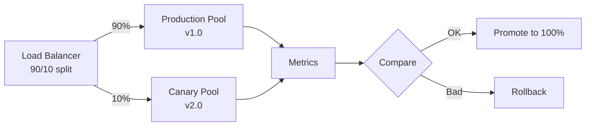

# How to Use Ansible to Set Up Canary Deployment Infrastructure

Author: [nawazdhandala](https://www.github.com/nawazdhandala)

Tags: Ansible, Canary, Deployment, DevOps, Infrastructure

Description: Build canary deployment infrastructure with Ansible for gradual rollouts with traffic splitting, metrics comparison, and automated promotion.

---

Canary deployments let you test new versions with a small percentage of real traffic before rolling out to everyone. If the canary shows increased error rates or degraded performance, you roll back before most users are affected. Ansible can manage the infrastructure for canary deployments, including traffic splitting, metrics collection, and automated promotion decisions.

## Canary Architecture



## Role Defaults

```yaml
# roles/canary/defaults/main.yml - Canary deployment settings
canary_weight: 10
canary_promotion_steps:
  - weight: 10
    duration: 300
  - weight: 25
    duration: 300
  - weight: 50
    duration: 300
  - weight: 100
    duration: 0
canary_error_threshold: 5
canary_latency_threshold_ms: 500
canary_metrics_endpoint: "http://prometheus:9090/api/v1/query"
```

## Deploy Canary

```yaml
# roles/canary/tasks/deploy.yml - Deploy canary version
---
- name: Deploy new version to canary servers
  include_role:
    name: app_deploy
  vars:
    deploy_targets: "{{ groups['canary'] }}"

- name: Verify canary servers are healthy
  uri:
    url: "http://{{ item }}:8080/health"
    status_code: 200
  loop: "{{ groups['canary'] }}"
  register: canary_health
  until: canary_health.status == 200
  retries: 10
  delay: 5

- name: Set initial canary traffic weight
  template:
    src: nginx_upstream.conf.j2
    dest: /etc/nginx/conf.d/upstream.conf
  delegate_to: "{{ item }}"
  loop: "{{ groups['load_balancers'] }}"
  vars:
    canary_current_weight: "{{ canary_promotion_steps[0].weight }}"
  notify: reload nginx

- name: Gradually increase canary traffic
  include_tasks: promote_step.yml
  loop: "{{ canary_promotion_steps }}"
  loop_control:
    index_var: step_index
```

## Canary Promotion Step

```yaml
# roles/canary/tasks/promote_step.yml - Individual promotion step
---
- name: "Set canary weight to {{ item.weight }}%"
  template:
    src: nginx_upstream.conf.j2
    dest: /etc/nginx/conf.d/upstream.conf
  delegate_to: "{{ lb }}"
  loop: "{{ groups['load_balancers'] }}"
  loop_control:
    loop_var: lb
  vars:
    canary_current_weight: "{{ item.weight }}"
  notify: reload nginx

- name: "Wait {{ item.duration }} seconds at {{ item.weight }}% traffic"
  pause:
    seconds: "{{ item.duration }}"
  when: item.duration > 0

- name: Check canary error rate
  uri:
    url: "{{ canary_metrics_endpoint }}"
    method: POST
    body_format: form-urlencoded
    body:
      query: 'rate(http_requests_total{status=~"5..",group="canary"}[5m]) / rate(http_requests_total{group="canary"}[5m]) * 100'
  register: error_rate
  delegate_to: localhost

- name: Rollback if error rate exceeds threshold
  include_tasks: rollback.yml
  when: (error_rate.json.data.result[0].value[1] | float) > canary_error_threshold
```

## Nginx Upstream Template

```nginx
# roles/canary/templates/nginx_upstream.conf.j2
upstream app {

    server {{ server }}:8080 weight={{ 100 - canary_current_weight | int }};


    server {{ server }}:8080 weight={{ canary_current_weight | int }};

}
```

## Running the Canary Deployment

```bash
# Deploy canary with gradual promotion
ansible-playbook -i inventory/hosts.ini canary-deploy.yml -e "app_version=2.0.0"

# Force immediate promotion to 100%
ansible-playbook -i inventory/hosts.ini canary-deploy.yml -e "canary_weight=100"

# Rollback canary
ansible-playbook -i inventory/hosts.ini canary-rollback.yml
```

## Summary

Canary deployments with Ansible provide a structured way to gradually roll out changes while monitoring for problems. The step-based promotion, combined with automated metrics checking, means bad deployments get caught and rolled back automatically before they affect all users. This approach gives you the confidence to deploy frequently while maintaining high reliability.

## Common Use Cases

Here are several practical scenarios where this module proves essential in real-world playbooks.

### Infrastructure Provisioning Workflow

```yaml
# Complete workflow incorporating this module
- name: Infrastructure provisioning
  hosts: all
  become: true
  gather_facts: true
  tasks:
    - name: Gather system information
      ansible.builtin.setup:
        gather_subset:
          - hardware
          - network

    - name: Display system summary
      ansible.builtin.debug:
        msg: >-
          Host {{ inventory_hostname }} has
          {{ ansible_memtotal_mb }}MB RAM,
          {{ ansible_processor_vcpus }} vCPUs,
          running {{ ansible_distribution }} {{ ansible_distribution_version }}

    - name: Install required packages
      ansible.builtin.package:
        name:
          - curl
          - wget
          - git
          - vim
          - htop
          - jq
        state: present

    - name: Configure system timezone
      ansible.builtin.timezone:
        name: "{{ system_timezone | default('UTC') }}"

    - name: Configure hostname
      ansible.builtin.hostname:
        name: "{{ inventory_hostname }}"

    - name: Update /etc/hosts
      ansible.builtin.lineinfile:
        path: /etc/hosts
        regexp: '^127\.0\.1\.1'
        line: "127.0.1.1 {{ inventory_hostname }}"

    - name: Configure SSH hardening
      ansible.builtin.lineinfile:
        path: /etc/ssh/sshd_config
        regexp: "{{ item.regexp }}"
        line: "{{ item.line }}"
      loop:
        - { regexp: '^PermitRootLogin', line: 'PermitRootLogin no' }
        - { regexp: '^PasswordAuthentication', line: 'PasswordAuthentication no' }
      notify: restart sshd

    - name: Configure firewall rules
      community.general.ufw:
        rule: allow
        port: "{{ item }}"
        proto: tcp
      loop:
        - "22"
        - "80"
        - "443"

    - name: Enable firewall
      community.general.ufw:
        state: enabled
        policy: deny

  handlers:
    - name: restart sshd
      ansible.builtin.service:
        name: sshd
        state: restarted
```

### Integration with Monitoring

```yaml
# Using gathered facts to configure monitoring thresholds
- name: Configure monitoring based on system specs
  hosts: all
  become: true
  tasks:
    - name: Set monitoring thresholds based on hardware
      ansible.builtin.template:
        src: monitoring_config.yml.j2
        dest: /etc/monitoring/config.yml
      vars:
        memory_warning_threshold: "{{ (ansible_memtotal_mb * 0.8) | int }}"
        memory_critical_threshold: "{{ (ansible_memtotal_mb * 0.95) | int }}"
        cpu_warning_threshold: 80
        cpu_critical_threshold: 95

    - name: Register host with monitoring system
      ansible.builtin.uri:
        url: "https://monitoring.example.com/api/hosts"
        method: POST
        body_format: json
        body:
          hostname: "{{ inventory_hostname }}"
          ip_address: "{{ ansible_default_ipv4.address }}"
          os: "{{ ansible_distribution }}"
          memory_mb: "{{ ansible_memtotal_mb }}"
          cpus: "{{ ansible_processor_vcpus }}"
        headers:
          Authorization: "Bearer {{ monitoring_api_token }}"
        status_code: [200, 201, 409]
```

### Error Handling Patterns

```yaml
# Robust error handling with this module
- name: Robust task execution
  hosts: all
  tasks:
    - name: Attempt primary operation
      ansible.builtin.command: /opt/app/primary-task.sh
      register: primary_result
      failed_when: false

    - name: Handle primary failure with fallback
      ansible.builtin.command: /opt/app/fallback-task.sh
      when: primary_result.rc != 0
      register: fallback_result

    - name: Report final status
      ansible.builtin.debug:
        msg: >-
          Task completed via {{ 'primary' if primary_result.rc == 0 else 'fallback' }} path.
          Return code: {{ primary_result.rc if primary_result.rc == 0 else fallback_result.rc }}

    - name: Fail if both paths failed
      ansible.builtin.fail:
        msg: "Both primary and fallback operations failed"
      when:
        - primary_result.rc != 0
        - fallback_result is defined
        - fallback_result.rc != 0
```

### Scheduling and Automation

```yaml
# Set up scheduled compliance scans using cron
- name: Configure automated scans
  hosts: all
  become: true
  tasks:
    - name: Create scan script
      ansible.builtin.copy:
        dest: /opt/scripts/compliance_scan.sh
        mode: '0755'
        content: |
          #!/bin/bash
          cd /opt/ansible
          ansible-playbook playbooks/validate.yml -i inventory/ > /var/log/compliance_scan.log 2>&1
          EXIT_CODE=$?
          if [ $EXIT_CODE -ne 0 ]; then
            curl -X POST https://hooks.example.com/alert \
              -H "Content-Type: application/json" \
              -d "{\"text\":\"Compliance scan failed on $(hostname)\"}"
          fi
          exit $EXIT_CODE

    - name: Schedule weekly compliance scan
      ansible.builtin.cron:
        name: "Weekly compliance scan"
        minute: "0"
        hour: "3"
        weekday: "1"
        job: "/opt/scripts/compliance_scan.sh"
        user: ansible
```

