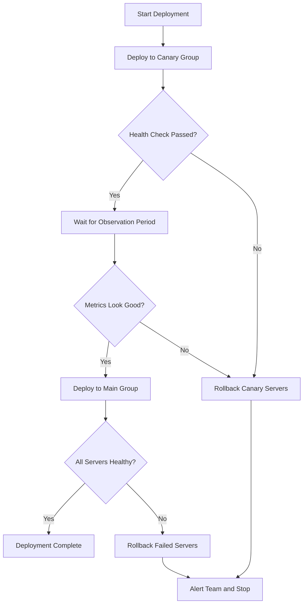

# How to Use Ansible for Canary Deployments

Author: [nawazdhandala](https://www.github.com/nawazdhandala)

Tags: Ansible, Canary Deployment, CI/CD, DevOps

Description: Learn how to implement canary deployments using Ansible to gradually roll out changes and reduce deployment risk in production.

---

Canary deployments are one of the most effective strategies for reducing the blast radius of a bad release. The idea is simple: instead of pushing new code to every server at once, you push it to a small subset first. If the metrics look good, you continue rolling out. If something breaks, you roll back only that small group. Ansible fits this workflow perfectly because of its inventory groups and serial execution controls.

In this post, I will walk you through building a canary deployment pipeline with Ansible, from inventory setup to health checks and full rollout.

## Why Canary Deployments Matter

Think about the last time a deployment went sideways. Maybe a config change broke authentication, or a new dependency caused memory leaks. With a traditional all-at-once deployment, every user is affected. With canary deployments, only a fraction of your traffic sees the new version. You get real-world feedback before committing to the full rollout.

## Setting Up Your Inventory for Canary Groups

The first step is splitting your servers into canary and production groups. Here is an inventory file that does this.

```yaml
# inventory/production.yml
# Split servers into canary (small group) and main (bulk of fleet)
all:
  children:
    canary:
      hosts:
        web-server-01:
          ansible_host: 10.0.1.10
        web-server-02:
          ansible_host: 10.0.1.11
    main:
      hosts:
        web-server-03:
          ansible_host: 10.0.1.12
        web-server-04:
          ansible_host: 10.0.1.13
        web-server-05:
          ansible_host: 10.0.1.14
        web-server-06:
          ansible_host: 10.0.1.15
        web-server-07:
          ansible_host: 10.0.1.16
        web-server-08:
          ansible_host: 10.0.1.17
        web-server-09:
          ansible_host: 10.0.1.18
        web-server-10:
          ansible_host: 10.0.1.19
```

In this setup, 2 out of 10 servers are in the canary group. That means roughly 20% of traffic will see the new version first.

## The Canary Deployment Playbook

Here is the core playbook that deploys to canary servers first, runs health checks, waits for confirmation, and then proceeds with the rest.

```yaml
# playbooks/canary-deploy.yml
# Main canary deployment playbook with health check gates
---
- name: Deploy to canary servers
  hosts: canary
  serial: 1
  become: true
  vars:
    app_version: "{{ deploy_version }}"
    app_dir: /opt/myapp
    health_check_url: "http://{{ ansible_host }}:8080/health"
    health_check_retries: 10
    health_check_delay: 5

  tasks:
    - name: Pull the new application version
      git:
        repo: "https://github.com/myorg/myapp.git"
        dest: "{{ app_dir }}"
        version: "{{ app_version }}"
        force: true

    - name: Install dependencies
      command: npm install --production
      args:
        chdir: "{{ app_dir }}"

    - name: Restart the application service
      systemd:
        name: myapp
        state: restarted
        daemon_reload: true

    - name: Wait for application to become healthy
      uri:
        url: "{{ health_check_url }}"
        method: GET
        status_code: 200
      register: health_result
      until: health_result.status == 200
      retries: "{{ health_check_retries }}"
      delay: "{{ health_check_delay }}"

    - name: Log canary deployment success
      debug:
        msg: "Canary server {{ inventory_hostname }} is healthy with version {{ app_version }}"

- name: Pause for canary observation
  hosts: localhost
  tasks:
    - name: Wait for monitoring period
      pause:
        minutes: 5
        prompt: "Canary servers are live. Monitor metrics for 5 minutes. Press Enter to continue or Ctrl+C to abort."

- name: Deploy to remaining servers
  hosts: main
  serial: 2
  become: true
  vars:
    app_version: "{{ deploy_version }}"
    app_dir: /opt/myapp
    health_check_url: "http://{{ ansible_host }}:8080/health"

  tasks:
    - name: Pull the new application version
      git:
        repo: "https://github.com/myorg/myapp.git"
        dest: "{{ app_dir }}"
        version: "{{ app_version }}"
        force: true

    - name: Install dependencies
      command: npm install --production
      args:
        chdir: "{{ app_dir }}"

    - name: Restart the application service
      systemd:
        name: myapp
        state: restarted
        daemon_reload: true

    - name: Wait for application to become healthy
      uri:
        url: "{{ health_check_url }}"
        method: GET
        status_code: 200
      register: health_result
      until: health_result.status == 200
      retries: 10
      delay: 5
```

The `serial: 1` in the canary play means we deploy one server at a time within the canary group. The `serial: 2` in the main play means we deploy two at a time for the rest of the fleet.

## Adding Automated Rollback

If health checks fail, you want automatic rollback. Here is a role that handles this.

```yaml
# roles/deploy/tasks/main.yml
# Deploy with automatic rollback on failure
---
- name: Record current version before deployment
  command: cat {{ app_dir }}/VERSION
  register: previous_version
  ignore_errors: true

- name: Deploy new version
  block:
    - name: Pull new code
      git:
        repo: "https://github.com/myorg/myapp.git"
        dest: "{{ app_dir }}"
        version: "{{ app_version }}"
        force: true

    - name: Restart service
      systemd:
        name: myapp
        state: restarted

    - name: Verify health
      uri:
        url: "http://{{ ansible_host }}:8080/health"
        status_code: 200
      register: health
      until: health.status == 200
      retries: 5
      delay: 3

  rescue:
    - name: Rollback to previous version
      git:
        repo: "https://github.com/myorg/myapp.git"
        dest: "{{ app_dir }}"
        version: "{{ previous_version.stdout | default('main') }}"
        force: true

    - name: Restart service with old version
      systemd:
        name: myapp
        state: restarted

    - name: Fail the play to stop further deployment
      fail:
        msg: "Canary deployment failed on {{ inventory_hostname }}. Rolled back to {{ previous_version.stdout }}."
```

The `block/rescue` pattern is how Ansible handles try/catch logic. If anything in the block fails, the rescue section runs and rolls back to the previous version.

## Canary Deployment Flow

Here is a visual representation of the canary deployment workflow.



## Running the Canary Deployment

Execute the playbook by passing the version you want to deploy.

```bash
# Run canary deployment with a specific version tag
ansible-playbook playbooks/canary-deploy.yml \
  -i inventory/production.yml \
  -e "deploy_version=v2.5.1"
```

## Integrating with Load Balancers

In a real environment, you probably want to drain connections from canary servers before deploying. Here is a task that removes a server from an Nginx upstream pool.

```yaml
# Remove server from load balancer before deployment
- name: Remove server from Nginx upstream
  delegate_to: "{{ item }}"
  lineinfile:
    path: /etc/nginx/conf.d/upstream.conf
    regexp: "server {{ ansible_host }}"
    state: absent
  loop: "{{ groups['loadbalancers'] }}"
  notify: reload nginx

# After successful deployment, add it back
- name: Add server back to Nginx upstream
  delegate_to: "{{ item }}"
  lineinfile:
    path: /etc/nginx/conf.d/upstream.conf
    line: "  server {{ ansible_host }}:8080;"
    insertafter: "upstream myapp {"
  loop: "{{ groups['loadbalancers'] }}"
  notify: reload nginx
```

## Tips for Production Canary Deployments

First, keep your canary group small but representative. If you have servers in multiple regions, include at least one canary per region. Second, automate the observation period. Instead of a manual pause, query your monitoring system (Prometheus, Datadog, or whatever you use) and check error rates programmatically. Third, version your deployments. Always tag releases and record which version is running on each server. This makes rollback trivial.

One pattern I have found useful in practice is to have the canary group be dynamic. Instead of hardcoding which servers are canary, you can use a variable and rotate which servers take the first hit. This distributes wear evenly across the fleet.

## Conclusion

Canary deployments with Ansible are straightforward once you understand inventory groups, serial execution, and the block/rescue pattern for rollback. The key is to build in health checks at every stage and make rollback automatic. Start with a simple canary setup like the one shown here, and then layer on load balancer integration and automated metric checking as your confidence grows. The investment in a proper canary pipeline pays for itself the first time it catches a bad release before it reaches all your users.
