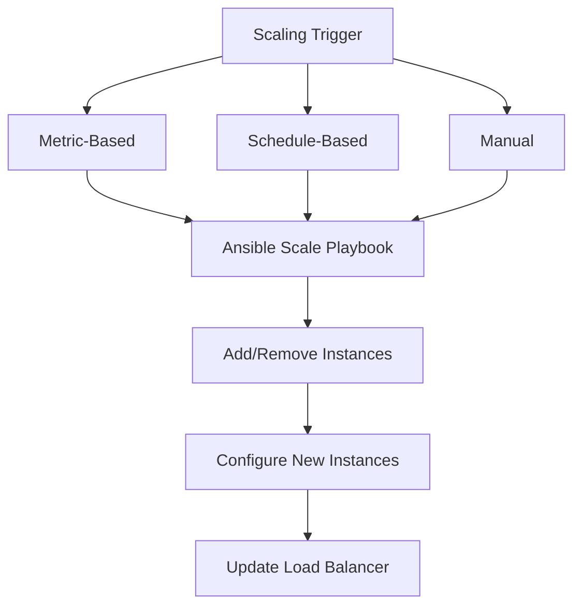

# How to Use Ansible for Capacity Scaling Automation

Author: [nawazdhandala](https://www.github.com/nawazdhandala)

Tags: Ansible, Scaling, Capacity Planning, Cloud, DevOps

Description: Automate capacity scaling with Ansible to add and remove infrastructure based on demand, schedules, and metric-driven thresholds.

---

Capacity scaling is about matching your infrastructure to demand. Too little capacity means slow responses or outages. Too much means wasted money. Ansible can automate scaling decisions based on metrics, schedules, or manual triggers.

This post covers building capacity scaling automation with Ansible.

## Scaling Approaches



## Metric-Driven Scaling

Query Prometheus for load metrics and scale accordingly:

```yaml
# playbooks/auto-scale.yml
# Scale infrastructure based on current metrics
---
- name: Evaluate scaling metrics
  hosts: localhost
  connection: local
  vars:
    scale_up_threshold: 80
    scale_down_threshold: 30
    min_instances: 2
    max_instances: 20
    cooldown_minutes: 10

  tasks:
    - name: Get current CPU usage across app servers
      ansible.builtin.uri:
        url: "http://{{ prometheus_host }}:9090/api/v1/query"
        method: POST
        body_format: form-urlencoded
        body:
          query: "avg(100 - (rate(node_cpu_seconds_total{mode='idle',job='app-servers'}[5m]) * 100))"
      register: cpu_metrics

    - name: Get current instance count
      ansible.builtin.uri:
        url: "http://{{ prometheus_host }}:9090/api/v1/query"
        method: POST
        body_format: form-urlencoded
        body:
          query: "count(up{job='app-servers'} == 1)"
      register: instance_count

    - name: Calculate metrics
      ansible.builtin.set_fact:
        current_cpu: "{{ cpu_metrics.json.data.result[0].value[1] | float }}"
        current_count: "{{ instance_count.json.data.result[0].value[1] | int }}"

    - name: Check last scaling event
      ansible.builtin.stat:
        path: /tmp/last_scale_event
      register: last_scale

    - name: Determine scaling action
      ansible.builtin.set_fact:
        scale_action: >-
          scale_up
          scale_down
          none

    - name: Scale up
      ansible.builtin.include_tasks: tasks/scale-up.yml
      vars:
        new_count: "{{ [current_count | int + 2, max_instances] | min }}"
      when: scale_action | trim == 'scale_up'

    - name: Scale down
      ansible.builtin.include_tasks: tasks/scale-down.yml
      vars:
        new_count: "{{ [current_count | int - 1, min_instances] | max }}"
      when: scale_action | trim == 'scale_down'

    - name: Record scaling event
      ansible.builtin.copy:
        content: "{{ ansible_date_time.iso8601 }} {{ scale_action | trim }}"
        dest: /tmp/last_scale_event
        mode: '0644'
      when: scale_action | trim != 'none'
```

## Scale Up Tasks

```yaml
# tasks/scale-up.yml
# Add new instances to the fleet
---
- name: Launch new instances
  amazon.aws.ec2_instance:
    name: "app-{{ item }}"
    instance_type: "{{ app_instance_type }}"
    image_id: "{{ app_ami }}"
    subnet_id: "{{ app_subnet }}"
    security_group: "{{ app_sg }}"
    key_name: "{{ deploy_key }}"
    tags:
      Role: app-server
      ManagedBy: ansible
      AutoScaled: "true"
    state: present
    wait: true
  loop: "{{ range(current_count | int + 1, new_count | int + 1) | list }}"
  register: new_instances

- name: Wait for SSH on new instances
  ansible.builtin.wait_for:
    host: "{{ item.instances[0].private_ip_address }}"
    port: 22
    timeout: 300
  loop: "{{ new_instances.results }}"

- name: Add new instances to inventory
  ansible.builtin.add_host:
    name: "{{ item.instances[0].tags.Name }}"
    ansible_host: "{{ item.instances[0].private_ip_address }}"
    groups: new_app_servers
  loop: "{{ new_instances.results }}"

- name: Configure new instances
  ansible.builtin.include_tasks: tasks/configure-app-server.yml

- name: Register with load balancer
  ansible.builtin.uri:
    url: "http://{{ lb_api }}/backends"
    method: POST
    body_format: json
    body:
      host: "{{ item.instances[0].private_ip_address }}"
      port: "{{ app_port }}"
    status_code: [200, 201]
  loop: "{{ new_instances.results }}"

- name: Notify scaling event
  community.general.slack:
    token: "{{ slack_token }}"
    channel: "#infrastructure"
    msg: "Scaled UP: Added {{ new_count | int - current_count | int }} app servers. Total: {{ new_count }}"
```

## Scale Down Tasks

```yaml
# tasks/scale-down.yml
# Gracefully remove instances from the fleet
---
- name: Identify instances to remove (oldest auto-scaled first)
  amazon.aws.ec2_instance_info:
    filters:
      "tag:Role": app-server
      "tag:AutoScaled": "true"
      instance-state-name: running
  register: auto_scaled

- name: Sort by launch time and select for removal
  ansible.builtin.set_fact:
    instances_to_remove: "{{ auto_scaled.instances | sort(attribute='launch_time') | list | first }}"

- name: Drain instance from load balancer
  ansible.builtin.uri:
    url: "http://{{ lb_api }}/backends/{{ instances_to_remove.private_ip_address }}/drain"
    method: POST

- name: Wait for connections to drain
  ansible.builtin.pause:
    seconds: 30

- name: Deregister from load balancer
  ansible.builtin.uri:
    url: "http://{{ lb_api }}/backends/{{ instances_to_remove.private_ip_address }}"
    method: DELETE

- name: Terminate instance
  amazon.aws.ec2_instance:
    instance_ids: "{{ instances_to_remove.instance_id }}"
    state: absent
    wait: true

- name: Notify scaling event
  community.general.slack:
    token: "{{ slack_token }}"
    channel: "#infrastructure"
    msg: "Scaled DOWN: Removed 1 app server. Total: {{ new_count }}"
```

## Schedule-Based Scaling

For predictable traffic patterns:

```yaml
# playbooks/scheduled-scaling.yml
# Scale based on time-of-day patterns
---
- name: Apply scheduled scaling
  hosts: localhost
  connection: local
  vars:
    scaling_schedule:
      weekday_peak:    # Mon-Fri 9am-6pm
        instances: 10
        hours: "9-18"
        days: "1-5"
      weekday_offpeak: # Mon-Fri nights
        instances: 3
        hours: "0-8,19-23"
        days: "1-5"
      weekend:
        instances: 2
        days: "0,6"

  tasks:
    - name: Determine current schedule window
      ansible.builtin.set_fact:
        target_instances: >-
          
          
          10
          3
          2

    - name: Scale to target
      ansible.builtin.include_tasks: tasks/scale-to-target.yml
      vars:
        desired_count: "{{ target_instances | int }}"
```

## Key Takeaways

Capacity scaling with Ansible can be metric-driven, schedule-based, or manual. For metric-driven scaling, query your monitoring system and make scaling decisions based on CPU, memory, or request rate. Always include cooldown periods to prevent thrashing. Scale up aggressively (add multiple instances) but scale down conservatively (remove one at a time). Drain connections before removing instances. For predictable workloads, use schedule-based scaling to pre-provision capacity before traffic increases. Log every scaling event for capacity planning analysis.
